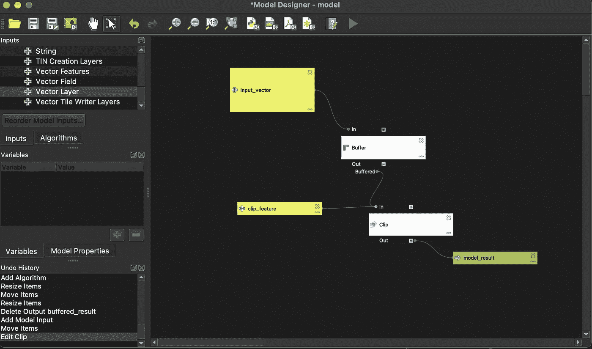
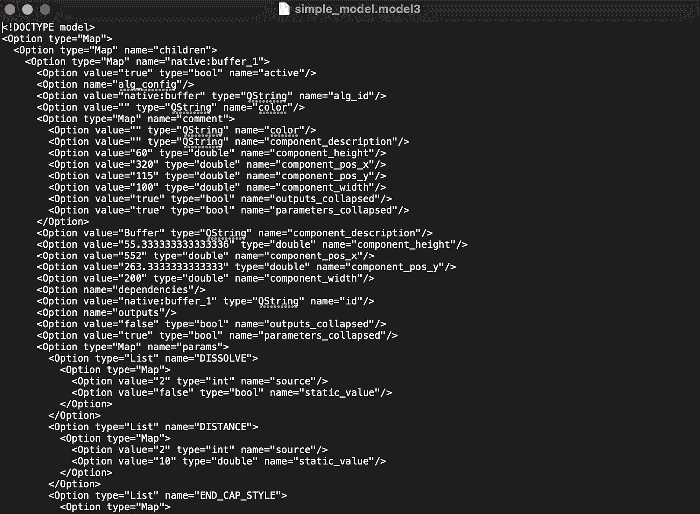
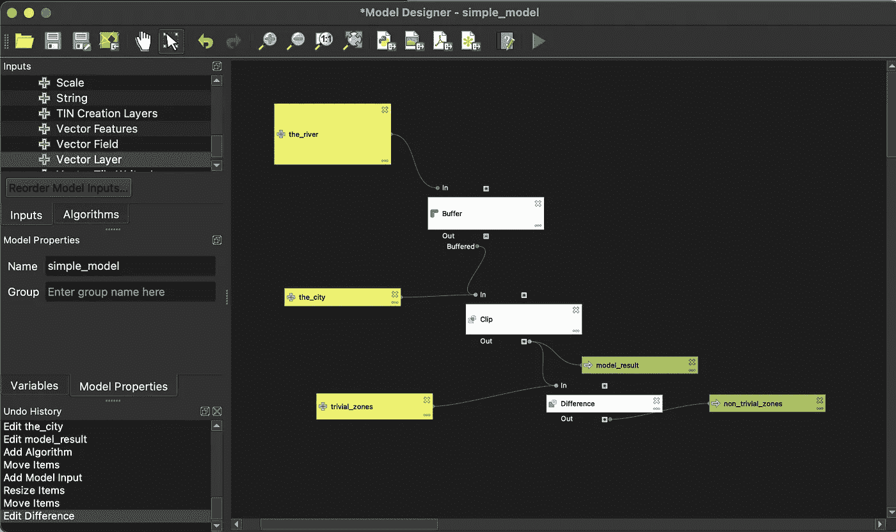
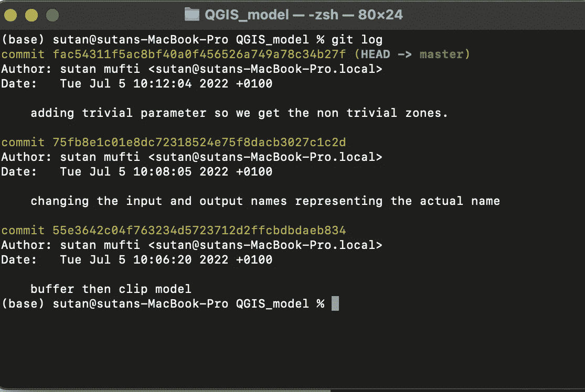
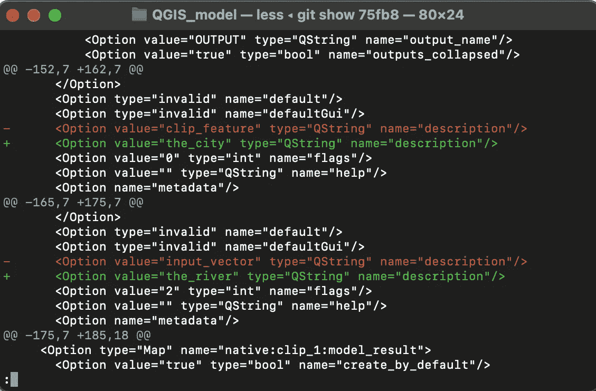
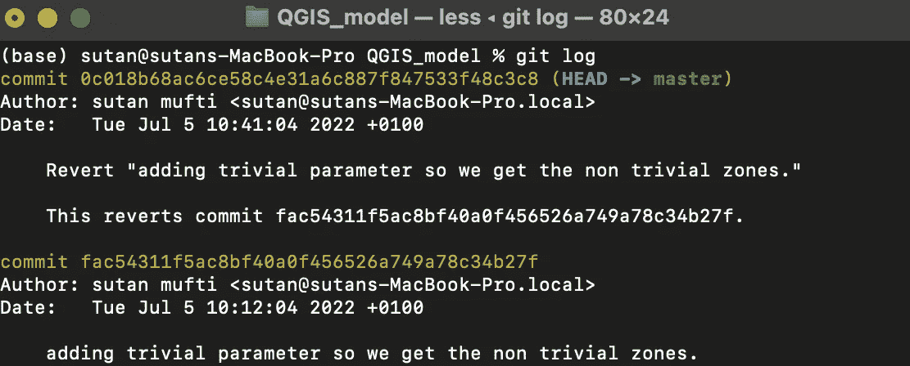
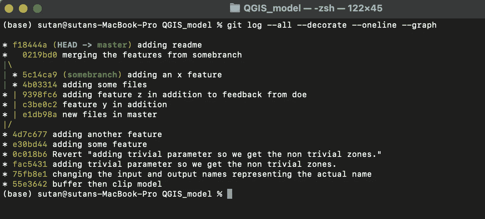

# 空间数据科学:使用 Git 的再现性和版本跟踪

> 原文：<https://towardsdatascience.com/spatial-data-science-reproducibility-and-version-tracking-with-git-cd0b47d9ba52>

作者和里尼(2022)

## 空间模型构建器和 Git:开发中的分析、跟踪和文档

# 简介—文档

文档是典型 GIS 工作流中的常见问题。点击哪些按钮？先用哪个工具，再用什么？我们的模式发生了什么变化？为什么有人做了什么事之后这就不管用了。更不用说软件版本和机器环境的差异了。当我们的工作必须对报告负责时，这变得非常必要。或者，在我们离开团队时进行交接，并培训接替我们的人。给定一组数据和环境，我们工作的可重复性是一个很大的保证。我们应该如何记录我们的空间数据过程？

在这篇文章中，我将讨论一些我们可以用来确保可重复性的工具。这些工具是模型构建器、git & Python 和 Notebook (Jupyter，以前称为 iPykernel)。如果你不做 python 或者任何编程，那么 model builder 是一个非常好的入门；一个非常简单的工具，说明设计过程。这个我先讨论一下。

*注意:这个系列是空间数据科学的一部分:Sutan 的系列，请查看下面的元文章以获得更多空间数据科学文章*

 [## 空间数据科学:系列

### Sutan Mufti 撰写的关于空间数据科学的系列文章。

medium.com](https://medium.com/rekayasa-data-spasial/spatial-data-science-the-series-81344a3ead29) 

# 模型生成器——制作空间模型的图形用户界面工具

如果你不使用编程语言，那么这是一个完美的工具。

如果我们将问题的范围限制在分析部分，那么我认为 model builder 是一个非常方便的解决方案。模型构建器是一个关于我们的空间数据过程的图形模型；我们拖放流程，并在流程上画箭头。因为它不需要用户了解任何编程语言，所以它对每个人来说都很容易使用并且非常容易理解。

让我们创建一个简单的模型:**首先我们缓冲一个特征，然后我们用另一个特征**裁剪缓冲结果。请看下图。让我们把它命名为**简单 _ 模型。**

带模型构建器的 QGIS 中的模型示例(作者，2022)

首先，输入进入缓冲区，缓冲过程的输出用另一个特征进行剪裁。当然，这非常简单，但是在实际项目中，这可能会变得复杂。这很有帮助，因为它非常直观地展现了正在发生的事情。然后，我们可以将模型保存到我们的目录中。

我创建的模型基本上是一堆文本文件。QGIS 只是渲染这些文本，这样我们就有了图形表示。下图显示了我们保存模型时的文本表示。嗯，它实际上是用 UTF-8 编码的，但我们现在不关心它。**重要的是模型(来自模型构建器)基本上是一个文本文件**。请注意，这种文本表示对于我将在下面讨论的版本跟踪非常重要。

名为 simple_model 的已保存模型的“实际”外观(作者，2022)

## 开发模型—添加变更

如果我们做了改变，那么这些文字也会改变。一些新的行将被创建或删除，这取决于我们做什么。这就带来了识别什么已经改变以及何时改变的问题。因此，跟踪什么发生了变化是一个明智的措施，这可以用 git 来完成。

# 版本跟踪— Git

现在我更想开发这个模型，并添加一些功能，因为我收到了一些反馈。我需要改变模型，这需要改变模型的文本文件。比方说，该模型显然将用于识别脆弱城市中的河流洪水危险区，我需要完成更多的流程。因此，我对模型做了一些修改。我做的一些改变:

*   更改输入和输出属性名称；从默认名称`input_geometry`和`clip_feature`到`the_river`和`the_city`；诸如此类。
*   添加`difference`叠加过程来消除琐碎的区域。

我们模型中的附加过程(作者，2022)

我添加了这两个改动，但是我的队友怎么知道我改了什么？此外，如果我的团队成员对模型做了其他事情，我怎么知道他做了什么？一封电子邮件就足够了，但它不如 git 有效。

Git 是一个命令行工具，用来控制我们代码中的变化。由于它是一个命令行工具，我们将使用终端或命令提示符。我们键入命令，然后单击 enter 执行。不要害怕，如果我们给一点时间，它不是那么复杂！基本命令是

*   `git log`显示更改的内容、更改者和时间
*   `git show`显示所做的实际更改
*   `git add`添加已更改但尚未提交的文件
*   正式提交更改！git 记录这个变化。

## 更改日志

每次我在模型中做小的改动，我都会用 git 创建一个日志。在这里，如果我执行`git log`，它将显示我对来自我的消息/便笺做了什么。下图显示了我已经完成的 3 次提交。您可以看到是谁做的，什么时候做的，以及消息。

记录发生了哪些变化(作者，2022)

## 显示更改的内容

如果我想看到一个特定的提交/更改，我可以执行`git show`，后跟提交 id 的第一个字符，例如`git show 75fb8`。看下图。

展示改变了什么(作者，2022)

红线是删除的行，绿线是新的/插入的行。这里我可以告诉大家，我把`input_vector`改成了`the_river`，把`clip_feature`改成了`the_city`。谁干的？git 日志显示是我；但是如果我们和队友一起工作，我们可以看到其他人可能会改变这一点。

## 还原更改

比方说，经过几次反馈后，我们反对琐碎的区域差分程序；所以我们必须重新做我们的改变！这很烦人，但我们如何后退一步？我们使用`git revert`来提交。让我们恢复我们的提交 id `fac543`并后退一步。

恢复更改(作者，2022)

现在，您可以看到使用提交 id `0c018b6`完成了恢复，消息描述了恢复操作及其恢复的提交 id。当我看到发生了什么变化时，这个模型又回到了以前的版本！

## 分支和协作

开发模型通常需要迭代和模块化特性。这些功能是模块化的，可以由其他团队成员开发。有了 git，我们可以同时一起处理相同的文件，进行修改，并跟踪每个人都做了什么。这是通过分支实现的；从初始模型创建分支；最重要的是，将这些分支合并成一个具有丰富功能的单一模型。

我们可以创建代表相同模型的分支，允许在这些分支上进行相应的更改。每个团队成员将并行处理他们的分支。当团队成员完成他们的工作时，我们将分支合并到一个模型中，每个团队成员都开发了这个模型的特性。

下图显示了如何制作分支并将其合并回初始模型。它只是一个名为“somebranch”的单独分支；我在那里开发了一些模型，然后将其合并回初始模型。`*`代表我所做的一个提交，后面是提交 id。

git 中的分支(作者，2022)

如果我们已经开发了一个稳定的模型，那么我们可以创建一个稳定版本的分支来保持它。稳定的分支不会被编辑，只是保留下来，让你知道它工作得很好。当一个开发阶段再次开始时，从稳定分支中创建另一个分支，然后重复。

# 结论

这就对了。使用模型构建器可以实现分析的自动化和形式化。模型构建器创建算法的直观图形表示，确保再现性。git 可以跟踪开发中的变化。Git 还允许协同工作环境和控制模型的版本。

这样，模型的文档可以随着模型开发的时间一起进行。更改可以并行进行，并且所有更改都会被记录。

## 不足之处

*   git 和模型构建器相当复杂。建立直觉并使之自然需要数月的练习。你需要投入时间去真正享受它，一开始并不好玩。我认为一旦你习惯了，它就会有回报。
*   在传统的典型 GIS 工作流中，单击按钮并保存项目文件，使用 git 是不合适的。项目文件，如。qgz 或者。mxd 包含布局配置、层顺序等琐碎信息。这对于结果信息来说是不重要的。
*   为了更复杂的方法，我们牺牲了点击按钮的便利性。通常要花更多的时间来写东西并使之正式化。虽然 word 文档可能足够方便，但它不一定是可复制的。在这里，有了模型和 git，我们甚至可以使用 Docker 来形式化模型，并确保机器的环境需要理解 linux OS 和 bash 脚本！但是，什么是码头工人和巴什，我说的对吗？另一篇文章的故事。

最终，它的价值是要付出代价的。它的价值取决于每个团队；但是大多数时候，我发现这样做是值得的，尤其是当事情需要谨慎和复杂的时候。有这样的保证肯定感觉很好。

## 注意

对于那些熟悉编程尤其是 python 的人，我最初想把 Jupyter Notebook 和 Python 脚本与`pyqgis`、`arcpy`或`shapely`放在一起。然而，在我重复了这篇文章之后，对于一篇单独的文章来说，这似乎是一个太多的主题了；此外，它与那些不写剧本的人没有关系。我认为 Git 已经够可怕的了，因为它已经使用了终端，但是我希望这篇文章可以作为那些想要解决文档问题的人的入门和第一个参考。我呼吁人们更多地使用终端。

因此，下一篇文章将讨论笔记本和脚本如何改进这些文档过程。这更有趣，也是我一直做的事情。我很少在 ArcGIS / QGIS 中进行空间分析，因为我无法有效地控制文档。