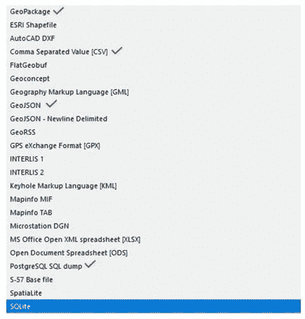
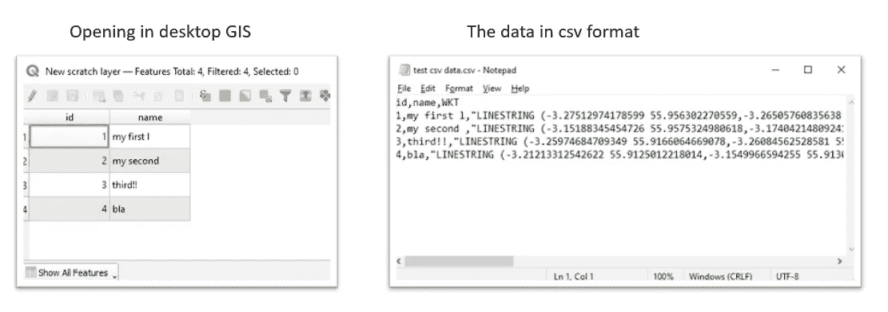
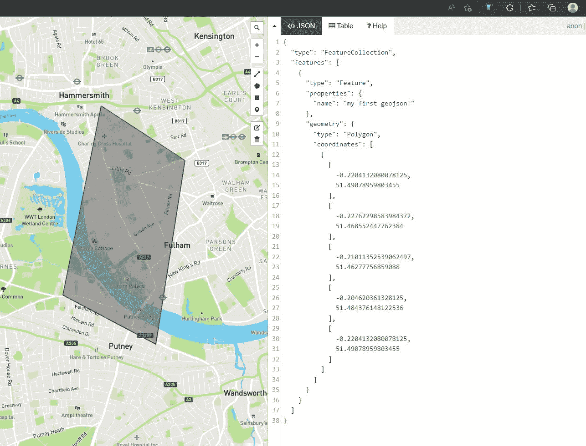
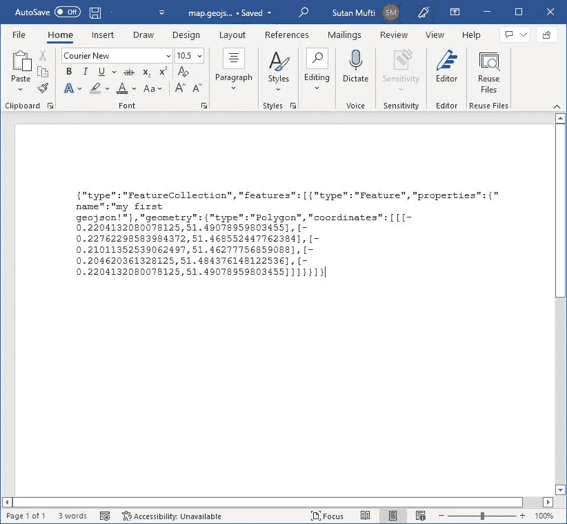
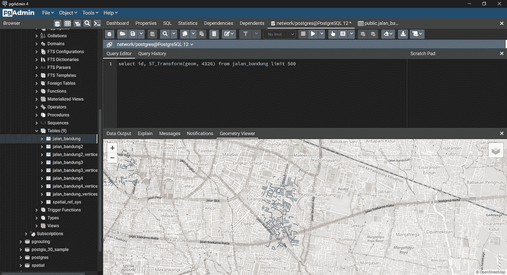
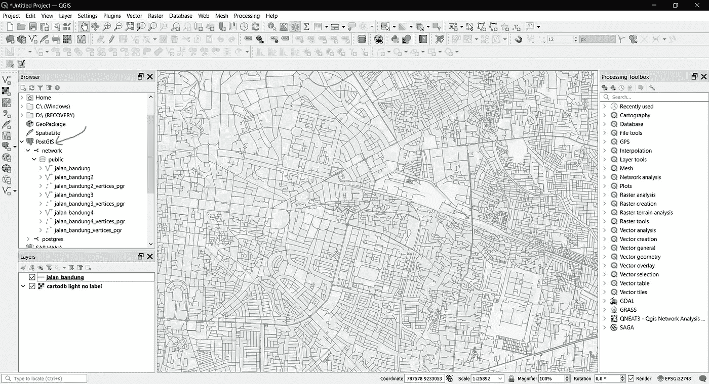

# 空间数据科学:空间数据存储

> 原文：<https://towardsdatascience.com/spatial-data-science-spatial-data-storage-364a8df4038c>


来源:作者&里尼，2022 年

## 可选空间数据格式介绍；没有 shapefile！

空间数据科学家使用空间格式的空间数据。通常，这种格式是由 ESRI 在 90 年代开发的“shapefile”格式。我希望本文的读者在继续本文的其余部分之前熟悉“shapefile ”,因为我将向您介绍超越 shapefile 工作流。如果您对 shapefile 感到满意，这是一个很好的开始。然而，随着项目变得越来越复杂，您将处理更复杂的数据，如`.osm.pbf`文件，或 JSON (JavaScript 对象符号)。那些是什么？为什么 shapefile 不够用？

## Shapefile 的限制

大型项目需要灵活性和稳定性，以减少人为错误。我认为，Shapefile 作为一种老技术，对普遍的现代挑战提出了几个限制:

*   **Shapefile 只允许最大 2 GB 的数据**，而有时我们需要处理更多这样的数据
*   **列名只允许一定数量的字符**。你必须明智地命名你的专栏！我还是觉得`.dbf`很烂。
*   **天生凌乱**。核心文件是`.shp`，但是如果没有`.dbf`、`.prj`和更多的补充，它就一文不值了！如果您想要重命名 shapefile，该怎么办？您必须对它们进行重命名，或者打开桌面 GIS 来为您进行重命名。或者，用花里胡哨的方式，在命令行界面使用 GDAL/ogr2ogr。

虽然 shapefile 广为人知，很突出，这很好，但我真的不喜欢 shapefile。然而，我必须说，用它工作很舒服！所以我认为恰当的说法是，

> 我讨厌我爱 shapefile…

但是外面还有什么呢？让我们探索一些替代方案…

# 在这篇文章中

本文向您介绍了各种格式和数据库管理，以支持各种处理空间数据的方法。最后，根据项目的独特环境，您将有多种选择。

# 存储空间数据

存储空间数据的标准方法是遵循 OGC 标准。对于点、多边形、折线等简单的矢量数据，标准应该足够了。空间数据可以以众所周知的文本(WKT)格式存储。；或其替代的著名二进制(WKB ),但它看起来很丑，因为它是二进制的。微软有一篇很棒的文章解释了什么是 WKT。

```
# example of storing spatial data in WKT formatPOINT(-122.349 47.651)LINESTRING(-122.360 47.656, -122.343 47.656)POLYGON((-122.358 47.653, -122.348 47.649, -122.348 47.658, -122.358 47.658, -122.358 47.653))
```

一个简单的矢量空间要素仅仅由点和它是什么的定义(它是一个点吗？多边形？还是线？).因此，WKT 是空间数据的一种表现形式。考虑到这一点，让我们来看看格式。

# 空间数据格式

本节讨论存储空间数据的各种格式，作为 shapefile 的替代方案。如果我们打开 QGIS 导出选项(下图),会有很多选项。我认为没有必要全部都学，下面的检查是最有可能用到的。



QGis 导出选项

## CSV —逗号分隔值

逗号分隔值实际上是一个文本文件。可以在 excel 中打开 CSV。让我给你举个例子:



CSV 格式的空间数据(来源:作者，2022)

我认为这是相当直截了当的，文本本身就说明了问题。几何信息以 WKT 格式存储，作为一个人，我们可以阅读它，但不是真的。您可以在 Ms Excel 中打开此 CSV 文件，编辑属性并将其返回到桌面 GIS。够搞笑的，还可以用 Ms Words 打开编辑。

## geo JSON-Javascript 对象符号(JSON)

JSON 是 web 或应用程序相互通信的一种格式。**只是一个文本文件，**像 csv...然而，以不同的形式。它由“键”和“值”对组成；当查询“键”时，返回“值”。文字看起来像下图的右边。



geojson.io(来源:作者，2022 年)

为了理解 JSON 文本，我建议阅读更多关于数据结构主题的内容。这本书挺受欢迎的([数据结构&算法](https://www.cs.bham.ac.uk/~jxb/DSA/dsa.pdf))。试着理解什么是数组、字典、索引等等。一旦掌握了这一点，JSON 和 GeoJSON 就更有意义了。

当处理在线/网站数据时，您经常会收到这类数据。我 80%的时间都在使用 Python GIS，当我看到一个以 GeoJSON 格式提供服务的网站时，我的心中燃起了一丝喜悦。这意味着我可以创建应用程序，检索 GeoJSON，并让我的应用程序无缝、干净地处理它。

> 你可以去 [geojson.io](http://geojson.io) 画一些线或者多边形，了解一下。

因为它是基于文本的，所以您可以打开。GeoJSON 用 Ms Word 照我说！或者，再次，文本编辑器。请确保分机保持不变。GeoJSON 保留其格式。



微软 Word 中的 Geojson(来源:作者，2022)

## 地理包-文件地理数据库

GeoPackage 基本上是一个包含“shapefiles”的“文件夹”。标记引号是因为它们的行为类似于 folder 和 shapefile，但是它们背后的技术本质是不同的。我们称空间数据为“特征”，而不是“形状文件”。您可以在 QGIS 或 ArcGIS 中浏览地理包“文件夹”。ESRI 也开发了一种类似的格式，称为地理数据库(。广发)。它在 ESRI ArcGIS 环境中进行了优化。


地理数据库格式(来源:作者，2022 年)

## PostGIS —数据库管理器

Postgis 是 postgresql(关系数据库管理器，RDBMS)的扩展。嗯，它本身并不是一种格式，但是为了简单起见，我们可以这样看。首先，我们需要安装 PostgreSQL 并创建一个数据库。然后，我们将 postgis 扩展到数据库，以支持地理空间处理功能。我们的数据库现在是“邮政地理信息系统”！



PostgreSQL 中的 Postgis 几何处理(来源:作者，2022)

我认为 Postgis 是最佳的地理空间数据格式。这是因为您可以执行 SQL 并只选择您需要的数据，而无需加载全部数据并对其进行过滤。除此之外，当您使用 geodjango 构建 web 应用程序时，您将使用 postgis。如此美丽。

我通常使用 QGIS 作为代理来管理 postgis 数据库，或者使用 PgAdmin。您可以使用工具“导出到 postgres”或“导出到 postgis”(取决于您的 QGIS 版本)将数据加载到 postgis，反之亦然。



Qgis 中的 Postgis(来源:作者，2022)

# 结论

现在，我已经向您介绍了一些替代数据格式，而不是常见的 shapefile 格式。这 5 种格式是。csv，。乔森还有。gpkg(地理包)或。gdb(地理数据库)和 PostGIS。我个人认为有趣的是，我们可以在 Ms Word 中写一堆单词，并根据它们创建一个地图，只要我们能够精确定位数据的精确坐标。如果 excel 女士可以处理多边形数据，我们当然可以创建地图；我们可以，但只能用点和线数据。当然，有一点需要注意:UTF 8 编码的文本文件格式效率非常低；另一方面，我发现 shapefiles 非常快。然而，这些优点并没有消失。

就个人而言，在从事 GIS 工作 4 年之后，我并不那么喜欢 shapefile。它在 90 年代有过辉煌的日子。现在，我更喜欢将我的数据存储在 PostGIS、CSV(尤其是当它是点数据时)或 geojson 中，尽管在性能方面有点低效。处理 CSV 和 WKT 数据非常方便，因为像 [geopandas](https://geopandas.org/en/stable/docs/reference/api/geopandas.GeoSeries.from_wkt.html) 和 [qgis](https://gis.stackexchange.com/questions/273143/adding-delimited-text-layer-in-qgis) 这样的工具已经提供了快速处理这些数据的命令。

在下一篇文章中，我将讨论使用 PostGIS 管理空间数据库。这是非常奇妙和令人兴奋的！