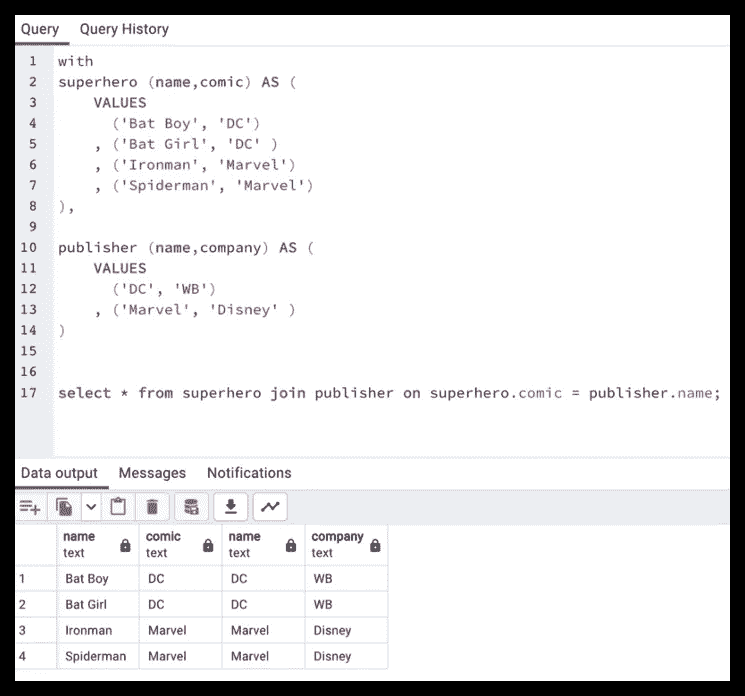
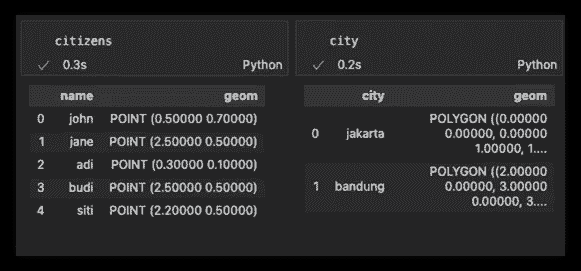
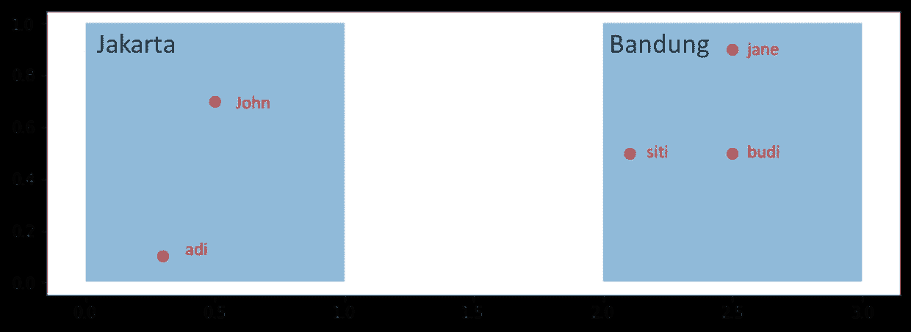
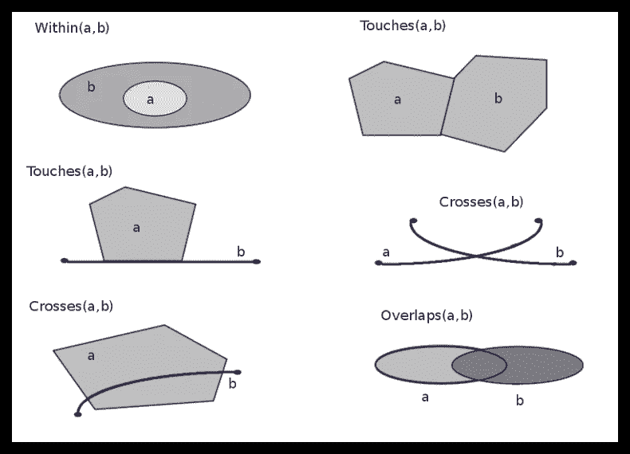
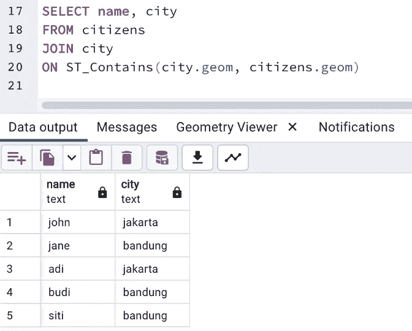
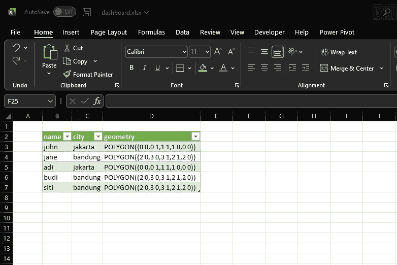
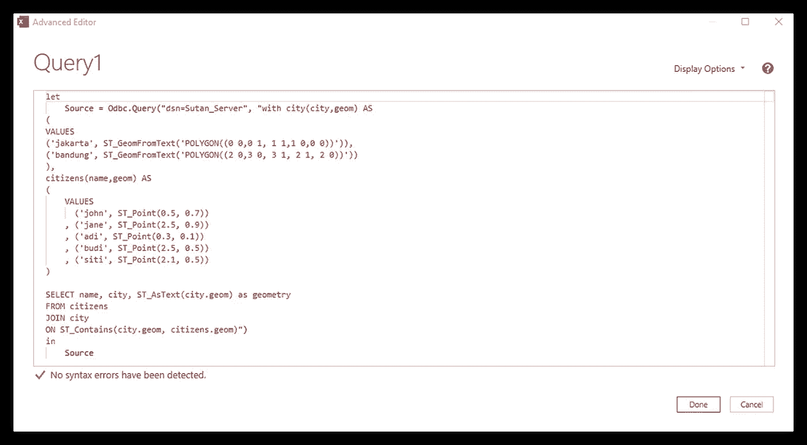

# 空间数据科学:SQL 空间连接

> 原文：<https://towardsdatascience.com/spatial-data-science-sql-join-spatially-ecd2f7400753>


(来源:里尼和作者，2022)

## 如果这些表有空间关系，则连接它们。额外收获:我在 Excel 中做

# 介绍

结构化查询语言 SQL 是一种从数据库中获取表格/数据的通用语言。最简单的语法是`select * from some_table`，它将返回来自`some_table`的所有行和列。还有一个是`select column1, column2 from some_table`只返回`column1`和`column2`；and `select * from some_table limit 10`返回所有列，但只返回 10 行。我们向数据库询问一些事情，数据库会回答。SQL 很重要，因为我们可能使用超过 2，000，000 行的表，如果我们只需要其中的一部分，我们不必加载所有的 2，000，000 行。

我们很少只使用一个表，我们经常使用多个相互连接的表。`vlookup`是我们在 Ms. Excel 中的做法，或者在我看来，更高级的版本:`xlookup`。一个更好的方法是使用 power-pivot 来设计连接，这样你就可以图形化地看到连接。

SQL 使我们能够在一个脚本中做到这一点，例如，观察下图。假设我有一个表`superhero`，它是`publisher`；我想把这些桌子连接起来。最后一行(第 17 行)是连接`superhero`和`publisher`的查询语法。从表`publisher`中查看`comic`列如何连接到`name`列。

> 注意:由于突出的 postgis 扩展，我使用 postgresql 作为我的 RDBMS。下图由 PgAdmin 4 制作，GUI 客户端操作 postgresql 数据库。



SQL 连接示例(来源:作者，2022)

## 加入

`join`命令只是一个`vlookup`。这是一种结合两张桌子的方法；一种连接两个表的方法。这种连接可以通过链接两个有关系的列(名为主键和外键)来实现。**可以进行连接，因为两个表的列之间存在关系。**

如果这两列是几何列，它是空间数据框架的一个组成部分，则可以建立空间关系。

首先，什么是空间数据框架？

# 空间数据框架-简短介绍

空间数据帧只是一个普通的数据帧，增加了一个几何列。该几何列包含每一行/特征的几何，它定义了形状。

在 postgresql 中，安装 postgis 扩展模块时会启用空间数据框架功能。一旦安装完毕，我们就可以访问空间数据函数和构造函数了。我们来构造一些数据:`citizens`和`city`。

[](https://postgis.net/)  

## 构建样本数据

比方说，我们有两个空间数据帧`citizens`和`city`。每个数据帧都有一个名为`geom`的`geometry`列。`geom`包含表示空间信息的 WKT 数据；但是在 Python 中这应该包含`shapely`点对象。数据帧看起来像这样。



样本数据框架(来源:作者，2022)

这些表是在 postgresql 查询工具中使用具有以下语法的 SQL 构建的。

```
-- producing city and citizens spatial dataframe
with city(city,geom) AS 
(
VALUES
('jakarta', ST_GeomFromText('POLYGON((0 0,0 1, 1 1,1 0,0 0))')), 
('bandung', ST_GeomFromText('POLYGON((2 0,3 0, 3 1, 2 1, 2 0))'))
),
citizens(name,geom) AS 
(
    VALUES
      ('john', ST_Point(0.5, 0.7))
    , ('jane', ST_Point(2.5, 0.9))
    , ('adi', ST_Point(0.3, 0.1))
    , ('budi', ST_Point(2.5, 0.5))
    , ('siti', ST_Point(2.1, 0.5))
)
```

当我们使用`matplotlib`或仅仅使用 QGIS 来可视化`geom`列时，它看起来像这样。



样本数据(来源:作者，2022 年)

我们看到红点(`citizens`)位于蓝框(`city`)内。`geom`列有关系；这意味着我们可以连接两个表。我们知道每个公民都生活在一个城市里。哪个住哪个？我们可以知道 john 住在雅加达，但是我们如何连接该表呢？我们可以告诉你的是`citizens`点和`city`多边形**重叠**，这是一种空间关系。这是空间连接进来。

# 空间关系

拓扑是表达空间关系的术语。在 PostGIS 中，通过应用空间函数来定义关系。请查看以下参考资料，了解可用的空间关系(来源:[第 8 章。PostGIS 参考](https://postgis.net/docs/reference.html)

*   [ST _ 3D intersects](https://postgis.net/docs/ST_3DIntersects.html)-如果两个几何在 3D 空间相交，则返回 true 仅适用于点、线串、多边形、多面体表面(区域)。
*   [ST_Contains](https://postgis.net/docs/ST_Contains.html) —如果 B 的任何点都不在 A 的外部，并且 A 和 B 至少有一个共同的内部点，则返回 true。
*   [ST _ contains proper](https://postgis.net/docs/ST_ContainsProperly.html)—如果 B 与 A 的内部相交，但不与边界或外部相交，则返回 true。
*   [ST_CoveredBy](https://postgis.net/docs/ST_CoveredBy.html) —如果 A 中没有点在 B 之外，则返回 true
*   [ST_Covers](https://postgis.net/docs/ST_Covers.html) —如果 B 中没有点在 A 之外，则返回 true
*   [ST _ Crosses](https://postgis.net/docs/ST_Crosses.html)-如果两个几何图形有一些(但不是全部)共同的内部点，则返回 true。
*   [ST _ LineCrossingDirection](https://postgis.net/docs/ST_LineCrossingDirection.html)—返回一个数字，指示两个线串的交叉行为。
*   [ST _ Disjoint](https://postgis.net/docs/ST_Disjoint.html)-如果两个几何图形不相交(它们没有共同点)，则返回 true。
*   [ST _ Equals](https://postgis.net/docs/ST_Equals.html)-如果两个几何图形包含相同的点集，则返回 true。
*   [ST _ Intersects](https://postgis.net/docs/ST_Intersects.html)-如果两个几何相交(它们至少有一个公共点)，则返回 true。
*   [ST _ ordering equals](https://postgis.net/docs/ST_OrderingEquals.html)-如果两个几何图形表示相同的几何图形并且具有相同方向顺序的点，则返回 true。
*   [ST _ Overlaps](https://postgis.net/docs/ST_Overlaps.html)-如果两个几何图形相交并具有相同的尺寸，但彼此不完全包含，则返回 true。
*   [ST _ Relate](https://postgis.net/docs/ST_Relate.html)-测试两个几何图形是否有匹配交集矩阵模式的拓扑关系，或计算它们的交集矩阵
*   [ST_RelateMatch](https://postgis.net/docs/ST_RelateMatch.html) —测试 DE-9IM 交集矩阵是否匹配交集矩阵模式
*   [ST _ Touches](https://postgis.net/docs/ST_Touches.html)-如果两个几何图形至少有一个公共点，但它们的内部不相交，则返回 true。
*   [ST_Within](https://postgis.net/docs/ST_Within.html) —如果 A 的任何点都不在 B 的外部，并且 A 和 B 至少有一个公共的内部点，则返回 true。

如果我们有一个名为`a`的空间数据帧和另一个名为`b`的空间数据帧，另一个例子如下图所示。**将每个形状(线、多边形或点)视为数据帧中的一行**。数据帧中的一行也称为特征。



空间拓扑学——由克劳斯——自己的作品，CC BY-SA 3.0，[https://commons.wikimedia.org/w/index.php?curid=21299138](https://commons.wikimedia.org/w/index.php?curid=21299138)

您可以在 PostGIS 的空间关系部分了解有关空间关系的更多信息。

[](http://postgis.net/workshops/postgis-intro/spatial_relationships.html)  

# 空间连接 SQL 空间连接

在我们的`city`和`citizens`的例子中，我们想要识别每个公民居住的城市。空间关系可以是包含、相交、重叠等。对于这些上下文，我们可以选择其中一个函数；我用`ST_Contains`函数来定义这种关系。`ST_Intersects`也管用。

```
.
.
.
-- 
SELECT name, city
FROM citizens
JOIN city
ON ST_Contains(city.geom, citizens.geom)
```

该查询基于空间关系返回查询表。



样本连接(来源:作者，2022)

# Microsoft Excel:超级查询

显然在 Excel 中可以做到这一点，请看下表。



excel 演示(来源:作者，2022)

这是通过连接 Postgresql 和 Excel 的 PowerQuery 完成的。默认情况下，它会转到 SQL Server，如果您想在 SQL Server 中执行空间 SQL，这非常方便。无论如何，在 Postgresql 中，Postgis 扩展允许我们使用空间功能来执行 sql。因此，本质上，excel 中的 GIS 分析，但没有可视化。



PowerQuery 高级编辑器(来源:作者，2022)

我将在下一篇文章中详细讨论 excel 中的空间分析。

# 结论

`vlookup`excel 中的函数可以在两个表上完成，因为这两个表包含有关系的列，但是如果这两个列包含空间数据呢？这种关系仍然存在，但它变成了一种空间关系；该关系可以通过空间 SQL 中的关系函数来定义。一旦我们定义了这种关系，我们就可以连接两个表。

## 个人笔记

空间连接的常用方法是使用 QGIS 或 ArcGIS 中的空间连接工具。我认为这会产生转储中间文件，从而使过程效率低下。使用 postgresql 和 postgis 等 RDBMS，我们实际上不需要 QGIS 或 ArcGIS 来进行空间连接。postgis 下面是 GEOS 和 GDAL，其中是大多数 gis 软件的几何引擎。所以，SQL 只是调用操作 geo 的函数的另一种方法。我更喜欢用 postgis 来做，因为处理工作转移到了服务器上，而不是主计算机上。

**有趣的是，空间分析功能在 Excel 中也是可能的**！如果只有 Ms Excel 具有制作多边形图形的能力，我们基本上可以在 Excel 中制作地图。我是在完成了本文中的空间连接之后才知道这一点的。

## 关于空间数据科学系列

本文是我创作的*空间数据科学系列*的一部分。查看元文章。

[](https://perkotaan.medium.com/spatial-data-science-the-series-81344a3ead29)  

我的 github 账号里有一些算法。查看一些公共存储库！

[](https://github.com/sutanmufti) 