# 马达加斯加每年野火的时空可视化

> 原文：<https://towardsdatascience.com/spatiotemporal-visualization-of-yearly-wildfires-in-madagascar-d92c2bd3374f>

# 马达加斯加每年野火的时空可视化

## 热图-VIRS(375 米)活动火数据展开时的动画

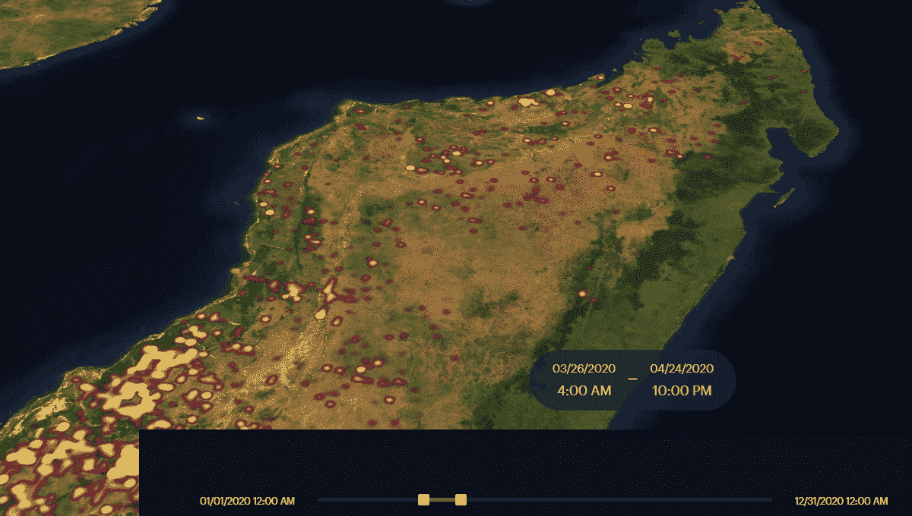

图片由作者提供。[最终在线演示](https://studio.unfolded.ai/public/35286e57-0bdc-48d6-97c2-b6fb5605a7b0)。2020 年马达加斯加的野火。

多亏了美国国家航空航天局，地球数据如今可以公开获取。资源管理系统的火灾信息部门([公司](https://earthdata.nasa.gov/earth-observation-data/near-real-time/firms))在卫星观测的 3 小时内发布接近实时的火灾/热异常数据。空间分辨率适中的产品之一是 375 万像素的可见红外成像辐射计套件。 *VIIRS 主动火灾产品*探测火灾或热烟雾，具有夜间探测能力。关于 *VIIRS 主动消防产品*的这些和其他细节可以在 [VIIRS 乐队网站](https://earthdata.nasa.gov/earth-observation-data/near-real-time/firms/viirs-i-band-active-fire-data)上找到，你也可以找到关于 VIIRS 用法和特性的[出版物](https://earthdata.nasa.gov/earth-observation-data/near-real-time/firms/about-firms#ed-firms-publications)。

如果您对下载公司数据感兴趣，您可以在这里创建一个新的数据请求:[下载公司数据](https://firms.modaps.eosdis.nasa.gov/download/)

## 关于可视化

一旦你能够下载数据集，就有一种简便的可视化方法，通过[展开的时空方法。在每年的时间范围内，您可以使用**时间戳**创建地图动画，而**坐标**可用于创建热图。确切地说，由于展开，您能够创建 wildfire 数据的热图动画。](https://www.unfolded.ai/)

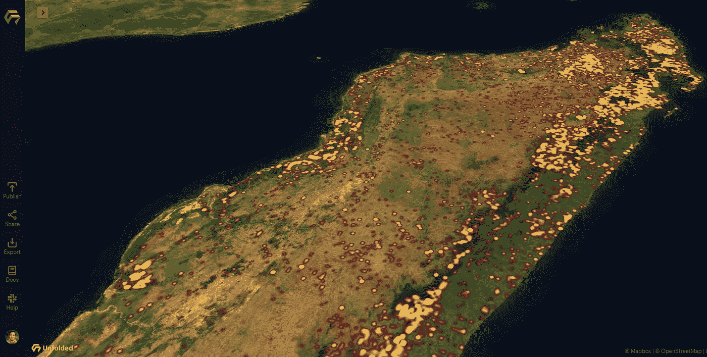

查看**在线演示:**[2020 年马达加斯加野火](https://studio.unfolded.ai/public/35286e57-0bdc-48d6-97c2-b6fb5605a7b0)

 [## 展开的工作室

### 2020 年马达加斯加的热图动画

studio.unfolded.ai](https://studio.unfolded.ai/public/35286e57-0bdc-48d6-97c2-b6fb5605a7b0/embed) 

这张马达加斯加年度热图动画是 2021 年 30 天地图挑战的一部分，它是与来自[数字地理实验室](https://www2.helsinki.fi/en/researchgroups/digital-geography-lab)的博士后研究员 [Johanna Eklund](https://researchportal.helsinki.fi/en/persons/johanna-eklund/publications/) 合作完成的。我感谢 Johanna 提供这个数据集并支持可视化的创建。

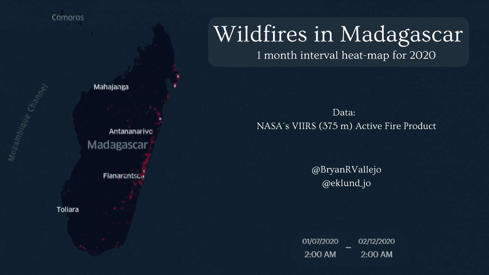

图片由作者提供。2020 年马达加斯加的野火

图片由作者提供。马达加斯加野火热图动画的推特帖子

## 关于数据许可和[引用](https://earthdata.nasa.gov/earth-observation-data/near-real-time/citation#ed-firms-citation)

美国航天局促进与研究和应用界、私营企业、学术界和公众全面和公开共享所有数据。阅读 NASA 的[数据和信息政策](http://science.nasa.gov/earth-science/earth-science-data/data-information-policy/)。

美国国家航空航天局要求使用公司数据产品或图像进行后续分发、获得增值产品或在书面或口头陈述中使用或引用公司产品的最终用户添加以下声明。

“*我们承认使用了美国宇航局资源管理系统(FIRMS)(*[*【https://earthdata.nasa.gov/firms*](https://earthdata.nasa.gov/firms)*)的火灾信息的数据和/或图像，这是美国宇航局地球观测系统数据和信息系统(EOSDIS)的一部分。”*

## 展开时的可视化参数

注意！您可以根据属性(如**昼夜**或**置信度)对数据进行子集划分。在决定你想要可视化什么之前，要知道元数据。**

将 CSV 格式的 VIIRS 数据集上传到展开的。您可以选择热图选项，选择经度和纬度列来做好准备。

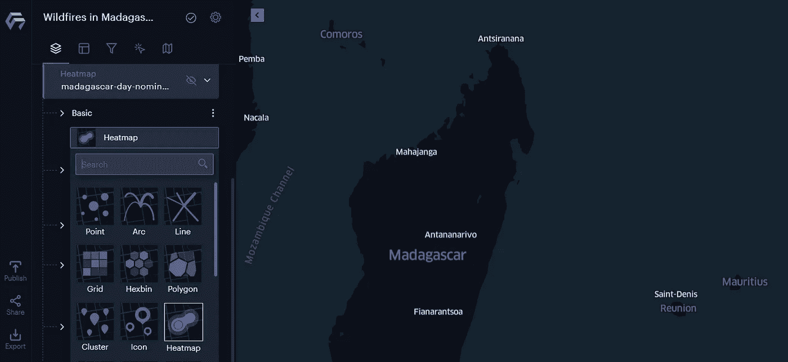

然后，下一步是设置热图的半径。半径确实能给出好的或坏的视觉效果。看看半径 20。

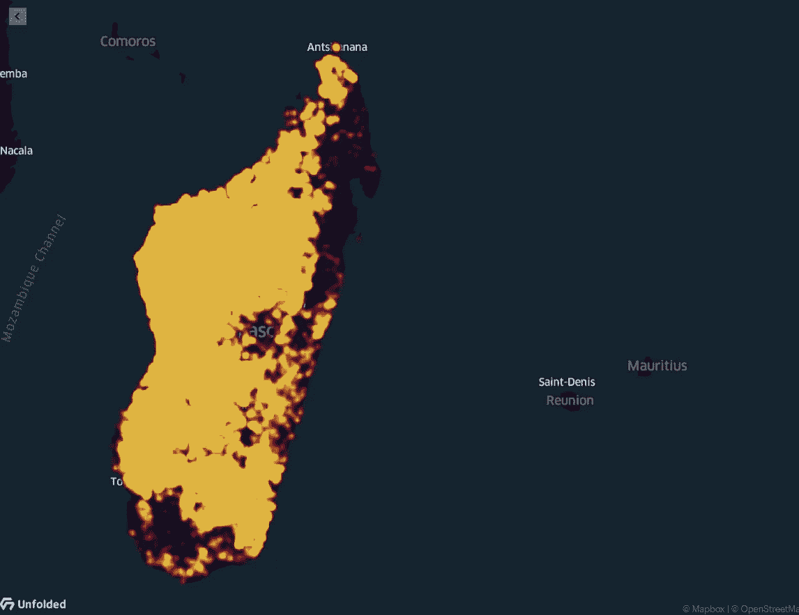

图片由作者提供。半径夸大的例子。

我们决定选择 0.1 级别的**半径**和无权重值。

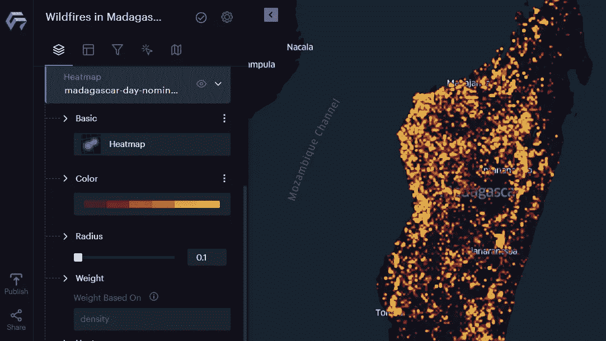

## 锐化热图

我们想用这些数据来可视化一年中野火的蔓延和空间分布。为了清楚地了解它们在哪里，我们设置了**强度**和**阈值。**我使用了强度较低的 0.8，因为它指出了非常高浓度的野火(黄色区域)，我将阈值设置为适中值 0.3，以了解低浓度野火位于何处(红色区域)。

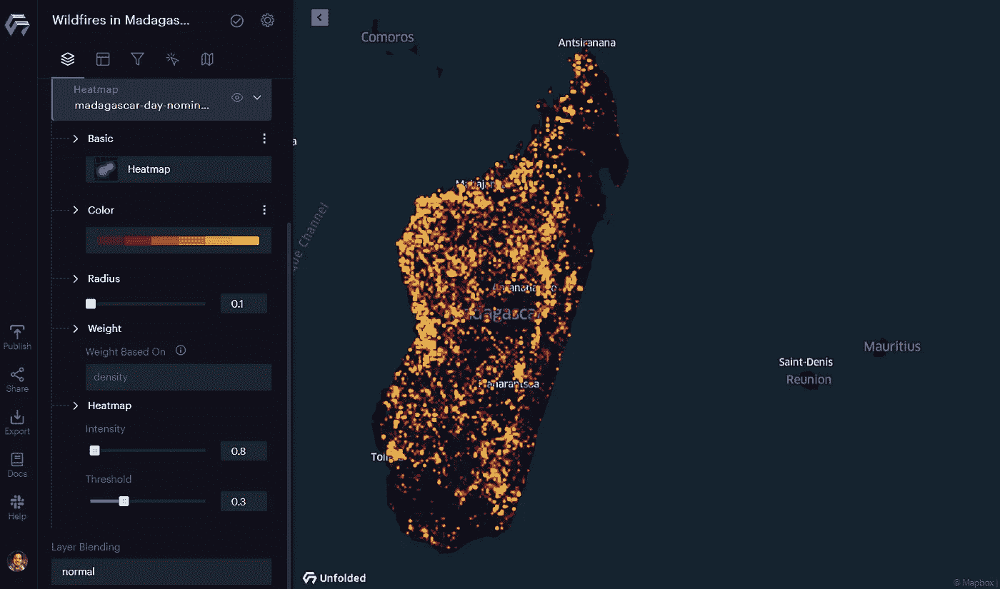

为了制作热图动画，我们创建了一个基于**时间戳的过滤器。**建议将**间隔**可视化设置为 1 个月。

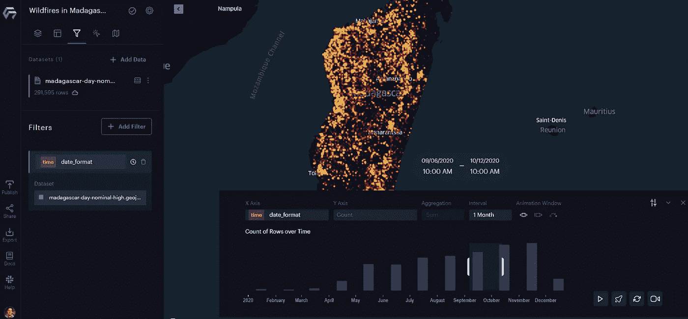

在此之后，你将能够看到在马达加斯加的旱季和雨季野火的空间分布是如何变化的。2020 年 3 月，西南部的野火发生率较低。

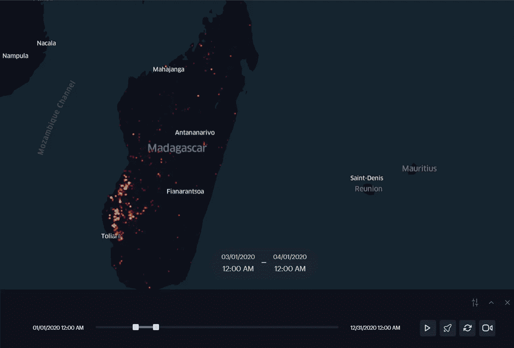

图片由作者提供。2020 年 3 月马达加斯加野火

后来，在 2020 年 6 月，马达加斯加西北部的野火高度集中。

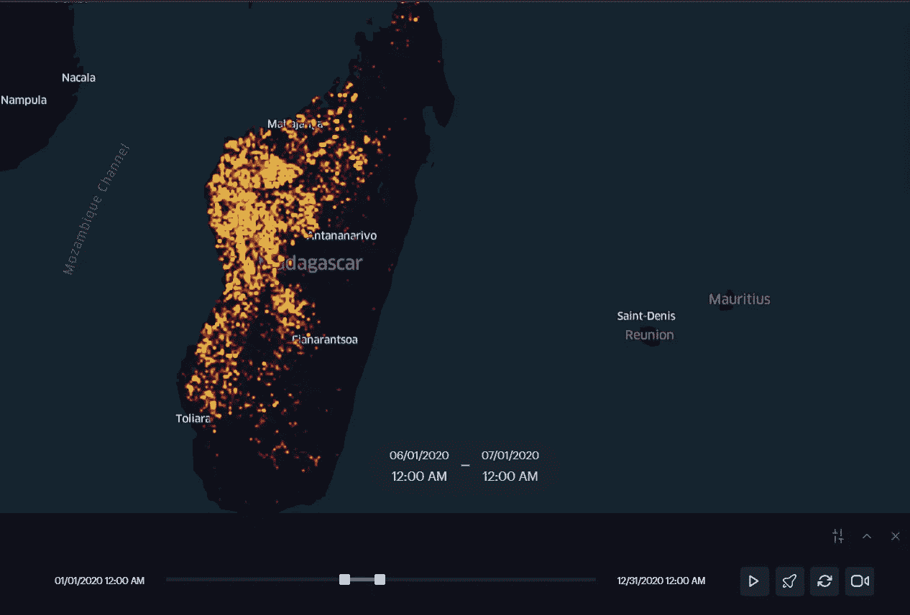

图片由作者提供。2020 年 3 月马达加斯加野火

当季节变化时，野火会转移到马达加斯加的东北部。现在，在季节性变化的国家的另一边，集中度很高。

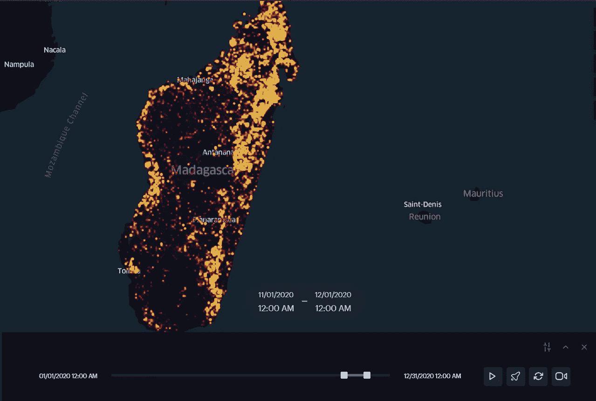

图片由作者提供。2020 年 11 月马达加斯加野火

## 建议

请注意，将现象可视化为热图是聪明的做法。它可以帮助您确定特定区域内事件的空间集中度。事件的集中是关键，因为它关系到因果关系。这意味着事件的高度集中与附近的其他变量有关。斯诺将热图用于流行病学，并成功地发现了霍乱的病因。罗布·卡恩斯(Rob Carnes)写的一个关于它的好故事可以在这里找到:[早期数据科学](https://medium.com/public-health/john-snow-early-big-data-science-d62b4dacd71b)。

所以，提高你的视觉化参数，直到你第一眼看到现象。相信我，作为一个地理学家，我能区分出一张地图是什么时候被仔细制作和锐化以帮助其他人形象化目标的。当你对你的地图感到满意时，你会让别人理解你所看到的。

我希望这个关于绘制野火的热图动画的简短建议对你和你未来的工作有用。如果您有任何问题，请随时联系我，我很乐意为您提供帮助。就在这篇文章里留言或者在 LinkedIn 上找我。