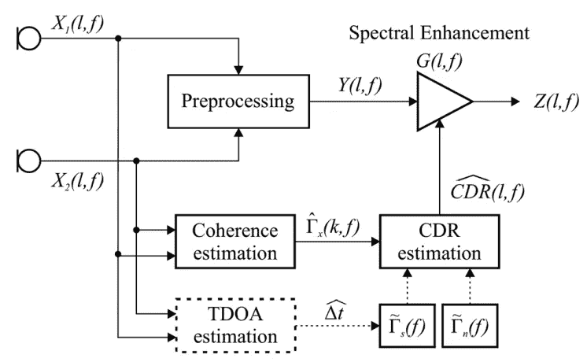
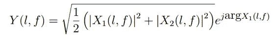
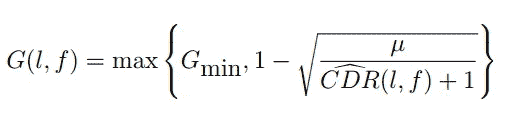
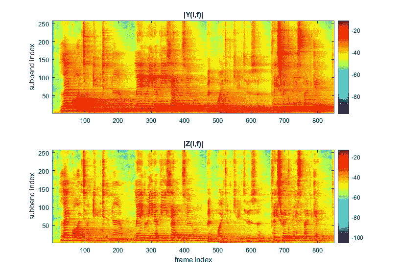
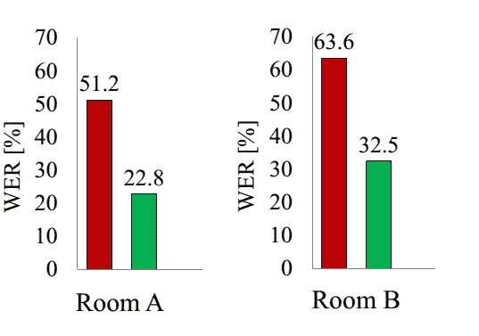

# 使用相干与扩散功率比估计器(CDR)的语音去混响

> 原文：<https://towardsdatascience.com/speech-dereverberation-using-coherent-to-diffuse-power-ratio-estimators-cdr-e632a5a79a51>

## 自动语音识别系统的预处理技术

作者创造的形象

# 介绍

当我们想要记录房间里的谈话时，会产生不同的音响效果。例如，我们可能会有一些不想要的背景噪音和房间表面的语音反射。

这些反射被称为 [**混响**](https://en.wikipedia.org/wiki/Reverberation) 。它们相互堆积，随着时间的推移而衰减，因为声音被物体表面吸收。已经表明，在混响环境中，我们的语音清晰度会受到不利影响。

此外，已经证明混响是[自动语音识别](https://en.wikipedia.org/wiki/Speech_recognition) (ASR)系统<https://asp-eurasipjournals.springeropen.com/articles/10.1186/s13634-015-0245-7>**中一个显著的误差来源。有些 ASR 系统在其设计中包含了在开始语音识别任务之前消除混响的方法。**

**因此，**去混响**是从声音中去除混响的过程，是**信号处理**中的一项关键任务。**

**在过去的十年中，已经提出了多种算法来抑制混响。在这篇文章中，提出了一种多信道去混响技术，该技术利用了**相干与扩散功率比(CDR)**[**【2】**](https://ieeexplore.ieee.org/document/7076629)估计，提高了 ASR 系统的性能。**

**CDR 度量是相干(期望的)和扩散(不期望的)信号分量之间的比率，其允许构建能够消除混响的**后置滤波器**(通常称为基于 CDR 的后置滤波器)。这个关系告诉我们有多少干净的语音超过了混响，并且取从零到无穷大的值，其中零表示高混响，无穷大表示只有干净的语音存在。**

**它类似于[**SNR**](https://en.wikipedia.org/wiki/Signal-to-noise_ratio)**metric、但噪声主要是混响。****

****倾向于估计 CDR 度量的技术被称为 CDR 估计器。要查看一些 CDR 估值器，您可以查看参考文献[**【2】**](https://ieeexplore.ieee.org/document/7076629)，其中包含原始推导和更深入的解释。****

****这项技术的有趣之处在于，它易于应用，并且不需要训练任何机器学习算法。****

# ****双麦克风阵列中 CDR 估计器的去混响****

****如何在双麦克风阵列中使用 CDR 估计器进行语音去混响？在图 1 中，我们可以看到带有 CDR 估计器的去混响标准流水线。****

********

******图 1** :基于预处理器和基于 CDR 的后置滤波器的去混响流水线。
图片取自[**【2】**](https://ieeexplore.ieee.org/document/7076629)****

****其中***【l，f】***， ***Y (l，f)***和 ***Z(l，f)*** 分别是**基于 CDR 的后置滤波器**，**预处理信号，**和**去混响信号**分别在<https://en.wikipedia.org/wiki/Short-time_Fourier_transform>**中。它们由 ***Z(l，f) = Y (l，f)G(l，f)*** 联系起来。******

****此外，***【l，f】***估计(在图 1 中以表示估计的帽子出现)依赖于在 *CDR 估计*块中处理的其他变量(参见[****【2】****](https://ieeexplore.ieee.org/document/7076629))，对它们的理解超出了本文的范围。****

**预处理信号 ***Y (l，f)*** 是输入记录的平方幅度和来自其中一个麦克风的相位的组合平均，如等式 1 所示。这个等式发生在图 1 的块*预处理*中。**

****

**等式 1**

**除此之外，基于 CDR 的后置滤波器通过采用来自块 *CDR 估计*的*估计和两个参数来获得。这如等式 2 所示:***

******

***等式 2***

***其中为过量系数， ***G_min*** 为用户设定的最小增益。在实际应用中，这些参数往往被优化以获得更好的听觉体验。***

***当***【l，f】***估计为不定式时，则***【G(l，f)*** 取值 1，当*为零时，***【G(l，f)*** 取值在*和****之间的最大值**** 因此，***【l，f】***的值介于 ***G_min*** 和 1 之间。*****

***简而言之，基于 CDR 的后置滤波器作为针对每个时间和频率仓的低 CDR 值的**混响** **衰减器**工作。***

***此外，这种方法考虑了两个麦克风的阵列，但也可能应用于更多麦克风的阵列，如本 [**未决问题**](https://github.com/andreas12345/cdr-dereverb/issues/1) 中所建议的，通过成对并执行平均***

# *****去混响的视觉示例*****

***去混响效果如何？在图 2 中，可以理解在 STFT 域中使用基于 CDR 的后滤波的预处理信号及其去混响版本的例子。这两个图像是通过从公共存储库[**【3】**](https://github.com/andreas12345/cdr-dereverb)标绘它们相应的光谱而获得的***

******

*****图 2** :使用 CDR 估计器的 STFT 域去混响示例。由作者通过绘制来自公共知识库[**【3】**](https://github.com/andreas12345/cdr-dereverb)的各个信号的结果而创建的图像***

***可以将预处理信号 ***Y (l，f)*** 中的混响视为频谱拖尾。换句话说，那些具有高能量(红色)的普遍频率成分往往持续更长时间。这表明由于反射，这些分量出现的时间比它们应该出现的时间要长。然而，在去混响信号中，这些反射比预处理信号中的反射短，表明基于 CDR 的后置滤波器正常工作。***

## ***使用 CDR 估计器消除混响的良好示例***

***如果你想听原声录音，图 2 中的去混响版本可以在资源库[**【3】**](https://github.com/andreas12345/cdr-dereverb)中找到。***

***可以在文件[**roomC-2m-75 deg . wav**](https://github.com/andreas12345/cdr-dereverb/blob/master/wav/roomC-2m-75deg.wav)中听有混响的原声，在 [**out.wav**](https://github.com/andreas12345/cdr-dereverb/blob/master/wav/out.wav) **中听去混响的版本。*****

# ***自动语音识别系统中的应用***

***如前所述，使用 CDR 估计器的语音去混响的一个潜在应用是在 ASR 系统中。有几项研究表明混响对语音识别性能的损害有多大。***

***在研究[**【4】**](https://www.researchgate.net/publication/262639033_Coherence-based_Dereverberation_for_Automatic_Speech_Recognition)中，介绍了 CDR 估计器的使用如何显著提高了[单词错误率](https://en.wikipedia.org/wiki/Word_error_rate) (WER)，这是众所周知的语音识别性能的度量标准。在同一研究中，强调了 CDR 估计器也与 ASR 系统中的其他传统去混响方法竞争。***

******

*****图 3** :两个不同房间的混响未处理信号(红色)和使用 CDR 后置滤波器技术去混响后(绿色)的 ASR 误码率。修改后的图像取自[【4】](https://www.researchgate.net/publication/262639033_Coherence-based_Dereverberation_for_Automatic_Speech_Recognition)***

***在图 3 中可以看到，对于混响未处理信号(红色)和应用 CDR 估计器后的去混响版本(绿色)，WER 的不同值之间的比较。***

***A 室是演讲厅，混响时间 1 秒，B 室是大门厅，混响时间 3.5 秒。有关本次实验的更多条件和调整的参数，请参考[**【4】**](https://www.researchgate.net/publication/262639033_Coherence-based_Dereverberation_for_Automatic_Speech_Recognition)***

# ***结论***

***如果您正在构建一个具有麦克风阵列的应用程序，并且需要执行一些预处理技术来消除混响，并且计算资源很少，那么您应该考虑使用这种技术。***

***此外，如图 3 所示，使用 CDR 估计器进行语音去混响可以将 ASR 中的 WER 降低近 30%。***

***这种技术的一个很大的优点是如何在不使用经过训练的模型的情况下实现高质量的去混响结果。然而，一个简单的应用技术背后，隐藏着复杂的推导和理解。***

# ***参考***

***[**【1】**](https://asp-eurasipjournals.springeropen.com/articles/10.1186/s13634-015-0245-7)德尔克罗伊，马克等《混响环境下远距离语音识别策略》。*《EURASIP 信号处理进展杂志*，2015 年，第 2015 卷，第 1 期，第 1–15 页。***

***[**【2】**](https://ieeexplore.ieee.org/document/7076629)**施瓦兹和沃尔特·凯勒曼。[去混响的相干-扩散功率比估计](https://ieeexplore.ieee.org/document/7076629)。IEEE/ACM 音频、语音和语言处理汇刊，23(6):1006–1018，2015。*****

*******[**3**](https://github.com/andreas12345/cdr-dereverb)**安德里亚斯·施瓦茨。cdr-dereverb。[https://github.com/andreas12345/cdr-dereverb](https://github.com/andreas12345/cdr-dereverb)，2019。*********

*******<https://www.researchgate.net/publication/262639033_Coherence-based_Dereverberation_for_Automatic_Speech_Recognition>**施瓦茨、安德里；布伦德尔、安德列亚斯；沃尔特.凯勒曼。用于自动语音识别的基于相干性的去混响。在*程序中。DAGA* 。2014.*********