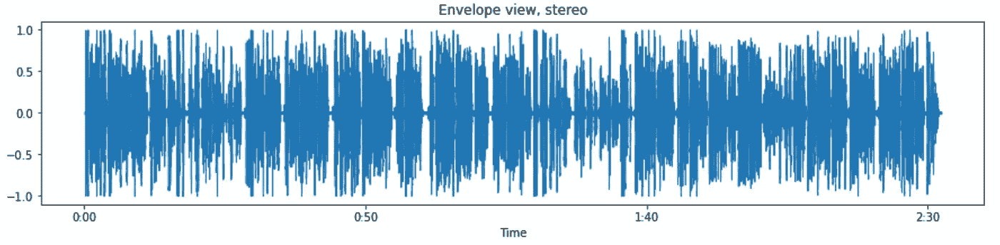
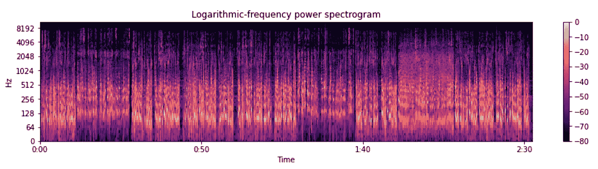
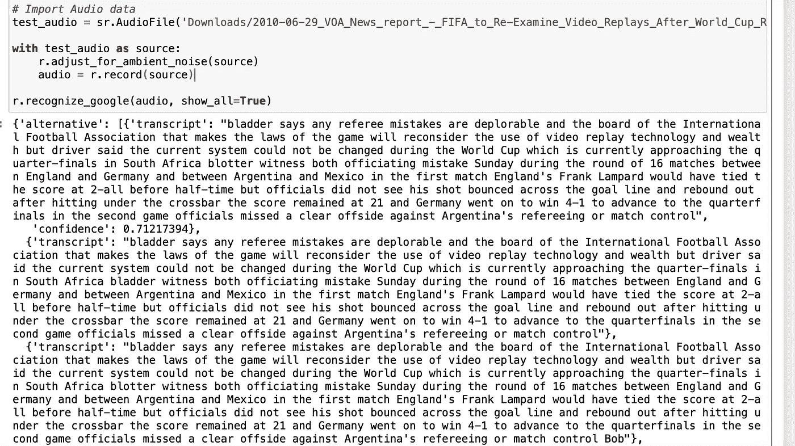
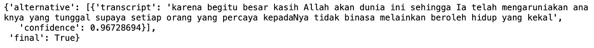
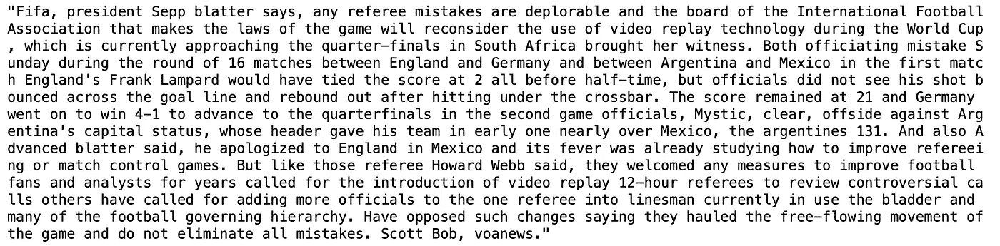
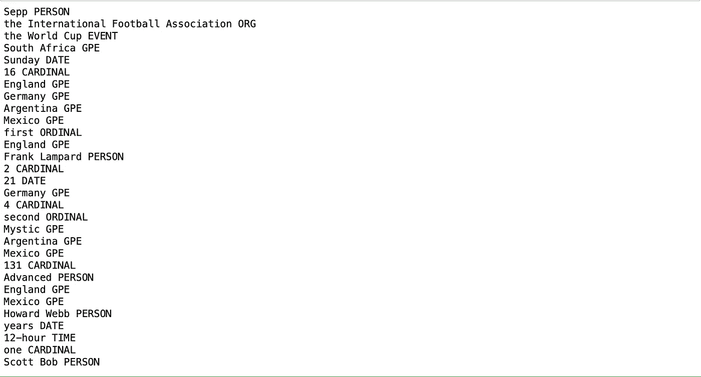

# 用于分析的语音识别

> 原文：<https://towardsdatascience.com/speech-recognition-for-analytics-e98c1e496873>


[梁杰森](https://unsplash.com/@ninjason?utm_source=medium&utm_medium=referral)在 [Unsplash](https://unsplash.com?utm_source=medium&utm_medium=referral) 上的照片

## 利用语音到文本处理充分利用您的音频数据

为了在竞争中占据优势，企业正在收集比以往更多的数据。大数据架构使这种增长成为可能，促进了海量和多种数据的快速捕获。除了常规的表格数字事务，我们还可以看到事件日志、文本消息，甚至是**多媒体内容**。

如果适当利用这些多媒体内容，可以为你所在的企业带来**额外的关键洞察力**。想象一下，如果您可以从客户服务电话中分析客户的主要问题和最常用的解决方案，或者在您的电子商务平台上消除垃圾/无关的文本/图像/视频评论。在本文中，我们将重点关注**音频分析**，特别是**处理/转录它们**，以便使用文本自然语言处理(NLP)工具进行进一步分析。

*本次分析使用的完整代码共享在*[*this Github project*](https://github.com/oliviatan29/speech-recognition-analysis/tree/main)*下。*

本文旨在使用 Python 中的语音识别库。如果你有兴趣了解更多关于音频数据内在的、与波形相关的特性，你可以查看[这篇文章](https://medium.com/towards-data-science/get-to-know-audio-feature-extraction-in-python-a499fdaefe42)。

# 音频文件的预处理

Python 中的大多数音频处理库要求音频文件为**波形(。wav)格式**进行处理。WAV 本身是最受欢迎的数字音频格式之一，因为它具有无损文件特性，不同于已经被压缩的 mp3/m4a。因此，如果您的音频文件不是 WAV 格式，建议您在继续分析之前先将其转换为 WAV 格式。

在 Python 中，我们可以使用 [**pydub**](https://github.com/jiaaro/pydub) 包进行音频文件的转换。从输入文件创建 AudioSegment 实例并使用“导出”功能导出所需的输出文件非常简单。

```
from pydub import AudioSegmentAudioSegment.converter = "Downloads/ffmpeg"
AudioSegment.ffmpeg = "Downloads/ffmpeg"
AudioSegment.ffprobe ="Downloads/ffprobe"from pydub.playback import play# Create an AudioSegment instance
raw_file = AudioSegment.from_file(file="Downloads/2010-06-29_VOA_News_report_-_FIFA_to_Re-Examine_Video_Replays_After_World_Cup_Referee_Mistakes.ogg", format="ogg")# Check the type
print(type(raw_file))# Export the .ogg file as wav
raw_file.export(out_f="Downloads/2010-06-29_VOA_News_report_-_FIFA_to_Re-Examine_Video_Replays_After_World_Cup_Referee_Mistakes.wav",
                format="wav")
```

除了转换文件格式，pydub 包还可以用于其他音频文件操作，如扩展/附加音频文件，分割音频文件，增加音量，或设置淡出过渡。

# 通用音频功能探索

现在我们有了正确的输入文件格式，我们可以通过查看音频文件的一般属性来开始我们的音频分析，如音频文件本身的*(声压的强度或级别)*(单位时间的振动)，或 ***长度*** 。**

**在这个分析中，我使用了来自 Wikimedia 的两个开放许可的音频文件:**

*   **[美国之音新闻报道——国际足联将重新审查世界杯裁判失误后的录像回放。ogg](https://commons.wikimedia.org/wiki/File:2010-06-29_VOA_News_report_-_FIFA_to_Re-Examine_Video_Replays_After_World_Cup_Referee_Mistakes.ogg) 归[美国之音新闻](https://www.voanews.com/)公有领域**
*   **[Aldi —印度尼西亚语—圣经·约翰福音 3–16 . ogg](https://commons.wikimedia.org/wiki/File:Aldi_-_Indonesian_language_-_Bible_Verse_John_3-16.ogg)可在[知识共享](https://en.wikipedia.org/wiki/en:Creative_Commons) [CC0 1.0 通用公共领域专用](https://creativecommons.org/publicdomain/zero/1.0/deed.en)下获得**

**这些文件源的详细信息可以在本文末尾找到(参考资料部分)。**

**我们可以使用 Python 中的 [**librosa**](https://librosa.org/) 包来提取音频文件特征。Librosa 是一个扩展包，允许我们提取各种音频文件属性，从振幅/频率等直接属性到更高级的导数属性，如[过零率](https://en.wikipedia.org/wiki/Zero-crossing_rate)和[梅尔频率倒谱系数(MFCCs)](https://en.wikipedia.org/wiki/Mel-frequency_cepstrum) 。它还允许各种可视化，从常规的线形图到[光谱图](https://en.wikipedia.org/wiki/Spectrogram)格式。**

**下面是在 librosa 中生成振幅可视化的代码。从可视化中，我们可以看到从文件的开始到大约 2.30 分钟的整个过程中相当一致的信号。**

```
**import librosa
import librosa.displayy, sr = librosa.load('Downloads/2010-06-29_VOA_News_report_-_FIFA_to_Re-Examine_Video_Replays_After_World_Cup_Referee_Mistakes.wav', mono=False)fig, ax = plt.subplots(figsize=(15, 3))
img = librosa.display.waveshow(y, sr=sr, ax=ax)ax.set(title='Envelope view, stereo')
ax.label_outer()plt.show()**
```

****

**美国之音新闻文件的振幅图**

**下面是在 librosa 中生成频谱图的代码。从这个图像中，我们可以看到音频文件的 5 个大片段。有一个是从 0:00 到 0:08，然后从 0:08 到 0:25，然后从 0:25 到 1:17，然后从 1:17 到 1:30，然后 1:30 到文件结尾。如果我们听音频文件，这些片段**代表文件**的变化设置——在清晰的录音室录音和轻微嘈杂的现场采访之间。**

```
**# Load audio file to Librosa
y, sr = librosa.load('Downloads/2010-06-29_VOA_News_report_-_FIFA_to_Re-Examine_Video_Replays_After_World_Cup_Referee_Mistakes.wav')# Converts data into short term Fourier transform. 
# STFT converts signals such that we can know the amplitude of the given frequency at a given time
D = librosa.amplitude_to_db(np.abs(librosa.stft(y)), ref=np.max)# Display spectogram
fig, ax = plt.subplots(figsize=(15, 3))
img = librosa.display.specshow(D, y_axis='log', x_axis='time', sr=sr)
ax.set(title='Logarithmic-frequency power spectrogram')
ax.label_outer()plt.colorbar()**
```

****

**美国之音新闻音频的对数频率频谱图**

# **语音识别**

**在探索了一般的音频功能之后，是时候进入这个项目令人兴奋的亮点了——*语音识别部分*！**

**很简单，你可以 ***将你的音频文件运行到一个预先确定的引擎中，以获得文本转录*** 。我们在这个转录过程中使用 Python 中的[语音识别](https://github.com/Uberi/speech_recognition)库。它支持多种语音识别引擎，如 [CMU 斯芬克斯](https://cmusphinx.github.io/wiki/)、[谷歌云语音 API](https://cloud.google.com/speech-to-text) 、[微软必应语音识别](https://www.microsoft.com/cognitive-services/en-us/speech-api)和 [IBM 语音转文本](http://www.ibm.com/smarterplanet/us/en/ibmwatson/developercloud/speech-to-text.html)。请注意，其中一些引擎需要使用 API 令牌。对于这个项目，我们使用**谷歌语音识别和默认的 API 键**。**

## **语音识别功能**

**语音识别库有一个**识别器**类，它有一组用于语音识别设置和功能的内置函数。**

**首先，我们导入库并设置识别器。然后，我们导入要转录的音频文件。**

```
**import speech_recognition as sr# Set up recognizer
r = sr.Recognizer()# Import Audio data
test_audio = sr.AudioFile('Downloads/2010-06-29_VOA_News_report_-_FIFA_to_Re-Examine_Video_Replays_After_World_Cup_Referee_Mistakes.wav')**
```

**从这里开始，我们可以使用`recognize_google`函数直接进行转录，该函数接受音频文件输入并给出转录作为输出。然而，根据您的音频文件的**质量，其他一些功能可以用来增强您的音频文件，从而提供更好的转录。****

****如果您的音频文件包含一些您不需要转录的不必要内容**，您可以使用`record` 功能中的“持续时间”和“偏移量”变量来选择要转录的音频文件的特定部分。**

****如果您的音频文件有噪音**，您可以使用`adjust_for_ambient_noise`功能校准环境噪音水平的能量阈值。校准允许识别器忽略噪声并专注于实际语音。**

**下面是 VOA 新闻音频文件的语音识别代码。**

```
**# Set up recognizer
r = sr.Recognizer()# Import Audio data
test_audio2 = sr.AudioFile('Downloads/2010-06-29_VOA_News_report_-_FIFA_to_Re-Examine_Video_Replays_After_World_Cup_Referee_Mistakes.wav')# Covert the AudioFile to AudioData, adjust for noise, cut by duration
with test_audio2 as source2:
    r.adjust_for_ambient_noise(source)
    audio2 = r.record(source2, duration=60)
    audio3 = r.record(source2, duration=60)
    audio4 = r.record(source2)# Generate transcription
text_audio = r.recognize_google(audio2) + " " + r.recognize_google(audio3) + " " + r.recognize_google(audio4)
text_audio**
```

**它将生成如下转录文本。**

****

**美国之音新闻音频的语音识别转录**

**语音识别引擎可能有几种来自不同识别技术的转录结果。识别器类自动地**挑选具有最高置信度得分的一个**。如果你想检查其他的转录结果，你可以在`recognize_google`函数中添加`show_all=True`变量。**

****

**有各种转录结果可用**

**关于语音识别库的更多细节，你可以在这里浏览他们的文档。**

## **非英语语言的语音识别**

**语音识别也允许识别一些非英语语言。在这种情况下，你只需要在`recognize_google`函数中添加`language="id-ID"`变量。**

```
**# Set up recognizer
r = sr.Recognizer()# Import Audio data
test_audio = sr.AudioFile('Downloads/Aldi_-_Indonesian_language_-_Bible_Verse_John_3-16.wav')
with test_audio as source:
    r.adjust_for_ambient_noise(source)
    audio = r.record(source)

r.recognize_google(audio, language="id-ID", show_all=True)**
```

****

**非英语(印度尼西亚语)语言的转录结果**

**此处列出了可用语言的列表[。](https://stackoverflow.com/questions/14257598/what-are-language-codes-in-chromes-implementation-of-the-html5-speech-recogniti/14302134#14302134)**

## **使用标点符号**

**从上面的结果可以看出，语音转录是以纯文本的形式交付的，没有任何格式。如果你在抄写一篇冗长的演讲或对话，这可能会令人困惑。**

**我偶然发现了[标点符号](https://pypi.org/project/punctuator/)库，可以用来在文本文件上标注标点符号，提高转录的可读性。使用起来非常简单，你只需要运行`punctuate`函数，就可以得到带注释的文本。**

```
**from punctuator import Punctuatorp = Punctuator('Downloads/INTERSPEECH-T-BRNN.pcl')
text_audio_punc = p.punctuate(text_audio)
text_audio_punc**
```

****

**标点转录结果**

**在某些情况下，注释可能无法完美地工作，但它确实有助于提高可读性。**

# **语言分析**

**现在以文本格式的形式，你可以**将各种自然语言处理技术**应用到你的音频转录中。可能性是无穷的，从做情感分析，话题抽取，分类等等。**

**在这个项目中，我只是使用[空间](https://spacy.io/)提供了一个简单的[命名实体识别](https://en.wikipedia.org/wiki/Named-entity_recognition)的例子，这对主题/对象分析和分类很有用。**

```
**import spacy# Load spaCy language model
nlp = spacy.load("en_core_web_sm")# Set up the transcribed text as doc
doc = nlp(text_audio_punc)# Find named entities in doc
for entity in doc.ents:
    print(entity.text, entity.label_)**
```

****

**命名实体识别结果空间**

**查看该结果，我们可以确定音频文件正在谈论世界杯事件(来自国际足球协会和世界杯实体)，其中提到了国家之间的一些比赛(来自国家名称和一些球员姓名实体)。**

# **结束语**

**包括音频数据在内的多媒体数据虽然已经被收集，但还没有被普遍用于产品和商业分析。有一些 Python 库包可以用来从这些音频数据中提取特征，包括使用语音识别技术的内容；允许我们**从这些音频数据**中获得最大收益。一旦转录成文本，这些数据就可以利用自然语言处理技术用于各种目的。可用性各不相同，从通过情感分析了解客户满意度，从客户服务电话评估关注的话题，到从平台删除垃圾/辱骂内容，等等。如果您已经有了数据(或者在收集和存储它们方面没有任何困难)，为什么不充分利用这些数据来进行产品分析呢？**

***本分析中使用的完整代码共享在*[*this Github project*](https://github.com/oliviatan29/speech-recognition-analysis/tree/main)*下。***

****使用的音频参考****

**[1] [美国之音新闻报道——国际足联重新审查世界杯裁判失误后的录像回放。该媒体在美国属于公共领域，因为它完全由美国联邦政府官方对外广播机构美国之音制作和提供的材料组成。](https://commons.wikimedia.org/wiki/File:2010-06-29_VOA_News_report_-_FIFA_to_Re-Examine_Video_Replays_After_World_Cup_Referee_Mistakes.ogg)**

**[2] [阿尔迪语——印尼语——圣经约翰福音 3–16 节. ogg](https://commons.wikimedia.org/wiki/File:Aldi_-_Indonesian_language_-_Bible_Verse_John_3-16.ogg)；根据[知识共享协议](https://en.wikipedia.org/wiki/en:Creative_Commons)许可 [CC0 1.0 通用公共领域专用](https://creativecommons.org/publicdomain/zero/1.0/deed.en)**