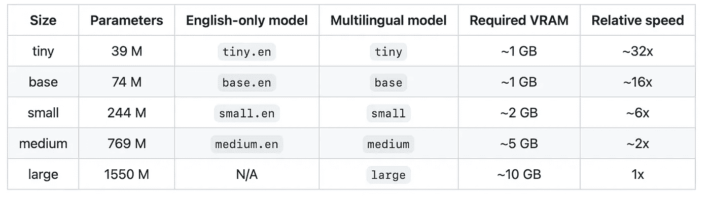
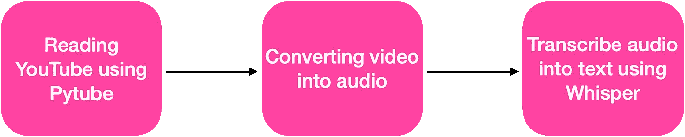

# 使用 OpenAI 的耳语进行语音转文本

> 原文：<https://towardsdatascience.com/speech-to-text-with-openais-whisper-53d5cea9005e>

## 轻松语音转文本


纪尧姆·德·日耳曼在 [Unsplash](https://unsplash.com/s/photos/speech-recognition?utm_source=unsplash&utm_medium=referral&utm_content=creditCopyText) 上的照片

OpenAI 最近发布了一个新的语音识别模型，名为 Whisper。与 DALLE-2 和 GPT-3 不同，Whisper 是一个免费的开源模型。

Whisper 是一个自动语音识别模型，根据从网络上收集的 680，000 小时多语言数据进行训练。按照 OpenAI 的说法，这种模型对口音、背景噪音和技术语言具有鲁棒性。此外，它支持 99 种不同语言的转录和翻译。

本文解释了如何使用 Whisper 模型和 Python 将语音转换成文本。并且，它不会涵盖模型如何工作或者模型架构。你可以在这里查看更多关于密语[的信息。](https://openai.com/blog/whisper/)

Whisper 有五款(参考下表)。下面是 OpenAI 的 GitHub 页面上的表格。根据 OpenAI 的说法，纯英文应用程序有四种模式，表示为`.en`。`tiny.en`和`base.en`车型表现更好，但是`small.en`和`medium.en`车型的差异会变得不那么显著。



Ref: [OpenAI 的 GitHHub 页面](https://github.com/openai/whisper)

对于本文，我将 Youtube 视频转换为音频，并将音频传递到 whisper 模型，以将其转换为文本。



作者图片

我用 Google Colab 和 GPU 来执行下面的代码。

## 导入 Pytube 库

```
!pip install -— upgrade pytube
```

阅读 YouTube 视频并下载为 MP4 文件进行转录
在第一个例子中，我正在按照下面的 Youtube 视频阅读著名的拍摄电影对话

```
**#Importing Pytube library**import pytube**# Reading the above Taken movie Youtube link**video = ‘https://www.youtube.com/watch?v=-LIIf7E-qFI'data = pytube.YouTube(video)**# Converting and downloading as 'MP4' file**audio = data.streams.get_audio_only()audio.download()
```

## 输出


上面的 YouTube 链接已经下载为“MP4”文件，并存储在 content 下。现在，下一步是将音频转换成文本。我们可以使用 whisper 用三行代码来实现。

## 导入 Whisper 库

```
# Installing Whisper libary!pip install git+https://github.com/openai/whisper.git -qimport whisper
```

## 装载模型

我在这里使用了`medium`多语言模型，并传递了上面的音频文件`I will find YouI will Kill You Taken Movie best scene ever liam neeson.mp4`并存储为一个文本对象

```
model = whisper.load_model(“large”)text = model1.transcribe(“I will find YouI will Kill You Taken Movie best scene ever liam neeson.mp4”)**#printing the transcribe**text['text']
```

## 输出

以下是音频中的文字。和音频完全吻合。

```
I don’t know who you are. I don’t know what you want. If you are looking for ransom, I can tell you I don’t have money. But what I do have are a very particular set of skills. Skills I have acquired over a very long career. Skills that make me a nightmare for people like you. If you let my daughter go now, that will be the end of it. I will not look for you. I will not pursue you. But if you don’t, I will look for you. I will find you. And I will kill you. Good luck.
```

# 如何转换不同的音频语言？

我们知道，Whisper 支持 99 种语言；我正在尝试使用印度语言，并把下面的电影剪辑视频转换成文本。

在这个例子中，我使用了`large`模型

```
#Importing Pytube libraryimport pytube# Reading the above tamil movie clip from Youtube linkvideo = ‘https://www.youtube.com/watch?v=H1HPYH2uMfQ'data = pytube.YouTube(video)# Converting and downloading as ‘MP4’ fileaudio = data.streams.get_audio_only()audio.download()
```

## **输出**


## 加载大型模型

```
**#Loading large model**
model = whisper.load_model(“large”)text = model1.transcribe(“Petta mass dialogue with WhatsApp status 30 Seconds.mp4”)**#printing the transcribe**text['text']
```

## 输出

模型转换成文本以上泰米尔语音频剪辑。模型很好地转录了音频；然而，我可以看到语言中的一些小变化。

```
சிறப்பான தரமான சம்பவங்களை இனிமேல் தான் பார்க்கப் போகிறேன். ஏய்.. ஏய்.. ஏய்.. சத்தியமா சொல்கிறேன். அடிச்சி அண்டு வேண்டும் என்று ஓழ்வு விட்டுடுவேன். மானம் போலம் திருப்பி வராது பார்த்துவிடு. ஏய்.. யாருக்காவது பொண்டாட்டி குழந்தைக் குட்டியன் சென்றும் குட்டும் என்று செய்துவிட்டு இருந்தால் அப்டியே ஓடி போய்டு.
```

主要试了中大型。它是稳健的，并准确转录音频。还有，我用带 GPU 的 Azure Synapse 笔记本转录了一段最长 10 分钟的音频，效果非常好。

这是完全开源和免费的；我们可以在您的项目中直接使用它进行语音识别应用。我们也可以把其他语言翻译成英语。我将在我的下一篇文章中用长音频和不同语言的英语来介绍它。

可以多查一下 Whisper 的型号；请访问 Whisper 的 G [ithub 页面](https://github.com/openai/whisper)。

感谢阅读。继续学习，并期待更多！

## 参考

1.  [https://github.com/openai/whisper](https://github.com/openai/whisper)
2.  [https://openai.com/blog/whisper/](https://openai.com/blog/whisper/)