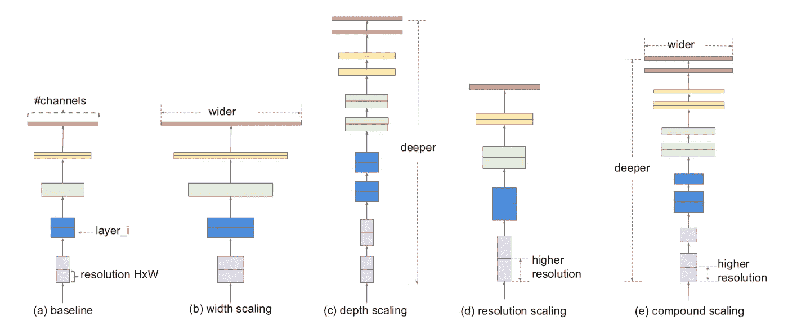
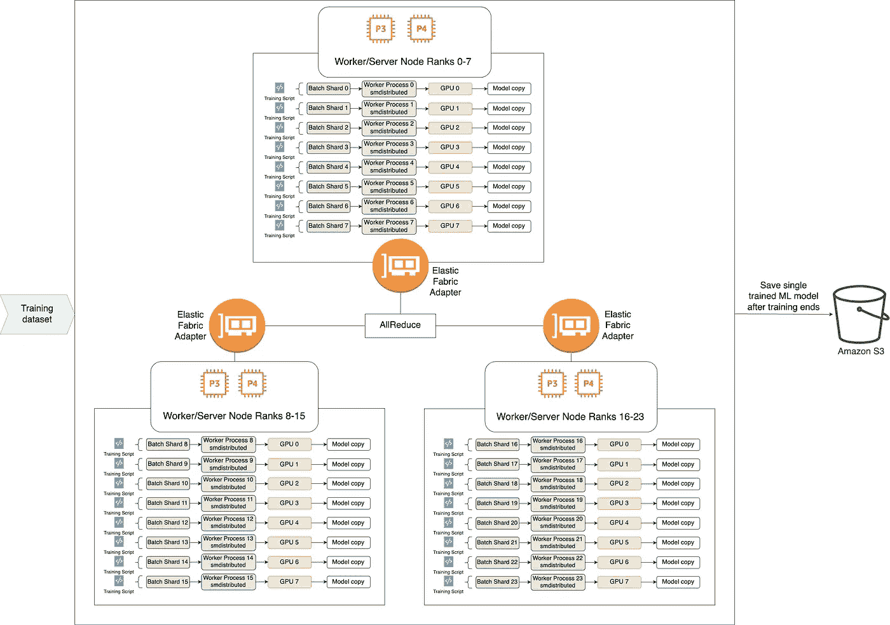
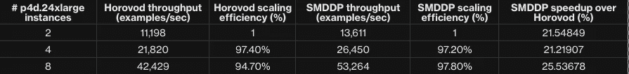
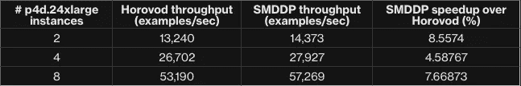
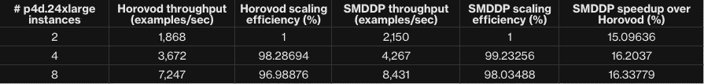
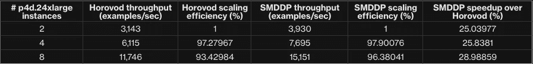

# 使用 SageMaker 分布式数据并行库加快 AWS 的高效网络培训

> 原文：<https://towardsdatascience.com/speed-up-efficientnet-training-on-aws-by-up-to-30-with-sagemaker-distributed-data-parallel-library-2dbf6d1e18e8>

## [理解大数据](https://towardsdatascience.com/tagged/making-sense-of-big-data)

# 使用 SageMaker 分布式数据并行库加快 AWS 的高效网络培训

## 深入探讨 SageMaker 分布式数据并行如何帮助将最先进的 EfficientNet 模型的训练速度提高 30%

卷积神经网络(CNN)现在广泛用于执行计算机视觉任务。自动驾驶汽车、安全系统和医疗保健等领域正朝着在应用工作流中采用 CNN 的方向发展。这些用例通常需要高精度模型，根据部署位置的不同，计算要求也有所不同，例如，基于边缘的安全系统可用的计算基础设施与基于云的医疗成像系统非常不同。

然而，训练机器学习模型并将其集成到应用程序中可能会很麻烦，这就是为什么我们在 AWS 开发了[亚马逊 SageMaker](https://aws.amazon.com/sagemaker/) ，这是一个完全管理的端到端机器学习(ML)平台。SageMaker 提供工具并管理基础设施；因此，ML 科学家和开发人员可以专注于模型开发。你可以仔细阅读 [SageMaker 示例 GitHub 知识库](https://github.com/aws/amazon-sagemaker-examples)，深入了解 SageMaker 如何简化你的机器学习管道。

SageMaker 还允许您通过在多个 GPU 上分配训练来更快地训练模型。为了帮助您更快更便宜地训练您的模型，我们在 AWS 的团队开发了 [**SageMaker 分布式数据并行(SMDDP)**](https://docs.aws.amazon.com/sagemaker/latest/dg/data-parallel-intro.html) 库，以实现*接近线性的缩放效率*和*最少的代码更改*。SMDDP 通过利用 AWS 的专业网络基础设施和 Amazon EC2 拓扑信息来执行优化的节点间通信，以加快您的分布式培训工作量。我们已经发表了[一篇论文](https://www.amazon.science/publications/herring-rethinking-the-parameter-server-at-scale-for-the-cloud)来描述 SMDDP 的内部设计和背后的科学原理，供您参考。

在这篇文章中，你将看到与 [Horovod](https://horovod.ai/) 相比，SMDDP 如何帮助你在 EfficientNet 的训练中获得高达 30%的速度，efficient net 是一种用于计算机视觉任务的最先进的模型。我们将首先对 EfficientNet 和 SMDDP 进行概述，然后我们将一步一步地指导您如何修改现有的 EfficientNet 代码，这些代码使用带有 TensorFlow 的 [Horovod 来替代使用 SMDDP。最后，我们将通过查看一些性能测量来帮助您了解 SMDDP 的优势。到本帖结束，你应该能使用 SMDDP 加快自己模型的训练速度了！](/distributed-deep-learning-with-horovod-2d1eea004cb2)

# EfficientNet 概述

卷积神经网络的一个关键挑战是扩展网络，即增加模型参数的数量以获得更高的精度。扩展 CNN 的常用策略是开发具有更高层数的更深模型。事实上，多年来， [ImageNet 大规模视觉识别挑战赛(ILSVRC)](https://image-net.org/) 的获奖作品毫不奇怪地采用了更深层次的 CNN，AlexNet 在 2012 年使用了 8 层，ResNet 在 2015 年使用了 152 层。

然而，以这种方式放大 CNN 是乏味的，需要大量的微调和实验来达到具有所需精度和资源要求的网络。谷歌的研究人员在他们的 [ICML 的论文](https://arxiv.org/abs/1905.11946)中解决了这个问题，他们开发了一种放大 CNN 的原则性方法，他们称之为*复合缩放*。复合扩展的关键在于神经网络可以在三个维度上扩展

1.  深度:增加网络的层数，这是 ResNets 中使用的主要缩放方法。
2.  宽度:增加单层中神经元的数量，或者更具体地说，增加卷积层中使用的滤波器的数量。
3.  分辨率:增加输入图像的宽度和高度。



EfficientNet 模型中使用的复合缩放。图片来自 [EfficientNet:反思卷积神经网络的模型缩放，ICML 2019](https://arxiv.org/abs/1905.11946)

复合缩放本质上是以一个恒定的比率沿着上述三个维度均匀地缩放网络，作者称之为*复合系数ɸ.*通过使用更大的复合系数，可以生成更精确且计算成本更高的模型。

虽然作者表明复合扩展可以普遍应用于任何基线网络架构，但复合扩展的效率受到基线网络架构选择的严重影响。为此，作者利用[神经架构搜索](/neural-architecture-search-nas-the-future-of-deep-learning-c99356351136)构建了一个最优网络架构 *EfficientNet-B0* 。该基线网络的主要构建模块是 MobileNetv2 中使用的[移动反向瓶颈模块。EfficientNet-B0 在只有 530 万个参数的 ImageNet 上实现了 77.1%的准确率。相比之下，ResNet-50 提供了 76%的准确性，但使用了 5 倍数量的参数。这使得 EfficientNet 成为自动驾驶汽车和安全系统等需要较低计算开销和高精度的系统的首选。此外，可以使用复合缩放来缩放 EfficientNet 以获得更高的精度，从而产生 EfficientNet-B1 至 EfficientNet-B7，该整数位于名称的末尾，表示复合系数ɸ *。*你可以在这篇](/review-mobilenetv2-light-weight-model-image-classification-8febb490e61c)[详细博客](/efficientnet-scaling-of-convolutional-neural-networks-done-right-3fde32aef8ff)中读到更多关于 EfficientNet 的技术细节。

# 分布式数据并行训练和 SMDDP

这些年来，可用于训练模型的训练数据量一直在增长，并且将来还会继续增长。例如，在这篇文章中，我们使用 ImageNet 数据集训练 EfficientNet，该数据集有超过一百万个训练图像。根据我们与 AWS 客户合作的经验，训练数据的大小可能会大得多，因为训练作业通常会使用超过 1000 万到 1500 万张训练图像！有了如此大的训练数据，在单个 GPU 上运行单个时期(整个训练数据集的一个完整周期)的训练的时间增加了，使得训练非常长，并且不符合业务需求。

人们可以通过使用多个 GPU 并利用一种称为*数据并行*的技术来减少训练时间。数据并行工作流程如下-

1.  驻留在每个 GPU 上的工作者进程具有其自己的模型副本，并且训练数据在工作者之间被分割。
2.  对于每个工人，我们在相应的训练数据片段上运行一次迭代训练，并使用[反向传播算法](/understanding-backpropagation-algorithm-7bb3aa2f95fd)计算梯度。
3.  在每次迭代结束时，所有工人使用 [AllReduce 算法](/visual-intuition-on-ring-allreduce-for-distributed-deep-learning-d1f34b4911da)交换本地计算的梯度，并计算全局平均梯度，然后用于更新模型的本地副本。



AWS 上的数据并行分布式深度学习。照片摘自 AWS 文档[sage maker 分布式数据并行库介绍](https://docs.aws.amazon.com/sagemaker/latest/dg/data-parallel-intro.html)

在分布式培训中，我们上面看到的所有减少步骤都涉及到通过网络在工人之间进行梯度交流。对于像 EfficientNet 这样拥有超过一百万个参数的先进模型，通过网络交换梯度会导致大量的通信开销，因为大型模型梯度会在实例之间争夺有限的网络带宽。除了降低训练速度之外，通信开销还限制了分布式数据并行训练的可扩展性。

理想情况下，难道我们不都喜欢线性*缩放效率，*其中训练速度与用于训练的 GPU 数量成比例地提高！通信开销成为实现线性扩展效率的障碍，并导致昂贵的 GPU 资源未得到充分利用。

我们在 AWS 的团队已经认识到这个关键问题，并开发了 SageMaker 分布式数据并行库(SMDDP)来提供接近线性的扩展效率，以最少的代码更改实现更快的训练速度。该库利用 AWS 基础设施，如[弹性纤维适配器](https://aws.amazon.com/hpc/efa/) (EFA)和亚马逊 EC2 拓扑信息来实现定制的优化 AllReduce 算法。SMDDP 还使用 CPU 而不是 GPU(其他通信库，如 [NCCL](https://developer.nvidia.com/nccl) 只使用 GPU)来执行 AllReduce，提供更多的 GPU 周期来计算梯度。这允许反向传递和梯度传递之间有更大程度的重叠，从而减少训练时间。要深入了解定制 AllReduce 算法，请参考我们关于 SageMaker 分布式数据并行性的[出版物](https://www.amazon.science/publications/herring-rethinking-the-parameter-server-at-scale-for-the-cloud)。

# 使用 SMDDP 培训效率网络

在这篇博文中，我们将派生出 NVIDIA 提供的 EfficientNet 的[多 GPU 实现，该实现使用 Horovod 和 TensorFlow。在此基础上，我们将需要对](https://github.com/NVIDIA/DeepLearningExamples/tree/master/TensorFlow2/Classification/ConvNets/efficientnet)[进行微小的代码更改，利用 AWS SMDDP 库](https://docs.aws.amazon.com/sagemaker/latest/dg/data-parallel-modify-sdp-tf2.html)而不是 Horovod。SMDDP 有一个类似于 Horovod 的 API 规范。这使得熟悉[Horovod API](https://horovod.readthedocs.io/en/stable/summary_include.html)的用户可以直接采用 horo VOD 培训脚本来使用 SMDDP。为了您的方便，我们已经在我们的 [SMDDP-Examples GitHub 资源库](https://github.com/HerringForks/SMDDP-Examples/tree/main/tensorflow/efficientnet)中发布了完整的培训脚本。下面，我们将带您大致了解所需的主要变化。

1.  导入 SMDDP 的 TensorFlow 客户端而不是 Horovod 的 TensorFlow 客户端并初始化。

```
# Import SMDDP client instead of Horovod's TensorFlow client
# import horovod.tensorflow as hvd
import smdistributed.dataparallel.tensorflow as sdp# Initialize the SMDDP client instead of Horovod client
# hvd.init()
sdp.init()
```

2.EfficientNet 培训脚本使用 Horovod 提供的`rank()` API 来获取 worker 的全局等级(逻辑全局进程号)。对数据集进行分片、对模型进行检查点操作以及记录性能指标的一些操作都需要这样做。下面是一个例子。

```
# Checkpoint only on rank 0
# Replace hvd.rank() calls with sdp.rank() as illustrated below
# if model_checkpoint and hvd.rank() == 0:
if model_checkpoint and sdp.rank() == 0:
  ckpt_full_path = os.path.join(model_dir, 'model.ckpt-{epoch:04d}')
  callbacks.append(tf.keras.callbacks.ModelCheckpoint(
      ckpt_full_path, save_weights_only=True, verbose=1,
      save_freq=save_checkpoint_freq))
```

3.将优化器包装在 SMDDP `DistributedOptimizer`类中，而不是 Horovod `DistributedOptimizer`类中。

```
# Replace Horovod's DistributedOptimizer class with SMDDP's DistributedOptimizer
# optimizer = hvd.DistributedOptimizer(optimizer,
                  compression=hvd.Compression.fp16)
optimizer = sdp.keras.DistributedOptimizer(optimizer,
                compression=sdp.Compression.fp16)
```

4.训练脚本使用 [Keras 回调](https://keras.io/api/callbacks/)将来自领导者等级(等级`0`)的初始模型变量传播给所有其他工作人员。用 SMDDP 的回调 API 替换 Horovod 的回调 API。

```
# Replace Horovod's BroadcastGlobalVariablesCallback callback with
# SMDDP provided BroadcastGlobalVariablesCallback callback
# callbacks=[hvd.callbacks.BroadcastGlobalVariablesCallback(0)]
callbacks=[sdp.keras.callbacks.BroadcastGlobalVariablesCallback(0)]
```

5.训练脚本使用`allreduce()`调用，特别是在验证阶段，来分发训练好的模型评估，并收集统计数据，如准确性。用 SMDDP 的`oob_allreduce()`(带外 AllReduce)调用替换 Horovod 的`allreduce()`调用。注意，SMDDP 同时提供了`allreduce()`和`oob_allreduce()`API。`allreduce()` API 必须仅用于梯度张量。对于统计等非梯度张量，使用`oob_allreduce()` API。

```
# Replace Horovod's allreduce() call with SMDDP's oob_allreduce() call.
# SMDDP's oob_allreduce() does an average reduce operation by default.
# stats['training_accuracy_top_1'] = float(hvd.allreduce(tf.constant(
# train_hist['categorical_accuracy'][-1], dtype=tf.float32),
    average=True))
stats['training_accuracy_top_1'] = float(sdp.oob_allreduce(tf.constant(
  train_hist['categorical_accuracy'][-1], dtype=tf.float32))
```

# 在 SageMaker 上使用 SMDDP 训练 EfficientNet

现在我们已经修改了 EfficientNet 培训脚本以使用 SMDDP，接下来我们继续在 Amazon SageMaker 上培训 EfficientNet。为了您的方便，我们开发了一个详细的[示例笔记本](https://github.com/aws/amazon-sagemaker-examples/tree/master/training/distributed_training/tensorflow/data_parallel/efficientnet),带您完成 SageMaker 上培训 EfficientNet 的整个过程。我们建议启动一个 [SageMaker 笔记本实例](https://docs.aws.amazon.com/sagemaker/latest/dg/nbi.html)来运行示例笔记本，而无需做任何设置。以下是一些最重要步骤的概述。

1.  准备 ImageNet 数据集作为 [TFRecords](https://www.tensorflow.org/tutorials/load_data/tfrecord) 的集合。TFRecords 是包含定型数据的二进制记录序列。它使用 Google 的[协议缓冲区](https://developers.google.com/protocol-buffers/)格式进行序列化。您可以按照[步骤下载 ImageNet 数据集并将其转换为 TFRecords 格式](https://github.com/kmonachopoulos/ImageNet-to-TFrecord)，然后将其上传到[亚马逊 S3](https://aws.amazon.com/s3/) 桶。对于像 ImageNet 这样的大型数据集，我们建议使用 [Amazon FSx](https://aws.amazon.com/fsx/) 作为您的文件系统。FSx 文件系统大大减少了 SageMaker 上的培训启动时间，因为它避免了每次启动培训作业时下载培训数据(就像 SageMaker 培训作业的 S3 输入一样)。FSx 还提供了更好的数据 I/O 吞吐量。示例笔记本包含创建 FSx 的步骤，该 FSx 与保存 ImageNet TFRecords 的 S3 存储桶相关联。
2.  默认情况下，SageMaker 使用最新的[亚马逊深度学习容器(DLC)](https://github.com/aws/deep-learning-containers/blob/master/available_images.md) 图像进行训练。示例笔记本有一个[脚本](https://github.com/aws/amazon-sagemaker-examples/blob/master/training/distributed_training/tensorflow/data_parallel/efficientnet/build_and_push.sh)，它使用 TensorFlow 2.6 的 DLC 作为基础映像，安装基于[英伟达 NGC 容器](https://developer.nvidia.com/ai-hpc-containers)训练 EfficientNet 模型所需的[附加依赖项](https://github.com/NVIDIA/DeepLearningExamples/blob/master/TensorFlow2/Classification/ConvNets/efficientnet/requirements.txt)，并将定制的 Docker 容器推送到[亚马逊 ECR](https://aws.amazon.com/ecr/) 。使用自定义 Docker 容器的图像 URI，您可以在下一步中构造一个 SageMaker 估计器。
3.  使用 [SageMaker Python SDK](https://sagemaker.readthedocs.io/en/stable/) 提供的 SageMaker 估计器类来启动一个训练任务。estimator 类允许您配置参数来指定要使用的 Docker 映像、实例的数量和类型以及超参数。参见以下设置 SageMaker TensorFlow 估算器的示例。

```
import sagemaker
from sagemaker import get_execution_role
from sagemaker.estimator import Estimator
import boto3sagemaker_session = sagemaker.Session()# Configure the hyper-parameters
hyperparameters = {
    "mode": "train",
    "arch": "efficientnet-b4",
    "use_amp": "",
    "use_xla": "",
    "max_epochs": 5,
    "train_batch_size": 64,
    "lr_init": 0.005,
    "batch_norm": "syncbn",
    "mixup_alpha": 0.2,
    "weight_decay": 5e-6
}

estimator = TensorFlow(
    entry_point="main.py",
    role=role,
    image_uri=docker_image, # name of docker image uploaded to ECR
    source_dir="./tensorflow/efficientnet",
    instance_count=2, # number of instances
    instance_type="ml.p4d.24xlarge", 
    # Other supported instance types: ml.p3.16xlarge, ml.p3dn.24xlarge
    framework_version="2.6", # TensorFlow 2.6
    py_version="py38",
    sagemaker_session=sagemaker_session,
    hyperparameters=hyperparameters,
    subnets=["<SUBNET_ID>"],
    # Should be same as Subnet used for FSx. Example: subnet-0f9XXXX
    security_group_ids=["<SECURITY_GROUP_ID>"],
    # Should be same as Security group used for FSx. sg-03ZZZZZZ
    debugger_hook_config=False,
    # Training using SMDataParallel Distributed Training Framework
    distribution={"smdistributed": {"dataparallel": {"enabled": True}}},
)# Submit SageMaker training job
# data_channels is the FSx input
estimator.fit(inputs=data_channels, job_name=job_name)
```

# 性能比较

我们比较了 SMDDP 和 Horovod 在 SageMaker 上训练效率网的性能。我们使用多个 [ml.p4d.24xlarge 实例](https://aws.amazon.com/ec2/instance-types/p4/)进行训练。每个 ml.p4d.24xlarge 实例配有 8 个 NVIDIA A100 GPUs，并具有 400 Gbps 实例网络，支持 EFA 和 [GPUDirect RDMA](https://docs.nvidia.com/cuda/gpudirect-rdma/index.html) (远程直接内存访问)。我们根据 NVIDIA DeepLearningExamples 存储库中提供的[脚本选择训练超参数，如批量大小和时期数。注意，使用 Horovod 和 SMDDP 对相同数量的历元进行训练将产生相同的参数集，因为库仅编排梯度的通信。我们展示了以下两种 EfficientNet 变体的性能结果:具有 530 万个参数的 efficent net-B0 和具有 1900 万个参数的 efficent net-B4。](https://github.com/NVIDIA/DeepLearningExamples/tree/master/TensorFlow2/Classification/ConvNets/efficientnet/scripts)

NVIDIA A100 GPUs 支持用[自动混合精度](https://docs.nvidia.com/deeplearning/performance/mixed-precision-training/index.html) (AMP)训练。SMDDP 支持开箱即用的放大器，当 FP16 中产生梯度时，SMDDP 会在 FP16 模式下自动降低梯度。当使用 AMP 训练 EfficientNet-B0 时，我们可以观察到，与 Horovod 相比，SMDDP 提供了高达 25%的性能提升。当使用 8 ml.p4d.24xlarge 实例时，Horovod 的缩放效率下降到 94%，而 SMDDP 能够保持 97%以上的缩放效率。



SMDDP 与 Horovod for EfficientNet-B0 的性能比较。图片作者。

当 [XLA(加速线性代数)](https://www.tensorflow.org/xla)用于训练 EfficientNet-B0 时，我们注意到 SMDDP 相对于 Horovod 的性能收益下降到 7%左右。Horovod 和 SMDDP 等数据并行库使用的一个关键设计方面是使用反向传播将生成梯度的通信与梯度的计算重叠。实际上，这隐藏了高通信开销并提高了性能。由于 XLA 融合了 GPU 内核来优化性能，数据并行训练的一个意想不到的后果是，它减少了重叠计算和通信的机会。我们建议 ML 科学家和开发人员在使用和不使用 XLA 编译的情况下评估训练性能，以确定特定模型的最佳选择。



SMDDP 与 Horovod for EfficientNet-B0 的性能比较与 XLA 一起训练。图片作者。

我们观察到使用含 SMDDP 的 EfficientNet-B4 的类似结果，其性能比 Horovod 高约 16%,并且具有更好的扩展效率。



SMDDP 与 Horovod for EfficientNet-B4 的性能比较。图片作者。

然而，当 XLA 用于训练 EfficientNet-B4 时，SMDDP 的性能收益比 Horovod 提高了近 30%。



SMDDP 与 Horovod for EfficientNet-B4 的性能比较与 XLA 一起训练。图片作者。

结果表明，与 Horovod 相比，SMDDP 可以实现高达 30%的训练吞吐量改进。这意味着您可以训练您的模型更快地收敛，并减少使用如此昂贵的 GPU 资源的计费时间。最重要的是，只要对我们前面提到的培训脚本进行简单的修改，所有这些都是可能的。

# 结论

在这篇博客文章中，您了解了如何使用 SageMaker 的分布式数据并行(SMDDP)库来加速和扩展 EfficientNet 的训练，这是一种用于计算机视觉任务的最先进的神经网络架构。SageMaker 和 SMDDP 简化并加快了模型的训练，使 ML 科学家和开发人员能够更快地创新。我们介绍了如何修改现有的 EfficientNet 培训脚本，以采用 SMDDP，只需修改几行代码，就可以实现高达 30%的性能提升。

我们还有其他几个 [PyTorch](https://github.com/aws/amazon-sagemaker-examples/tree/master/training/distributed_training/pytorch) 和 [TensorFlow](https://github.com/aws/amazon-sagemaker-examples/tree/master/training/distributed_training/tensorflow) 的例子，供你进一步使用 SMDDP。我们也鼓励您利用您在这里学到的知识，使用 SMDDP 来加速我们自己模型的训练。如有任何问题或反馈，请联系我们，您可以在 [SMDDP-Examples GitHub 资源库](https://github.com/HerringForks/SMDDP-Examples)中提出问题。