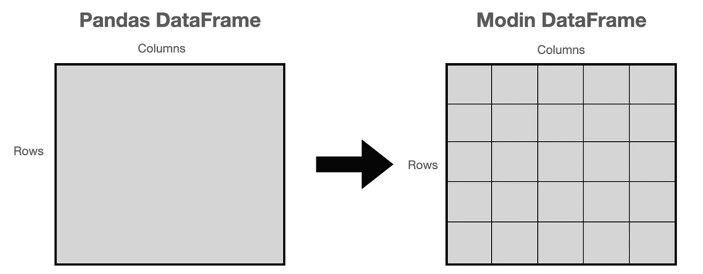

# 用摩丁加速你的熊猫工作流程

> 原文：<https://towardsdatascience.com/speed-up-your-pandas-workflow-with-modin-9a61acff0076>

## 利用分布式计算的力量


克里斯·利维拉尼在 [Unsplash](https://unsplash.com/s/photos/speed-up?utm_source=unsplash&utm_medium=referral&utm_content=creditCopyText) 上的照片

支持[摩丁](https://modin.readthedocs.io/en/stable/)的数据科学初创公司 Ponder 最近宣布了 700 万美元的种子投资。看起来他们在可扩展数据科学方面有着光明的未来。因此，我想给摩丁一个机会，和熊猫做一些比较。

Pandas 是 Python 的一个数据分析和操作库。考虑到典型数据科学工作流中的大部分时间都花在数据清理、操作和预处理上，Pandas 可能是数据科学生态系统中使用最广泛的 Python 库。

Modin 是另一个 Python 库，可以加速 Pandas 笔记本、脚本或工作流。它的逻辑很简单:它同时分配数据和计算。Modin 沿两个轴对数据帧进行分区，因此它在分区矩阵上执行。



(图片由作者提供)

关于摩丁最好的事情之一是你不需要学习新的语法。它提供了与熊猫代码的完全兼容性。您需要做的只是在导入库时更改一行。

我们将首先创建一个包含 1000 万行的示例数据帧，并将其保存为 csv 格式。然后，我们将对熊猫和摩丁进行常规操作。

让我们从导入熊猫和创建数据帧开始。

```
import numpy as np
import pandas as pddf = pd.DataFrame(np.random.randint(1,100,size=(10**7,50)))
df = df.add_prefix("column_")
df["group"] = ["A","B","C","D"]*2500000df.shape**# output**
(10000000, 51)
```

数据帧包含 1000 万行和 50 列，整数值在 1 到 100 之间。我还添加了一个分类列来测试 groupby 函数。

我们现在可以将该数据帧保存为 csv 文件。

```
df.to_csv("large_dataset.csv",index=False)
```

csv 文件的大小为 1.47 GB。


(图片由作者提供)

我们现在有了“大型”数据集。是时候做手术和计时了。我有一台装有 M1 芯片的 MacBook Pro 2000。您在机器上测量的时间可能略有不同，但您会发现与熊猫相比，摩丁有所改进。

我们要做的第一个操作是读取 csv 文件。

```
**# Pandas**
import pandas as pd%%time
df_pandas = pd.read_csv("large_dataset.csv")CPU times: user 20.5 s, sys: 5.44 s, total: **26 s**
Wall time: 28.6 s
```

用熊猫看文件用了 26 秒。

```
**# Modin**
import moding.pandas as pd%%time
df_modin = pd.read_csv("large_dataset.csv")CPU times: user 4.85 s, sys: 1.81 s, total: **6.66 s**
Wall time: 44.3 s
```

使用 Modin，我们能够在 6.66 秒内读取相同的文件，这意味着提高了 74%。

虽然我们可以使用相同的语法应用相同的操作，但是“df_pandas”和“df_modin”的类型是不同的。

```
type(df_pandas)
pandas.core.frame.DataFrametype(df_modin)
modin.pandas.dataframe.DataFrame
```

我们要做的下一个操作是过滤数据帧。

```
**# Pandas**%%time
df_filtered = df_pandas[df_pandas.group.isin(["A","B"])]CPU times: user 790 ms, sys: 1.35 s, total: **2.14 s**
Wall time: 2.92 s
```

我们选择组值为 A 或 b 的行。对于 Pandas，该操作耗时 2.14 秒。

```
**# Modin**%%time
df_filtered = df_modin[df_modin.group.isin(["A","B"])]CPU times: user 1.83 s, sys: 341 ms, total: **2.17 s**
Wall time: 3.15 s
```

我们看不到任何改善。事实上，熊猫在这个操作上比摩丁略快。

**注:**摩丁用的是雷或者 Dask 发动机。文档中解释了如何选择其中之一。

数据处理中的另一个常见任务是组合多个数据帧。让我们用 concat 函数将过滤后的数据帧和原始数据帧结合起来做一个例子。

```
**# Pandas**%%time
df_combined = pd.concat([df_pandas, df_filtered])CPU times: user 1.41 s, sys: 2.73 s, total: **4.14 s**
Wall time: 5.99 s**# Modin**%%time
df_combined = pd.concat([df_modin, df_filtered])CPU times: user 580 ms, sys: 622 ms, total: **1.2 s**
Wall time: 4.02 s
```

时间从 4.14 秒下降到 1.2 秒，提高了大约 71%。在这个任务中，摩丁比熊猫快多了。

让我们也用 groupby 函数做一个例子。下面的代码片段计算每个组的平均 column_1 值。

```
**# Pandas**%%time
df_pandas.groupby("group")["column_1"].mean()CPU times: user 405 ms, sys: 122 ms, total: **527 ms**
Wall time: 524 ms**# Output** group
A    50.033868
B    49.989013
C    50.009207
D    49.975092
Name: column_1, dtype: float64
```

熊猫需要 527 毫秒。

```
**# Modin**%%time
df_modin.groupby("group")["column_1"].mean()CPU times: user 536 ms, sys: 166 ms, total: **702 ms**
Wall time: 3.4 s**# Output** group
A    50.033868
B    49.989013
C    50.009207
D    49.975092
Name: column_1, dtype: float64
```

在这个例子中，Pandas 执行 groupby 操作的速度比 Modin 快。根据 Modin 的[文档](https://modin.readthedocs.io/en/stable/supported_apis/dataframe_supported.html)显示，groupby 函数尚未针对所有操作进行优化。这可能是它在这一步不能打败熊猫的原因。

我们做了一些例子来比较熊猫和摩丁在 1.47 GB csv 文件上的性能。在读取文件和组合数据帧方面，Modin 优于 Pandas。另一方面，Pandas 在使用 groupby 进行过滤和聚合时的表现优于 Modin。

我认为，随着数据量的增加，摩丁和熊猫之间的性能差异将变得更加明显。另一个将揭示与熊猫相比摩丁速度的要点是集群的数量。我在一台机器上(例如我的笔记本电脑)完成了这些示例。在多个集群上使用更大的数据集进行这些示例可能是更准确的比较。

*你可以成为* [*媒介会员*](https://sonery.medium.com/membership) *解锁我的全部写作权限，外加其余媒介。如果你已经是了，别忘了订阅**如果你想在我发表新文章时收到电子邮件。***

*[](https://sonery.medium.com/membership) [## 通过我的推荐链接加入 Medium-Soner yl DRM

### 作为一个媒体会员，你的会员费的一部分会给你阅读的作家，你可以完全接触到每一个故事…

sonery.medium.com](https://sonery.medium.com/membership) 

感谢您的阅读。如果您有任何反馈，请告诉我。*