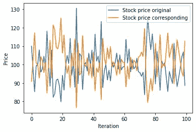
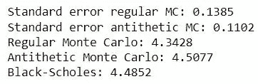
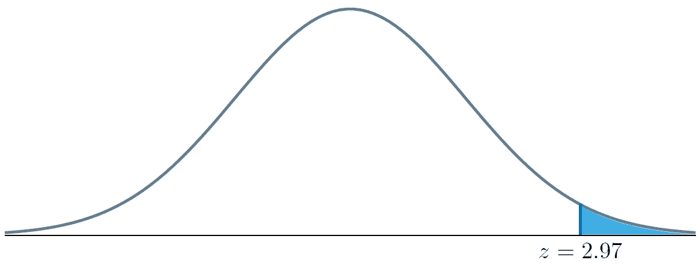
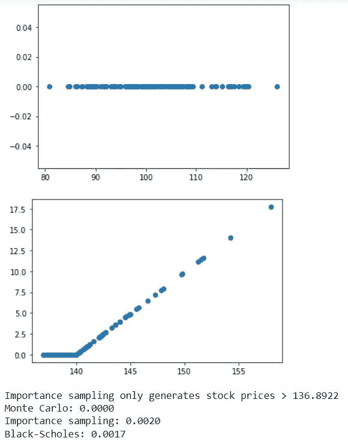
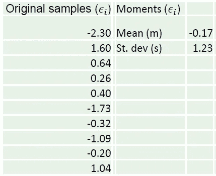
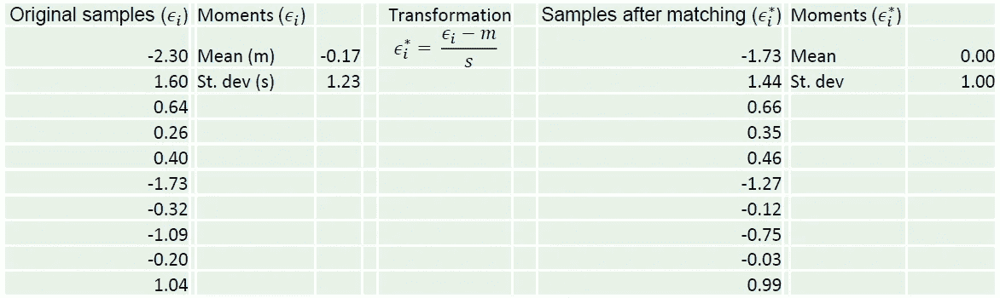
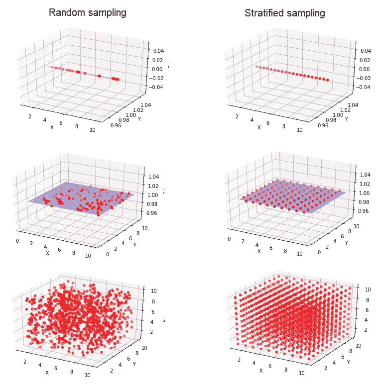
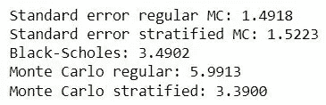
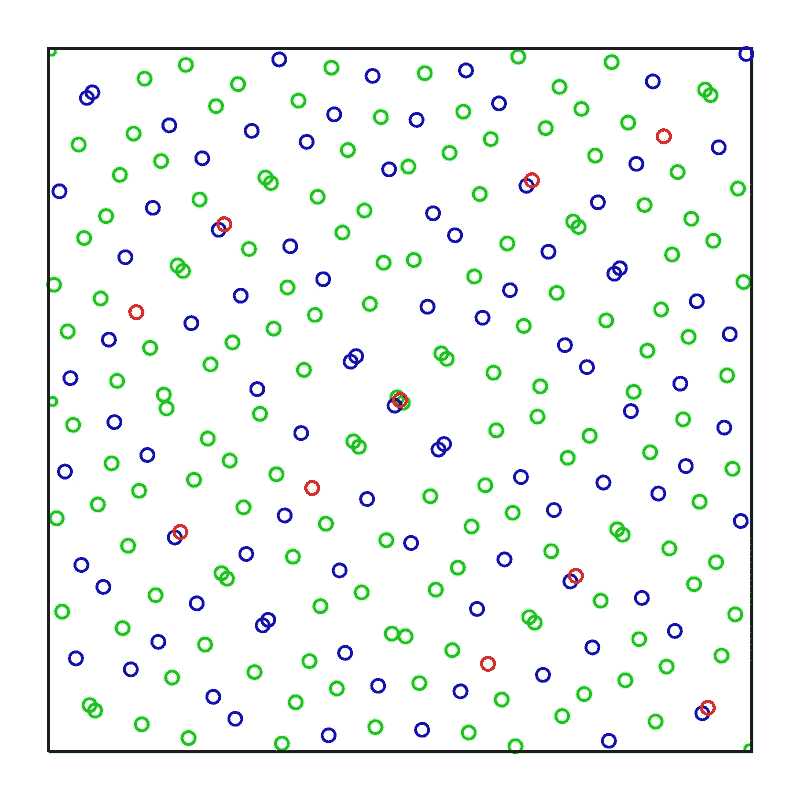

# 通过部署这些采样策略来加速您的模拟

> 原文：<https://towardsdatascience.com/speed-up-your-simulations-by-deploying-these-sampling-strategies-372993703ec5>

## 更有效抽样随机变量的六种策略。了解对偶变量、重要性抽样、矩匹配、控制变量、分层抽样和准随机序列。


勒内·波特在 [Unsplash](https://unsplash.com?utm_source=medium&utm_medium=referral) 上拍摄的照片

尽管许多现实世界的系统(及其所有的不确定性)都可以被公式化为数学问题，但我们通常缺乏获得解析解的能力。即使是对现实的半现实的描述也包含**许多不确定性的来源**，不一定来自众所周知的理论分布。

通常，我们求助于蒙特卡罗模拟，从随机分布中抽取大量样本，并依靠中心极限理论来估计系统的真实值。然而，从数学上来说，这种近似只适用于无限多的样本。本文为那些没有无限时间的人讨论了六种抽样策略。

# 蒙特卡罗模拟的缺点


图片由 [Nic Rosenau](https://unsplash.com/@nicreates?utm_source=medium&utm_medium=referral) 在 [Unsplash](https://unsplash.com?utm_source=medium&utm_medium=referral) 上拍摄

模拟可以是系统的静态表示(例如，工厂布局)，但通常也嵌入学习和优化的方面(例如，强化学习)。蒙特卡罗模拟提供了一个非常丰富的工具箱，但是它的**主要缺点是它的** **效率低下**。

假设你想确定用骰子(一个非常基础的模拟模型)投出的眼睛的平均数。如果你重复实验 100 次，你可能会在 3.2 和 3.8 之间结束——与 3.5 的真实平均值相比，误差相当大。重复 1000 次可能会得到 3.4 到 3.6 之间的值——更好，但也不会过于精确。

如果需要数千次重复来近似一个简单骰子的值，可以想象需要数百万甚至数十亿次重复来精确估计服从多重随机分布的随机系统的相关值。考虑到运行环境本身也需要计算工作(考虑生产车间或风力发电场建模),计算问题变得显而易见。

幸运的是，我们通常可以比随机采样做得更好，大大减少计算负担以达到一定的精度水平。本文讨论了一些采样策略，它们可以在蒙特卡罗模拟和强化学习等环境中使用。

> 作为一个运行示例，我将使用模拟来为一个**欧式看涨期权**定价。对于那些不熟悉金融衍生品的人来说:在未来的某个特定日期(例如，一年后)，这样的期权赋予了以预先确定的执行价格 K 买入股票的权利，如果股价 S 超过了行权日的执行价格(S > K)，那么行使期权并锁定利润是有意义的。如果 S < K，行使期权是不理性的。因此，收益可以表示为 max(S-K，0)。(贴现的)期权价值等于**预期收益**，我们试图使用蒙特卡洛模拟来了解这一点。对于这个特殊的期权，我们可以使用解析解(Black-Scholes 方程)来验证价格，从而得出期权的真实价值。

# 对立变量

> “你走低，我走高。”

在许多模拟环境中，极端情况在频谱的两边都很重要。一个太阳能公园在晴天会产生很多能量，在乌云密布的日子里会产生很少的能量。当股市暴涨时，我们赚了很多钱，当股市暴跌时，我们损失惨重。自然地，如果我们碰巧选择了大部分阳光明媚的日子和繁荣的市场，我们对现实的描述就会有所偏差。

**对偶抽样**背后的想法是**成对抽取随机变量**，其中一个抽取是另一个抽取的“反面”。考虑从均匀[0，10]分布中提取。如果我们随机抽样 1.3，我们也会抽样 8.7 来完成配对。如果我们画正态分布的第 64 个百分点，我们也画第 36 个百分点。

更正式一点:对于每个生成的路径*【ϵ_1,ϵ_2,…,ϵ_m】*，我们生成一个对偶部分*【-ϵ_1,-ϵ_2,…,-ϵ_m】*。除了方差减小的好处之外，生成ϵ在计算上可能是昂贵的——对立的对应物则提供了“额外的”观察。

示例时间。股票价格路径通常是基于从标准正态偏差(几何布朗运动模型)中抽取的回报样本生成的。如果我们使用对偶抽样，生成的价格路径对看起来像镜像:



价格路径示例。蓝色路径代表“原始”路径。橙色路径是对立的路径，形成了原始路径的镜像。[图片由作者提供]

通常，以这种方式采样会降低标准误差。当然，为了公平地比较标准 MC 和对偶 MC，我们需要相同数量的数据点 *M* :产生标准误差 *σ_strd/sqrt(2M)* 和 *σ_anti/sqrt(M)。*

让我们在我们的期权例子上试试:



常规 MC 和对偶 MC 的定价比较。后者始终产生较小的标准误差[图片由作者提供]

的确:标准误差越小，结果越准确！

# 控制变量

在许多情况下，我们有一些解决方案，我们可以对比我们的模拟结果。对于一个类似的问题，我们可能有一个解析的解决方案，甚至只是一个抽样观察。这样的知识是有价值的，因为它可以用来减少样本的方差。

**控制变量**是我们引入到具有零均值的估计器中的任何一项。它们可以被安全地添加，因为它们不影响*期望*；然而，它们确实会影响*方差*。

这听起来可能有点抽象，所以让我们快速地看一个例子。如前所述，Black-Scholes 公式是评估欧式期权价值的解析表达式。对于美式期权——可以在到期前的任何时候行使——没有解析解。然而，收益曲线非常相似；我们期望美式期权价值 *v_A* 至少等于欧式期权价值 *v_E* (这实际上是欧式期权的一个有限案例)。

我们可以使用模拟( *v_A^MC* )来评估美式期权，同时使用样本来评估具有相同执行价格和到期日的欧式期权。对于后者，我们可以测量模拟值 *v_E^MC* 和分析值 *v_E* 之间的误差。然后，我们假设相同的误差适用于 *v_A^MC* 和真实(未知)值 *v_A*

是时候插入一些数字了。

假设我们对美式期权的蒙特卡罗模拟产生了 v_A^MC=4.49。欧洲蒙特卡罗估计(使用相同的模拟价格路径)是 v_𝐸^𝑀C *=4.32* ，布莱克-斯科尔斯公式得出 *v_E=4.08* 。因此，欧式期权价值有一个误差*v _ e −v_e^mc*= 0.24。

我们假设这个错误也适用于美式期权。然后，我们可以估计*v_a=v_a^mc+v_e-v_e^mc=4.25*。请注意，我们已经修正了最初估计的 4.49。由于模拟高估了欧式期权的价值，很可能我们也高估了美式期权——修正后的估计应该更准确。

# 重要性抽样

抽样时，我们可能只对观察结果的**子集感兴趣—** 需要干预的罕见事件、极端结果、几乎不会发生的例外...问题是这些罕见的事件是——你不会相信的——罕见的。如果一个事件只发生 1/10，000 次，你将不得不产生许多随机样本来获得一些观察结果。

举个例子，考虑一个深度*价外*的期权。只有当股价爆炸时，它才会足够高，期权才会有回报。假设这样的价格路径只以 0.1%的概率出现。对于随机抽样，平均来说，每 1000 次重复我们只能得到一次非零回报。我们可能需要数百万条路径来得到一个合理的估计，99.9%的模拟路径没有产生额外的见解。

重要性抽样通过只从**条件概率分布**中抽样来解决这个问题。对于遵循正态分布的模拟回报，我们只能从右边的尾部取样，从分析知识中知道我们只覆盖了整个分布的 0.1%。显然，我们必须修正我们忽略的许多零值结果(调整平均收益是很简单的)。



重要性抽样的直观表示。我们只从阴影区域取样，利用我们对高斯分布的了解

看看下面的例子。对于常规抽样，我们不生成任何价内路径，因此得出期权价值为 0 的结论。另一方面，重要性抽样产生了许多积极的回报。在转换为无条件分布后，我们看到价格相当接近真实值——对于随机样本，这将需要更多的重复！



常规抽样与重要性抽样，以评估深度价内期权。由于我们只对增长非常强劲的价格路径进行采样，重要性采样只需要很少的观察就能得出准确的价格估计[图片来自作者]

# 力矩匹配

在蒙特卡罗模拟中，我们经常从已知的理论分布中取样，例如正态分布。分布可以通过其**矩**(例如，平均值、标准偏差、偏斜度、峰度)来表征，这些是相应图形的定量属性。

您可能认为，如果您从正态分布中抽取样本，那么构建的样本集也是正态分布的。这种直觉适用于大量样本，但不幸的是不适用于小样本。

考虑下面的例子，我们从一个标准的正态分布中抽取 10 个样本。通过扩展，我们希望我们的**样本分布**也具有均值 0 和标准差 1。然而，快速计算表明情况并非如此。



来自标准正态分布的一组样本。尽管我们从 N(0，1)分布中提取数据，但由于样本量较小，样本集呈现出不同的均值和标准差[图片由作者提供]

幸运的是，修复非常容易。在这种情况下，我们只需减去样本均值(将均值重置为 0)并除以样本标准差(将其重置为 1)。注意，我们可以对偏度或峰度做同样的处理。



力矩匹配。我们基于期望的分布特性来变换原始样本。转换后，样本集反映了一个适当的标准正态分布[图片由作者提供]

转换后的样本反映了我们希望从中采样的真实分布，这加快了收敛速度。

# 分层抽样

从收敛的角度来看，从随机分布中足够频繁地取样是可靠的。然而，在实践中，抽样是非常有限的，这就引出了为什么抽样需要是“随机”的问题。相反，给定有限数量的样本，为什么不试着让**尽可能好地覆盖分布**？

分层抽样探索了这一概念。假设我们从 1 到 10 之间的均匀分布中抽取 10 个样本。随机样本可能如下所示:

> 随机抽样:[7 10 5 6 9 8 7 2 5]

请注意，1、3 和 4 未显示，而 2、5 和 7 采样两次。接下来让我们考虑分层抽样:

> 分层抽样:[1 2 3 4 5 6 7 8 9 10]

我们简单地以与分布的概率质量成比例的方式分布我们的样本，提供分布的均匀覆盖。请注意:( I)我们需要知道分布情况,( ii)我们必须预先指定样本的数量，以便正确抽取样本。

这个过程最容易用均匀分布来形象化。下面分别是一维、二维和三维的例子。



随机抽样(左)与分层抽样(右)。请注意，对于相同数量的观察值，分层抽样提供了更均匀的抽样空间覆盖。[图片由作者提供]

对于正态分布，我们将从钟形曲线的中心(高概率质量)采样更多的点，并且仅从尾部稀疏地采样。换句话说，样本的**密度与分布**成正比。

下面的数字例子表明，对于有限的样本，分层抽样**更加准确。在这种情况下，我们为一个只有 10 次复制的选项定价(这是一个极低的数字)。然而，结果是相当准确的。相比之下，随机抽样与真实值相差甚远。**



一个选项的价值估计，常规蒙特卡罗和分层抽样都只使用 10 个样本。尽管样本数量非常少，分层抽样还是非常接近真实价格，而常规 MC 则完全不一样。[图片由作者提供]

# 准随机抽样

准随机抽样(也称为**低差异抽样**)非常类似于分层抽样，因为它旨在均匀覆盖理论分布。主要区别在于分层抽样依赖于*预先确定的*数量的观察值，而准随机抽样是*顺序*。

> 如果我们能再做一次观察，哪一点会产生最深刻的见解？

在许多情况下，您对运行给定数量的迭代不感兴趣，而是希望运行足够的迭代来满足某个标准误差。你可能想要达到一个标准误差<0.1%, without knowing whether this requires 10,000 or 1,000,000 replications. In such cases, quasi-random sampling can **扩展序列**直到达到期望的精度。

例如，假设我们想要生成介于 0 和 1 之间的样本。我们可以从中间开始，采样 0.5。左边和右边的“间隙”一样大，所以下一个样本可能是 0.25，然后是 0.75。之后，我们可能会在 0.25 和 0.5 之间、0.5 和 0.75 之间进行采样，等等。

有各种方法来填补分布中的“缺口”,每种方法都有相应的算法。例如，使用 *scipy* 可以如下生成 **Sobol 序列**:

```
**from** scipy.stats **import** qmc
>>> sampler **=** qmc**.**Sobol**(**d**=2,** scramble**=False)**
>>> sample **=** sampler**.**random_base2**(**m**=3)**
>>> sample
*array([[0\.   , 0\.   ],*
 *[0.5  , 0.5  ],*
 *[0.75 , 0.25 ],*
 *[0.25 , 0.75 ],*
 *[0.375, 0.375],*
 *[0.875, 0.875],*
 *[0.625, 0.125],*
 *[0.125, 0.625]])**scipy documentation:* [https://scipy.github.io/devdocs/reference/generated/scipy.stats.qmc.Sobol.html](https://scipy.github.io/devdocs/reference/generated/scipy.stats.qmc.Sobol.html)
```



2D Sobol 序列的例子，包含序列的前 10 个(红色)、100 个(红色+蓝色)和 256 个(红色+蓝色+绿色)元素[图片来自[WikiMedia](https://commons.wikimedia.org/wiki/File:Sobol_sequence_2D.svg#/media/File:Sobol_sequence_2D.svg)by[Jheald](https://commons.wikimedia.org/wiki/User:Jheald)

虽然没有预定义的样本数，但对方差的影响与分层抽样非常相似。直觉仍然是为手头的分布获取一组有代表性的样本。

# 结束语

随机采样是无偏的，理论上可以保证无限重复下的收敛，但通常效率很低。我们可能会彻底探索没有增加新见解的问题区域，而忽略感兴趣的区域。

采样策略利用我们对问题结构的了解，转换样本，或者简单地尝试以更智能的方式覆盖底层分布。

所描述的技术可能并不总是有效。最关键的是，我们经常需要了解概率分布；事实上，我们经常依赖经验分布。

抛开局限性不谈:经验证明，采样策略通常可以大大加快模拟速度。当你时间紧迫，而你的算法似乎不收敛时，一定要试一试！

# 参考

赫尔，J. C. (2014 年)。期权、期货和其他衍生品。全球版。

      [](https://en.wikipedia.org/wiki/Low-discrepancy_sequence)    [](https://en.wikipedia.org/wiki/Stratified_sampling) 