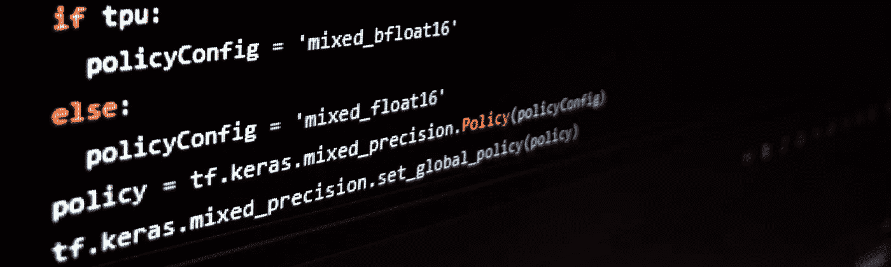
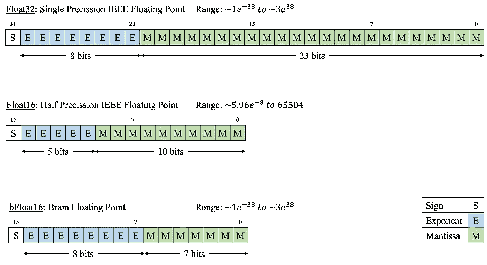

# 利用 GPU 和 TPU 上的混合精度加速 TensorFlow 训练

> 原文：<https://towardsdatascience.com/speed-up-your-tensorflow-training-with-mixed-precision-on-gpu-tpu-acf4c8c0931c>

## 简单的分步指南

按作者

在这篇文章中，我将向你展示如何使用混合精度位表示在合适的 GPU 或 TPU 上加速训练。首先，我将简要介绍不同的浮点格式。其次，我将一步一步向您展示如何使用 TensorFlow 实现显著的速度提升。详细的文档可以在[【1】](#a741)中找到。

## 概述

1.  [简介](#a33a)
2.  [在 TensorFlow 中激活混合精度](#33e2)
3.  [损失比例](#8621)
4.  [结论](#4761)

## 1.介绍

代表一个值的位数越多，占用的内存就越多。因此，对这些值执行的计算需要更多的时间，因为必须从存储器中读取和写入更多的位，并在寄存器中来回移动。

混合精度指的是一种技术，其中使用 16 位和 32 位浮点值来表示变量，以减少所需的内存并加快训练速度。它依赖于这样一个事实，即现代硬件加速器，如 GPU 和 TPU，可以在 16 位上更快地运行计算。

在 TensorFlow 中，有两种 16 位浮点类型:float16 和 bfloat16。Float16 遵循半精度浮点数的 IEEE 标准，与 float32 相比，指数用 5 位而不是 8 位表示，尾数用 10 位而不是 23 位表示。这大大缩小了 float16 值可以表示的可能值的范围。Bfloat16 通过保持指数的 8 位并且仅将尾数的位从 23 位减少到 7 位来解决这个问题。这样，当每个值之间的步长增加时，范围保持不变。见图 1

图 1 —作者受[【2】](#1b34)启发，对比不同的浮点表示法

## 2.在 TensorFlow 中激活混合精度

要激活 TensorFlow 中的混合精度，可以实施全局策略。为 TPU 激活时，策略应为“mixed_bfloat16”，而为 GPU 激活时，配置应为“mixed_float16”。使用全局策略设置，所有后续层将使用 float32 中的变量执行 float16 中的计算。为了数值的稳定性，变量保持在 float32 中。在代码 1 中，程序员检查 TPU 或 GPU 是否可用，并设置相应的全局策略。

代码 1 —使用全局策略激活混合精度

为了数值稳定性，建议模型的输出层使用 float32。这可以通过在最后一层设置`dtype=tf.float32`或者激活，或者在模型输出处添加一个线性激活层`tf.keras.layers.Activation("linear", dtype=tf.float32)`来实现。抛开数值稳定性不谈，当使用 matplotlib 绘制模型预测时，数据必须在 float32 中，因为不支持绘制 float16 数据。

如果你用 [tf.keras.model.fit](https://www.tensorflow.org/api_docs/python/tf/keras/Model#fit) 训练你的模型，就大功告成了！如果使用 mixed_float16 实现自定义训练循环，则需要进一步的步骤；损失比例。

## 3.损耗缩放

如上图 1 所示，float16 的范围较小。尤其是在反向传播期间，梯度可能变得如此之小，以至于触发下溢事件。当应用损失缩放时，损失被乘以一个大的数字，例如 512，这导致梯度也以相同的程度缩放。这样，发生下溢的可能性大大降低。在计算梯度之后，结果除以相同的缩放因子，以获得实际的未缩放梯度。

为了防止在训练期间发生溢出和/或下溢，您的优化器必须包装在[TF . keras . mixed _ precision 中。losscale optimizer](https://www.tensorflow.org/api_docs/python/tf/keras/mixed_precision/LossScaleOptimizer)。这个包装器实现了方法`get_scaled_loss()`和`get_unscaled_gradients()`，它们实现了上一段中描述的缩放。您的自定义训练循环可能看起来像 Code2。

代码 2 —应用损失和梯度缩放

## 4.结论

混合精度可以加速某些 GPU 和 TPU 上的训练。当使用 [tf.keras.model.fit](https://www.tensorflow.org/api_docs/python/tf/keras/Model#fit) 来训练您的模型时，唯一需要的步骤是通过使用例如全局策略来构建具有混合精度的模型。如果实现了定制的训练循环，优化器包装器[TF . keras . mixed _ precision。应实现 losscale optimizer](https://www.tensorflow.org/api_docs/python/tf/keras/mixed_precision/LossScaleOptimizer)以防止溢出和下溢。

[1]混合精度，张量流，2021 年 1 月 9 日访问，[https://www.tensorflow.org/guide/mixed_precision](https://www.tensorflow.org/guide/mixed_precision)

[2] BFloat16:云 tpus 高性能的秘密，谷歌云博客，2021 年 1 月 9 日访问，[https://Cloud . Google . com/Blog/products/ai-machine-learning/BF loat 16-云 TPUs 高性能的秘密](https://cloud.google.com/blog/products/ai-machine-learning/bfloat16-the-secret-to-high-performance-on-cloud-tpus)