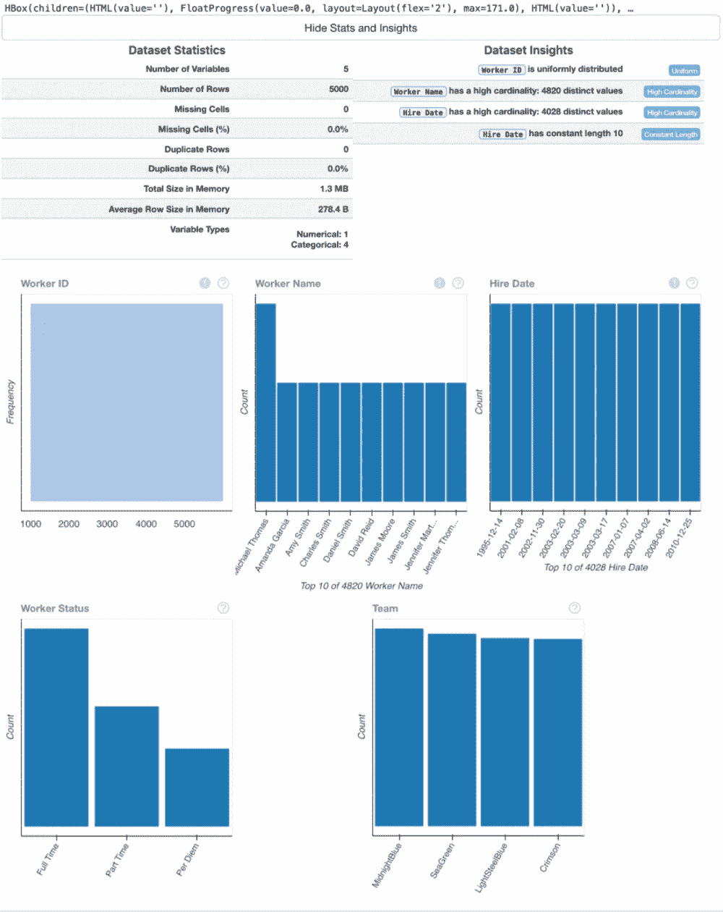
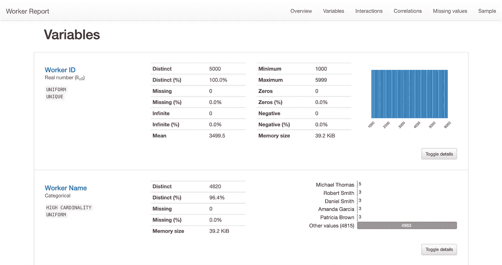
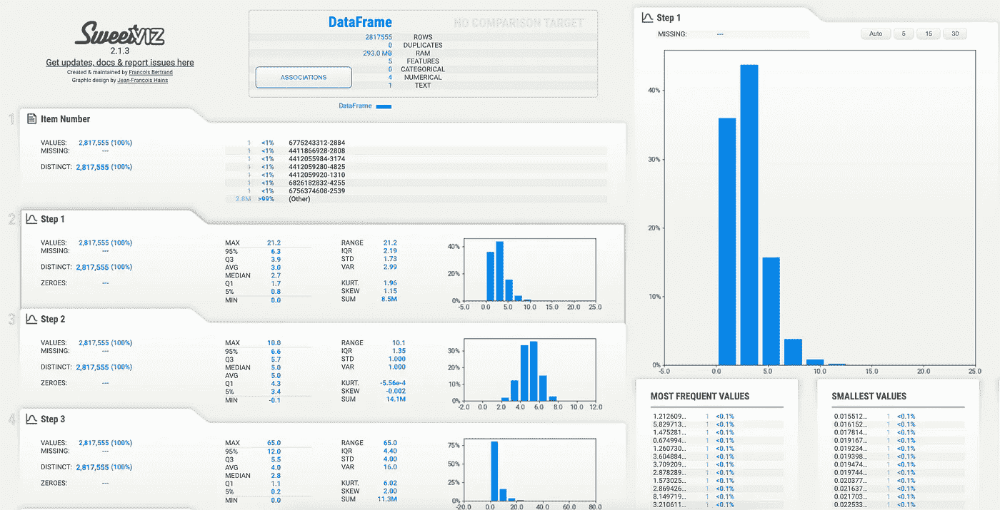

# 使用 Python 加速探索性数据分析

> 原文：<https://towardsdatascience.com/speeding-up-exploratory-data-analysis-with-python-838fe5e25b43>

## 利用开源 EDA 库提高工作效率


拉尔夫·布隆伯格在 [Unsplash](https://unsplash.com/s/photos/race?utm_source=unsplash&utm_medium=referral&utm_content=creditCopyText) 上拍摄的照片

探索性数据分析(EDA)——尤其是在带回家的工作面试中——可能是一个非常耗时的过程。

EDA 的主要目的是调查和了解一个新的数据集。我们希望获得洞察力并熟悉数据——最好是尽快。

带回家作业的说明通常会附带一个说明，说明完成时间不超过 4 或 6 个小时。

在工作中，老板可能会不耐烦地等待我们的分析。

在这里，我们将探索 3 个有助于加速 EDA 过程的开源库:

*   数据准备
*   熊猫简介
*   SweetViz

在[“应对带回家的挑战”](/tackling-the-take-home-challenge-7c2148fb999e)中，我们使用 Python、Pandas 和 Seaborn 完成了一个带回家的 EDA 挑战示例。创建笔记本很耗时，我们使用了大量代码。让我们看看能否借助上述库加快我们的分析速度。

## 资料组

我们将继续使用我们在本文的[中创建的小部件工厂数据集，在这里我们通过 Python 生成假数据。](/generating-fake-data-with-python-c7a32c631b2a)

## 数据准备

DataPrep 宣称自己是“Python 中最快、最简单的 EDA 工具”。它使数据科学家能够在几秒钟内用几行代码理解 Pandas/Dask 数据帧。”

它确实非常容易使用，可以将 EDA 过程减少到只有几行代码。

使用`pip`可以轻松安装 DataPrep:

```
pip install dataprep
```

我们可以使用`plot()`方法来可视化我们的整个数据框架，并展示关键见解:

```
from dataprep.eda import plot# using dataprep's plot method to get insights on each variable
plot(worker_df)
```



DataPrep 的绘图输出—作者提供的图像

只需一行代码，我们就可以创建可视化效果，并获得关键数据元素的信息，包括丢失的值，以及只使用 Python 和 Pandas 需要多行代码的变量数量。

Dataprep 增加了我们在带回家挑战笔记本中没有包括的额外见解，包括变量类型、重复信息和内存统计。

Dataprep 包括用于数据清理和简化 API 调用的附加组件，值得进一步研究。

## 熊猫简介

[Pandas Profiling](https://pandas-profiling.github.io/pandas-profiling/docs/master/index.html#pandas-profiling) 是一个很好的工具，可以让我们轻松地获取信息，包括数据类型、缺失值和唯一值，以及变量之间的相关性。它还允许我们生成交互式 HTML 报告。

熊猫档案可以通过`pip`安装:

```
pip install pandas-profiling
```

生成报告很简单。让我们导入 Pandas Profiling 并创建一个报告:

```
from pandas_profiling import ProfileReport# generate report with pandas profiling
profile = ProfileReport(worker_df, title='Worker Report')
profile
```



熊猫简介报告-作者图片

我们还可以生成一个 HTML 文件:

```
profile.to_file("worker_report.html")
```

`ProfileReport()`方法提供了与 Dataviz 类似的输出，提供了对缺失值、内存统计数据和不同值的洞察。我们还可以获得变量和特征分布之间的相关性信息。

## Sweetviz

[Sweetviz](https://github.com/fbdesignpro/sweetviz) 自我描述为“一个开源 Python 库，只需两行代码就能为 kickstart EDA(探索性数据分析)生成漂亮的高密度可视化效果。”

Sweetviz 可以安装`pip`。

```
pip install sweetviz
```

像熊猫档案一样，我们可以用 Sweetviz 生成 HTML 报告。

```
import sweetviz as svmy_report = sv.analyze(widget_df)
my_report.show_html()
```



SweetViz HTML 报告—作者图片

类似于 Dataprep 和 Pandas Profiling，我们能够很容易地获得关于不同的和缺失的值以及特性分布的信息。

## 结论

在这里，我们回顾了 3 个有助于加速 EDA 的软件包。这些包非常相似，允许我们将 EDA 过程减少到只有几行代码。

这三个库对于指导探索性分析都非常有用。很多时候，当开始处理一个新的数据集时，我们不知道从哪里开始。从这些库生成的报告可以提供一个非常全面的起点。这三个库至少为我们在 EDA 带回家的挑战笔记本中没有探究的数据提供了一个新的视角。

我喜欢 Pandas Profiling 和 Sweetviz 让我们能够轻松地创建 HTML 报告，以及 Dataprep 如何提供清理数据和使用 API 的附加功能。

我会把这些带回家挑战吗？大概不会。虽然它们使获得对数据的有用见解变得极其快速和容易，并创建了广泛和彻底的分析，但它们没有给你展示技能的机会。在带回家的作业中，评审者需要能够评估我们的编码能力。将 EDA 浓缩成一行代码并不能给我们机会来展示我们的编码技能或创造力。

我会考虑在日常工作中使用这些 EDA 库。我喜欢他们快速提供完整分析的方式。一般来说，业务用户不太关心这些见解是如何收集的，或者我们的编码有多好。他们希望快速解读数据并获得可行的见解。我相信这些库可以成为数据专业人员工具带的一项资产，有助于提高生产率。