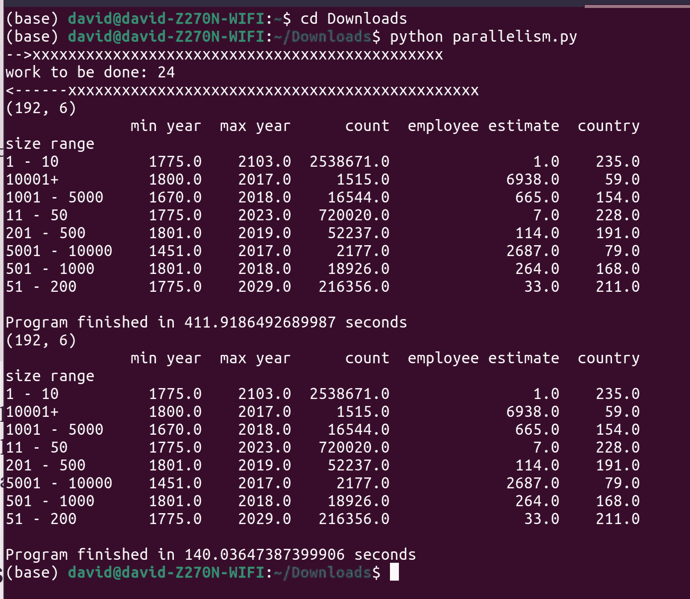
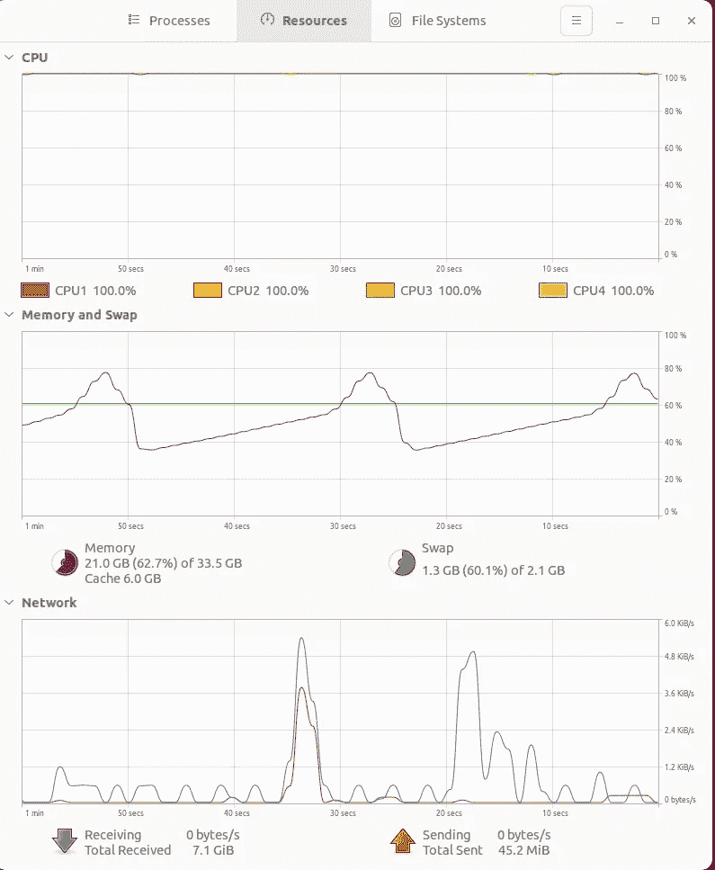
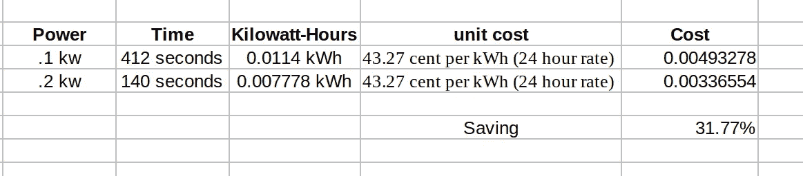

# 加速熊猫和 Python，为什么？

> 原文：<https://towardsdatascience.com/speeding-up-pandas-and-python-why-218b7a96adcf>

## 我的读者中的一个主题 Python 慢吗？


阿巴斯·特拉尼在 [Unsplash](https://unsplash.com?utm_source=medium&utm_medium=referral) 上拍摄的照片

最近，我看到了很多关于加速 Python 和熊猫的文章。事实上，我[甚至自己写了一个](/doing-explanatory-data-analysis-f184c01557e7)，演示了如何使用 Rapids 和 CuDF 从一个强大的 GPU 获得出色的性能。

但是为什么这么多人在电脑上写关于加速 Python 和熊猫的文章呢？Python 很慢，还是我们编码的方式更慢？最近，当我看到新的文章时，这些问题一直萦绕在我的脑海中。所以我想自己做一些实验来寻找答案。请继续阅读。

我应该说 Python 有点类似于上面照片中的那些火车轨道。如果 Python 作业使用一条铁路线，使用两条或多条铁路线可能会更快。现代 CPU 也是多核的，并为用户提供四条或更多铁路线来转移工作负载。我拍了一张我当前系统的快照，你可以在下面看到这个系统的运行。


作者正在使用的系统截图。python 脚本使用一条铁路线。

该系统正以 100%的速度在一条铁路线上运行。如果它需要一分钟，那应该不可怕！尝试等待 10 分钟，让 Excel 更新工作簿中的所有公式。

# 需要完成的工作量

我通过定义我希望通过应用单列车轨道和多列车轨道方法来完成的工作量来开始我的回顾。

正如在我的[上一篇文章中，](/doing-explanatory-data-analysis-f184c01557e7)我使用了一个大型公开可用的数据集。超过 700 万的公司数据集[1]在[知识共享 CC0.01](https://pdl.ai/3PhCOLo) 下获得许可。 ***“你可以复制、修改、分发和执行作品，即使是出于商业目的，都无需征得许可。”***

该文件大小为 1.1 GB，有 700 多万行和 11 列。

```
path = "/home/david/Downloads/"
file = "companies_sorted.csv"
filePath = path+filework = [filePath,filePath,filePath,filePath,filePath,filePath, filePath, filePath, filePath,filePath,filePath, filePath, filePath, filePath,filePath,filePath, filePath, filePath, filePath,filePath,filePath, filePath, filePath, filePath]
frames = []
```

我的变量——work——是 24 个文件路径的列表。恰好同一个文件出现了 24 次，几乎有 24.5GB 的数据。770 万行，11 列 x24 = 1.85 亿行，11 列。扔给 Excel 看看！我经常有 25 个以上的 Apache 或 Nginx 日志文件，这是一个有效的场景。

我希望您同意工作量很大，在单核或多核系统上需要一段时间。

# 工人

当有工作要做的时候，我们一般会雇一堆工人来做。所以让我们来讨论一下我的工人设计。

```
def worktodo(file):
    df = pd.read_csv(file)
    df=df.groupby('size range').agg({'year founded': ['min', 'max', 'count'], 'country': lambda x: x.nunique(), 'current employee estimate': 'median'}).reset_index()
    cols = ['size range','min year','max year','count','country','employee estimate']
    df.columns=cols
    return dfdef summary(frames):
    frame = pd.concat(frames)
    print(frame.shape)  
    print(frame.groupby('size range').agg({'min year': 'min', 'max year': 'max', 'count': 'mean','employee estimate': 'mean', 'country': 'mean'}))
    print(" ")
```

函数‘work todo’—‘天生我没有想象力’—接收一个文件，将它读入一个 Pandas 数据帧，然后使用 groupby 对文件进行总结。我做了一点清理，然后返回数据帧。我们需要这样做 24 次。作业从 7.7m X 11 的输入变为 8 行 X 6 列的输出。

函数 summary 获取数据帧列表，并对所有单个文件进行最终汇总。

# 程序

有工作要做，有工人去做是不够的。你还需要工人的案头程序或流程来完成工作。

```
def singleCpu():
    start_time = time.perf_counter()frames = []
    for todo in work:
        frames.append(worktodo(todo))summary(frames)

    finish_time = time.perf_counter()print(f"Program finished in {finish_time-start_time} seconds")

    del frames
```

我首先为单个火车轨道或 CPU 定义了一个进程——单线程场景——这是最常见的方法。

没什么可报告的——迭代要完成的工作并将其传递给工人——获取摘要并将其存储在一个名为 frames 的列表中。处理完所有文件后，我们将原始输出交给 summary 函数，得到最终产品。

```
if __name__ == "__main__":
    print ("-->xxxxxxxxxxxxxxxxxxxxxxxxxxxxxxxxxxxxxxxxxxxxxx")
    print (f"work to be done: {len(work)}")
    print ("<------xxxxxxxxxxxxxxxxxxxxxxxxxxxxxxxxxxxxxxxxxxxxxx")
    singleCpu()
    start_time = time.perf_counter()with Pool() as mp_pool:
        results = mp_pool.map(worktodo, work)

    summary(results)

    finish_time = time.perf_counter()

    print(f"Program finished in {finish_time-start_time} seconds")
```

对于相反的论点——我使用了多处理——和池类。两行代码本质上是将工作分成块，并分配给可用的工作人员。

# 结果

在定义了工作量、工作人员和要遵循的流程之后，剩下的就是执行任务和完成大量工作了。



这张截图是作者在实验结束后拍摄的。

重点是

*   需要处理 24 个文件—24.5g，庞大的 1.85 亿行。
*   交付了两个结果:传统的单线程方法和使用 Pool()的多处理策略
*   最终的数据帧是 192 行乘 6 列——表示大小范围变量的每个成员的摘要。
*   捕获了一些系统监视器的屏幕截图

从终端窗口(见上图)，您会注意到传统方法花费了 411.92 秒，而 Pool()过程花费了 140.03 秒。7 分钟对 2.33 分钟，因此从一个内核扩展到四个内核时不会产生 X4 的结果。总有一个驱动程序必须在工人之间进行协调。听起来熟悉吗？这就是 Spark 或分布式计算语言。尽管如此，代码还是快了三倍，这很好，对吗？

我捕捉到的一些系统工作的截图…

## 使用所有四个内核



图片由作者提供-使用了 21.0 GB 大多数机器已经折叠。

## **仅使用单核**


作者图片

**但是运行四列火车而不是一列肯定更贵！不要！**

我们有太阳能电池板，它允许双电源方案和一些令人兴奋的分析。在实验过程中，我捕捉到了功耗。不太科学，但是在运行期间消耗了双倍的能量。我们从 0.1 千瓦增加到 0.2 千瓦。我知道我的系统的电源是 600 瓦。


图片由作者提供。电源控制器显示“实验室”中当前使用的电源以及电源的来源。我们看到了太阳能和传统的公共电源。


图片由作者提供。电源控制器显示功耗增加。电力只能从没有阳光的公共电源获取。爱尔兰的雨天产生的太阳能很少！

因此，使用 1 条线，我们燃烧了 7 分钟，比如说. 1kw。使用四条线，我们在 2.33 分钟内消耗了 0.2 千瓦。



作者制作了一个 Excel 文件——估算用电量和节省的电量。

多处理分支比单 CPU 方法少使用 31.77%的功率。我们数据科学和 IT 部门需要在 2030 年前将温室气体排放量减少 50%。IT、深度学习和数据分析是温室气体和化石燃料驱动的电力的重要用户[2]。

# 关闭

因此，一段时间以来，我一直在思考一些问题。为什么这么多人在电脑上写关于加速 Python 和熊猫的文章？Python 很慢吗，还是更像我们编码的方式？

对于第一部分，我认为人们总是会写一些改进我们实践的技术，并提供如何以不同的方式做事情的见解。Python 慢吗？Python 是一种解释型语言，运行速度比编译型语言稍慢。尽管如此，你必须从这 1 分钟的运行时间中抵消掉使用 Python 所获得的生产力，并且要有谨慎的预期。创建一个 C++或 Java 应用程序在不到 1 分钟的运行时间内需要花费更长的时间。

我们如何编码的问题正成为焦点。对于温室气体排放和减排目标，我们需要关注它，并有效利用我们的算法。本文展示了基于算法设计(单核与多核运算)的结果和功耗的巨大差异。长期运行的 ETL 工作、数周的深度神经网络训练和其他任务可能很快就会成为 **ESG 辩论**的一部分，并因温室气体减排挑战而受到审查。

# 代码库

和往常一样，你可以在我的 GitHub 账户上找到这个脚本。

<https://github.com/CognitiveDave/ReadingList/blob/main/parallelism.py>  

不是中等会员！为什么不加入呢——只需 50 美元，物超所值。

<https://cognitivedave.medium.com/membership>  

# 参考

[1]700 多万公司数据集根据[知识共享 CC0.01](https://pdl.ai/3PhCOLo) 获得许可。你可以直接从人民数据实验室索取一份[的拷贝，并在这里阅读更多关于他们](https://www.peopledatalabs.com/company-dataset?utm_campaign=Company%20Dataset&utm_source=Medium%20&utm_medium=Social%20&utm_term=company-dataset)[的内容。](https://medium.com/@peopledatalabs/2019-global-company-dataset-8acca1f1caf0)此处的数据用于加载内存和创建战术总结。

[2][https://HPI . de/news/jahrgaenge/2020/HPI-startet-clean-IT-initiative . html](https://hpi.de/news/jahrgaenge/2020/hpi-startet-clean-it-initiative.html)“HPI 将其研究和教学活动捆绑在清洁信息技术倡议中。通过这种方式，HPI 通过提供一流的培训以及可持续和节能地使用 IT 系统和研究成果，为开发气候友好型数字解决方案和人工智能应用做出了贡献。这些解决方案支持社会和经济生活的所有领域，特别是健康、可持续流动和促进平等。”


照片由 [Zbynek Burival](https://unsplash.com/@zburival?utm_source=medium&utm_medium=referral) 在 [Unsplash](https://unsplash.com?utm_source=medium&utm_medium=referral) 上拍摄