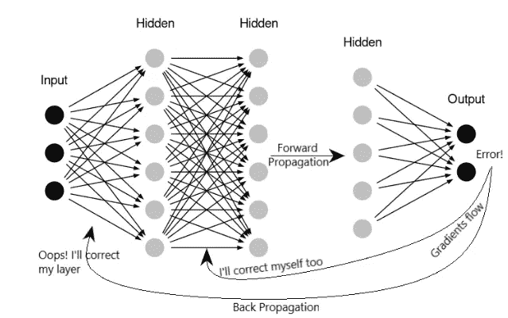
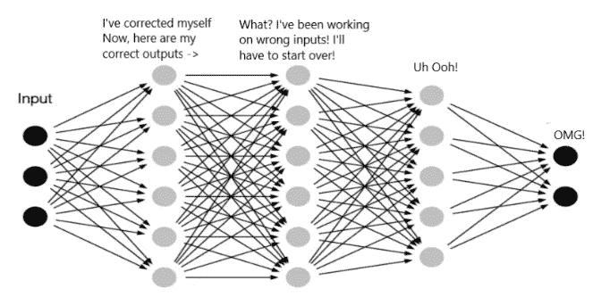
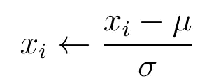
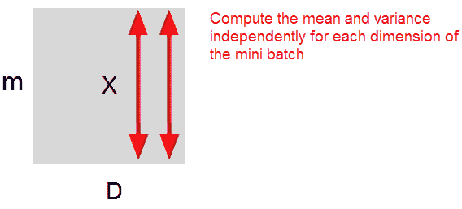
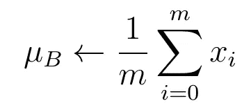
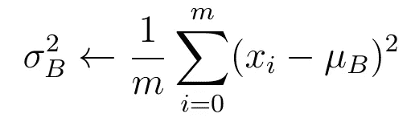
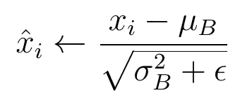
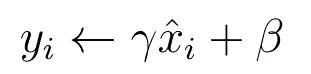

# 用批量规范化加速神经网络的训练

> 原文：<https://towardsdatascience.com/speeding-up-training-of-neural-networks-with-batch-normalization-29e833260c86>

## 深度学习中最重要的关键技术之一

来自 unsplash.com 的马克西姆·伯格

在本文中，我将向您介绍一种非常有用和有效的技术“批处理规范化”的理论和实际实现。批处理规范化可以显著加快神经网络的训练速度，并带来更高的性能。

# 1.介绍

神经网络学习使用反向传播算法对给定的问题进行预测。在训练期间，调整神经网络中的权重和偏差，以使**在下一次更好地预测。**或者换句话说，随着权重和偏差的调整，网络输出的值变得更接近实际值(标签)。

在反向传播算法中，在网络的每一层之间计算损失函数相对于权重的梯度，并且梯度被反向传播:

图 1 神经网络中的正向传播。[资料来源:布萨尔、马尼沙和辛格..(2015).前馈神经计算与多元线性回归模型在奶牛产奶量预测中的比较研究。当代科学。108.2257–2261.]

然而，反向传播会导致一种不良现象，称为*内部协方差偏移*。这可能会在训练神经网络时导致问题。

如果你想了解更多关于神经网络训练的知识，我推荐《人工神经网络训练》这篇文章。其中，我详细描述了梯度法和反向传播算法，并通过一个实例逐步推导出所需的所有方程。

# 2.内部协方差转移问题

在训练过程中，神经网络的每一层都试图纠正前向传播过程中产生的错误。但是，每一层都会单独进行自我修正。

图 2 内部协方差移动。[资料来源:布萨尔、马尼沙和辛格..(2015).前馈神经计算与多元线性回归模型在奶牛产奶量预测中的比较研究。当代科学。108.2257–2261.]

考虑上面的神经网络，其中第二层调整其权重和偏差，以使整个神经网络可以在未来做出更准确的预测。

同时，这也改变了第二层的输出**，其用作第三层的**输入。**这意味着通过提高第二层的权重和偏差，迫使第三层从零开始学习，以便对相同的数据做出正确的预测。**

于是，提高了一层，后续的一层就面临着全新的困难！

> 由于当前层中权重和偏差的调整，后续层被迫学习新的输入数据。

我们将这种描述的行为称为“内部协方差偏移”。这种现象通常会增加神经网络的训练时间。在下文中，我将展示如何通过批处理规范化来解决这个问题。

但首先，我们需要简要解释一下术语“规范化”。

# 3.概述:数据的标准化

在机器学习和深度学习中，通常需要对输入数据进行缩放或归一化(参见“机器学习中的数据预处理”)，然后才能对神经网络进行训练。例如，如果我们有一个数据集，其特征**x**具有非常不同的值范围(例如，[0，1]以及[1，1000])，我们应该归一化该数据以加速网络的学习。

数据的归一化可通过将以下等式应用于数据集中的每个输入要素 **x_i** 来实现:

情商。1 输入
数据的归一化。

其中μ表示特征的平均值 **x** ，σ表示该特征的方差。这将强制数据集中每个输入要素 **x** 的值假设平均值为零，方差为一。

这样，我们可以使深度学习或经典机器学习模型的训练既**更稳定又更快**。标准化是数据预处理的一个非常重要的部分，我们需要在给定数据上训练神经网络之前执行。

# 4.批量标准化

训练数据归一化的原理也可以应用于**一个神经网络**中神经元的值，可以大大提高一个神经网络的训练。

正如第 3 节中归一化输入特征的情况一样，我们希望神经元的值取平均值为 0，方差为 1。我们将实现这一点的方法称为批量标准化。

> 通过批量标准化，我们减少了内部协方差偏移。或者换句话说，隐藏层中神经元的值移动的量。

与标准化数据的一个区别是，在批量标准化中，我们通过所谓的小批量 **m** 实例来标准化神经元值，而不是通过训练数据集的所有实例。

为了更清楚，考虑尺寸为 m 和尺寸为 **D** 的小批量。m 是指小批量中训练样本的数量， **D** 可以认为是给定隐藏层中神经元的数量。

图 3 批量标准化的示例。

为每个维度计算批量标准化，或者换句话说，为整个小批量中的每个神经元计算**。在实践中，当在应用激活函数之前应用于神经元时，批量归一化显示出更好的性能。**

也就是说，如果我们使一层的神经元以零为中心，方差为 1，作为激活函数的输入值，我们对激活本身获得相同的结果。

让我们来看看使用批处理规范化的一些优点。

# 5.批量标准化的优势

## 更稳定的梯度

一般来说，批量标准化导致神经网络中神经元激活值的相似范围。这导致更稳定的梯度和更少的振荡。这种情况允许更好地收敛到损失函数的全局最小值。

## 更快的训练

稳定的梯度允许使用更高的学习率。在梯度下降中，网格收敛通常需要较小的学习速率。并且随着网格变得更深，梯度下降期间的梯度变得更小，因此训练时间随着网格的深度而增加。通过批量标准化，我们可以使用更高的学习率，进一步提高神经网络的训练速度。

## 权重的正确初始化变得不那么成问题

在大多数情况下，训练表现高度依赖于权重和偏差的正确初始化。然而，初始化这些参数可能会很困难，当构建更深的网格时甚至更具挑战性。使用批处理规范化减少了这种依赖性。批量标准化似乎允许我们在选择权重和偏差的初始值时不那么小心。

**总结一下:**批量标准化是一种非常强大的技术，可以在不增加太多开销的情况下改善神经网络的训练。

# 6.实践中的批量标准化

再次考虑尺寸为 **m** ，尺寸为 **d** 和 **x_i** 的小批量神经元的值，这些值用作神经网络中任何隐藏层中的激活函数的输入数据。在第一步中，我们计算小批量中每个尺寸的值 **x_i** 的平均值:

情商。2 平均值的计算。

使用平均值μB，我们可以计算值 **x_i:** 的方差

情商。3 方差的计算。

均值和方差都允许我们在微批次的每个维度上归一化神经元的值 **x_i** 。在此步骤之后，标准化值 **x_hat** 以零为中心，并且方差为 1:

情商。4 批量标准化。

到目前为止，批量标准化与标准化数据集中的输入要素(参见第 3 节)没有什么不同。然而，批量标准化需要一个额外的步骤。在该步骤中，我们通过参数γ缩放归一化值 **x_hat** ,并通过参数β移动该值:

情商。5β移位。

γ和β都是可训练的参数，并且在训练期间由神经网络学习。从逻辑上讲，问题出现在我们为什么要这样做。

*为什么简单的标准化是不够的*？

这最后一步的原因如下:通过使激活以零为中心且方差为 1，我们还在神经网络上引入了约束，即隐藏神经元的所有激活值**必须遵循这一特定分布**。

然而，我们不能保证，对于神经网络来说，这一定总是最有利的情况。在某些情况下，批处理规范化可能会改善训练。然而，在其他情况下，神经网络可能**需要略微或完全不同的激活分布**。

引入通过γ缩放归一化值和通过β移位的能力，软化了之前在等式中施加的约束。4.

> 由于缩放和移位参数是可学习的参数，神经网络可以在训练期间学习，并自行决定是否批量归一化或归一化到什么程度。

在极端情况下，神经网络可能会认识到标准化根本无助于训练。在这种情况下，γ和β可以取将标准化值 **x_hat** 转换回先前的非标准化形式 **x** 的值。

这意味着，通过引入缩放和移动归一化值的能力，我们给予神经网络自由来决定是否执行批量归一化或执行到什么程度。

然而，在实践中，当**处理更深层次的神经网络**时，我会强烈推荐使用批处理规范化。批处理规范化是一种经过验证的方法，具有许多优点，可以极大地提高神经网络的训练性能。

在最坏的情况下，神经网络了解到不需要批量标准化，并通过学习适当的缩放和移位参数来完全覆盖批量标准化。

[https://artem-oppermann.medium.com/subscribe](https://artem-oppermann.medium.com/subscribe)

# 这篇文章的要点

*   批处理规范化加速了神经网络的训练
*   批处理规范化使神经网络中神经元的值的平均值为零，方差为一
*   在激活功能步骤之前应用批量标准化。
*   这种方法有许多优点，例如训练更快、更稳定
*   在训练更深层次的神经网络时，应始终使用批处理规范化