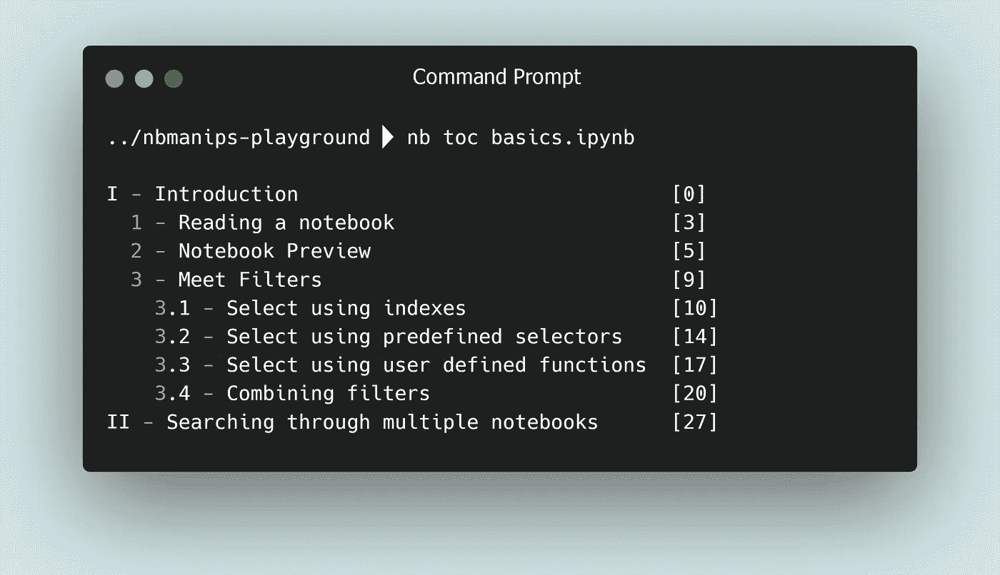

# 分割你的 Jupyter 笔记本(2 行代码)

> 原文：<https://towardsdatascience.com/split-your-jupyter-notebooks-in-2-lines-of-code-de345d647454>

## 你的笔记本太大了吗？

作者:[阿玛尔哈斯尼](https://medium.com/u/d38873cbc5aa?source=post_page-----40d1ab7243c2--------------------------------) & [迪亚赫米拉](https://medium.com/u/7f47bdb8b8c0?source=post_page-----40d1ab7243c2--------------------------------)


稳定扩散产生的铝

如果你想以一种快速而肮脏的方式测试一个新想法，或者第一次探索数据，IPython 笔记本真的很有用。无论哪种方式，笔记本都有迅速变大和笨重的趋势，通常在你完成探索后需要清洁和重构，至少如果你想与你的经理、同事或未来的自己分享它们。

一个非常常见的操作是将笔记本分成多个子笔记本，通常基于标题。如果您想在 Jupyter 中这样做，您必须多次复制笔记本，并删除每个笔记本中的相关单元格。

如果有一种更快的方法来系统地完成这项工作呢？这就是你将在本文中学习的内容，使用 `nbmanips`，我创建的一个 python 包/ CLI 来轻松管理笔记本。

```
**Table of Contents :** · [Installing nbmanips](#0777)
· [1 - Splitting notebooks](#8973)
· [2 — Splitting a Notebook based on the Table of Contents](#0477)
· [3 — Splitting notebooks using a Python script](#af36)
· [Bonus: Concatenate multiple notebooks](#4d36)
```

# 安装 nbmanips

如果使用 pip，安装 nbmanips 非常简单:

```
pip install nbmanips
```

通过运行以下命令，确保 CLI 正常工作，并且您至少安装了版本 `1.3.0`:

如果你愿意，你可以用你自己的笔记本文件测试下面的库，但是如果你需要笔记本，这里有一个非常棒的 Git 存储库，里面有超过 30 个与机器学习相关的笔记本。

# 1 -拆分笔记本

一旦你安装了 nbmanips，你可以使用命令行界面，轻松地分裂笔记本。由您决定告诉包您希望在哪个级别执行拆分。假设您需要在每次有带标题(h1 HTML 标记)的 markdown 单元格时进行拆分，您需要做的就是在命令中指定如下内容:

```
nb select has_html_tag h1 | nb split -s nb.ipynb
```

*   命令的第一部分( `nb select has_html_tag h1`)将告诉 `nbmanips` 在哪些单元上执行拆分。
*   第二部分( `nb split -s nb.ipynb`)将根据管道选择分割笔记本。 `-s`标志告诉 nbmanips 使用选择而不是单元格索引。

在本例中，选择是在具有 1 级标题的 Markdown 单元格上执行的，但是您可以根据自己的喜好进行自定义。例如，您也可以在 2 级标题上拆分:

```
nb select has_html_tag h1,h2 | nb split -s nb.ipynb
```

如果您想了解其他选择器或其他用例，请随意查看这篇文章:

[](/rapidly-explore-jupyter-notebooks-right-in-your-terminal-67598d2265c2) [## 快速浏览 Jupyter 笔记本电脑(就在您的终端中)

### 编辑描述

towardsdatascience.com](/rapidly-explore-jupyter-notebooks-right-in-your-terminal-67598d2265c2) 

默认情况下，结果笔记本将被命名为 `nb-%d.ipynb`，但是您可以通过添加 `--output/-o`选项对其进行自定义:

```
nb select has_html_tag h1 | nb split -s nb.ipynb -o 'custom-name-%d.ipynb'
```

# 2 -根据目录拆分笔记本

拆分笔记本的一个更简单的方法是使用单元格本身的索引，使用此命令，如果您想要在特定的标题或代码单元格上拆分，这可能会很有帮助，例如:

```
nb split nb.ipynb 5,9
```

缺点是在大笔记本中查找单元格索引会很繁琐。谢天谢地，有更简单的方法找到索引。

例如，您可以使用以下命令显示目录:

```
nb toc nb.ipynb
```



另一个不太明显的例子是，如果您想要计算包含导入语句的单元格的索引，并且该单元格在笔记本的最后 10 个单元格中:

# 3 -使用 Python 脚本拆分笔记本

`nbmanips`是一个 python 包，这意味着你可以在一个 python 脚本中使用它，如果你想做更复杂的事情或者自动化处理一堆文件，这是很有用的。

在你开始任何治疗之前，你必须阅读这个笔记本:

现在您有了笔记本，您可以使用我们在第一个示例中看到的选择进行拆分:

或者像我们在前面的例子中看到的那样，使用目录:

# 好处:连接多个笔记本电脑

您可以使用以下命令连接多个笔记本:

```
nb cat nb1.ipynb nb2.ipynb -o result.ipynb
```

或者，如果您使用的是 python 脚本:

# 最后的想法

`nbmanips`努力成为 Jupyter 笔记本的瑞士军刀，让您可以轻松拆分、合并和浏览笔记本，而无需考虑。

我认为把它放在你的口袋里是一个很好的工具，它不一定每天都有用，但是当你需要它的时候，你会感谢拥有它。

另一个使用案例是连接多个笔记本电脑。如果您感兴趣，您可以查看我们的另一篇文章，该文章不仅展示了如何操作，还详细介绍了 Jupyter 笔记本文件的结构:

[](/how-to-easily-merge-multiple-jupyter-notebooks-into-one-e464a22d2dc4) [## 如何轻松将多台 Jupyter 笔记本合并为一台

### 编辑描述

towardsdatascience.com](/how-to-easily-merge-multiple-jupyter-notebooks-into-one-e464a22d2dc4) 

如果您有任何问题，请不要犹豫，在回复部分留言，我们将非常乐意回答。

感谢您坚持到现在，注意安全，我们将在下一篇文章中再见！😊

## 更多文章阅读

[](/rapidly-explore-jupyter-notebooks-right-in-your-terminal-67598d2265c2) [## 快速浏览 Jupyter 笔记本电脑(就在您的终端中)

### 优化笔记本搜索

towardsdatascience.com](/rapidly-explore-jupyter-notebooks-right-in-your-terminal-67598d2265c2) [](/this-decorator-will-make-python-30-times-faster-715ca5a66d5f) [## 这个装饰器将使 Python 速度提高 30 倍

### 以熊猫为例

towardsdatascience.com](/this-decorator-will-make-python-30-times-faster-715ca5a66d5f)