# 数据科学案例研究:是什么让 Spotify 播放列表成功

> 原文：<https://towardsdatascience.com/spotify-data-science-case-study-what-makes-a-playlist-successful-28fec482c523>

## 端到端数据科学案例研究，结合实际业务问题的技巧和 Python 实现:是什么让 Spotify 播放列表取得成功


图片来源:[佩克斯-弗拉达-卡尔波维奇](https://www.pexels.com/photo/young-lady-typing-on-keyboard-of-laptop-in-living-room-4050315/)

如果你正在准备数据科学或数据顾问案例研究面试，那么这篇文章就是为你准备的。本 ***端到端数据科学案例研究*** 及其 ***Python*** 实施，在招聘流程的最后阶段询问将有助于您了解从哪里开始，以及您应该遵循哪些必要步骤来解决此类案例研究面试。本文将为您解答以下问题以及更多问题:

> -在 Spotify 的现场案例研究面试中会有什么期待？
> 
> -如何进行端到端案例研究，回答数据科学问题“是什么让 Spotify 播放列表成功？”

这将是一个很好的起点，让你在下一次数据科学工作面试中留下坚实的第一印象。

在本文中，您会发现以下主题是每个数据科学案例研究的重要组成部分:

```
**- Content of Spotify Case Study Presentation Interview
- Why are you asked to do a Case Study?
- Defining Business Goal and Technical Goal
- Game Plan
- Defining Success Metrics
- Short Term Success Metrics
- Long Term Success Metrics
- Feature Engineering: Candidates for Successful Playlists
- Data Exploration and Visualization
- Data Modelling
- Conclusion: Answering the Case Study Question
- Python Code**
```

现场和最终面试可能是整个面试过程中最令人生畏的面试之一，通过这篇博客，我将制定本案例研究的**业务和数据科学目标**，执行**数据可视化**和**探索分析**。此外，我将使用**线性回归**执行简单的**数据建模**，并得出结论。

**注**:你可以在这里找到解决类似 Spotify 现场采访案例的其他方法

# **Spotify 案例研究访谈的内容**

Spotify 最终面试阶段的一个主要部分是要求应聘者为虚拟演示面试做准备，在虚拟演示面试中，你需要:

*   围绕数据探索和可视化分析进行案例研究
*   熟悉建模技术、 **NLP** 、**机器学习**和**人工智能**
*   准备一个幻灯片演示

一旦你准备好了你有 1 周时间的工作，你将被要求向一组 Spotify 面试官(超过 4-6 人，包括 HM、用户研究人员、产品经理和数据科学家)展示它。

**提示:**准备回答**统计**基础题。

*如果你想学习或更新基本的统计学概念，你可以看看这篇文章:*

[](/fundamentals-of-statistics-for-data-scientists-and-data-analysts-69d93a05aae7)  

**提示:**准备回答 **A/B 测试**相关问题。

要解决这个问题，你需要知道的关于 A/B 测试的一切都可以在这里找到:

[](/simple-and-complet-guide-to-a-b-testing-c34154d0ce5a)  

如果你正处于面试过程的早期阶段，以下是我之前的博客，它将帮助你**破解 Spotify 数据科学的技术屏障**。

[](/how-to-crack-spotify-data-science-technical-screen-interview-23f0f7205928)  

> 关于这个话题的更多内容，你可以在 Glassdoor.com[阅读](https://www.glassdoor.nl/Sollicitatiegesprek/Spotify-Data-Scientist-Sollicitatievragen-EI_IE408251.0,7_KO8,22.htm)

# 为什么要求你做案例研究？

公司和面试官要求求职者进行案例研究，并且经常要求他们提出一个目标来评估你的思维过程、技术和沟通技巧。尤其是，你如何能很好地处理一个商业案例，然后向不同背景的人解释清楚。

此外，你应该足够灵活地接受和回答与案件相关的任何类型的问题。重要的是要注意，所有面试都是不同的，但在这种情况下执行的步骤和任务很可能是适用的，或者至少让您更好地理解在处理大多数数据科学面试时应该做什么。

在这篇博客中，我将讨论以下主题:

*   **确定项目的商业目标**和技术目标。​
*   讨论战略，即旨在指导我们完成整个过程的分步游戏计划。​​
*   详细了解**定义成功指标**的流程，以衡量播放列表的成功，我们将快速浏览成功播放列表的可能候选特征列表。​
*   经历**数据探索**和**可视化结果**
*   浏览**数据建模结果**。
*   做出结论，并指定实现业务目标的后续步骤。​


图片来源:[佩克斯-弗拉达-卡尔波维奇](https://www.pexels.com/photo/crop-young-businesswoman-using-laptop-while-drinking-tea-at-home-4050347/)

# 步骤 1:定义项目目标

所以先从项目目标说起。这是这个项目更高层次的目标，在这种情况下，它回答了一个问题:是什么让 Spotify 播放列表成功。​

这里我们可以区分一下**业务目标** (OKRs 或 KRs)和**技术目标**(数据科学项目目标)**。**因此，这里的商业目标将是向 Spotify 用户提供最佳播放列表，以:

*   1:提高用户满意度(减少搜索时间并提高搜索结果或推荐系统结果的质量)，
*   2:提高使用率
*   3:增加收入

所以，我们想量化是什么让播放列表成功。我们可以通过定义一个目标成功标准来衡量播放列表的成功程度。其次，我们希望确定成功播放列表的关键指标，这是区分成功播放列表和不成功播放列表的特征。​

根据顾客的需求，确定播放列表成功的因素，并了解如何衡量。然后，人们可以改进这些播放列表的播放列表搜索结果或推荐系统。该公司甚至可以对它们进行个性化设置，这样我们就可以向客户提供他们最有可能感兴趣的播放列表。​

因此，我们希望 Spotify 用户能听更多更长时间的播放列表。​

> 我们想量化是什么让播放列表成功。我们可以通过定义一个目标成功标准来衡量播放列表的成功程度。


图片来源:[安德里亚·皮亚卡迪奥](https://www.pexels.com/photo/young-sportswoman-listening-to-music-in-park-3776837/)

# 第二步:游戏计划或策略

你需要做的下一件事是想出一个进行案例研究的策略，目标是回答最初提出的问题，即**“是什么让播放列表成功？”**并达到上一步所述的目标。

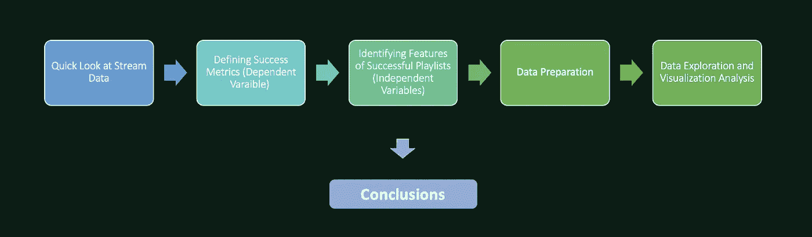

图片来源:作者

我们将从查看数据和一些描述性统计开始，以了解更多关于我们的数据。其次，我们将查看一些**候选成功指标**，它们可以帮助我们衡量播放列表的成功程度。

然后，我们将快速浏览一下数据中可能对播放列表的成功产生影响的一些特性。之后，我们将看看在数据探索和可视化分析之前使用的数据准备步骤。最后，我们将运行初步的线性回归来测试检测到的特征的显著性，并且我们将基于执行的简要分析得出结论。​

> 我们希望确定成功播放列表的关键指标，这是区分成功播放列表和不成功播放列表的特征。​

# 步骤 3:数据和描述性统计

这是原始数据的样子，总共有 403.366 行(播放列表)和 25 列(特写)。在这里，我们可以看到数据中前 5 名和后 5 名的观察值，以及前 4 列和后 4 列。​

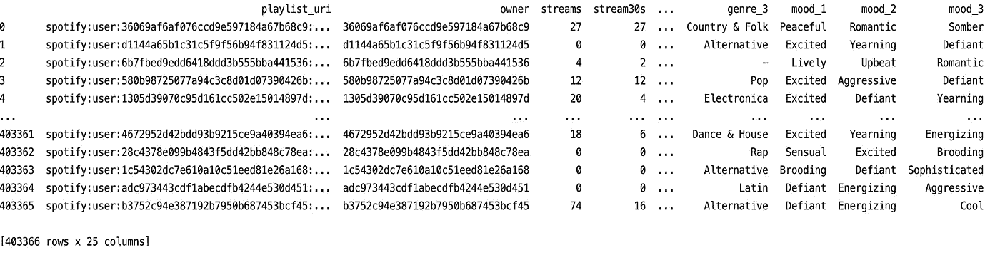

图片来源:作者

*   从数据中移除异常值
*   检查缺少的值

## **某些特征的描述性统计**

让我们看看一些描述性的统计数据。请注意，Spotify 的 399 个播放列表在计算时被排除在数据之外。 ***这部分是从数据中剔除异常值的必要部分。***

我们看到大约有 31.5 万个播放列表的唯一所有者。平均而言，播放列表有 202 首曲目、88 张专辑和 84 位艺术家。我们还看到，平均而言，一个播放列表具有相当短标题，只有两个令牌。​

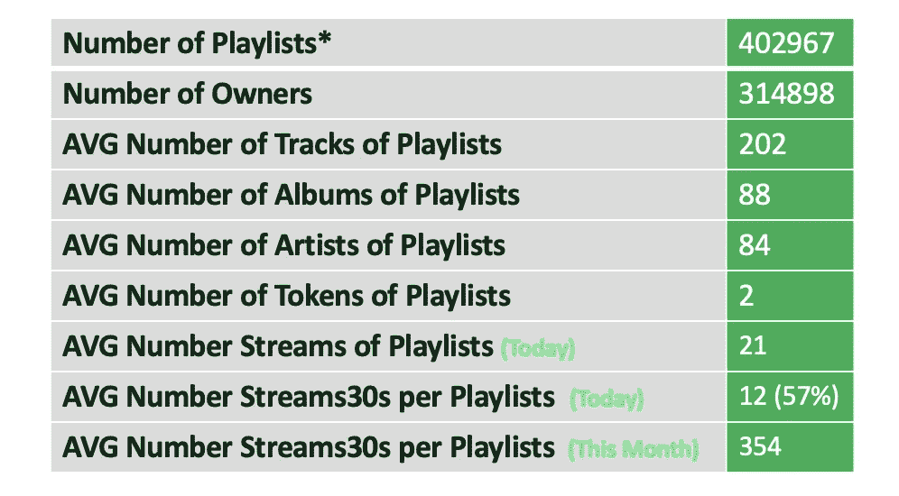

图片来源:作者

此外，我们看到平均播放列表有 21 个流，而这些流中只有 12 个超过 30 秒。因此，平均而言，今天 57%的播放列表流最终被收听超过 30 秒。这是我们想要改变和提高这一比例的事情。​

当我们查看与使用相关的功能统计数据时，特别是在 DAU，它的 AVG、最小值、最大值，我们看到每个播放列表的每日活跃使用量有很大的差异。有些播放列表有大量的 DAU，而有些播放列表很少或根本没有。从每周和每月的活跃使用中可以看到类似的情况。​

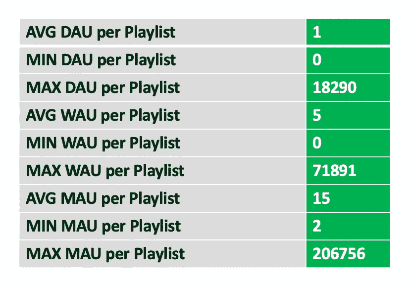

图片来源:作者

> 我们希望 Spotify 用户能听更多更长时间的播放列表。​

# **第 4 步:定义成功指标**

现在让我们来讨论这个分析和案例研究中非常重要的部分，即定义成功指标来衡量播放列表的成功。问题是什么时候才能称播放列表成功？播放列表是成功的，当很多用户听的时候，听的时间比较长。有许多可能的指标，我们可以用来衡量播放列表的成功，也可以在多个层面。​

**什么时候才能说播放列表成功？**

*   用户大量收听成功的播放列表
*   用户收听成功的播放列表的时间更长(超过 30 秒)

**成功的可能水平是什么？**

*   播放列表级别的成功
*   播放列表所有者级别的成功

因此，这里有几个我们可以用来衡量播放列表成功的指标的例子，在这里我们可以区分短期和长期的成功。​

对于短期指标，我们可以使用 dau 或 Wau，我们可以使用当前超过 30 秒的流的数量。播放列表的几个长期成功指标可以是 MAU、每月活跃用户、每月流 30 或每月所有者流。​


图片来源:[布德龙巴赫](https://www.pexels.com/photo/young-ethnic-male-skater-on-skateboard-holding-boombox-on-shoulder-5157168/)

## **短期成功指标**

*   **DAUs:** 播放列表中流媒体播放时间超过 30 秒的日活跃用户数
*   **WAUs:** 播放列表中播放时间超过 30 秒的每周活跃用户数
*   **流 30s:** 今天播放列表中超过 30s 的流的数量

## **长期成功指标**

*   **MAUs** :本月播放列表中流超过 30 秒的月活跃用户数。或过去 2 个月内播放列表中的活跃用户总数(mau_both_months)
*   **Monthly_streams30s** :播放列表 30 秒以上的流数
*   **Monthly _ owner _ streams 30s**:本月播放列表所有者超过 30 秒的流数

## 选择的度量

为了简单起见，今天我选择 WAU 作为成功的衡量标准，这是一个播放列表的短期和长期表现之间的一线希望。然而，在理想情况下，我们希望提出一个自定义的指标，包含播放列表的短期和长期性能，以及所有者的性能。例如，组合 DAU，WAU，茂，流 30 今天，每月流和每月业主流。​

> 理想情况下，我们希望提出一个自定义指标，包含播放列表的短期和长期性能，以及所有者的性能。例如，组合 DAU，WAU，茂，流 30 今天，每月流和每月业主流。​

# **第五步:候选特征**

现在，当我们知道如何衡量播放列表的性能时，让我们看看可能与播放列表的成功相关的一些功能。在这里，我将它们分为 4 组:播放列表种类、分类描述符、播放列表所有者特征和播放列表质量比率。

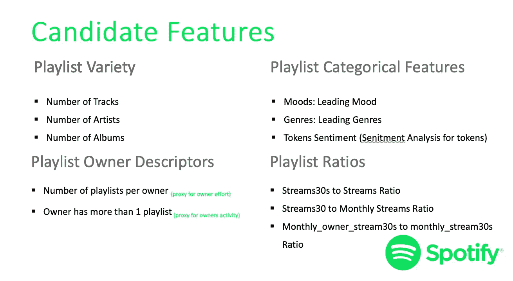

图片来源:作者

就播放列表的种类而言，我们可以查看播放列表的曲目数量、艺术家数量和专辑数量。根据描述播放列表的分类变量，我们可以查看播放列表的主导情绪或主导流派。

我们还可以使用情感分析来衡量播放列表的标记是积极的还是消极的。​

人们可以查看所有者拥有的播放列表的数量，这是所有者努力的代理，或者创建二进制变量来指示播放列表的所有者是否拥有多于一个的播放列表，这是所有者的活动或参与的代理。最后，可以使用一些比率来描述播放列表。​


图片来源:[安德里亚·皮亚库迪](https://www.pexels.com/photo/satisfied-woman-taking-selfie-on-smartphone-in-studio-3783517/)

## 播放列表种类

*   轨道数量
*   艺术家数量
*   相册数量

## 播放列表分类特征

*   情绪:主导情绪
*   流派:主流流派
*   代币情感(代币的语义分析)

## **播放列表所有者描述符**

*   每个所有者的播放列表数量(代表所有者的努力)
*   所有者有多个播放列表(所有者活动的代理)

## **播放列表比率**

*   流与流的比率
*   溪流 30 与每月溪流的比率
*   Monthly_owner_stream30s 与 monthly_stream30s 的比率

> 您可以使用情感分析来衡量播放列表标记的积极或消极程度。​

# **第六步:假设**

## 品种重要吗？

*   类型
*   情绪
*   轨道数量
*   相册
*   艺术家

利用上一步中描述的功能，我们可以测试播放列表种类很重要的假设，即:

> **假设**:播放列表中的更多流派、情绪、艺术家、曲目和专辑是否与播放列表的更高成功相关？

## 感情重要吗？

*   情绪分析心情
*   类型
*   代币

然后，我们可以测试播放列表标记中的情感是否重要，即:

> **假设**:播放列表的情绪会影响播放列表的成功吗？​

## 努力重要吗？

*   标题长度

我们可以检验所有者的努力是否重要，即:

> **假设**:所有者在播放列表中投入的努力越多，播放列表的成功就越多吗？

## 订婚重要吗？

*   用户拥有的播放列表数量
*   每月拥有者流量 30s 与每月流量 30s 的比率

最后，人们可以测试参与是否重要，例如:

> **假设**:所有者方面的较高参与度是否与播放列表的较高成功相关？

> 值得注意的是，通过这种数据分析，我们试图确定与播放列表更成功相关的因素，但由于相关性不是因果关系，因此需要建模来验证这种特征与播放列表成功之间的因果关系。​​

​

# **第七步:数据准备**

现在，在继续数据探索和可视化部分之前，让我们快速回顾几个数据准备步骤。​

首先，我们需要意识到异常值。我之前提到的离群值之一是关于 Spotify 拥有的播放列表。但除此之外，还有其他一些具有非常大的流和使用量的极端值，我们希望排除它们，以发现更常见的平均播放列表的一些模式。因此，我们删除了每周使用量中第 99 个百分点的所有播放列表。​​

**检查异常值**

*   移除 399 个高于平均流量的 Spotify 播放列表
*   从第 99 个百分位中删除行

接下来，我们检查丢失的值。虽然没有空值，但变量中存在缺失值数据点，尤其是在流派和情绪变量中。

**检查缺失值**

*   数据中没有空值，但有缺失值，尤其是在情绪、流派变量中

最后，我们将令牌的字符串或 txt 表示转换为令牌列表，以使用它来计算令牌的数量并执行情感分析，其中具有负面情感的播放列表将获得低值，而具有正面情感的播放列表将获得高值。

**代币信息检索和情感分析**

*   将文本转换为字符串列表
*   情绪得分低:负对高:正(代币上的 NLP)

# **第八步:数据探索&可视化**

让我们从数据探索和数据的可视化开始。

**播放列表领先流派**

这里是播放列表的主要流派的直方图，我们看到有 3 个明显的主要流派，播放列表的数量最多。​

这些是最常见的播放列表类型，我们能做的是为这 3 种类型“独立摇滚”、“说唱”和“流行”创建二元变量，并在预测模型中使用它们作为独立变量，这将有助于发现类型和播放列表性能的因果关系。​

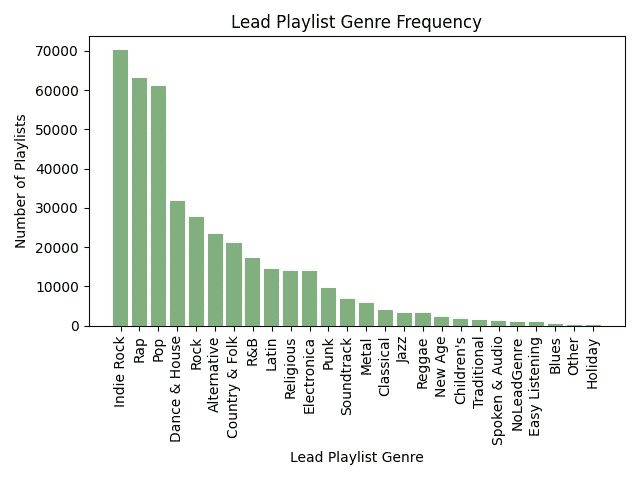

图片来源:作者

我们观察到:

*   所有播放列表中 3 个最受欢迎的领先流派:“独立摇滚”、“说唱”、“流行音乐”
*   这 3 个流派的播放列表比较成功？
*   未来预测模型中这三个流派二元特征

```
lead_genres = stream_data_no_outliers.groupby(**"genre_1"**)[**"playlist_uri"**].count().reset_index().sort_values(**"playlist_uri"**,ascending = **False**)
objects = lead_genres.genre_1
y_pos = np.arange(len(objects))
genre_1 = lead_genres.playlist_uri

plt.bar(y_pos, genre_1, align=**'center'**, alpha=0.5, color = **"darkgreen"**)
plt.xticks(y_pos, objects,rotation=**'vertical'**)
plt.title(**"Lead Playlist Genre Frequency"**)
plt.xlabel(**"Lead Playlist Genre"**)
plt.ylabel(**"Number of Playlists"**)
plt.tight_layout()
plt.show()
```

**播放列表领导情绪**

现在让我们看看另一个直方图，这次是播放列表的主导情绪，我们看到有 2 个获胜者。这些是最常见的播放列表情绪，“挑衅和兴奋”。​

我们能做的是为这两种情绪创建二元变量，并将它们用作预测模型中的独立变量，这将有助于发现类型和播放列表性能中的因果关系。​

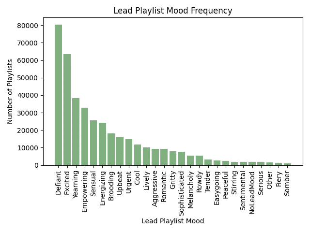

图片来源:作者

我们观察到:

*   所有播放列表中最受欢迎的两种主要情绪:“挑衅”、“兴奋”
*   具有这两种情绪的播放列表更成功
*   未来预测模型的这两种情绪的二元特征

```
lead_moods = stream_data_no_outliers.groupby(**"mood_1"**)[**"playlist_uri"**].count().reset_index().sort_values(**"playlist_uri"**,ascending = **False**)
objects = lead_moods.mood_1
y_pos = np.arange(len(objects))
mood_1 = lead_moods.playlist_uri
*# histogram of Binomial distribution* plt.bar(y_pos, mood_1, align=**'center'**, alpha=0.5, color = **"darkgreen"**)
plt.xticks(y_pos, objects,rotation=**'vertical'**)
plt.title(**"Lead Playlist Mood Frequency"**)
plt.xlabel(**"Lead Playlist Mood"**)
plt.ylabel(**"Number of Playlists"**)
plt.tight_layout()
plt.show()
```

## 所有者的努力:播放列表标题中的令牌数

让我们来看看所有者的努力是否与播放列表的成功有关。这个绘制了播放列表中令牌数量的平均 WAU 的直方图没有显示出清晰的模式，尽管看起来在令牌数量接近 12 之前有一个正的模式。​

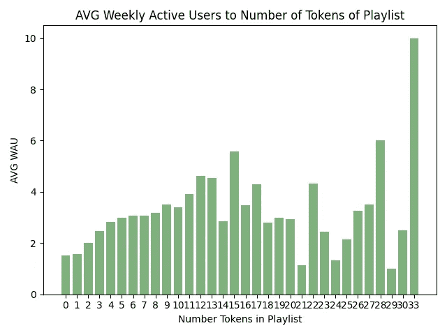

图片来源:作者

我们观察到:

*   没有令人信服的明确模式表明令牌(努力代理)的长度对播放列表的使用有影响
*   从 0 到 11 有一些积极的模式作为 num 标记，但之后这种影响逐渐消失

```
wau_num_tokens = df.groupby(**"num_tokens"**)[**"wau"**].mean().reset_index().sort_values(**"num_tokens"**,ascending = **True**)
objects = wau_num_tokens.num_tokens
y_pos = np.arange(len(objects))
ntokens = wau_num_tokens.wau
plt.bar(y_pos, ntokens, align=**'center'**, alpha=0.5, color = **"darkgreen"**)
plt.xticks(y_pos, objects)
plt.title(**"AVG Weekly Active Users to Number of Tokens of Playlist"**)
plt.xlabel(**"Number Tokens in Playlist"**)
plt.ylabel(**"AVG WAU"**)
plt.tight_layout()
plt.show()
```

## 体裁多样化至关重要

现在让我们来看看 WAU 播放列表中流派数量的散点图，看看流派的多样性是否与 WAU 有关。​

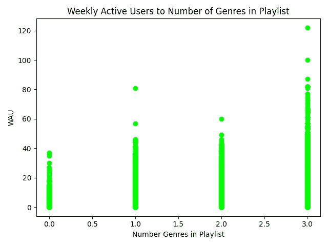

图片来源:作者

我们看到，具有最多 3 种风格的播放列表具有最高的 WAU，并且在播放列表中的风格数量与其成功之间存在正相关。即，我们观察到:

*   体裁数量与 WAU 呈正相关
*   具有 3 种风格的播放列表比少于 3 种风格的播放列表具有更高的 WAU

所以，流派的多样性很重要。

```
wau_num_genres = df.sort_values(**"num_genres"**,ascending = **True**)
plt.scatter( wau_num_genres.num_genres,wau_num_genres.wau, color = **"lime"**)
plt.title(**"Weekly Active Users to Number of Genres in Playlist"**)
plt.xlabel(**"Number Genres in Playlist"**)
plt.ylabel(**"WAU"**)
plt.tight_layout()
plt.show()
```

## 多种播放列表曲目

接下来，让我们来看看 WAU 对播放列表中曲目数量的绘图，看看曲目的多样性是否与播放列表的成功相关。​


图片来源:作者

图中似乎没有明确的关系。所以，曲目的多样性并不重要

```
wau_num_tracks = stream_data_no_outliers.groupby(**"n_tracks"**)[**"wau"**].mean().reset_index().sort_values(**"n_tracks"**,ascending = **True**)
plt.scatter( wau_num_tracks.n_tracks,wau_num_tracks.wau, color = **"lime"**)
plt.title(**"AVG Weekly Active Users to Number of Tracks in Playlist"**)
plt.xlabel(**"Number Tracks in Playlist"**)
plt.ylabel(**"AVG WAU"**)
plt.tight_layout()
plt.show()
```

## 各种播放列表和专辑

现在让我们来看看 WAU 在播放列表中专辑数量的散点图，看看专辑的多样性是否与 WAU 有关。​

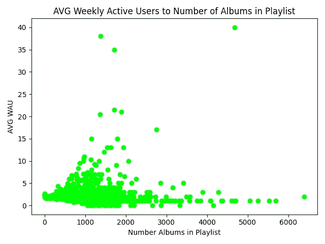

图片来源:作者

根据观察，我们发现专辑数量和播放列表成功之间存在正相关关系:

*   播放列表中的专辑数量与 WAU 成正比
*   包含更多专辑的播放列表比包含少量专辑的播放列表显示出更高的 WAU
*   但是这种效果会逐渐消失

所以，专辑的多样性很重要，但我们需要记住，相关性不是因果关系。

```
wau_num_albums = stream_data_no_outliers.groupby(**"n_albums"**)[**"wau"**].mean().reset_index().sort_values(**"n_albums"**,ascending = **True**)
plt.scatter( wau_num_albums.n_albums,wau_num_albums.wau, color = **"lime"**)
plt.title(**"AVG Weekly Active Users to Number of Albums in Playlist"**)
plt.xlabel(**"Number Albums in Playlist"**)
plt.ylabel(**"AVG WAU"**)
plt.tight_layout()
plt.show()
```

## 播放列表中的各种艺术家

最后，让我们看看 WAU 关于播放列表中艺术家数量的曲线图，看看艺术家的多样性是否与 WAU 有关。​

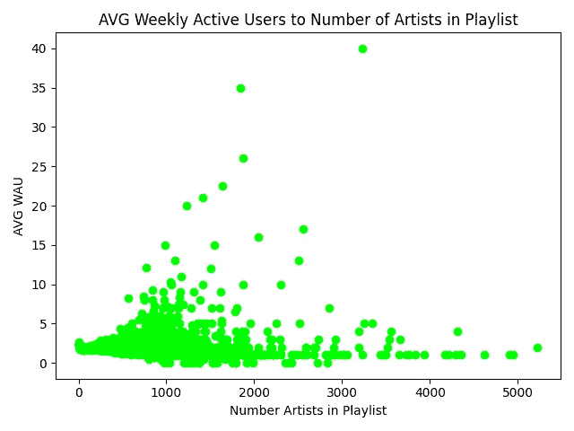

图片来源:作者

我们发现艺术家的数量与播放列表的成功之间存在正相关关系，这是基于:

*   播放列表中艺术家的数量和 WAU 之间的正相关关系
*   艺术家数量较多的播放列表比艺术家数量很少的播放列表显示出更高的 WAU
*   但是这种效果会逐渐消失

因此，艺术家的多样性很重要，但相关性不是因果关系

```
wau_num_artists = stream_data_no_outliers.groupby(**"n_artists"**)[**"wau"**].mean().reset_index().sort_values(**"n_artists"**,ascending = **True**)
plt.scatter( wau_num_artists.n_artists,wau_num_artists.wau, color = **"lime"**)
plt.title(**"AVG Weekly Active Users to Number of Artists in Playlist"**)
plt.xlabel(**"Number Artists in Playlist"**)
plt.ylabel(**"AVG WAU"**)
plt.tight_layout()
plt.show()
```

## 播放列表的情感

现在让我们检查一下播放列表中的情绪是否重要。这里我们使用一种叫做 **TextBlob** 的 **NLP** 技术来分析代币的情感。​

其背后的想法是获得[-1 和 1]之间的 aa 共同分数，该分数将表示这些 case 标记中文本的情感分数，其中较大的值表示积极的情感。​

如你所见，在左手边你有最积极的播放列表，而在右边你有最消极的播放列表。​

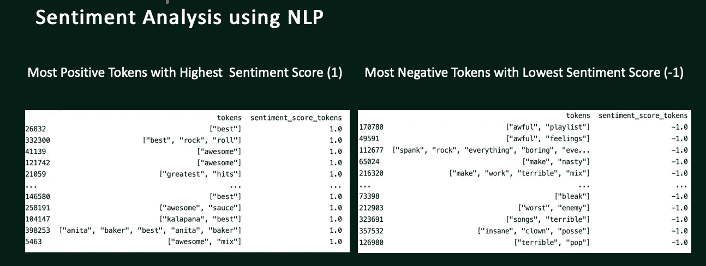

图片来源:作者

WAU 对令牌的情绪得分的曲线图没有显示出任何清晰的模式，所以就我们从数据中看到的，播放列表中令牌的情绪与播放列表的成功没有真正的关系。​

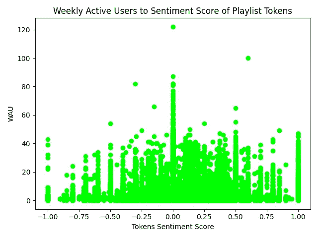

图片来源:作者

```
wau_sentimentscore = df.sort_values(**"sentiment_score_tokens"**, ascending = **True**)
plt.scatter( wau_sentimentscore.sentiment_score_tokens,wau_sentimentscore.wau, color = **"lime"**)
plt.title(**"Weekly Active Users to Sentiment Score of Playlist Tokens"**)
plt.xlabel(**"Tokens Sentiment Score"**)
plt.ylabel(**"WAU"**)
plt.tight_layout()
plt.show()
```

> 当使用数据可视化和探索时，需要有保留地解释结果，因为相关性不是因果关系。

# 步骤 9:简单的数据建模

通过数据探索和可视化分析，我们得出了一个可能变量的列表，这些变量显示了与播放列表的成功之间的关系。但是这些变量显示了与播放列表的成功的相关性。

我们需要再做一步来找出这些和许多其他特征是否不仅相关，而且对播放列表的成功有统计上的显著影响，因为相关性不是因果关系。我们将通过使用**线性回归**来实现，这只是它的一个非常简单的版本。

为此，我们需要创建一个播放列表的样本，样本大小可以根据置信水平来确定，我选择的置信水平为 99%，误差为 1%，这导致了 16K 个播放列表。​

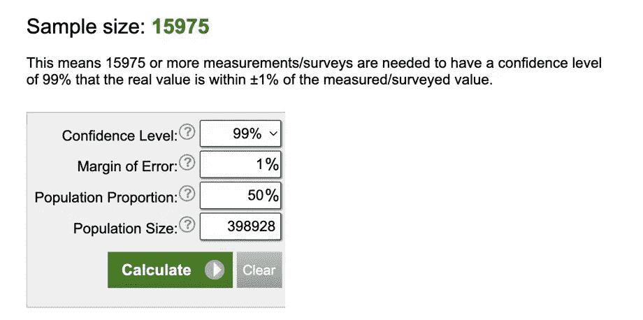

图片来源:作者

以下是使用前面提到的一些特性和一些新特性作为自变量和 WAU 作为因变量**时，使用 **OLS** 估计运行多重**线性回归**的结果。​**

我们可以看到的是，流行音乐类型对播放列表的 WAU 有显著的负面影响。此外，专辑数量和流派数量在统计上对播放列表的 WAU 有显著的积极影响。这证实了我们早期的发现，多样性很重要。​

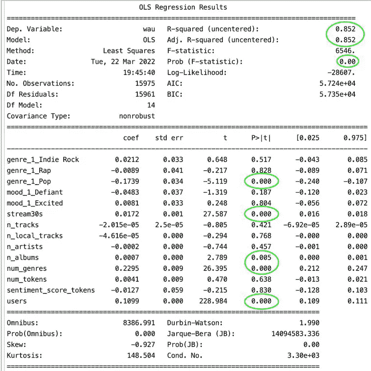

图片来源:作者

总结回归结果:

*   **流行类型:**显著和负面影响
*   **流 s30s:** 显著且积极的效果
*   **Num_albums** :显著且积极的效果
*   **数量 _ 流派**:显著且积极的影响
*   **用户**:显著且积极的效果

# 第十步:**结论**

因此，使用**数据探索**和**可视化**我们发现了与播放列表的成功相关的某些特征。*值得一提的是，我们选择了一个非常简单的成功指标，而理想情况下，我们希望使用更高级的功能。*

然后，我们使用之前使用的一些功能，并结合其他一些功能，运行一个初步的线性回归，以测试早期的假设，并找到哪些因素使播放列表成功。我们发现播放列表的多样性，特别是专辑和流派的多样性使得播放列表成功。

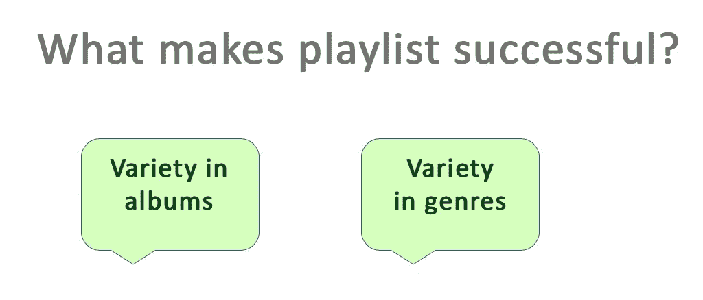

图片来源:作者

但是我们需要更多这些功能，我们需要更先进的成功衡量标准。

# 步骤 11:后续步骤

这些见解只是冰山一角。这些数据包含许多有趣和重要的特性，不幸的是，由于时间限制，今天只讨论了其中的一小部分。​

项目的下一步应该是运行更高级的**线性回归**来检测播放列表成功的许多其他特征的**统计显著性**，以获得增加或降低播放列表成功水平的特征列表。​

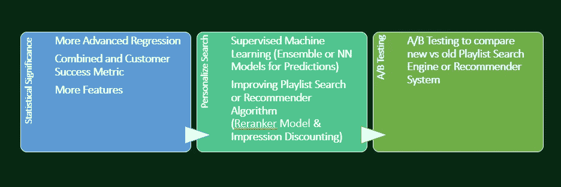

图片来源:作者

之后，人们可以使用**监督的机器学习**来个性化**搜索引擎**或**推荐系统**向用户提供播放列表。因为我们想在顶部显示最成功的播放列表。然后 **A/B 测试**可以用来对现有的推荐系统测试新算法。

此外，Spotify 可以建立一个带有**印象折扣**的**重新排名模型**，以个性化和改进搜索引擎。最后，在所有这些中，人们不应该忘记新的播放列表:(冷启动问题)。

​

# Python 实现

# 如果你喜欢这篇文章，这里有一些你可能喜欢的其他文章:

[](/how-to-crack-spotify-data-science-technical-screen-interview-23f0f7205928)  [](/bias-variance-trade-off-overfitting-regularization-in-machine-learning-d79c6d8f20b4)  [](https://tatev-aslanyan.medium.com/data-sampling-methods-in-python-a4400628ea1b)  [](/monte-carlo-simulation-and-variants-with-python-43e3e7c59e1f)  [](https://levelup.gitconnected.com/predicting-bitcoins-price-with-recurrent-neural-networks-a27b4d2d839)  

***感谢阅读***

*我鼓励你* [***加入 Medium***](https://tatev-aslanyan.medium.com/membership)**来拥有* *完整访问我所有关于数据科学、机器学习、AI 以及其他主题的文章。**

**关注我* [***中型***](https://medium.com/@tatev-aslanyan)**阅读更多关于各种数据科学和数据分析主题的文章。更多机器学习的动手应用，数学和统计概念查看我的*[***Github***](https://github.com/TatevKaren)**账号。
欢迎反馈，可在*[***LinkedIn***](https://www.linkedin.com/in/tatev-karen-aslanyan/)*上联系。****

*****快乐学习！*****