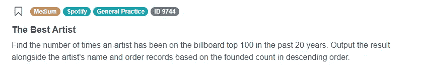
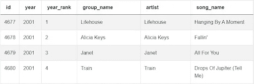
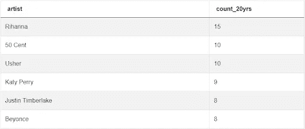
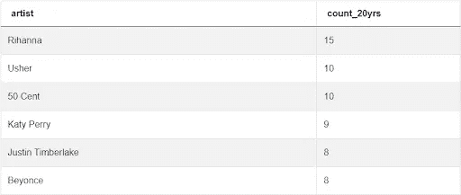

# Spotify 数据科学面试问题演练

> 原文：<https://towardsdatascience.com/spotify-data-science-interview-question-walkthrough-2d50bc45abb9>

## *Spotify 在 2020 年《财富》杂志评选的未来 50 强中排名第十，它为雄心勃勃的数据科学家提供了一系列多样化的工作选择*


作者在 [Canva](https://canva.com/) 上创建的图片

在 Spotify 的网站上快速搜索一下，就会看到对希望探索数据科学不同领域的数据科学家来说很有吸引力的选择:营销、用户研究、产品洞察等。在今天的文章中，我们将探讨以下来自最近 Spotify 数据科学采访的采访问题。

# Spotify 数据科学面试问题



截图来自 [StrataScratch](https://platform.stratascratch.com/coding/9744-artist-of-the-decade?python=&utm_source=blog&utm_medium=click&utm_campaign=medium)

问题链接:[https://platform . stratascratch . com/coding/9744-十年最佳艺人](https://platform.stratascratch.com/coding/9744-artist-of-the-decade?python=&utm_source=blog&utm_medium=click&utm_campaign=medium)

在 StrataScratch，请跟随我们，与 Frederik Müller 一起了解如何首先接近 Spotify 数据科学面试问题，然后再解决这个问题。请注意，自录制之日起，此面试问题已被修改。方法仍然是一样的，但输出占过去 20 年的历史，而不是 10 年。

# Spotify 数据科学面试问题中使用的技巧

在解决这个问题的方法中，将使用以下技巧:

*   算术运算
*   COUNT() /分组依据
*   内置日期函数

# 方法

任何面试数据科学面试问题的第一种方法都包括几个初始步骤:

1.  收集和审查提供的所有数据
2.  记录预期产出，以及
3.  澄清解决方案中是否存在任何必须解决的独特性或挑战

这个问题的数据全部呈现在一个表格里:billboard_top_100_year_end。此表列出了所有进入 billboard top 100 的歌曲，以及年份、艺术家姓名、组合名称和歌曲排名。



截图来自 [StrataScratch](https://platform.stratascratch.com/coding/9744-artist-of-the-decade?python=&utm_source=blog&utm_medium=click&utm_campaign=medium)

我们的预期输出是艺术家名字的列表，以及他们在过去 20 年中出现在 billboard top 100 图表中的总次数。列表应该按照出现的次数从高到低排序。在提供的数据集中，已经存在一列艺术家姓名，我们将使用它作为第一个返回的列。因为一个艺术家除了个人事业之外还可能是多个团体的一部分，所以我们的查询选择 artist 列而不是 group_name 列。查询返回的第二列是每个艺术家在列表中出现的次数。这将需要使用 COUNT()函数。这是我们将用来构建查询的基础知识。

## 构建查询


作者在 [Canva](https://canva.com/) 上创建的图像

*在下面构建查询时，通过运行提供的代码来跟踪每个步骤，看看查询是如何发展的。*

我们首先找到表中的所有艺术家，并返回每个艺术家出现的总次数。摘要还告诉我们按出现频率对结果进行排序，所以让我们按第 2 列排序，这是 COUNT(*)的结果:

```
SELECT artist,
       COUNT(*) as count_20yrs
FROM billboard_top_100_year_end
GROUP BY artist
ORDER BY 2 DESC
```

由于这个 Spotify 数据科学面试问题只要求过去 20 年*的结果，因此添加了一个 WHERE 子句来过滤结果。此时，目标是测试准确性——稍后将对查询进行细化。

```
SELECT artist,
       COUNT(*) AS count_20yrs
FROM billboard_top_100_year_end
WHERE YEAR >= 2002
GROUP BY artist
ORDER BY 2 DESC
```

**请注意，示例中的年份取决于本文的发布日期。*

以下是当前存在的查询结果:



截图来自 [StrataScratch](https://platform.stratascratch.com/coding/9744-artist-of-the-decade?python=&utm_source=blog&utm_medium=click&utm_campaign=medium)

## 细化查询

既然查询已经有了准确的解决方案，那么是时候改进 WHERE 子句以获得更好的适用性了。编写有效查询的目标是确保代码是“经得起未来考验的”，也就是说，随着时间的推移，查询应该像预期的那样工作。我们的输出应该只包括 billboard 过去 20 年的历史数据，所以我们将在查询中使用 DATE_PART()和 CURRENT_DATE 来隔离当前年份:

```
DATE_PART(‘YEAR’, CURRENT_DATE)
```

要查找过去 20 年的结果，我们使用—运算符从当前年份中减去年份列中的值，并且仅在结果< = 20 时显示该行。最后，最佳实践包括尽可能指定列名，而不是星号(*)[所有列]。虽然 COUNT(*)在这种情况下有效，因为表中的所有行都是唯一的，但指定 artist 列有助于可读性和处理时间:

```
SELECT artist,
       COUNT(artist) AS count_20yrs
FROM billboard_top_100_year_end
WHERE DATE_PART('year', CURRENT_DATE) - YEAR <= 20
GROUP BY artist
ORDER BY COUNT(artist) DESC
```

正如我们在下面所看到的，这里的输出与前面未经提炼的代码相同，尽管这种修改确保了结果将保持准确的久而久之。



截图来自 [StrataScratch](https://platform.stratascratch.com/coding/9744-artist-of-the-decade?python=&utm_source=blog&utm_medium=click&utm_campaign=medium)

## 结论

通过本文和相关视频，我们已经完成了评估 Spotify 数据科学采访问题的步骤、提供的数据、对这些数据的假设，并完成了解决方案。问题解决后，我们回顾了解决方案，并为了将来的可读性而改进了查询。我们使用 COUNT()查找所有艺术家的计数，使用 DATE_PART()从 CURRENT_DATE 中分离出 year 值，使用减法(-)和比较(<=) operators to produce the final result. Check out our post “ [*顶级公司的数据科学面试问题*](https://www.stratascratch.com/blog/40-data-science-interview-questions-from-top-companies/?utm_source=blog&utm_medium=click&utm_campaign=medium) )来练习其他顶级公司的更多此类问题。

*原载于*[*https://www.stratascratch.com*](https://www.stratascratch.com/blog/spotify-data-science-interview-question-walkthrough/?utm_source=blog&utm_medium=click&utm_campaign=medium)*。*