# Spotify(未包装)

> 原文：<https://towardsdatascience.com/spotify-un-wrapped-4adad6b9ce4e>

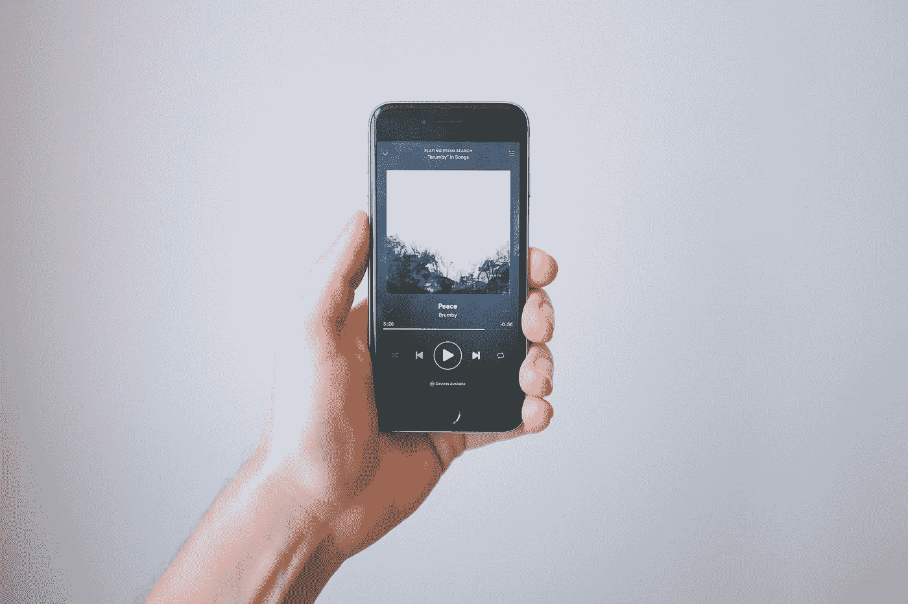

在 [Unsplash](https://unsplash.com?utm_source=medium&utm_medium=referral) 上 [NeONBRAND](https://unsplash.com/@neonbrand?utm_source=medium&utm_medium=referral) 拍摄的照片

# Spotify(未包装)

## 所有我包好的东西都没有告诉我，但我一直想知道

那么，你知道吗，你可以在你账户的隐私设置中从 Spotify 下载你去年的流媒体历史记录？(链接[此处](https://www.spotify.com/br/account/privacy/))。我上周才知道这件事，并在今年年初提交了我的申请。这样一来，我就可以访问我从 2021 年 1 月 6 日到 2022 年 1 月 7 日的详细流媒体历史记录。

作为 Spotify 的普通用户，Wrapped season 是我一年中最喜欢的时刻之一。尽管有一些统计数据已经成为经典——比如你的顶级艺术家或顶级歌曲——但我们看到一种积极的努力，即通过音乐整合一年的记忆和经历，让讲述的故事保持新鲜和新鲜，以取悦用户。

考虑到这一点，这是我试图在我的 Spotify 数据上找到新的故事——关于我生活的那一年，我的习惯和造就我的 2021 年的音乐。

# 亮点是:

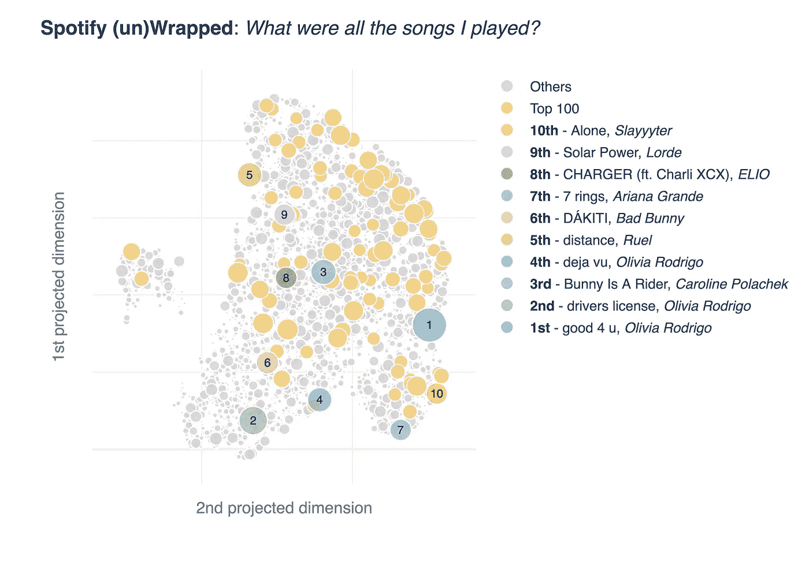

*作者图片*

这些都是我在 2021 年播放的 **5818** 首歌曲，是借助一种叫做 UMAP 的算法绘制的——这种算法突出了所有点的局部和全局结构。在这里，具有相似特征的歌曲——如声音感觉、能量水平、节奏和舞蹈能力——被投射得更近。

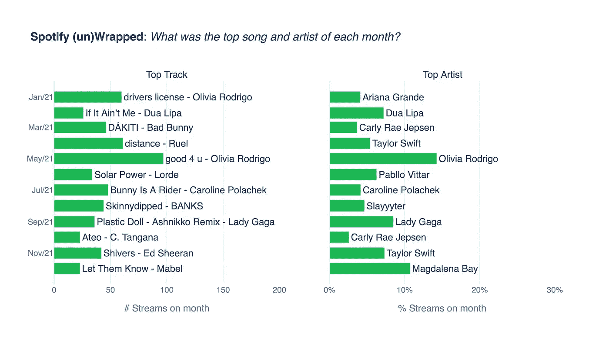

*作者图片*

分析几个月来热门歌曲的演变，我们发现这与音乐发行有关联，这些歌曲中的 **8 首在它们发行的同一个月**成为我最常听的歌曲。此外，我们看到了一些风格的变化，从流行行为——如杜阿·利帕和奥利瓦·罗德里戈——到更小众的艺术家——如鲁尔和卡罗琳·波拉切克。

当考虑艺术家和他们的专辑时，这种情况也会发生。泰勒·斯威夫特、奥利维亚·罗德里戈、帕布洛·维塔尔和 Lady Gaga 在他们发布新项目的那个月成为顶级艺术家。

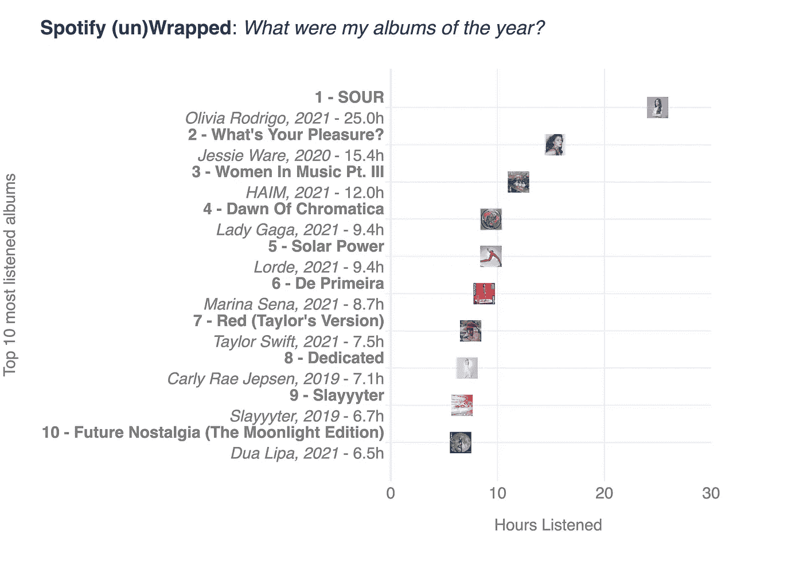

*作者图片*

我的年度专辑是**奥利维亚·罗德里戈的*酸涩****——我听了相当于一整天多一点的时间。前二名和前三名分别是杰西·威尔的*你喜欢什么*和 Pt 的*音乐中的女人。III* ，哈伊姆(我最喜欢的乐队)的。*

*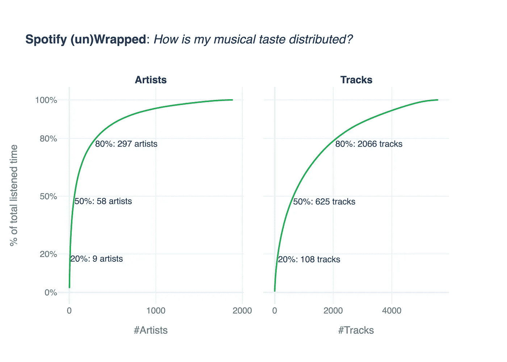*

**作者图片**

*我知道我更倾向于听女人的话，但这张图表让我非常清楚。 **9** **艺人，全是女的，负责我 20%的听歌时间**。他们是:奥利维亚·罗德里戈、泰勒·斯威夫特、卡莉·瑞·吉普森、哈伊姆、杜阿·利帕、杰西·威尔、查莉 XCX、班克斯和 Lady Gaga。正如他们所说:谁运营我的 Spotify？女生们！*

*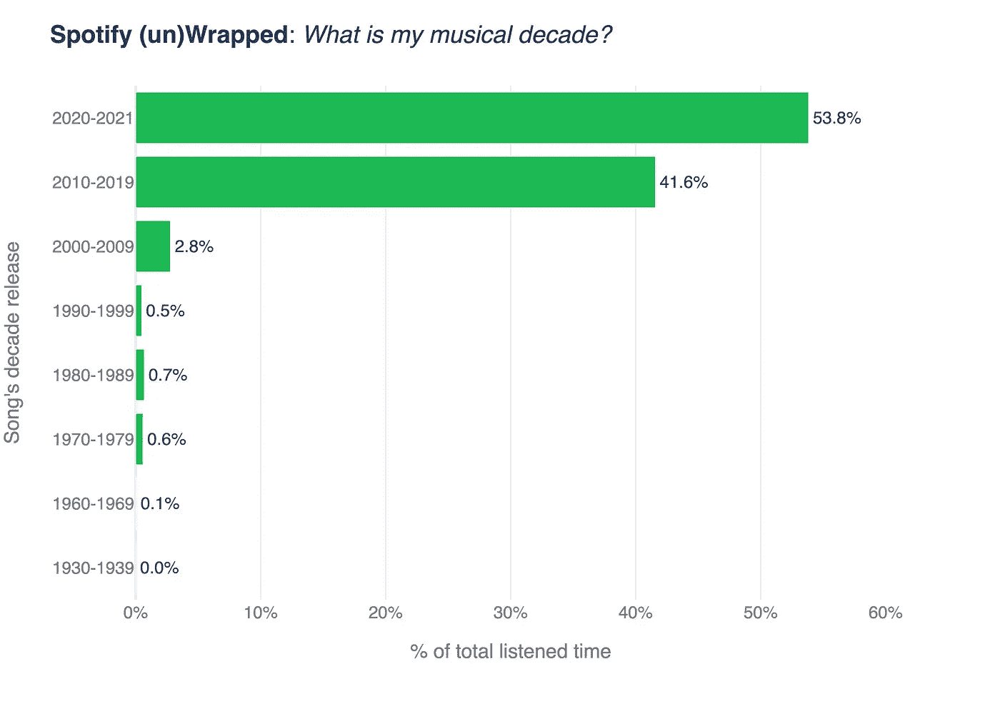*

**作者图片**

*我一半以上的听音乐时间都花在了过去两年的音乐上(54%) 。另外 42%是 2010-2019 年的音乐。鉴于此，[很明显，我们的音乐品味在 20 多岁的时候就冻结了](https://aeon.co/essays/why-do-your-musical-tastes-get-frozen-over-in-your-twenties)，而我已经 25 岁了，我怀疑，这个图表还需要一段时间才会开始停滞。*

*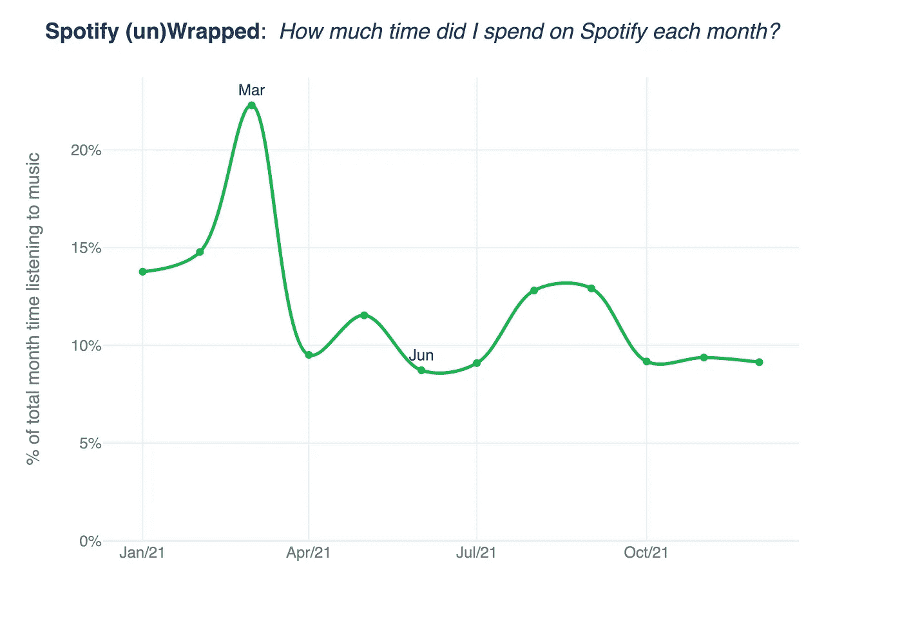*

**作者图片**

***3 月**是我在 Spotify 上最活跃的一个月，而最不活跃的是 6 月(可能是因为我回父母家住了一个月)。三月份，我花了这个月 22%的时间听音乐。*

*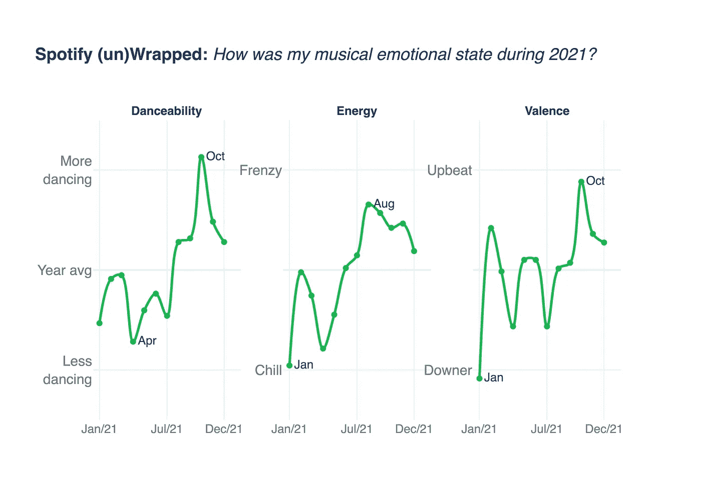*

**作者图片**

*在 Spotify 平台上赋予的特性中，有一些传达了一种文化意义。通过分析这些因素，我们发现我的第二学期比第一学期积极多了。**从 7 月份开始，似乎转向了更乐观、更有活力、更适合跳舞的歌曲**——这是我这一年的情绪转变，可能是因为回归到更像疫情之前的生活状态，因为巴西开始向年轻人推广疫苗接种。好玩(无关？)事实上，我的生日也在十月。*

*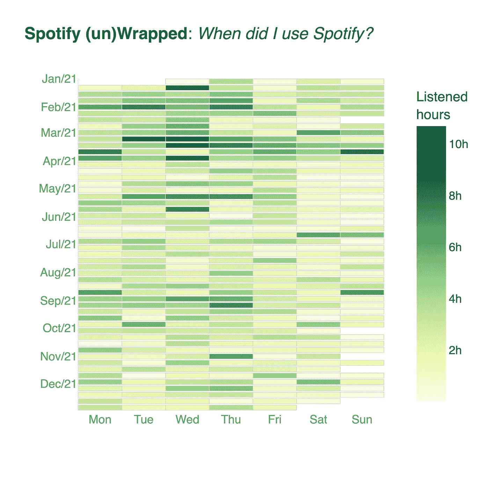*

**作者图片**

*我一年中只有**7 天**(大多是周日)没听音乐，我一年中听得最多的一天是**3 月 10 日**，当时我听了 **10.7 小时**！*

*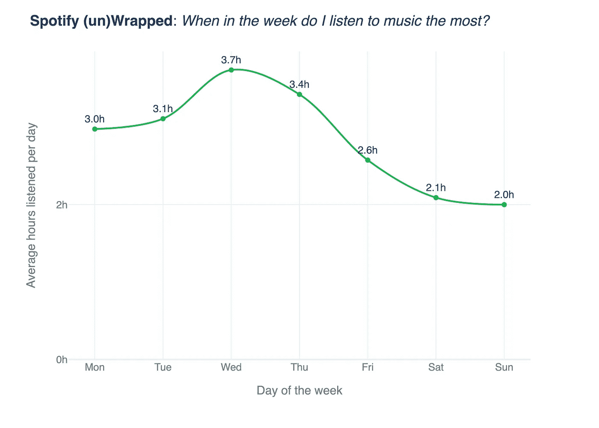*

**作者图片**

***周三**是我花**最多时间听音乐**的时候，平均听了 3.7h。相比之下，**周日**是我听得最少的时候(2.0h)。有趣的事实:在周三早上，工作中有一个不开会的政策——所以我通常会试着专注于更专注的任务，通常会开着音乐。*

*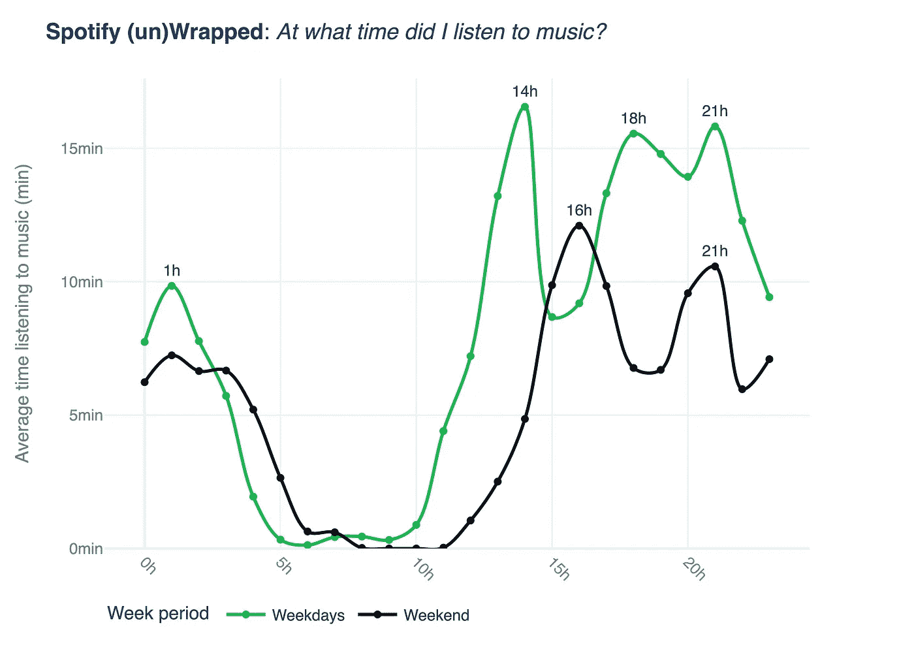*

**作者图片**

*我一周中的音乐高峰时段是 **14h** (后 luch 专注时间) **18h** (通常是我去健身房的时候)和 **21h** (当我在做饭、洗澡或者只是浏览——所有这些都涉及到听点什么的时候)。在周末，我的高峰期是在**16 小时**(通常是午饭后)和**21 小时**(聚会前/社交聚会时间)。令人惊讶的是，工作日比周末更有音乐感。*

*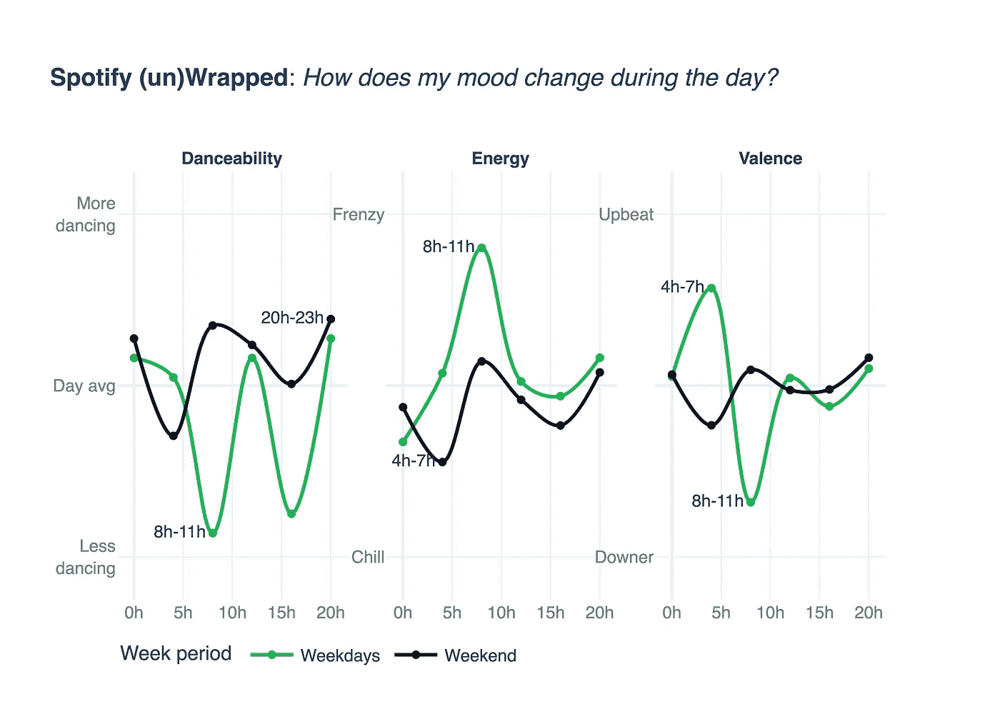*

**作者图片**

*当观察白天的情绪变化时，我们发现没有比周末晚上更适合跳舞的时刻了。此外，**工作日早上是精力最旺盛的时候**，让工作时精力充沛。与此同时，这种能量伴随着更悲伤的节奏，因为工作日的早晨也是化合价的最低值。*

*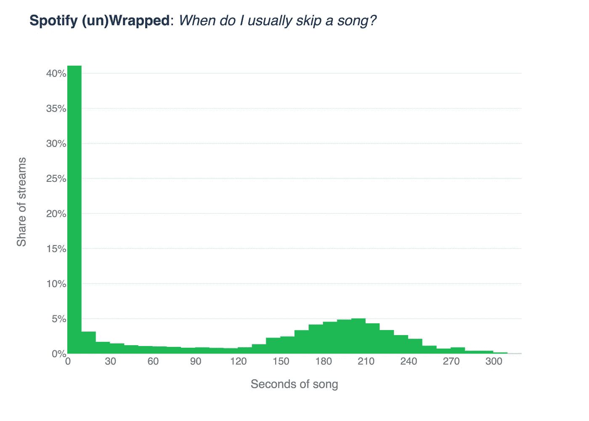*

**作者图片**

*最后，但同样重要的是，我似乎是一个挑剔的听众。我听的超过 40%的歌曲，在达到 10 秒大关之前都会跳过。强硬的人群。*

*看了所有这些数据后，有一件事是肯定的:我们每个人都是一个完整的宇宙，我们与音乐的关系也没有什么不同。*

*你呢？你的听歌习惯是什么？你想看看我是怎么做到的吗？代码可以在 github 项目库的[这里](https://github.com/adautobraz/ergo/tree/master/spotify_unwrapped)找到。*

 *[## Spotify -我最喜欢的 2021 年歌曲

open.spotify.com](https://open.spotify.com/playlist/37i9dQZF1EUMDoJuT8yJsl?si=0da72cf6cd45479d)*