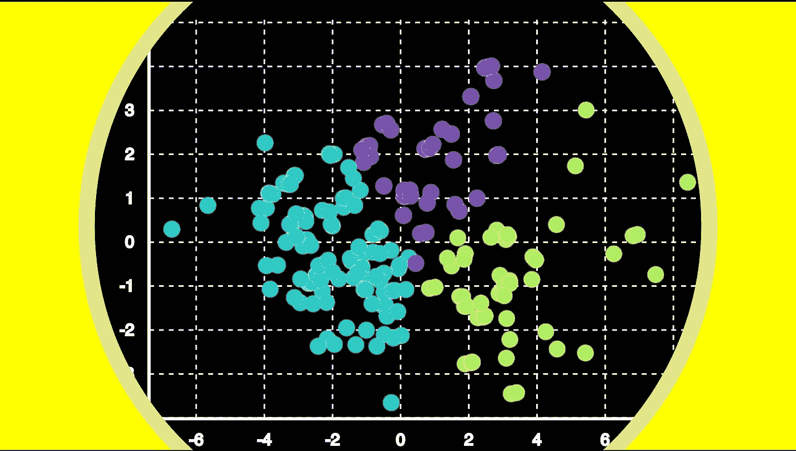
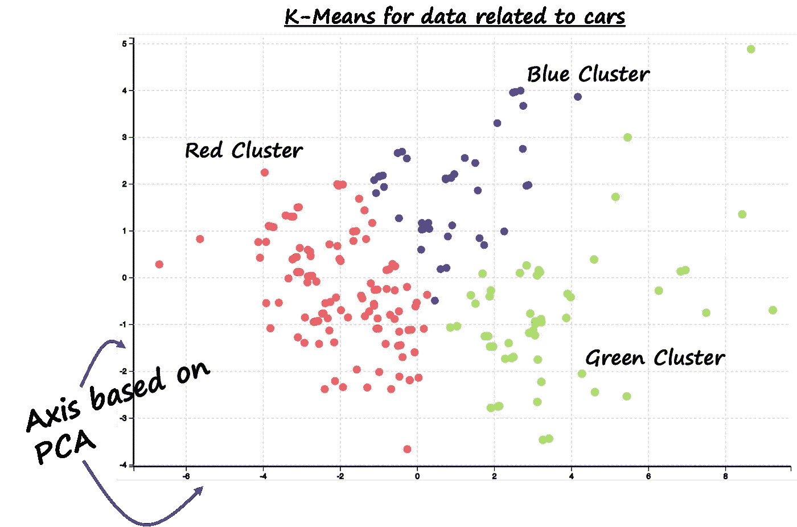
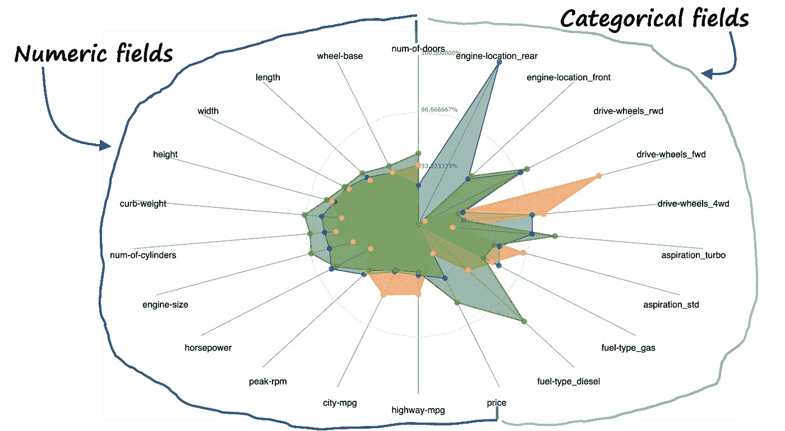
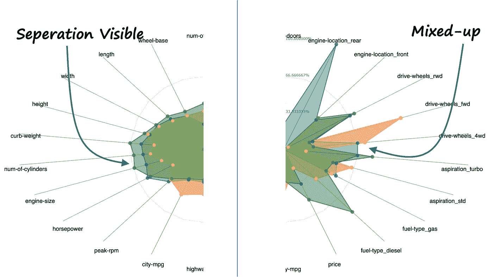
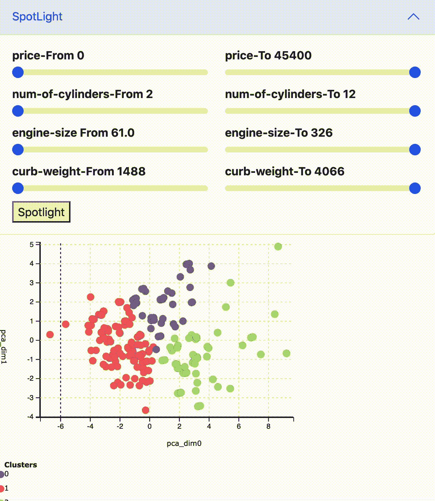
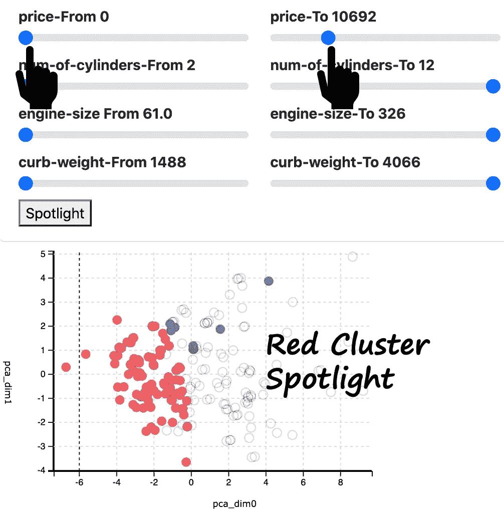
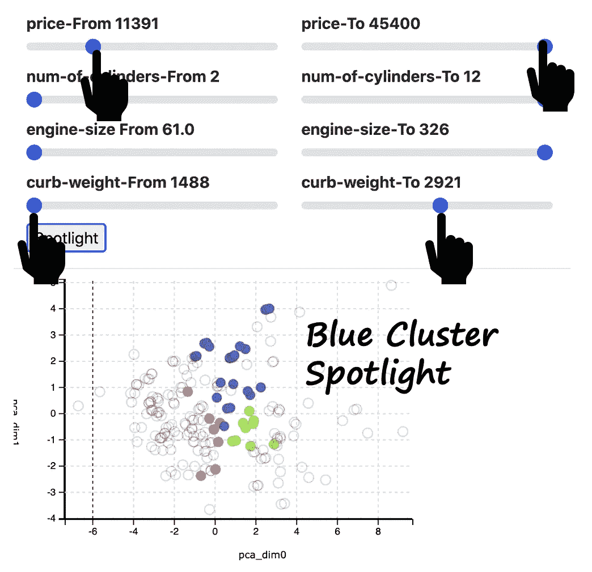
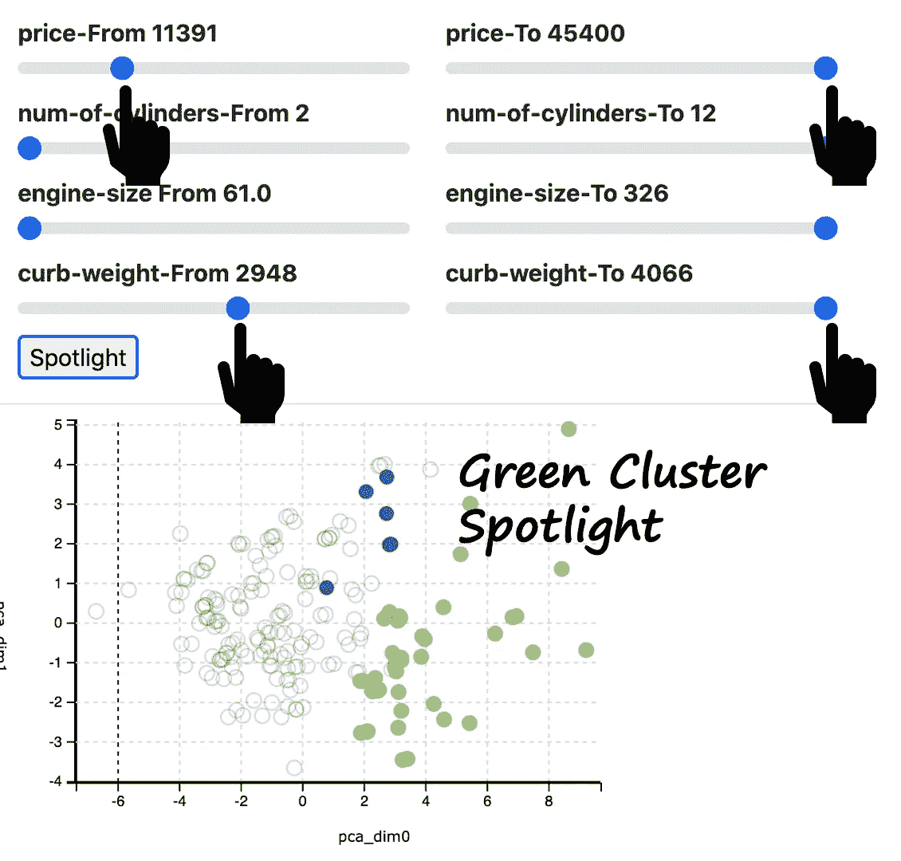

# 聚焦:精确聚类解释的可视化方法

> 原文：<https://towardsdatascience.com/spotlighting-a-visual-approach-to-precisely-interpret-the-clustering-f4c56dba39bb>

## 聚光灯，雷达图，以及如何理解你的集群

聚类解释(图片由作者提供)

理解集群的意义可能比创建集群更重要。形成聚类的过程更加面向数学，然而，解释聚类并不简单。

在这个故事中，您将看到一种解释集群的可视化方法。这里描述的可视化方法使用了两种可视化技术——雷达图和聚光灯。尽管雷达图已广为人知，但聚光灯技术是数据科学家最未充分利用的技术之一。在这里你会看到它是多么强大和视觉上的吸引力。

但是首先，让我们从手头的问题开始——解释集群的问题。

# 这样你就有了漂亮的集群。现在怎么办？

下图显示了数据相关汽车的 K-Means 聚类结果。该数据包含不同品牌的汽车和相关信息，如长度、宽度、马力、价格等。数据集中有超过 25 个字段，因此选择降维 PCA 技术来可视化聚类。

汽车样本数据(图片由作者提供)。

K-Means 聚类结果(图片由作者提供)

好消息是，集群结构良好，在上图中非常明显。不太好的消息是，理解集群意味着什么的真正工作还没有完成。

# 快速浏览可能的集群解释方法

我们可以使用多种算法方法来解释聚类。你可以参考我的文章[这里](/interpreting-clusters-29975099eea1)关于不同的算法方法，如 PCA 特征向量分析或使用机器学习来解释集群。

然而，这些算法方法很有趣，引入了额外的复杂性。所以让我们来看一个解决这个问题的视觉方法。

# 让我们把星团带上我们的雷达！

现在让我们用雷达图显示我们的星团！但首先，你可能会问，为什么是雷达图？为了回答你的沸腾的问题，让我陈述两个事实。

聚类分析实际上意味着根据数据的维度来定义聚类。由于数据中有多个维度，

> 聚类解释是一个“多维”分析问题

现在谈第二个事实。

> 雷达图是一种“多维”可视化技术

雷达图比散点图、条形图等更酷..，因为它们有助于多维可视化数据。因此，这是一个完美的技术，为集群解释问题。

这是基于聚类输出的雷达图。这些组的颜色与聚类相对应——红色、绿色和蓝色。

聚类数据雷达图(图片由作者提供)

哇！多维可视化看起来比二维散点图好得多。雷达图的左侧是数据中的数字字段。右边是分类字段。

现在，让我们进一步分析红色、绿色和蓝色组之间的差异，如下图所示。

分析雷达图组(图片由作者提供)

您将会看到，位于左侧的数字字段在红色、绿色和蓝色区域之间有一条清晰的分界线。但是，右侧的分类字段没有清晰的分隔，看起来有些混乱。这意味着数值字段是解释聚类的良好候选。

我们看到红色集群的高度、重量、气缸数、发动机尺寸和价格都很低。蓝色聚类在这些字段中具有中等值，绿色聚类具有高值。我们可以将这一观察转化为以下陈述

*   红色集群是一个小型汽车集群
*   蓝色集群是一个中型汽车集群
*   绿色集群是大型汽车集群

厉害！这已经是一个突破，因为它给了我们所寻找的东西——每个集群的意义。

现在让我们用聚光灯技术把群集解释带到下一个层次。

# 聚焦集群！

到目前为止，我们有一个与每个集群相关的含义，如红色集群是一个小型汽车。但是，我们不知道将汽车归类为小型汽车的数值字段的级别。例如，什么是价格值或引擎大小，这将意味着一个小汽车？

让我们用聚光灯技术来回答这个问题。

> 聚光灯是一种突出某些数据而不隐藏其他数据的方式。

正如我前面提到的，聚光灯是数据科学家最有效、但最未被充分利用的可视化技术之一。

为了演示这种技术，我们将使用之前展示的散点图。然后，我们将选择一个数字字段，改变它的值来查看，然后聚焦哪些点会被聚焦。下图是展示聚光灯技术的动画视觉效果。

聚光灯(作者图片)

您将观察到，在价格 0 到大约 11000 之间，红色的聚类被突出显示，而其他聚类变为无色。然而，它们并没有消失。这叫做聚光灯。它比过滤功能强大得多，因为所有数据点仍在可视化中。

这里是聚光灯的结果，显示为图像。

**聚焦红色星团**

红色集群聚光灯(图像由。作者)

**聚焦蓝色星团**

蓝色集群的聚光灯(图片由作者提供)

**聚焦绿色星团**

绿色集群聚光灯(图片由作者提供)

您将观察到，即使有轻微的重叠，聚光灯也有助于确定数值字段的阈值。

我们可以得出以下结论:

*   红色聚类是小型汽车聚类，是所有价格低于大约 11000 英镑的汽车
*   蓝色聚类是一个中型汽车聚类，是所有 11000 以上的汽车，以及重量小于 3000 的汽车
*   绿色集群，这是一个大型汽车集群，所有汽车超过 11000，以及重量超过 3000

这真是难以置信！我们现在有了集群的精确定义！让我们给它起个名字——**精准集群解读！**您在任何地方都不会看到这个术语，但在这里您第一次看到了它！恭喜你！

## 数据源引用

数据来自 https://archive.ics.uci.edu/ml/datasets/automobile。

Dua d .和 Graff c .(2019 年)。UCI 机器学习知识库[http://archive . ics . UCI . edu/ml]。加州欧文:加州大学信息与计算机科学学院。

# 现在轮到你了！

你可以访问我的网站进行聚类解释以及其他没有编码的分析。【https://experiencedatascience.com 

这是我的 Youtube 频道的一步一步的教程。您将能够使用零编码为您的数据定制演示

请**订阅**,以便在我发布新故事时随时获得通知。

<https://pranay-dave9.medium.com/subscribe>  

你也可以通过我的推荐链接**加入 Medium** 。谢谢你。

<https://pranay-dave9.medium.com/membership> 