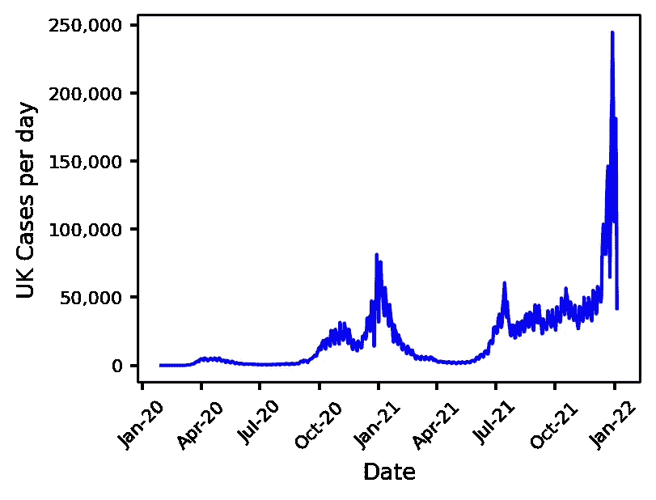
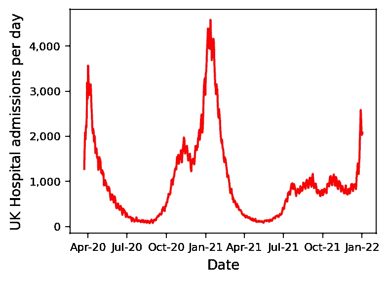
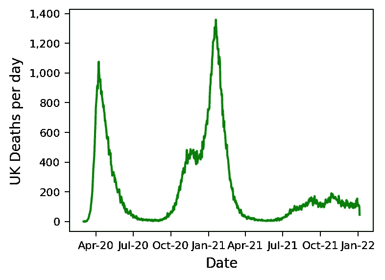
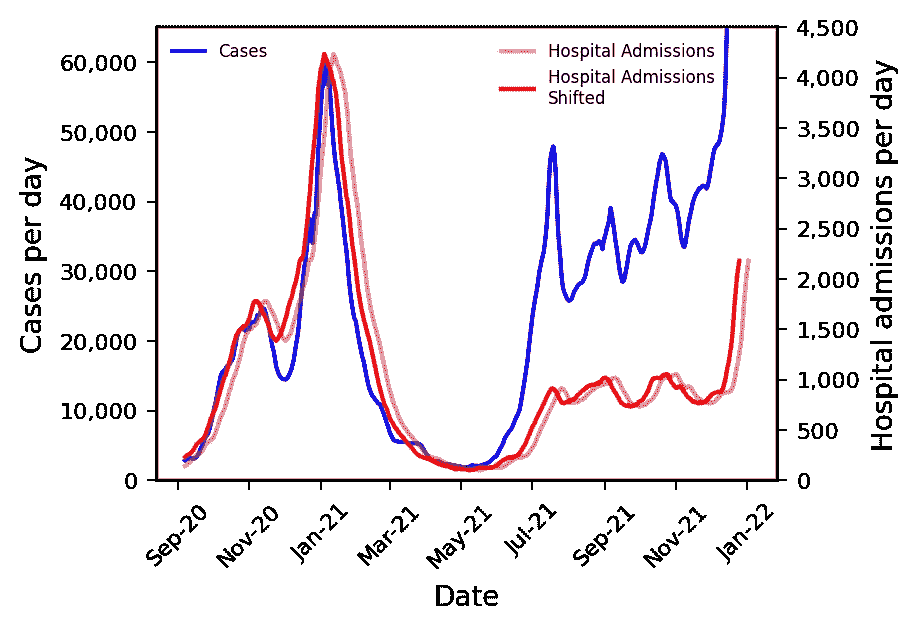
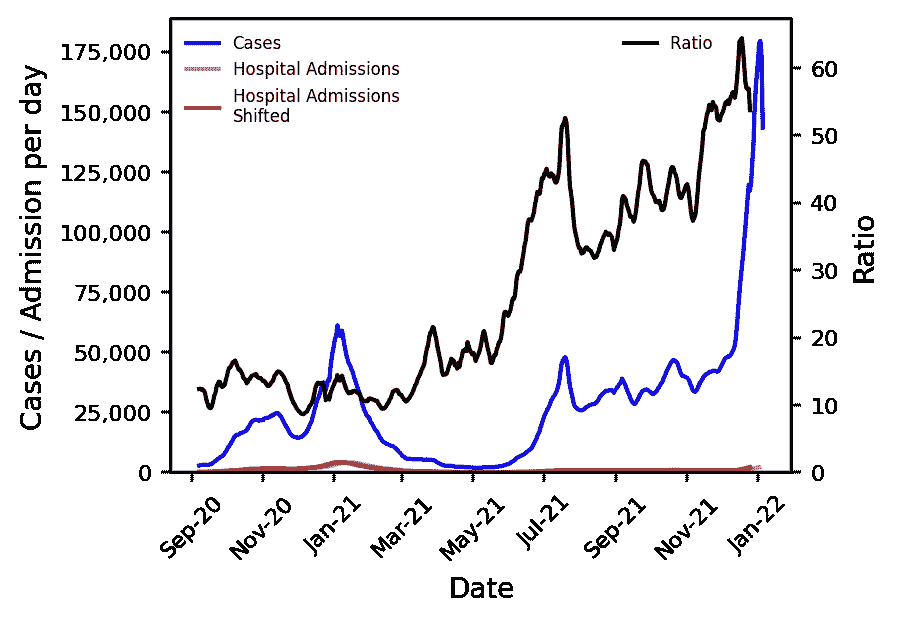
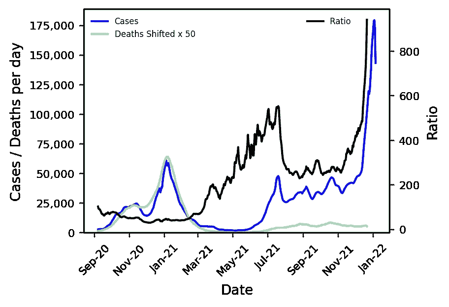

# 电子表格到 Python:使用代码轻松监控 Covid

> 原文：<https://towardsdatascience.com/spreadsheets-to-python-monitoring-covid-made-easy-using-code-ab29730f2023>

## [电子表格到 Python](https://towardsdatascience.com/tagged/spreadsheets-to-python)

# 电子表格到 Python:使用代码轻松监控 Covid

## *探索 Python 数据分析的诸多乐趣和好处*


马丁·桑切斯在 [Unsplash](https://unsplash.com?utm_source=medium&utm_medium=referral) 上的照片

互联网上的大量可用数据给了我们一个前所未有的机会来探索不同现象和事件背后的潜在数字。通常这些数据会随着时间的推移而更新，我们希望通过更新我们的分析来利用这一点。对我来说，从电子表格到代码的最重要的原因之一是这个过程变得非常容易。

几个月前，我写了一篇[博客文章](https://blog.filament.so/riding-the-third-wave-e5eca4696a50)，研究英国“第三波”Covid 的开始。为了这篇文章，我写了代码从英国政府网站上读入数据。我现在对现在占主导地位的 Omicron 变种如何影响病例数感兴趣；好消息是，为了找到答案，重用我编写的代码真的很容易。

我在 [Filament](https://www.filament.so/) 中写这篇博客，这是一个基于云的 Python 平台，它允许我在任何我感兴趣的时候从我的手机或电脑上轻松地重新运行代码。在这一点上我应该说我是灯丝的 CSO。当然，同样的代码也可以在其他 Python 平台上运行。

# 英国的 Covid 案例

最近，英国的 Covid 病例数量大幅增加；让我们看看它与前几波相比如何。为此，我将使用两个库，Pandas 用于存储数据，Matplotlib 用于绘制数据，所以首先我导入我需要的库。为了避免打断正文，在这篇文章中，所有的代码都放在最后。我鼓励读者自己复制并运行这段代码；或者， [Filament](https://www.filament.so/) 的用户可以启动一个包含一系列博客文章代码的工作空间，包括本系列中的文章。

然后，我导入一个包含每天病例数的 csv 文件。我选择使用一个按照样本采集日期组织的 csv，因为我认为这对于我以后的计算会更准确。这意味着过去几天的数据是不完整的。另一个选择是下载一个按结果报告日期组织的文件。这是最新的，但可能会影响住院率的计算。

一旦文件被导入，就很容易生成一个显示每天病例数的图表。我们可以看到在过去的几个星期里案件的大幅上升！



作者图片

在下一张图中，我下载了每天的住院人数。我们预计这些案例会有一点滞后(我们稍后将对此进行更多的探讨)，但即使如此，我们也可以看到最终的大幅增长。



作者图片

最后，死亡。有许多不同的死亡衡量标准；该图显示阳性检测 28 天内的死亡；死亡不一定来自 Covid。很容易将代码改为读取其他度量之一。



作者图片

这些数据本身就很有趣，但更重要的是，现在只要我想，重新运行代码和更新图表真的很容易:我只需再次点击 run！如果我每天手动下载电子表格，这将会困难得多。

# 住院率

现在让我们用这些数据做一些简单的计算。我要做的第一件事是查看病例与住院人数的比率，看看这一比率是如何随着时间的推移而变化的。我将错过 2020 年春天的第一波 Covid 波，因为测试是有限的，很可能会错过很多病例。相反，我将从 2020 年 9 月 1 日开始。在计算比率之前，我需要做的第一件事是对齐两组数据:结果是住院高峰在病例高峰之后 8 天。这意味着，平均而言，去医院的人是在阳性检测后 8 天去的。我通过将入院时间推迟 8 天来说明这一点。为了让事情更容易查看，我用 7 天滚动平均值平滑了数据。



作者图片

现在我们来看看病例与入院的比例。下图显示了这一点(在右手轴上)。2020 年末，英国感染新冠肺炎的人中，约有 1/15 的人去了医院；到 2021 年年中，随着疫苗接种的生效，这一比例可能会提高到 40 分之一。现在这个比例似乎又在提高了；然而，现在确定还为时过早，数据可能受到圣诞节期间报告延迟的影响。我会继续关注事态的发展。



作者图片

最后，让我们看看死亡率，下图中，我将死亡率移动了 15 天，与病例重叠；我还将它们放大了 50 倍，这样病例和死亡就可以在同一个轴上查看。大约一年前，每 50 个病例中有一个死亡，这种情况迅速改善，然后稳定在每 250 个病例中有一个左右，2021 年 7 月左右的非常高的比率可能是 2020 年欧洲足球锦标赛的结果，在此期间，我预计大量病例出现在年轻人中，他们不太可能患重病。看起来，最近病例的增加似乎与死亡人数的增加无关，如果持续下去，这将是一个好消息，但也可能是这种转变的产物:在得出确切结论之前，需要更多的数据。



作者图片

# 结论

我们已经看到了如何使用 Python 来可视化和分析从互联网上获得的数据。不幸的是，在这些数据可用于得出关于 Covid 的 Omicron 变体的可靠结论之前，需要多一点时间:新一波病例太新，由于圣诞节和新年期间的干扰，可用数据可能还不是最新的。

然而，使用代码的伟大之处在于，我现在可以每隔几天简单地通过按下一个“运行”按钮来重新运行分析。这是在 Python 中执行这种分析的巨大优势。分析也是可适应的，我可以改变平均的数量，不同数据组之间的转换，甚至通过改变一两行并再次运行代码来改变所使用的数据组。

上述分析中的一个主要假设是，在当前(第四波)和第二波中，病例和住院(或死亡)之间的时间延迟是相同的。这是一个很难证明的假设——大多数人没有接种疫苗，奥米克隆似乎是一种非常不同的病毒。如果情况稳定下来，这就不重要了；虽然它们上升很快，但微小的偏差可能会对计算出的比率产生很大影响。这是未来需要继续调整的地方，通过代码也可以使之变得更容易。

我希望这个简单的例子再次展示了在 Python 中执行数据分析和可视化的价值。

*这篇文章的文本、代码和图像是使用* [*灯丝*](http://www.filament.so/) *创建的，这是一个用于数据、分析和报告的一体化工作空间。如需了解更多信息，请访问我们的网站*<http://www.filament.so/>**。Filament 目前正在运行一个封闭的测试程序；前 100 名使用推荐代码 TDSFILAMENT 请求访问的人可以跳过等候名单，提前获得访问权限。这个博客和其他博客的所有代码对所有 Filament 用户都是可用的。**

# *保持联系*

*   *在[媒体](https://clivesiviour.medium.com/)上关注我，了解更多类似的故事*
*   *在 [LinkedIn](https://www.linkedin.com/in/clive-siviour/) 上连接*

## *笔记*

*[1]参见此处的合理使用政策:[https://coronavirus.data.gov.uk/details/download](https://coronavirus.data.gov.uk/details/download)*

```
*#%% Code to import and plot UK Covid Dataimport matplotlib.pyplot as plt
import matplotlib.ticker as tkr
from matplotlib.dates import DateFormatter
import pandas as pd#%% Read case data into a DataFramecovid_cases=pd.read_csv('[https://coronavirus.data.gov.uk/api/v1/data?filters=areaType=overview&structure=%7B%22areaType%22:%22areaType%22,%22areaName%22:%22areaName%22,%22areaCode%22:%22areaCode%22,%22date%22:%22date%22,%22newCasesBySpecimenDate%22:%22newCasesBySpecimenDate%22,%22cumCasesBySpecimenDate%22:%22cumCasesBySpecimenDate%22%7D&format=csv'](https://coronavirus.data.gov.uk/api/v1/data?filters=areaType=overview&structure=%7B%22areaType%22:%22areaType%22,%22areaName%22:%22areaName%22,%22areaCode%22:%22areaCode%22,%22date%22:%22date%22,%22newCasesBySpecimenDate%22:%22newCasesBySpecimenDate%22,%22cumCasesBySpecimenDate%22:%22cumCasesBySpecimenDate%22%7D&format=csv'))# Change date formats in the DataFrame, and reorder so that the most recent data are lastcovid_cases['date']=pd.to_datetime(covid_cases['date'])
covid_cases=covid_cases[::-1]
covid_cases.reset_index(drop=True, inplace=True)#%% Plotfig, ax1 = plt.subplots(figsize = [4,3], dpi=200)ax1.plot(covid_cases['date'], 
         covid_cases['newCasesBySpecimenDate'], 
         label='Full data', 
         color='b'
         )# Format the axesax1.tick_params(axis='both', which='major', labelsize=8)ax1.set_xlabel('Date', fontsize=10)
ax1.set_ylabel('UK Cases per day', fontsize=10)ax1.set_xticks(ax1.get_xticks())
ax1.set_xticklabels(ax1.get_xticklabels(), rotation=45, ha='center')# this code adds a comma at the thousand separator on the y-axis
ax1.get_yaxis().set_major_formatter(
    tkr.FuncFormatter(lambda x, p: format(int(x), ',')))# these two lines are used to set the date format to MMM-YY
date_form = DateFormatter("%b-%y")       
ax1.xaxis.set_major_formatter(date_form) 
#%% Read hospital admission data into a new DataFrame

covid_hospital=pd.read_csv('https://coronavirus.data.gov.uk/api/v1/data?filters=areaType=overview&structure=%7B%22areaType%22:%22areaType%22,%22areaName%22:%22areaName%22,%22areaCode%22:%22areaCode%22,%22date%22:%22date%22,%22newAdmissions%22:%22newAdmissions%22,%22cumAdmissions%22:%22cumAdmissions%22%7D&format=csv')

covid_hospital['date']=pd.to_datetime(covid_hospital['date'])
covid_hospital=covid_hospital[::-1]
covid_hospital.reset_index(drop=True, inplace=True) #%% Plot

fig, ax2 = plt.subplots(figsize=[4,3] ,dpi=200)

ax2.plot(covid_hospital['date'], 
         covid_hospital['newAdmissions'], 
         label='Full data', 
         color='r'
         )

# Format the axes

ax2.tick_params(axis='both', which='major', labelsize=8)

ax2.set_xlabel('Date', fontsize=10)
ax2.set_ylabel('UK Hospital admissions per day', fontsize=10)

ax2.get_yaxis().set_major_formatter(
    tkr.FuncFormatter(lambda x, p: format(int(x), ','))) 

ax2.xaxis.set_major_formatter(date_form) #%% Read death data into a new DataFrame

covid_deaths=pd.read_csv('https://coronavirus.data.gov.uk/api/v1/data?filters=areaType=overview&structure=%7B%22areaType%22:%22areaType%22,%22areaName%22:%22areaName%22,%22areaCode%22:%22areaCode%22,%22date%22:%22date%22,%22newDeaths28DaysByDeathDate%22:%22newDeaths28DaysByDeathDate%22,%22cumDeaths28DaysByDeathDate%22:%22cumDeaths28DaysByDeathDate%22%7D&format=csv')

covid_deaths['date']=pd.to_datetime(covid_deaths['date'])
covid_deaths=covid_deaths[::-1]
covid_deaths.reset_index(drop=True, inplace=True) #%% Plot

fig, ax3 = plt.subplots(figsize=[4,3] ,dpi=200)

ax3.plot(covid_deaths['date'], 
         covid_deaths['newDeaths28DaysByDeathDate'], 
         label='Full data', 
         color='g'
         )

# Format the axes

ax3.tick_params(axis='both', which='major', labelsize=8)

ax3.set_xlabel('Date', fontsize=10)
ax3.set_ylabel('UK Deaths per day', fontsize=10)

ax3.get_yaxis().set_major_formatter(
    tkr.FuncFormatter(lambda x, p: format(int(x), ','))) 

ax3.xaxis.set_major_formatter(date_form) #%% Compare cases and hospital admissions, align admissions

# Choose shift and averaging period

shift_1 = 8 # number of days to shift admissions data to compare to case data
av_period = 7 # days over which to average

# In order to align the two datasets, I find the index of the date I want to start plotting from
start_1=covid_cases[covid_cases['date']=='2020-09-01'].index[0]
start_2=covid_hospital[covid_hospital['date']=='2020-09-01'].index[0] 

# Create figure and axes

fig, ax4 = plt.subplots(figsize=[4,3] ,dpi=200)
ax4_2=ax4.twinx() # allows me to plot the data using two y-axes

# Now draw the plots

ax4.plot(covid_cases['date'][start_1:-shift_1], 
        covid_cases['newCasesBySpecimenDate'][start_1:-shift_1].rolling(av_period).mean(),
        label='Cases', 
        color='b'
        )

ax4_2.plot(covid_hospital['date'][start_2:],
          covid_hospital['newAdmissions'][start_2:].rolling(av_period).mean(), 
          label='Hospital Admissions         ', 
          color=(1,0,0,0.5)
          )

ax4_2.plot(covid_hospital['date'][start_2:-shift_1],
          covid_hospital['newAdmissions'][start_2+shift_1:].rolling(av_period).mean(), 
          label='Hospital Admissions         \nShifted', 
          color='r'
          )

# Format the axes

ax4.legend(fontsize=6, frameon=False, loc='upper left' )
ax4_2.legend(fontsize=6, frameon=False, loc='upper right' )

#ax4_2.legend(fontsize=6, facecolor='white', edgecolor='white',framealpha=1, loc='upper right')

ax4.tick_params(axis='both', which='major', labelsize=8)
ax4_2.tick_params(axis='both', which='major', labelsize=8)

ax4.set_xlabel('Date', fontsize=10)
ax4.set_ylabel('Cases per day', fontsize=10)
ax4_2.set_ylabel('Hospital admissions per day', fontsize=10)        

ax4.set_ylim([0,65000])
ax4_2.set_ylim([0,4500])

ax4.get_yaxis().set_major_formatter(
    tkr.FuncFormatter(lambda x, p: format(int(x), ','))) 

ax4_2.get_yaxis().set_major_formatter(
    tkr.FuncFormatter(lambda x, p: format(int(x), ','))) 

ax4.set_xticks(ax4.get_xticks())
ax4.set_xticklabels(ax4.get_xticklabels(), rotation=45, ha='center')

ax4.xaxis.set_major_formatter(date_form) #%% Plot hospitalisation ratios

# create a DataFrame with the required data

hospitalisation_rate=pd.DataFrame({'Date':covid_cases['date'][start_1:]})

hospitalisation_rate['Cases']=covid_cases['newCasesBySpecimenDate'][start_1:]
hospitalisation_rate.reset_index(drop=True, inplace=True)

temp=pd.DataFrame({'Admissions': covid_hospital['newAdmissions'][start_2:]})
temp.reset_index(drop=True, inplace=True)

hospitalisation_rate['Admissions']=temp

temp=pd.DataFrame({'Admissions_shifted': covid_hospital['newAdmissions'][start_2+shift_1:]})
temp.reset_index(drop=True, inplace=True)

hospitalisation_rate['Admissions_shifted']=temp

del temp

hospitalisation_rate['Ratio']=hospitalisation_rate['Cases'].rolling(7).mean()/hospitalisation_rate['Admissions_shifted'].rolling(7).mean() #%% Plot

fig, ax5 = plt.subplots(figsize=[4,3] ,dpi=200)

ax5.plot(hospitalisation_rate['Date'], 
         hospitalisation_rate['Cases'].rolling(7).mean(), 
         label='Cases',
         color='b'
         )

ax5.plot(hospitalisation_rate['Date'], 
         hospitalisation_rate['Admissions'].rolling(7).mean(), 
         label='Hospital Admissions',
         color=(1,0,0,0.5)
         )

ax5.plot(hospitalisation_rate['Date'], 
         hospitalisation_rate['Admissions_shifted'].rolling(7).mean(),
         label='Hospital Admissions \nShifted',
         color='r'
         )

ax5_2 = ax5.twinx()

ax5_2.plot(hospitalisation_rate['Date'], 
           hospitalisation_rate['Ratio'], 
           label='Ratio            ',
           color='k'
           )

ax5.legend(fontsize=6, frameon=False, loc='upper left' )
ax5_2.legend(fontsize=6, frameon=False, loc='upper right')

ax5.tick_params(axis='both', which='major', labelsize=8)
ax5_2.tick_params(axis='both', which='major', labelsize=8)

ax5.set_xlabel('Date', fontsize=10)
ax5.set_ylabel('Cases / Admission per day', fontsize=10)
ax5_2.set_ylabel('Ratio', fontsize=10)    

ax5.get_yaxis().set_major_formatter(
    tkr.FuncFormatter(lambda x, p: format(int(x), ','))) 

ax5_2.get_yaxis().set_major_formatter(
    tkr.FuncFormatter(lambda x, p: format(int(x), ','))) 

ax5.set_xticks(ax5.get_xticks())
ax5.set_xticklabels(ax5.get_xticklabels(), rotation=45, ha='center')

ax5.xaxis.set_major_formatter(date_form)

ax5.set_ylim(bottom=0)
ax5_2.set_ylim(bottom=0)#%% Plot death ratios

# create a DataFrame with the required data

start_3=covid_deaths[covid_deaths['date']=='2020-09-01'].index[0]
shift_2=15

temp=pd.DataFrame({'Deaths_shifted': covid_deaths['newDeaths28DaysByDeathDate'][start_3+shift_2:]})
temp.reset_index(drop=True, inplace=True)

hospitalisation_rate['Deaths_shifted']=temp

del temp

hospitalisation_rate['Deaths_Ratio']=hospitalisation_rate['Cases'].rolling(7).mean()/hospitalisation_rate['Deaths_shifted'].rolling(7).mean()

#%% Plot

fig, ax6 = plt.subplots(figsize=[4,3] ,dpi=200)

ax6.plot(hospitalisation_rate['Date'], 
         hospitalisation_rate['Cases'].rolling(7).mean(), 
         label='Cases',
         color='b'
         )

ax6.plot(hospitalisation_rate['Date'], 
         hospitalisation_rate['Deaths_shifted'].rolling(7).mean()*50, 
         label='Deaths Shifted x 50',
         color='lightgreen'
         )

ax6_2 = ax6.twinx()

ax6_2.plot(hospitalisation_rate['Date'], 
           hospitalisation_rate['Deaths_Ratio'], 
           label='Ratio            ',
           color='k'
           )

ax6.legend(fontsize=6, frameon=False, loc='upper left' )
ax6_2.legend(fontsize=6, frameon=False, loc='upper right')

ax6.tick_params(axis='both', which='major', labelsize=8)
ax6_2.tick_params(axis='both', which='major', labelsize=8)

ax6.set_xlabel('Date', fontsize=10)
ax6.set_ylabel('Cases / Deaths per day', fontsize=10)
ax6_2.set_ylabel('Ratio', fontsize=10)    

ax6.get_yaxis().set_major_formatter(
    tkr.FuncFormatter(lambda x, p: format(int(x), ','))) 

ax6_2.get_yaxis().set_major_formatter(
    tkr.FuncFormatter(lambda x, p: format(int(x), ','))) 

ax6.set_xticks(ax6.get_xticks())
ax6.set_xticklabels(ax6.get_xticklabels(), rotation=45, ha='center')

ax6.xaxis.set_major_formatter(date_form)

ax6.set_ylim(bottom=0)*
```