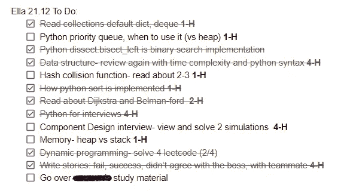

# 为忙碌的受访者制定冲刺计划

> 原文：<https://towardsdatascience.com/sprint-plan-for-the-busy-interviewee-16fd0893623d>

# 为忙碌的受访者制定冲刺计划

## 你可以根据面试过程调整冲刺计划的蓝图

当开始为科技行业面试时，一些工程师倾向于开始[磨 leetcode](https://medium.com/r?url=https%3A%2F%2Ftowardsdatascience.com%2Ftechnical-preparation-for-the-busy-interviewee-9082830550e5) 和发送简历，但有组织性和彻底性帮助我实现了我的目标，没有迷路或与错误的公司签约。

每一次冲刺，我都提出了清晰的目标，让你离面试更近一步，以及不同类别的任务，比如简历、学习或计划面试顺序。

## 如何根据自己的需要调整这个计划

仔细检查每个 sprint 的描述和评估——你需要这个 sprint 吗？你需要多长时间来完成冲刺目标？

考虑你目前的准备程度、空闲时间和截止日期，为每一次冲刺设定一个开始和结束的日期。

## 冲刺开始时

决定你将做什么任务来完成目标，我建议一些想法，但你可能想改变它们来适应你的策略-你可以在下面的评论中分享你做了什么任务。

## 到了**年底，各**冲刺:

*   上一部的回顾展-什么是好的？你能改进什么？
    你还需要一周的时间来实现冲刺的目标吗？
    你是否过度劳累？也许你已经准备好安排一些面试了？
*   计划接下来的冲刺——冲刺目标，每日目标。

## 冲刺 A -抖落灰尘

> 这个冲刺的目标是-
> -为你即将开始的旅程获得动力。为求职/学习过程设定目标。

为了完成这些目标，您可以将任务设置为-

*   面试策划:想好自己感兴趣的公司，按照优先顺序分三组。
*   面试计划:建立一个路线图，考虑你准备的时间限制，每周投入多少时间。
*   动机:研究一个你感兴趣的主题——比如[堆如何工作](https://www.youtube.com/watch?v=t0Cq6tVNRBA)，或者[排序算法的视觉比较](https://www.youtube.com/watch?v=ZZuD6iUe3Pc)。
*   动机:寻找即将开始面试的朋友或网上团体。
*   面试策略:收集学习材料——例如，拿一本 CTCI 的书。
*   研究:进行为期两周的数据结构计划，推动你每天解决两个简单的问题。
*   简历:开始写吧；你可以使用这些[资源](https://www.ladybug.dev/episodes/resumes)。

杰森·库德里特在 [Unsplash](https://unsplash.com/s/photos/graph?utm_source=unsplash&utm_medium=referral&utm_content=creditCopyText) 上拍摄的照片。

## 冲刺 B -基础

> 这个冲刺的目标是-
> -学习数据结构和系统设计术语的基础。
> -练习简单水平题。

如果你是第一次学习数据结构，这个冲刺可能需要更长的时间。另一方面，有经验的工程师可能会跳过这一条。

*   面试战术:伟大的 CTCI 第三章:面试前，和面试流程图。
*   花 20 分钟学习每个数据结构——数组、链表、树、图、栈、队列和哈希表。
*   学习与每个数据结构相关的技巧或模式。
    例如，快速&慢速指针用于检测链表中的循环或堆，在不排序整个列表的情况下找到前 K 个元素是很棒的。
*   用你最喜欢的编程语言编写标准算法的实现——排序、树遍历、二分搜索法。
*   做顶级面试题- [我从《易级集》开始](https://medium.com/p/9082830550e5)。
*   系统设计:获取一些关于这些面试的一般信息。
*   系统设计:熟悉负载平衡器、队列、发布/订阅等术语。
*   简历:写完它，到你觉得可以寄出去的程度。
*   面试计划:向几家公司申请，持续发送直到他们联系你，为下一次冲刺安排面试。

我发现仅仅为了学习而学习很难，所以仅仅阅读数据结构是乏味的，而且我做得不好。然而，因为我不记得 heaps 的存在而差点面试失败是一个很好的动机；如果你和我一样，可以去看看 sprint C。

## 冲刺 C -大研究

> 目标是-
> -学习 [80%](https://asana.com/resources/pareto-principle-80-20-rule) 的技术材料。你不必面面俱到。
> -学习面试元技能
> -了解你的强项和需要改进的地方。

**大部分学习都发生在这个冲刺阶段，**所以这也是开始在现实世界中测试自己的绝佳时机。你可能会通过一些面试，并在这里完成你的路，或者像我一样，获得一些反馈，并在接下来的冲刺中提高。

*   从源头上解决几十个面试问题，这有助于你更好地关注书籍或网站。只要材料与实际采访相似，确切的来源并不重要，你可以将你的解决方案与书中的进行比较。
*   [我高效技术准备的所有战术](/technical-preparation-for-the-busy-interviewee-9082830550e5)。
*   在 CTCI 第 5、6 章或[视频](https://www.youtube.com/watch?v=GBuHSRDGZBY)中学习时间分析和解决问题的技巧。
*   面试策略:准备一个关于你自己的[简短介绍](https://www.youtube.com/watch?v=Oy6S0iTZx54)，以最大化[你的第一印象](https://www.youtube.com/watch?v=5v-wyR5emRw)。
*   进行一次行为或人力资源面试，练习在保持真实性的同时展现你的品质；这里有一些小技巧。
*   面试计划:在这个冲刺阶段做一到两次科技面试；**的目标不是通过面试**，而是了解你的现状以及在下一次冲刺中需要改进的地方。
*   Python:使用[集合](https://docs.python.org/3/library/collections.html)和[平分](https://docs.python.org/3/library/bisect.html)模块。为什么德雀比列表好？
*   练习递归，你应该能熟练地用迭代和递归方法编写通用算法。
*   实践贪婪的方法。
*   解决一些用矩阵或岛表示的图形问题。

由[劳拉·卡弗](https://unsplash.com/@kapfii?utm_source=unsplash&utm_medium=referral&utm_content=creditCopyText)在 [Unsplash](https://unsplash.com/s/photos/books?utm_source=unsplash&utm_medium=referral&utm_content=creditCopyText) 拍摄的照片。

## 冲刺 D -微调

> 目标是-
> -根据 sprint C 的反馈进行改进。
> -提高面试技巧。

一旦你从 sprint C 中获得了一些经验，就该完成深入的材料，并对你收到的反馈进行处理了。
如果你的目标不是 [FAANG](https://en.wikipedia.org/wiki/Big_Tech) 公司，我建议把 sprints D+E 合并成最后一个。

*   简历:准备关于质量和技术项目的故事——最好是星形的。
*   采访策划:这是[筛选采访](https://eddy.com/hr-encyclopedia/screening-interview/#:~:text=A%20screening%20interview%20is%20a,minimum%20education%20and%20experience%20requirements.)的绝佳时机；他们通常测试你已经学过的经典科目。
*   面试战术:做[点](https://www.youtube.com/watch?v=vHKzIPwWQkg) [嘲讽](https://www.youtube.com/watch?v=4tYoVx0QoN0)；你可以和朋友一起练习或者自己做——大声解释的同时解决问题，遵守时间限制，不要偷看语法。记得做时间分析和测试。
*   面试策略:阅读你感兴趣的公司，他们的面试过程，以及公司价值观。
*   设计面试:解决一些架构问题。你可以在 YouTube 或者[这门课](https://www.educative.io/courses/grokking-the-system-design-interview)中找到它们。

进一步学习任务的想法-

*   链表和双向链表——编写你的实现。
*   快速回顾一下图遍历算法，Dijkstra，bellman-ford。
*   练习回溯和动态编程；关注初级水平的问题，因为复杂的动态编程问题很少。
*   知道编写和使用一种排序算法-合并或快速排序。可以使用标签在 LeetCode 中查找相关问题。

请记住，完全准备好是不切实际的期望。我决定不投资某些科目(如比特和字节),因为这不常见——感谢 [Miri Yehezkel](https://medium.com/u/f42f02c247a3?source=post_page-----16fd0893623d--------------------------------) 提醒我这一点。

我只是在 sprint D 开始思考我梦想中的公司，并针对他们的问题调整我的学习计划，但你已经在正确的方向上设定了你的道路。

我的待办事项围绕冲刺 D，照片由我。

## 冲刺电子杀死它

> 目标是在面试时保持最佳状态。

到现在为止，你已经学习、练习和模仿了，所以前一天晚上好好睡一觉，不要因为学习而疲惫不堪。

面试当天，试着用兴奋代替焦虑；毕竟，如果你不兴奋地迈出这段旅程的最后几步，那才是疯了。

什么都不做我会紧张，所以我花时间复习不涉及问题的技术资料，以避免遇到思想问题时惊慌失措。

*   如果你喜欢技术书籍， [Skeina 的](https://www.amazon.com/Algorithm-Design-Manual-Steven-Skiena/dp/1849967202)很棒。
*   复习语法[指南](https://google.github.io/styleguide/pyguide.html)。

# 结论

为了利益最大化，回顾并分析你的道路——它有效吗？你能改进什么吗？不要犹豫，根据你的需要调整建议的计划。

相关岗位- [介绍系统设计面试](https://medium.com/geekculture/introduction-to-system-design-interviews-at-faang-27b39a7b715f)和[为忙碌的面试者做技术准备](/technical-preparation-for-the-busy-interviewee-9082830550e5)。