# SQL 聚合函数面试问题

> 原文：<https://towardsdatascience.com/sql-aggregate-functions-interview-questions-46a631114843>

## 为了下一次数据科学面试，让我们更深入地了解一下必须知道的 SQL 聚合概念。


作者在 [Canva](https://canva.com/) 上创建的图片

今天，我们每秒钟生成数百万、数十亿行数据。然而，我们通常需要一个单一的指标来标记变更并做出业务决策。例如，上一季度的总销售额、平均流失率、广告投放次数等。聚合函数有助于生成这些指标。聚合函数根据一组输入值计算单个结果。所有聚合函数都是确定性的，每次使用相同的输入值集调用它们时，它们都输出相同的值。我们有一篇文章——《SQL 聚合的终极指南<https://www.stratascratch.com/blog/the-ultimate-guide-to-sql-aggregate-functions/?utm_source=blog&utm_medium=click&utm_campaign=medium>*——来获得这些函数的介绍性概述。在本文中，我们将更深入地研究 SQL 聚合函数的使用。我们将在这里讨论的各种场景是:*

*   *整个表上的聚合*
*   *按组群汇总*
*   *窗口函数中的聚合*

*注意:除了 COUNT(*)，所有聚合函数都会忽略空值，除非另有说明。让我们开始吧。*

# *整个表上的聚合*

**

*作者在 [Canva](https://canva.com/) 上创建的图像*

*最简单的用例是从一个数据集中找到总的聚合指标。让我们用 Postmates 数据科学家访谈问题中的一个例子来尝试一下。*

## *问题#1:客户平均订单*

**查找平均订单金额和下订单的客户数量。**

*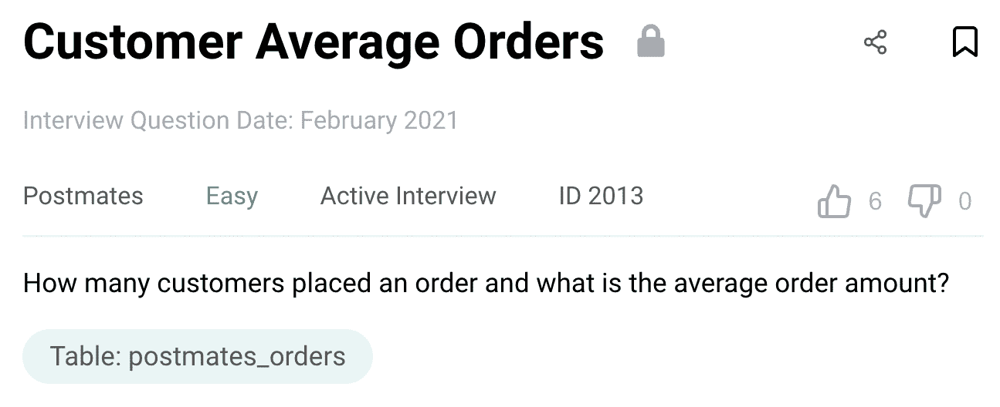*

*此问题使用具有以下字段的 postmates_order 表。*

*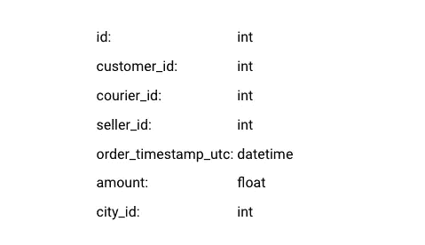*

*数据以下列方式显示。*

***表:** postmates_orders*

*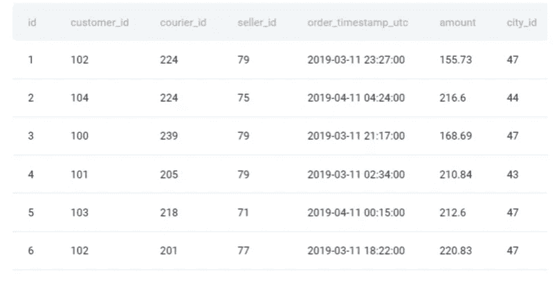*

## *解决办法*

*这个问题很简单。但是有一点小小的变化，我们稍后会讲到。找到平均订单量相当容易。我们只需要使用 AVG()函数。*

```
*SELECT
    AVG(amount) AS avg_order_amount 
FROM postmates_orders
;*
```

*但是，要找到客户的数量，我们需要稍微小心一点。我们不能简单地采用 COUNT(*)或 COUNT(customer_id ),因为存在重复交易的客户。我们需要使用 DISTINCT 关键字来确保我们只计算唯一的。使用下面的查询可以解决这个问题。*

```
*SELECT
    COUNT(DISTINCT customer_id) AS num_customers
    , AVG(amount) AS avg_order_amount 
FROM postmates_orders
;*
```

## *问题 2:出售披萨的 Yelp 商家数量*

**查找出售披萨的 Yelp 商家的数量。**

*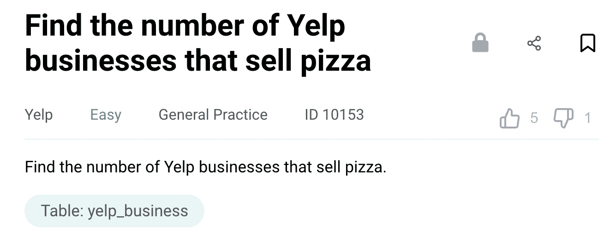*

*该问题使用包含以下字段的 yelp_business 数据集。*

*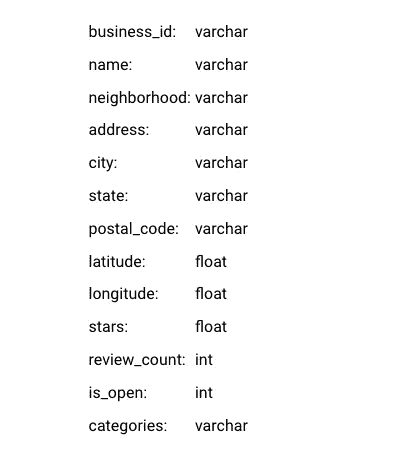*

*数据是这样的。*

***表格:** yelp_business*

*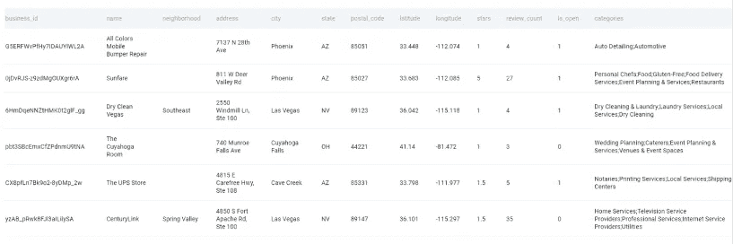*

## *解决办法*

*这是一个非常简单的问题。在解决问题时，我们需要考虑两个部分。*

*   *识别销售比萨饼的企业*
*   *细数相关商家。*

*为了识别销售比萨饼的企业，我们使用 categories 字段并搜索文本是否包含短语“比萨饼”。为了使搜索不区分大小写，我们使用 ILIKE 操作符。*

```
*SELECT business_id, categories
FROM yelp_business
WHERE categories ILIKE '%pizza%'
;*
```

*或者，我们也可以将文本转换成大写或小写，并使用 LIKE 操作符，它在所有 SQL 风格中都可用。*

```
*SELECT business_id, categories
FROM yelp_business
WHERE LOWER(categories) LIKE '%pizza%'
;*
```

*输出如下所示*

*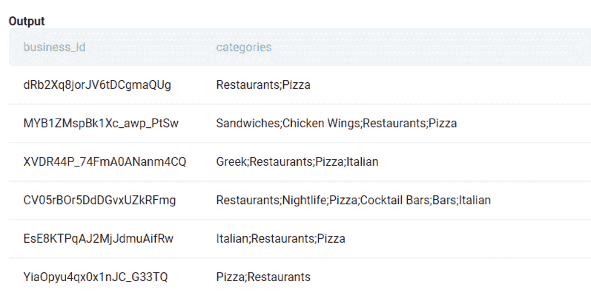*

*现在我们简单地计算唯一的 business_id。同样，我们使用 DISTINCT 关键字来忽略重复项。*

```
*SELECT COUNT(DISTINCT business_id)
FROM yelp_business
WHERE LOWER(categories) LIKE '%pizza%'
;*
```

# *按组群汇总*

**

*作者在 [Canva](https://canva.com/) 上创建的图像*

*聚合的另一个常见用例是按不同的分组进行汇总——相同的产品类别、交易月份、现场访问周等。这些基于群组的分析有助于我们识别子层中的趋势，而这些子层在总体总量中可能是不可见的。我们可以通过使用 GROUP BY 子句来实现这一点。让我们从 ESPN 数据科学采访中的一个简单问题开始。*

## *问题 3:找出第一次参加奥运会的年份*

**根据各国首次参加奥运会的年份对其进行排序。该国可在国家奥林匹克委员会(NOC)领域。按升序报告年份和 NOC。**

*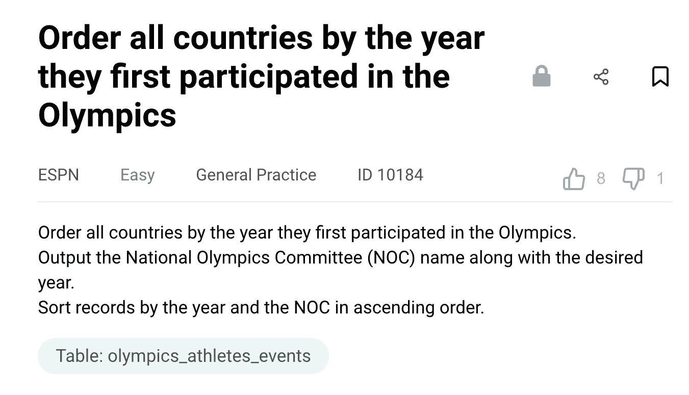*

*该问题使用包含以下字段的 olympics_athletes_events 数据集。*

*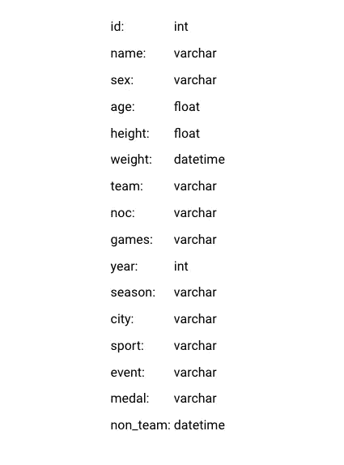*

*数据以下列方式显示。*

***表:**奥运会 _ 运动员 _ 赛事*

*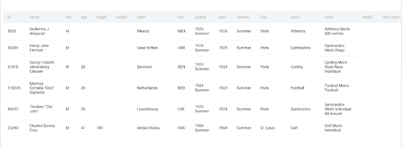*

## *解决办法*

*这是一个相对容易的问题。为了解决这个问题，我们按以下方式进行。*

*   *找出某个国家参加奥运会的最早年份。*
*   *以所需的方式对结果进行排序。*

*与前一个问题不同，我们需要按国家进行汇总。为此，我们使用 GROUP BY 子句。*

```
*SELECT
noc, MIN(year) 
FROM olympics_athletes_events
GROUP BY 1
;*
```

*我们得到以下输出。*

*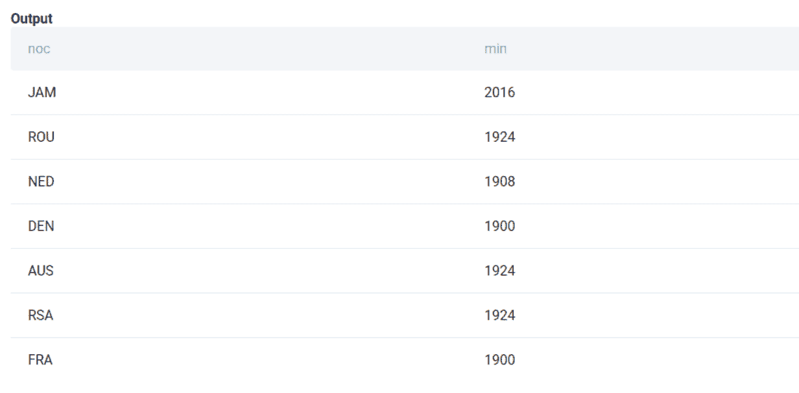*

*我们通过根据需要对输出进行排序来完成这个问题。*

```
*SELECT
noc, MIN(year) 
FROM olympics_athletes_events
GROUP BY 1
ORDER BY 2,1
;*
```

## *问题 4:每年最高的薪水*

**报告 2011 年至 2014 年每一年每位员工的最高薪酬。以每名员工一行的形式输出上述各年相应的最高薪酬。按照员工姓名的字母顺序对记录进行排序。**

*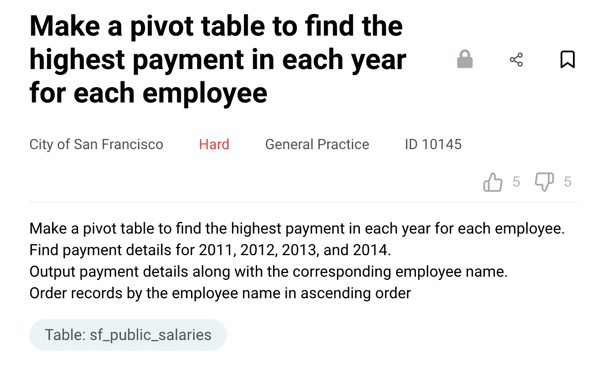*

*该问题使用包含以下字段的 sf _ public _ salaries 表。*

*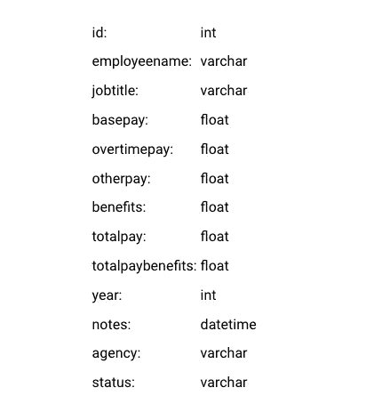*

*数据以下列方式显示。*

***表:**SF _ public _ salary*

*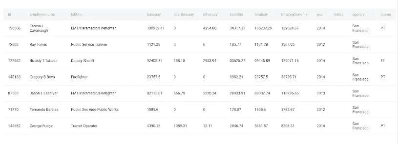*

## *解决办法*

*我们可以用以下方式解决这个 SQL 聚合函数面试问题。*

*   *首先旋转每个员工每年的工资。*
*   *汇总每个员工每年的数据，并以所需的方式输出。*

*数据集中感兴趣的列是 employeename、totalpay 和 year。数据是长格式的。我们需要将其转换成宽格式。为此，我们使用 CASE WHEN 运算符。*

```
*SELECT 
    employeename
    , CASE WHEN year = 2011 THEN totalpay ELSE 0 END AS pay_2011
    , CASE WHEN year = 2012 THEN totalpay ELSE 0 END AS pay_2012
    , CASE WHEN year = 2013 THEN totalpay ELSE 0 END AS pay_2013
    , CASE WHEN year = 2014 THEN totalpay ELSE 0 END AS pay_2014
FROM
sf_public_salaries
;*
```

*我们得到以下输出。*

*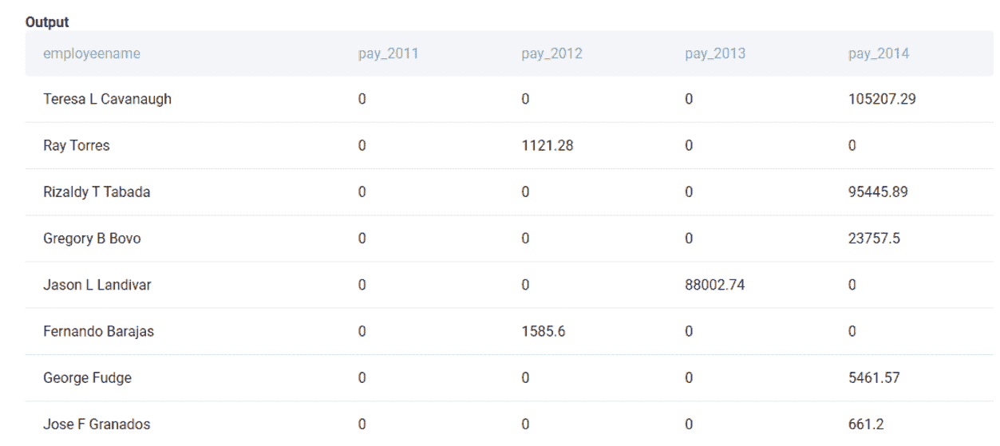*

*我们已经成功地从长格式数据集转向宽格式数据集。现在，我们只需找到根据雇员姓名聚合的每一列的最高工资，并按字母顺序对结果进行排序。*

```
*WITH yearly_pays as (
SELECT 
    employeename
    , CASE WHEN year = 2011 THEN totalpay ELSE 0 END AS pay_2011
    , CASE WHEN year = 2012 THEN totalpay ELSE 0 END AS pay_2012
    , CASE WHEN year = 2013 THEN totalpay ELSE 0 END AS pay_2013
    , CASE WHEN year = 2014 THEN totalpay ELSE 0 END AS pay_2014
FROM
sf_public_salaries
)
SELECT 
    employeename
    , MAX(pay_2011) AS pay_2011
    , MAX(pay_2012) AS pay_2012
    , MAX(pay_2013) AS pay_2013
    , MAX(pay_2014) AS pay_2014
FROM yearly_pays
GROUP BY 1
ORDER BY 1
;*
```

*或者，我们可以在 MAX()函数中使用 CASE WHEN 操作符，而不必创建一个 CTE。*

```
*SELECT 
    employeename
    , MAX(CASE WHEN year = 2011 THEN totalpay ELSE 0 END) AS pay_2011
    , MAX(CASE WHEN year = 2012 THEN totalpay ELSE 0 END) AS pay_2012
    , MAX(CASE WHEN year = 2013 THEN totalpay ELSE 0 END) AS pay_2013
    , MAX(CASE WHEN year = 2014 THEN totalpay ELSE 0 END) AS pay_2014
FROM
sf_public_salaries
GROUP BY 1
ORDER BY 1
;*
```

## *问题 5:有风险的项目*

*确定可能会超出预算的项目。为了计算项目的成本，我们需要在项目持续期间按比例分配给项目的所有员工的成本。员工成本按年定义。*

*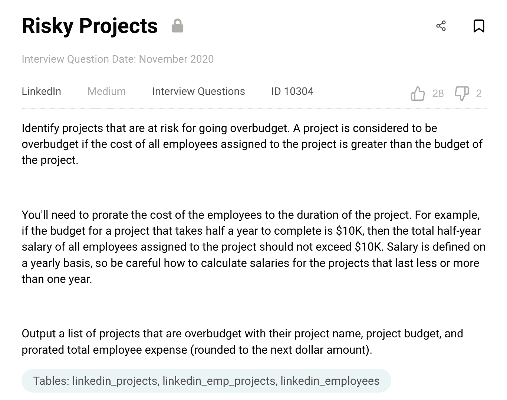*

*该问题使用了三个表:linkedin_projects、linkedin_emp_projects、linkedin_employees*

*linkedin_projects 表包含以下字段。*

*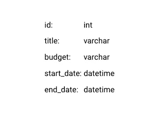*

***表格:**领英 _ 项目*

*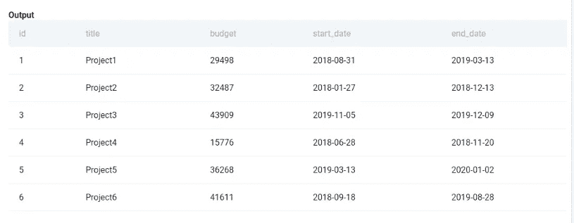*

*数据集 linkedin_emp_projects 包含以下字段。*

*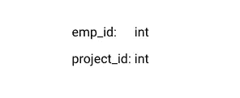*

***表格:**领英 _ 员工 _ 项目*

*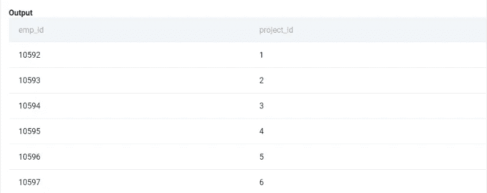*

*包含以下字段的数据集 linkedin_employees*

*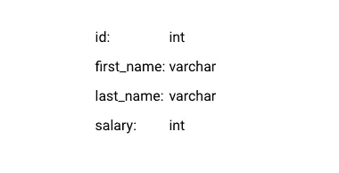*

***表:**LinkedIn _ 员工*

*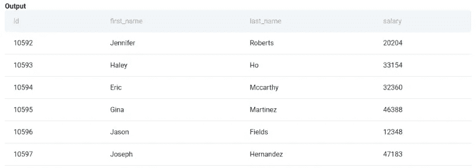*

## *解决办法*

*与前一个问题相比，这是一个更长的问题。让我们把我们的解决方案分成更小的部分。我们的计划是*

*   *首先，找出每个员工的每日成本*
*   *然后在项目级别合计每日成本*
*   *通过将项目的每日总成本乘以项目的持续时间来计算项目的预计成本*
*   *输出相关结果。*

*让我们从找出每天的花费开始。由于员工的工资是一整年的，所以我们通过将工资除以 365 来计算每天的成本。注意，由于 salary 字段是一个整数，我们需要将分子或分母转换为浮点，以避免整数除法[。](https://www.postgresql.org/docs/8.0/functions-math.html#:~:text=division%20(integer%20division%20truncates%20results)*

```
*SELECT 
*, salary * 1.0 / 365 AS daily_cost
FROM linkedin_employees 
;*
```

*我们也可以通过除以 365.0 来完成同样的操作*

```
*SELECT 
*, salary / 365.0 AS daily_cost
FROM linkedin_employees
;*
```

*我们得到以下输出。*

*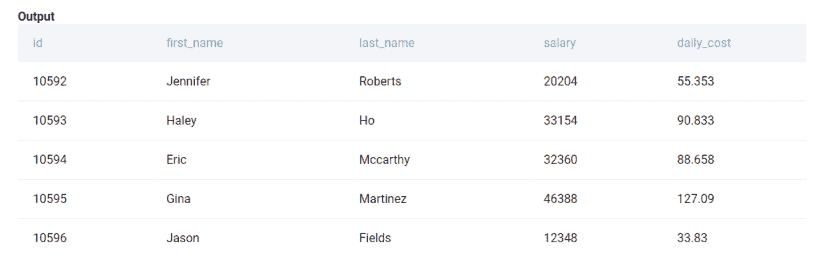*

*接下来，我们通过合计与项目相关的所有员工的员工成本来计算每个项目的每日成本。为此，我们将 linkedin_emp_projects 表与 linkedin_employees 表合并。*

```
*SELECT 
    lep.project_id
    , SUM(le.salary / 365.0) AS daily_cost
FROM 
linkedin_emp_projects AS lep
LEFT JOIN linkedin_employees AS le
    ON lep.emp_id = le.id
GROUP BY 1    
;*
```

*我们得到以下输出。*

*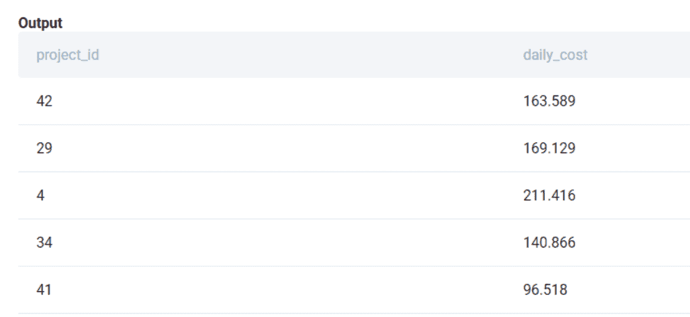*

*然后，我们将上述输出与 linkedin_projects 合并，以获得项目细节。*

```
*SELECT 
    lp.title
    , lp.budget
    , lp.start_date
    , lp.end_date
    , SUM(le.salary / 365.0) AS daily_cost
FROM 
linkedin_projects AS lp
LEFT JOIN linkedin_emp_projects AS lep
    ON lp.id = lep.project_id
LEFT JOIN linkedin_employees AS le
    ON lep.emp_id = le.id
GROUP BY 1,2,3,4    
;*
```

*我们得到以下输出。*

*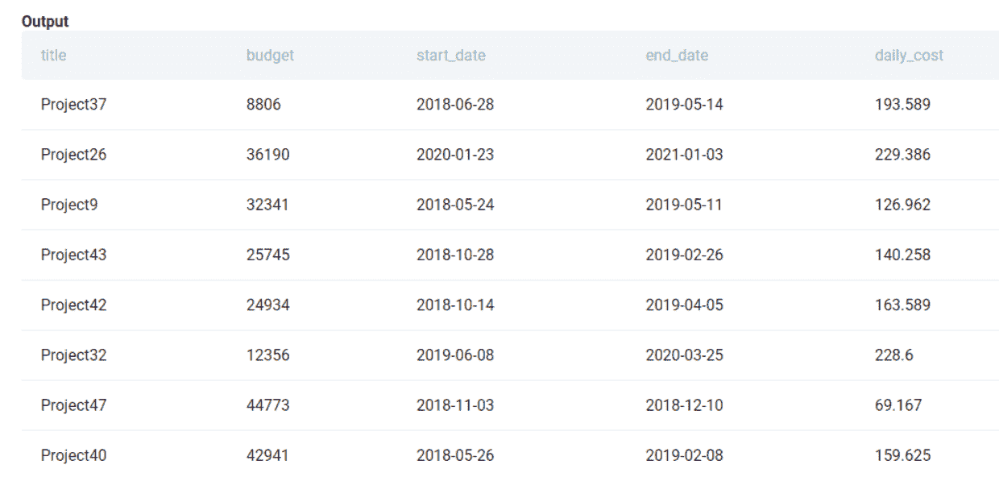*

*现在我们在一个表中有了所有的数据。现在，我们可以根据 start_date 和 end_date 之间的天数计算预计成本，并将其乘以每日成本。*

```
*WITH merged AS (
SELECT 
    lp.title
    , lp.budget
    , lp.start_date
    , lp.end_date
    , SUM(le.salary / 365.0) AS daily_cost
FROM 
linkedin_projects AS lp
LEFT JOIN linkedin_emp_projects AS lep
    ON lp.id = lep.project_id
LEFT JOIN linkedin_employees AS le
    ON lep.emp_id = le.id
GROUP BY 1,2,3,4
)
SELECT 
    title
    , budget
    , (end_date - start_date)::INT * daily_cost AS projected_cost
FROM merged
;*
```

*我们得到以下输出。*

*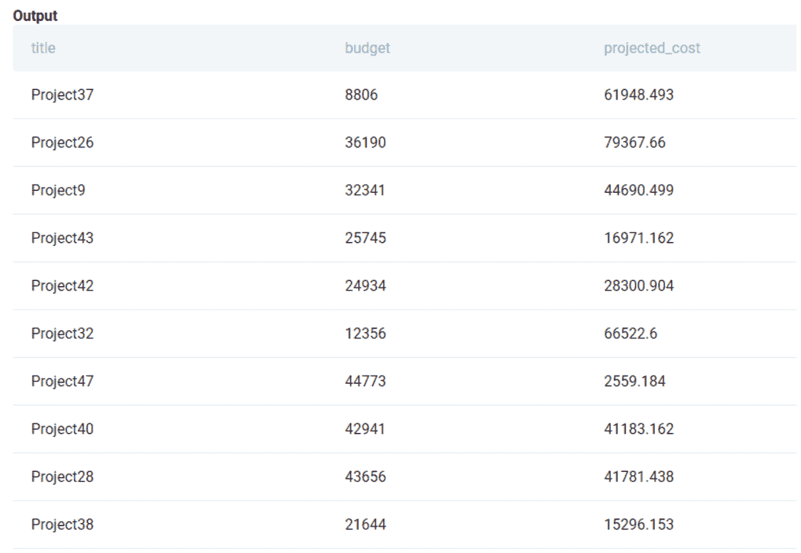*

*我们最后向上取整 projected_cost，并且只输出那些 projected_cost 大于预算的项目。*

```
*WITH merged AS (
SELECT 
    lp.title
    , lp.budget
    , lp.start_date
    , lp.end_date
    , SUM(le.salary / 365.0) AS daily_cost
FROM 
linkedin_projects AS lp
LEFT JOIN linkedin_emp_projects AS lep
    ON lp.id = lep.project_id
LEFT JOIN linkedin_employees AS le
    ON lep.emp_id = le.id
GROUP BY 1,2,3,4
)
SELECT 
    title
    , budget
    , CEIL((end_date - start_date)::INT * daily_cost) AS projected_cost
FROM merged
WHERE (end_date - start_date)::INT * daily_cost > budget
;*
```

*您可以参考我们的文章 [" *不同类型的 SQL 连接* "](https://www.stratascratch.com/blog/different-types-of-sql-joins-that-you-must-know/?utm_source=blog&utm_medium=click&utm_campaign=medium) 来更详细地理解连接的概念。*

# *窗口函数中的聚合*

**

*作者在 [Canva](https://canva.com/) 上创建的图像*

*窗口函数的知识和应用是区分顶级 SQL 分析师和优秀分析师的关键。如果使用得当，窗口函数可以节省大量时间，因为它们有助于节省用于聚集然后合并回原始数据集的中间查询。在数据分析师和数据科学家的时代，这是一个非常常见的用例。我们从亚马逊数据科学采访中的一个简单问题开始。*

## *问题 6:最新登录日期*

**查找每个视频游戏玩家登录的最新日期。**

*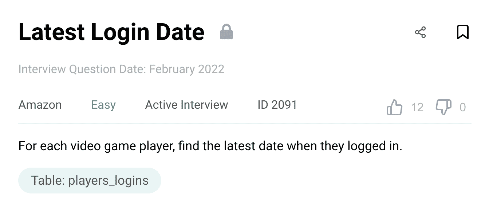*

*该问题使用包含以下字段的 players_logins 表*

**

***表:**玩家 _ 登录*

*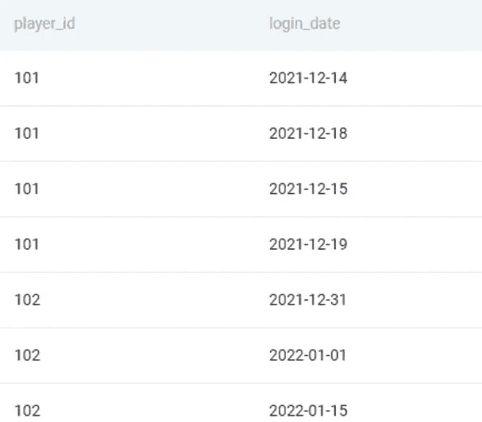*

## *解决办法*

*通过在 GROUP BY 子句中使用 MAX()可以非常容易地解决这个问题。*

```
*SELECT
    player_id
    , MAX(login_date) AS latest_login
FROM players_logins
GROUP BY 1
;*
```

*但是让我们用稍微不同的方法来解决这个问题。这将帮助我们理解窗口函数中的聚合是如何工作的。我们需要找到最近的登录日期，按照 player_id 进行划分。*

```
*SELECT
    player_id
    , login_date
    , MAX(login_date) OVER (PARTITION BY player_id) AS latest_login
FROM players_logins
;*
```

*我们得到以下输出。*

*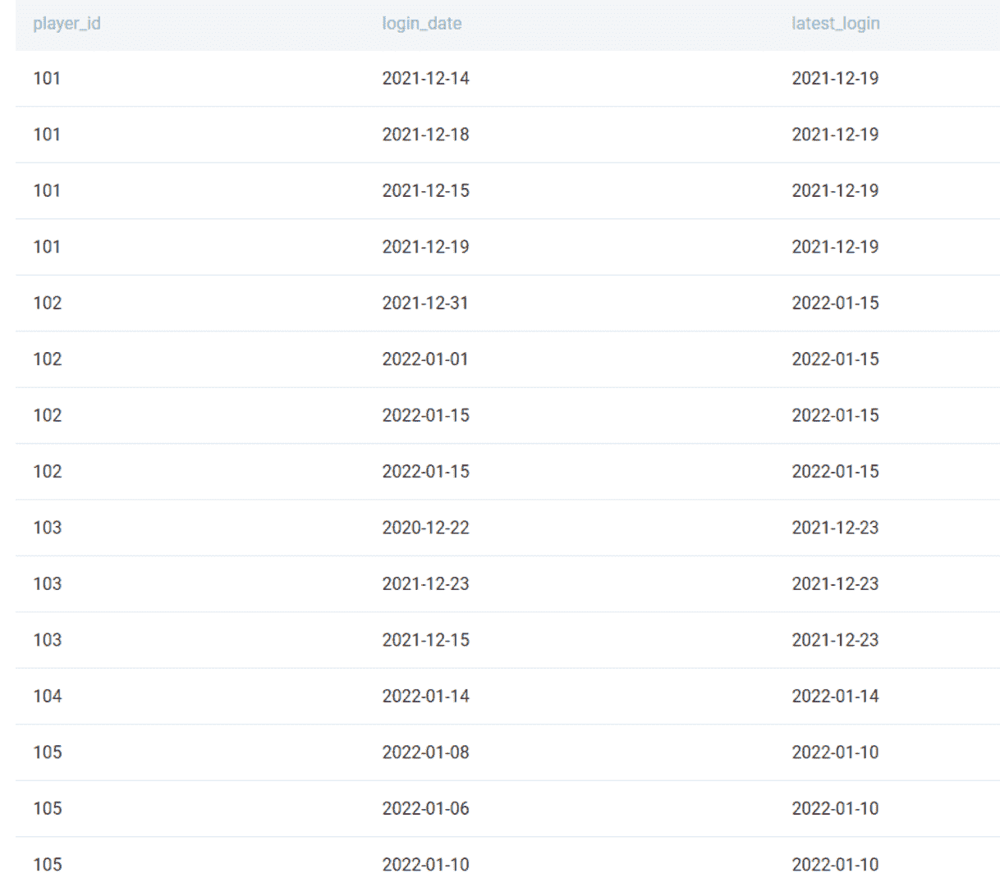*

*我们有每个玩家的最新登录信息，我们可以通过使用 DISTINCT 子句来删除重复项，从而获得最终输出。*

```
*SELECT
    DISTINCT
    player_id
    , MAX(login_date) OVER (PARTITION BY player_id) AS latest_login
FROM players_logins
;*
```

*与之前的 GROUP BY 相比，使用 window 函数的优势在于，我们在一次查询调用中添加了一个字段，其中包含每个玩家的最新登录日期。我们不必单独汇总指标，并将其合并回原始数据集。这有助于我们将总指标与单个值进行比较。在下一个问题中会非常有用的东西。这是来自网飞数据科学的采访。*

## *问题 7:电影分级的不同*

**对于每位演员，报告所有电影的平均终身评分与她参演的倒数第二部电影的评分之间的差异。只考虑角色类型为‘普通演技’的电影。id 字段是根据电影发行的时间顺序创建的顺序 ID。排除没有评级的角色。**

**输出演员姓名，终身评分，倒数第二部电影的评分，以及两个评分的绝对差值。**

*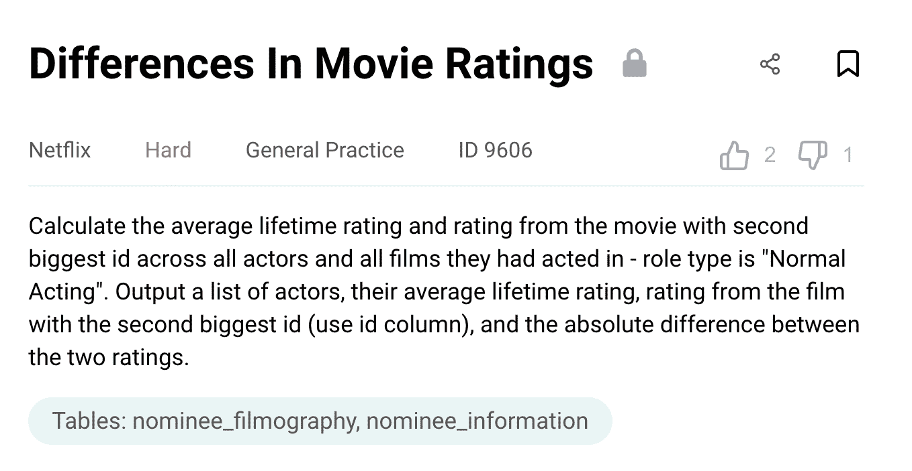*

*这个问题使用了两个表格——被提名人电影记录和被提名人信息。表 nominee_filmography 具有以下字段。*

*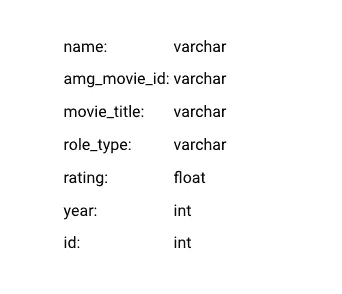*

***表:**提名人 _ 从影记录*

*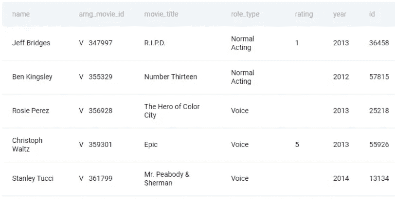*

*表 nominee_information 包含以下字段。*

*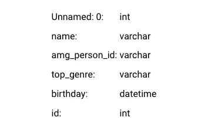*

***表格:**被提名人 _ 信息*

**

## *解决办法*

*如果仔细阅读这个 SQL 聚合函数面试问题，我们不需要第二个表。我们需要的所有数据都在第一个表格中(提名人 _ 电影记录)。我们可以用下面的方法解决这个问题*

*   *找出一个演员演过的所有电影的平均评分。*
*   *查找每位演员的倒数第二部电影的评分*
*   *报告两者之间的差异，并输出相关字段。*

*我们需要排除那些没有提供分级的电影，只包括那些角色类型为“正常表演”的电影。我们从找到平均评级开始。我们不使用 GROUP BY 子句，而是使用一个窗口函数，因为在第二步中我们也将使用一个窗口函数。*

```
*SELECT
    name
    , id
    , rating
    , AVG(rating) OVER (PARTITION BY name) AS avg_rating
FROM nominee_filmography
WHERE role_type = 'Normal Acting'
AND rating IS NOT NULL
;*
```

*我们得到以下输出。*

*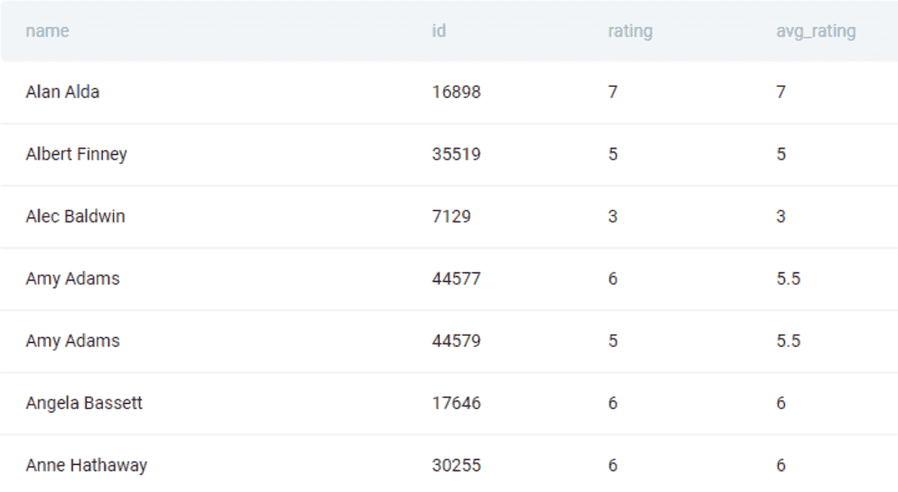*

*现在我们添加另一个窗口函数来根据 id 字段计算电影的排名。*

```
*SELECT
    name
    , id
    , rating
    , AVG(rating) OVER (PARTITION BY name) AS avg_rating
    , RANK() OVER (PARTITION BY name ORDER BY id DESC) AS movie_order
FROM nominee_filmography
WHERE role_type = 'Normal Acting'
AND rating IS NOT NULL
;*
```

*我们得到以下输出。*

*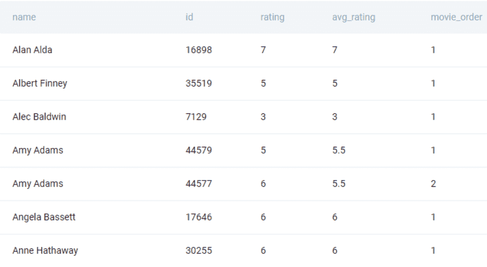*

*我们现在有了演员出演的每部电影的总体电影评级和排名(根据上映日期)。现在我们简单的找到排名 2 的电影(倒数第二部电影)，找到与平均评分的绝对差值。*

```
*SELECT 
    name
    , avg_rating
    , rating
    , ABS(avg_rating - rating) AS difference
FROM (
    SELECT
        name
        , id
        , rating
        , AVG(rating) OVER (PARTITION BY name) AS avg_rating
        , RANK() OVER (PARTITION BY name ORDER BY id DESC) AS movie_order
    FROM nominee_filmography
    WHERE role_type = 'Normal Acting'
    AND rating IS NOT NULL
    ) AS ranked
WHERE movie_order = 2
;*
```

*你可以在这里阅读我们关于窗口功能的全面指南。*

# *额外文本聚合*

**

*作者在 [Canva](https://canva.com/) 上创建的图片*

*让我们通过将聚合函数应用于文本操作来结束我们对聚合的研究。随着非结构化数据变得越来越普遍，在 SQL 中熟练使用文本操作函数非常重要。我们有一篇文章专门讨论[文本操作，如果你想了解更多关于文本特定函数的信息。出于这个练习的目的，我们将使用一个在亚马逊数据科学采访中出现的问题，这个问题相当难。但是让我们试着用稍微不同的方式来解决这个问题。](https://www.stratascratch.com/blog/string-and-array-functions-in-sql-for-data-science/?utm_source=blog&utm_medium=click&utm_campaign=medium)*

## *问题 8:连胜记录最长的球员*

*给定乒乓球运动员的比赛日期和比赛结果，找出最长的连胜记录。连胜是指一个球员连续赢得比赛的次数。输出具有最长连胜的玩家的 ID 和连胜的长度。*

*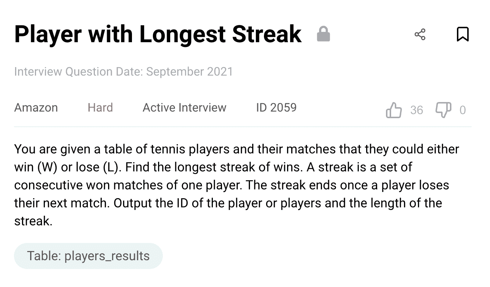*

*该问题使用包含以下字段的 players_results 表*

*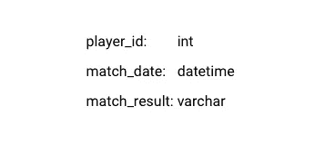*

***表:**选手 _ 成绩*

*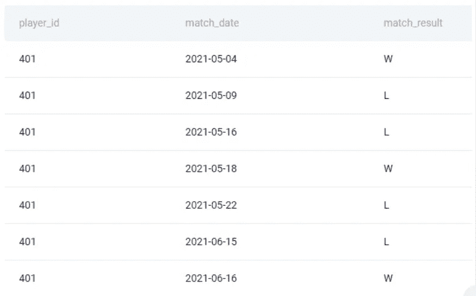*

## *解决办法*

*要解决这个 SQL 聚合函数面试问题，我们需要了解条纹是如何定义的，以及我们如何识别它们。让我们假设一个玩家赢和输的序列。*

*W，W，L，L，W，L，W，L，W，W，L，L，W，W，L，W，L，W，W，W，L，L，W*

*如果我们忽略损失，序列会变成类似这样。*

*W，W，_，_，W，_，W，W，_，_，W，W，_，W，_，W，_，W，W，_，_，W*

*牛排的开始和结束可以简单地通过空间的存在来识别。所以在上面的例子中，条纹是 2，1，3，2，1，2，1。然后，我们可以将这些条纹中最长的条纹作为玩家的最佳条纹(在我们的示例中为三个)。*

*要以上述方式在 SQL 中实现这一点，我们需要执行以下操作。*

*   *按照 match_date 的顺序连接所有结果*
*   *通过移除中间损失，将结果字符串分割成单独的条纹。*
*   *找出条纹的长度*
*   *在玩家级别聚集，保持每个玩家最长的连胜记录*
*   *输出最长的连胜记录以及拥有最长连胜记录的玩家。*

*我们首先按照球员的时间顺序连接每场比赛的结果。*

```
*SELECT
    player_id
    , string_agg(match_result, '' ORDER BY match_date) as result_string
FROM players_results
GROUP BY 1
;*
```

*我们得到以下结果*

*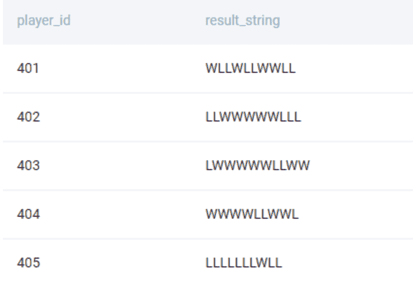*

*然后我们继续分割琴弦。为此，我们使用 string_to_array 函数，并通过使用“L”作为分隔符将结果字符串转换为数组。*

```
*SELECT
    player_id
    , string_to_array(string_agg(match_result, '' ORDER BY match_date), 'L') as win_streak
FROM players_results
GROUP BY 1*
```

*我们得到一系列条纹。*

*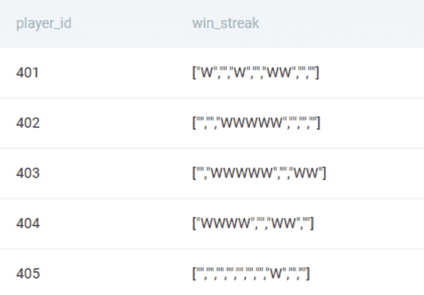*

*我们需要做的就是用空白来识别条纹的起点和终点。现在，我们继续将阵列分割成单独的条纹。为此，我们使用 UNNEST()函数。*

```
*SELECT
    player_id
    , unnest(string_to_array(string_agg(match_result, '' ORDER BY match_date), 'L')) as win_streak
FROM players_results
GROUP BY 1
;*
```

*我们现在有如下的单独条纹。*

*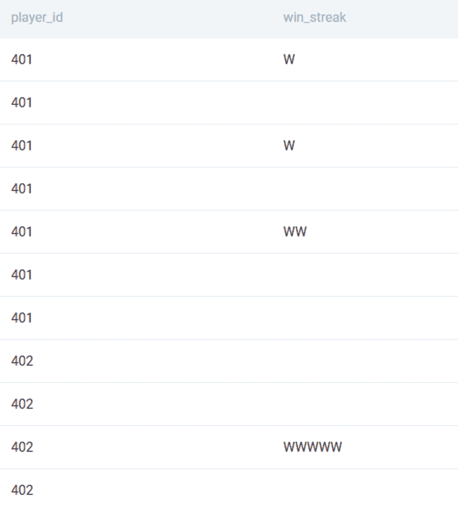*

*现在问题已经简化为寻找最长‘连胜’的长度。这可以通过使用 LENGTH()函数来完成。*

```
*WITH res_str AS (
    SELECT
        player_id
        , unnest(string_to_array(string_agg(match_result, '' ORDER BY match_date), 'L')) as win_streak
    FROM players_results
    GROUP BY 1
)
SELECT 
    player_id
    , win_streak
    , length(win_streak)
FROM res_str
;*
```

*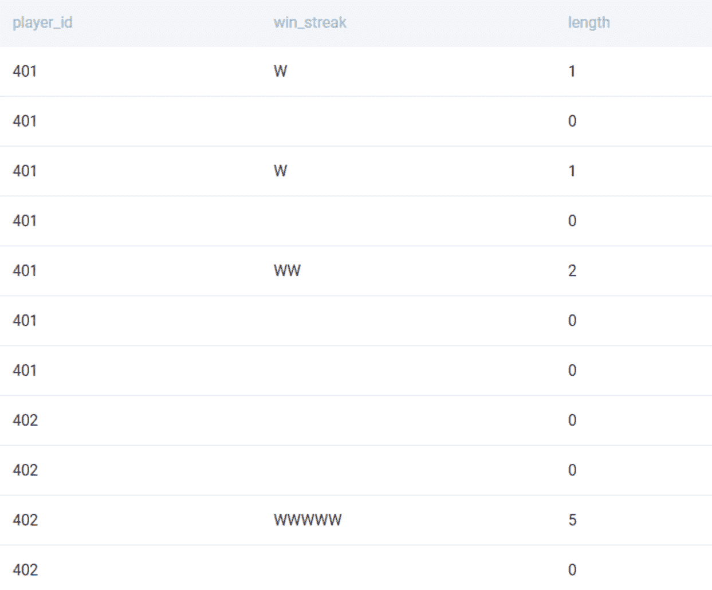*

*然后，我们使用 GROUP BY 子句在玩家级别进行聚合。*

```
*WITH res_str AS (
    SELECT
        player_id
        , unnest(string_to_array(string_agg(match_result, '' ORDER BY match_date), 'L')) as win_streak
    FROM players_results
    GROUP BY 1
)
SELECT 
    player_id
    , MAX(length(win_streak)) as max_streak
FROM res_str
GROUP BY 1
;*
```

*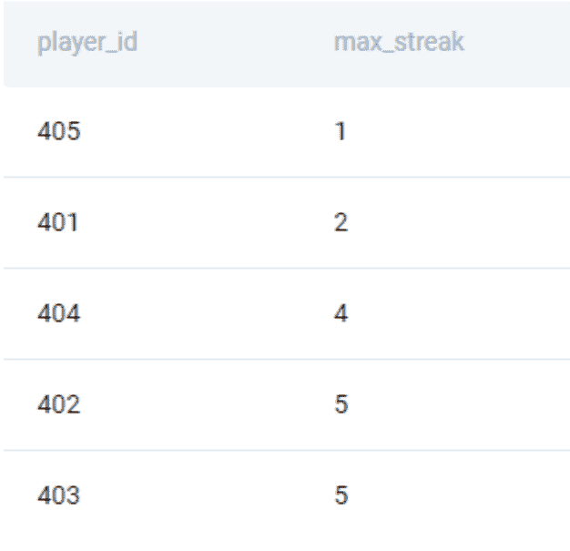*

*然后像前面一样使用窗口函数来找到具有最长连胜的玩家。*

```
*WITH res_str AS (
    SELECT
        player_id
        , unnest(string_to_array(string_agg(match_result, '' ORDER BY match_date), 'L')) as win_streak
    FROM players_results
    GROUP BY 1
), ranked_streaks AS (
    SELECT 
        player_id
        , MAX(length(win_streak)) as max_streak
        , RANK() OVER (ORDER BY MAX(length(win_streak)) DESC) as rnk
    FROM res_str
    GROUP BY 1
)
SELECT
    player_id
    , max_streak
FROM ranked_streaks
WHERE rnk = 1
;*
```

# *结论*

*在本文中，我们研究了 SQL 中聚合的各种应用。我们从聚合整个数据集开始，然后使用 GROUP BY 子句将聚合应用到子组，最后在窗口函数中完成聚合。我们还看了一个文本聚合的例子。随着数据量每天成倍增长，数据分析师和数据科学家掌握聚合函数至关重要。就像生活中的其他技能一样，掌握这些技能需要练习、耐心和坚持。*