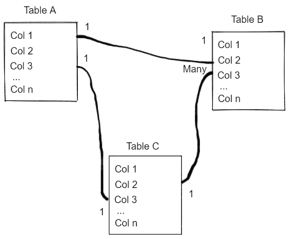
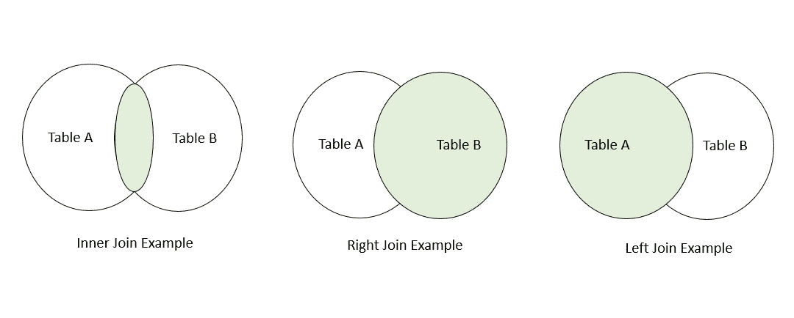

# SQL 和数据库学习:数据科学家和 ML 工程师指南

> 原文：<https://towardsdatascience.com/sql-and-databases-learning-a-guide-for-data-scientists-and-ml-engineers-a73875b0d6f2>

## 让我们检查一些高级概念，这些概念将适合希望了解更多 SQL 和数据库的专业人员的学习计划。

照片由 [@tvick](https://unsplash.com/@tvick) [Unsplash](https://medium.com/u/2053395ac335?source=post_page-----a73875b0d6f2--------------------------------) 拍摄。com

作为数据科学家、分析师或工程师，您可能会经常处理表格数据。*行列*格式是最常见的数据存储方式，因为它容易被大多数非技术用户掌握。

这种二维格式在多种工具和框架中得到了展示，例如:

*   Microsoft Excel 或 Google Sheets 中的电子表格格式。
*   关于 dataframe 格式在 *R* 或者 *Python 的*熊猫。
*   存储在数据库中的表上。

用于机器学习模型的大量数据源都存储在后者中。除此之外，许多模型的输出还通过符合某种关系模式的表格提供，帮助用户理解结果并轻松查询。随着越来越多的组织将数据科学家和工程师整合到他们的核心信息技术团队中，工作角色往往会变得有点混乱，这本质上并不是一件坏事。

**但是...一个模糊的工作角色是数据科学家应该学习 SQL(结构化查询语言)和通用数据库理论的唯一理由吗？**我觉得不会。就个人而言，我认为**学习这些概念将是一种资产，原因有二**(除了维护您自己的数据源/模型输出):

*   **您将能够更轻松地与其他数据专业人员交流** —能够将 dataframe 命令翻译成类似 SQL 的语句。
*   **你将倾向于开发更高效的数据管道**在 SQL 内部执行复杂的操作，并利用你的表的索引。

SQL 是数据库世界的一部分。它只是一个接口，供我们与位于某个数据库服务器中的数据进行通信——构建或维护数据库不仅仅是这样。

这篇文章的目标是详细介绍一些数据库概念，并为您提供学习 SQL 和数据库的总结。这些是我认为与数据科学家和 ML 工程师探索相关的 5 个角度——你不应该认为这是一个广泛的列表，而是一个初步的高级概念的粗略指南，你可以在学习 SQL 和数据库的过程中重点关注这些概念。

开始吧！

# 基本查询

使用 SQL 查询从存储在数据库中的表中检索数据比将整个数据框引入 Python 并在 Pandas 中处理数据更有效(特别是在本地环境中)。

学习基本的查询方法是建立良好的数据辩论技能的良好开端，这将加速您的查询和数据管道。您可以从检查如何对表执行简单操作开始:

*   从特定表中选择列的子集；
*   基于条件过滤表格；
*   按特定列对数据进行分组；

最简单的 *select* 语句只包含两个关键字— `SELECT`和`FROM`。你可以从在 [MySQL](https://www.mysql.com/) 或另一个开源系统的样本数据库中做这个简单的查询开始——当你把你的查询变得更复杂时，用其他关键词如`WHERE`、`GROUP BY`或`HAVING`来增加你的查询的味道。

为了帮助您，这里有一些资源，您可以使用它们来了解关于简单查询语句的更多信息:

*   [W3 学校选择报表页面；](https://www.w3schools.com/sql/sql_select.asp)
*   [网上科技 Select 语句示例；](http://techonthenet.com/sql/select.php)
*   我的第一节 [SQL 绝对初学者教程](https://www.udemy.com/course/sql-for-absolute-beginners/?couponCode=MEDIUMREADERS)；

# 索引和键

了解表 ID 和主键将有助于您更好地理解如何组合表，避免数据管道中的重复，以及在处理多个数据源时构建智能数据结构。模式中没有一个表是孤立的(或者至少不应该是)，主键和外键是主要的概念，可以帮助您描绘出数据的全貌，并理解底层结构和标识表中某一行的列。

此外，您还会偶然发现索引的概念。通常情况下，主键和索引是相互关联的——但是您可以在一个表中拥有其中的一个，而不拥有另一个。索引主要用于加速某些搜索，代价是对象占用内存空间。设计良好的索引可以将数据库系统的速度提高 10 倍。

查看以下资源以了解更多信息:

*   [Technopedia 的主键网页](https://www.techopedia.com/definition/5547/primary-key)；
*   [微软主键和外键解释；](https://docs.microsoft.com/en-us/sql/relational-databases/tables/primary-and-foreign-key-constraints?view=sql-server-ver16)
*   [Oracle 的表索引指南；](https://docs.oracle.com/cd/E11882_01/server.112/e40540/indexiot.htm#CNCPT1170)

# 数据模型

一个人如何组织一个数据库，并以二维物体的形式表现一个特定的现实？数据模型(不要与机器学习模型混淆)是以表格格式表示多个实例的方法。检查数据模型将使您更好地理解关系和主键，因为这些概念是构建正确的数据模式的核心。

基本的逻辑数据模型(有时称为模式)可能如下所示:

表格模式示例—按作者分类的图像

数据模型包含一组约束和连接，详细说明了底层数据是如何组织的。数据模型有很多种，每一种都有不同的目标。例如:

*   关系模型——可能是最著名的数据模型，也是组织数据库表的最早方法之一。关系模型构建了以实体为核心的表之间的关系。
*   星型模式——这种模式是为现代数据仓库定制的，将信息分成事实和维度表。星型模式的主要目标是使用多种机制来跟踪变化，比如声明行有效性的*到*和*从*概念。
*   雪花模式——类似于星型模式，雪花模式扩展了以前的一些功能，增加了维度分层和低级别的数据冗余。

上面的三个例子只是理解如何将数据建模到不同表中的一个起点——还有更多模式我没有详细介绍。在某些情况下，您需要查询的基础表可能符合这里描述的模式之一。

了解模式的一些资源:

*   [关于关系模式的 MSSQLTips 页面](https://www.mssqltips.com/sqlservertip/6892/relational-database/)
*   [微软的星型模式例子；](https://docs.microsoft.com/en-us/power-bi/guidance/star-schema)
*   [Integrate.io 雪花 vs 星星 Schame 页面；](https://www.integrate.io/blog/snowflake-schemas-vs-star-schemas-what-are-they-and-how-are-they-different/)

# 连接数据

正如我们已经看到的，构建和理解模式是基于表之间的关系。除此之外，连接不同的表是数据模型的核心概念。

当你积累了多年的数据科学经验后，你会注意到数据管道中的大量错误来自于不良的连接(和数据建模技能)。接合不良可能会导致多种错误，最常见的有:

*   由于联接类型选择不当，您的某一部分行被删除。
*   连接表的实体定义不明确，并产生了重复。

可以说，数据管道的大部分错误都是围绕以上两个问题。这两种错误都会对您的数据科学模型造成重大损害，要么是删除您想要建模的现象的重要部分，要么是创建比其应有的权重更大的“虚假”实例。

连接有两个特征——类型和键。类型与它们从基础表中捕获的域相关。键是指用作表之间的连接器的列。

加入示例-按作者分类的图片

例如，`inner join`通过选择两个(或更多)表中的公共域来连接它们。如果其中一个键在两个表中都不存在，它将不会传播到结果表。

相比之下，`right join`和`left join`最终将一个表(左或右)视为传播到结果的“控制”表，而不管它在并发表上的状态。

连接是构建清晰无误的数据管道的核心。从我详述的概念来看，这应该对您作为数据科学家的职业生涯影响最大——让我们看看一些资源:

*   我的 [SQL 绝对初学者教程第四节](https://www.udemy.com/course/sql-for-absolute-beginners/?couponCode=MEDIUMREADERS)；
*   [W3 学校表连接示例](https://www.w3schools.com/sql/sql_join.asp)；
*   [DoFactory 加盟教程；](https://www.dofactory.com/sql/join)

# NOSQL

在关系数据库和 SQL 领域之外，在学习了上述数据库概念之后，您可能会接触到 *NOSQL* 的概念。

*NOSQL* (不仅是 SQL 的缩写)是一个重要的概念，可以扩展您的数据库知识，并了解如何在我们上面讨论的格式之外存储数据。虽然数据模型、模式和关系数据库是存储和服务数据的极好方式，但它们的僵化使它们不适合处理非结构化数据。NOSQL 数据库(比如 MongoDB)试图通过将数据存储在我们上面看到的典型“模式”之外来解决这个问题。

随着存储成本的降低和数据冗余问题的减少，键值数据库开始成为存储不太适合严格关系模式的数据的有效解决方案。

您可以在这里查看更多关于 NOSQL 的资源:

*   [Mongo DB 的 NOSQL 页面](https://www.mongodb.com/nosql-explained)
*   Soner Yildirim 用 8 个例子来查询一个 NOSQL 数据库。

感谢你花时间阅读这篇文章。我的目标是给你一些概念，帮助你围绕学习 SQL 或数据库制定一个学习计划——这些资源不足以知道你需要的一切，但应该给你一些基础知识。

***正如你在整篇文章中注意到的，我在***[***Udemy***](https://www.udemy.com/course/sql-for-absolute-beginners/?referralCode=23E560A160F7202E026F)***上开设了一门关于从头开始学习 SQL 的课程，我在其中深入探讨了这些概念以及更多内容——这门课程适合绝对的初学者，我希望有你在身边！***

[SQL 绝对初学者教程](http://udemy.com/course/sql-for-absolute-beginners/?couponCode=MEDIUMREADERS) —图片由作者提供

 [## 通过我的推荐链接加入 Medium-Ivo Bernardo

### 阅读我在 Medium 上的所有故事，了解更多关于数据科学和分析的信息。加入中级会员，您将…

medium.com](https://medium.com/membership/@ivopbernardo)