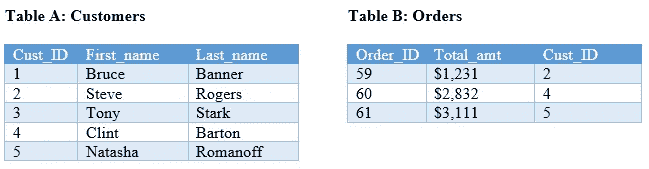
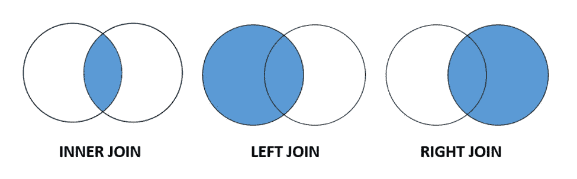
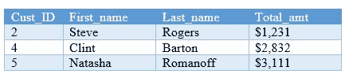
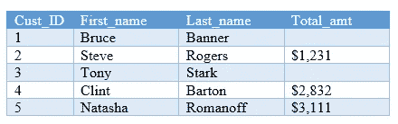
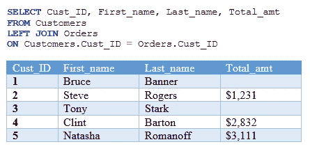
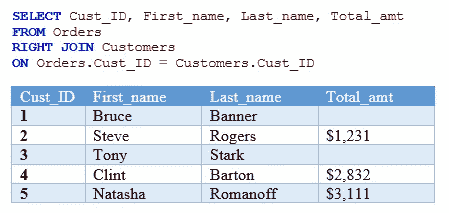
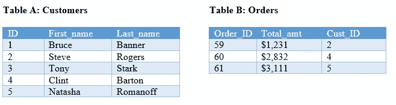

# 初学者难以理解的 SQL 概念

> 原文：<https://towardsdatascience.com/sql-concepts-that-beginners-have-trouble-with-44ad41243806>

## 当没有提示时，如何从头开始编写 SQL 查询？

Elena Mozhvilo 在 [Unsplash](https://unsplash.com?utm_source=medium&utm_medium=referral) 上的照片

作为一个在线分析训练营的导师，我有很多学员问我“当没有像我在课程作业中提供的提示时，我如何在真实的工作世界中提出 SQL 查询？”

许多网站和课程会教你如何使用 SQL，但他们不会教你如何从头开始创建 SQL 查询。也就是说，如果没有实际操作，没有课程提供的提示，你怎么知道 SQL 查询在现实生活中应该是什么样子。

本文不是要教您 SQL，而是为 SQL 初学者提供说明，以便您可以开始编写自己的查询。

在这篇文章中，我将试图澄清我的学员经常问的这些具体问题的困惑。

*   我如何知道是使用左联接、右联接还是内联接？
*   当我进行连接时，哪个表在左边哪个表在右边有关系吗？
*   我加入哪个专栏有关系吗？
*   在真实的工作环境中，我如何知道我的 SQL 查询应该是什么样的？
*   如果我在纠结 SQL，我该怎么办？

同样，本文的目的不是教你如何编写 SQL，所以我假设你知道什么是 SQL 和 SQL 的基础知识。

# **我如何知道是使用左连接、右连接还是内连接？**

让我们看一个简单的例子来理解所有三种类型的连接的输出。左边的表 A 是一个包含客户名和姓的表。右边的表 B 是一个包含订单总数的表。

来源:作者

如果您已经忘记了所有联接之间的差异，这里有一个视觉效果来刷新您的记忆。

SQL 内部连接与左连接和右连接—来源:作者

如果您执行内部连接，您将获得两个表之间匹配的所有记录。正如您所看到的，Cust_ID 2、4 和 5 出现在两个表中。

**内部连接**

内部联接输出—来源:作者

如果执行左连接，您将获得所有匹配的记录以及左侧表中的所有记录。我们从左边的表中得到所有客户 1-5。

**左连接**

左连接输出—来源:作者

如果执行右连接，您将获得所有匹配的记录以及右侧表中的所有记录。有 3 个客户的 3 个订单。

**右连接**

右连接输出—来源:作者

右连接的输出与内连接的输出相同。让我们仔细看看左连接和内连接。您注意到这些输出之间有什么不同吗？你应该使用哪一个？

左连接的输出既包含有订单的客户，也包含没有订单的客户。内部联接只包含有订单的客户。决定使用哪个连接将取决于您被询问的内容以及这段数据的用途。

我们是否只关心已经下了订单的客户？我们要不要看看哪些客户没有订单？这些是你在决定加入时应该考虑的问题。

# 当我进行连接时，哪个表在左边哪个表在右边有关系吗？

表是在连接的“左侧”还是“右侧”并不重要。无论您将它放在哪里，都可以获得相同的输出。重要的是在决定放置表的位置后，使用什么类型的连接。

**例 1**

假设我将表 Customers 放在左边，将表 Orders 放在右边，然后执行一个左连接。

左连接输出—来源:作者

**例二**

现在让我们颠倒一下哪张桌子在左边和右边。这次把订单放在左边，顾客放在右边。为了获得与前面相同的输出，您需要进行右连接，因为 Customers 表现在位于右侧，而不是左侧。

右连接输出—来源:作者

如您所见，示例 1 和示例 2 中的结果完全相同。因此，你可以改变桌子的位置，但是要确保你做了正确的连接以获得准确的结果！

# **我加入哪个专栏有关系吗？**

为了准确地获得数据，您必须选择正确的列进行连接。我们总是根据相关的列来连接两个表。

在前面的例子中，我们在订单上加入了**。Cust_ID =客户。客户标识**。这一点很容易发现，因为它们有确切的列名，因此它们彼此相关不是秘密。

你可能经常看到的一个常见例子是这样的。表 A 有一个名为 ID 的列。表 B 有一个名为 Cust_ID 的列。即使列名不完全相同，我们也可以通过逻辑推断出表 A 中的 ID 与表 b 中的 Cust_ID 相关。

如果幸运的话，您可能会找到显示实体关系图的文档，它会告诉您数据库中的所有主键和外键。这将是您加入哪些专栏的蓝图。

请注意，在某些情况下，您可能会发现必须在多个列上进行联接。所以一定要仔细看看这些表格！

# **在真实的工作环境中，我如何知道我的 SQL 查询应该是什么样的？**

要回答这个问题，我想从两个方面来谈。我的学员经常感到困惑的第一部分是“我如何知道从哪里获取数据？”也就是应该用什么表？

嗯，你必须看一下表格，并找出你的数据在哪里。数据是否仅位于一个表中？数据是否位于多个表中？如果是这样，您需要将这些表连接在一起以获得您的输出。

下面是一个数据库的例子。这里有 8 个不同的表，每个表都包含与表名相关的特定信息。

来源:[https://en . wikiversity . org/wiki/Database _ Examples/north wind # Entity-Relationship _ Diagram](https://en.wikiversity.org/wiki/Database_Examples/Northwind#Entity-Relationship_Diagram)

为了确定使用什么表，您将检查这些表并确定您想要的数据所在的位置。你想要产品信息吗？你想要员工信息吗？

如果您不确定数据的确切位置，我建议您查询该表并查看示例输出，以便更好地了解表中的内容。

我的学员经常感到困惑的第二部分是知道 SQL 语句应该是什么样子。您已经学习了 SELECT FROM WHERE ORDER BY 语法，但是如何知道这个模板包含什么内容呢？你会根据请求的内容知道该写什么。也就是说，要求您从数据库中获取哪些数据？实际上，您将把请求转换成 SQL 语句。

我编写查询的方式是首先弄清楚输出应该是什么样子。这将指导您确定您的 SQL 查询应该是什么样子。

我最初试图回答的一些问题如下:需要哪些列？需要计算哪些列，应该如何计算。这些列位于哪个(哪些)表中？

这些都是有用的问题，因为它会帮助你决定是否需要连接表，是否需要分组等等。

# **如果我在纠结 SQL，我该怎么办？**

在我看来，我认为您应该在学习 SQL 之前学习关系数据库，因为这将有助于您理解数据库和连接是如何工作的。尝试参加关系数据库课程，看看是否有助于您理解这些概念。

此外，你只会通过练习变得更好。尝试不同的查询，看看输出如何变化。这将真正帮助您理解如何操作 SQl 查询来获得您需要的内容。

如果你正在写一个大的查询，从小的开始，确保每一部分都像你期望的那样运行。

希望这篇文章能帮你理清一些事情。对于 SQL 实践操作，请查看这 24 个 SQL 练习及其解决方案。

<https://www.w3resource.com/sql-exercises/movie-database-exercise/joins-exercises-on-movie-database.php>  

照片由 [Unsplash](https://unsplash.com?utm_source=medium&utm_medium=referral) 上的 [Prateek Katyal](https://unsplash.com/es/@prateekkatyal?utm_source=medium&utm_medium=referral) 拍摄