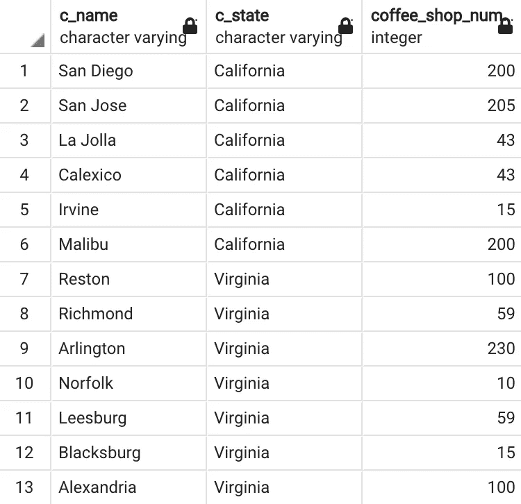
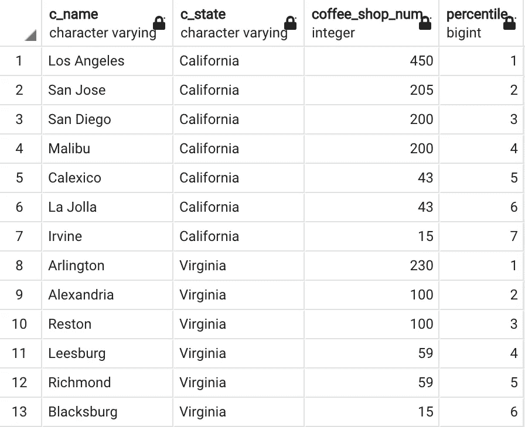
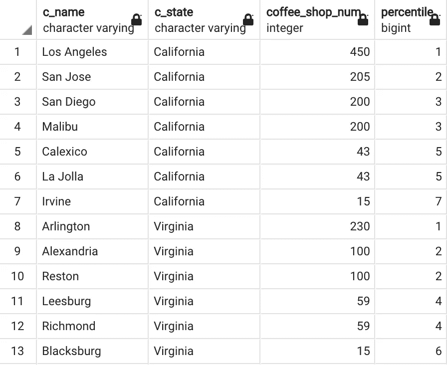
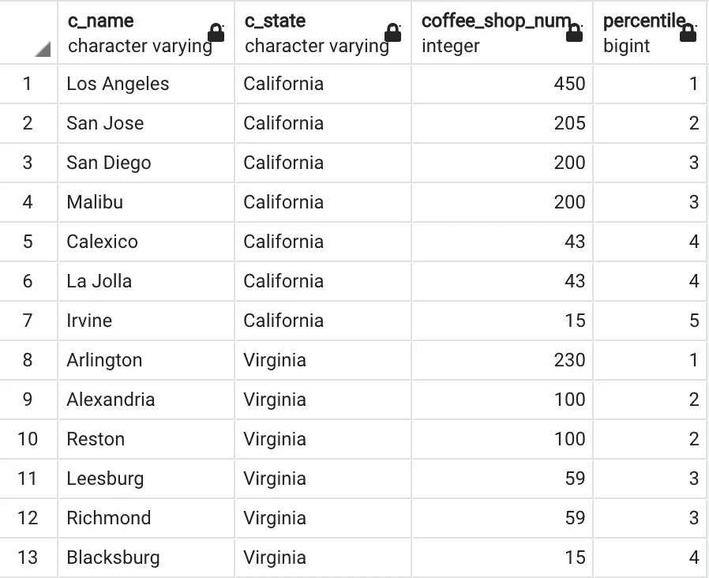
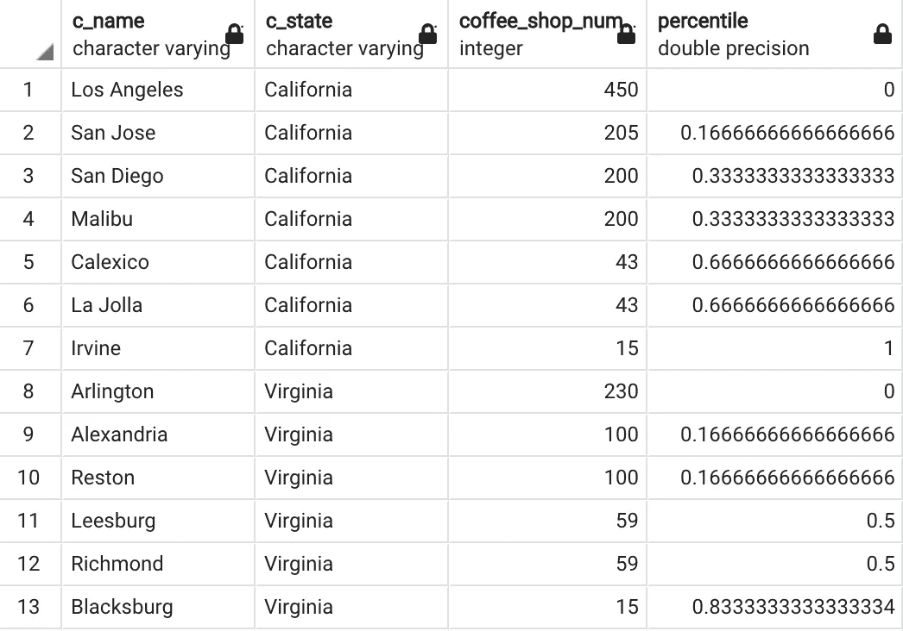
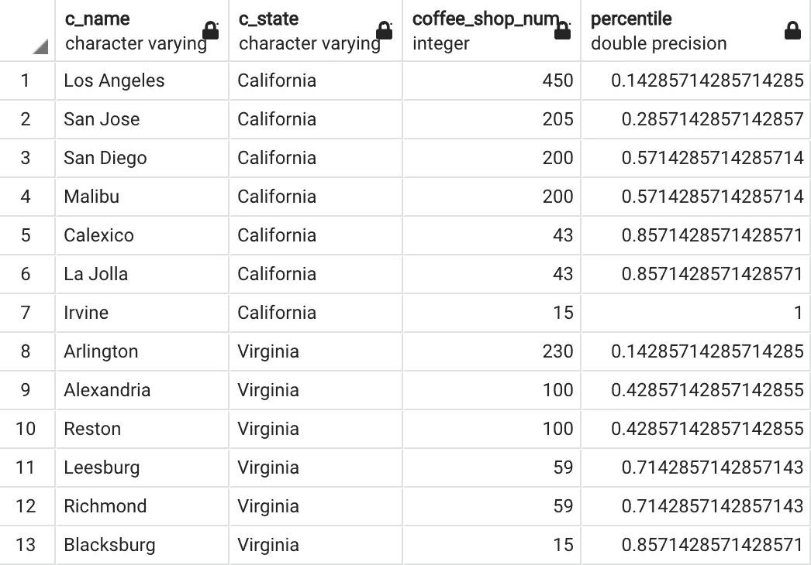

# SQL 排名窗口功能指南

> 原文：<https://towardsdatascience.com/sql-ranking-window-function-guide-b9aee35d5931>

排数()、排名()、密集排名()、实体()、百分比排名()、CUME DIST()

在 SQL 查询的世界中，我们经常发现自己需要创建某种排序来更好地理解我们的数据。幸运的是，排序函数是窗口函数下的主要领域之一，并且很容易实现！

六种类型的排名函数是:

*   ROW_NUMBER()
*   排名()
*   密集等级()
*   百分比排名()
*   NTILE()
*   DIST CUME()

在我们进入每个排名函数的细节之前，我们应该看看这些函数通常是如何写出的:

```
[Ranking Function]() OVER([specific operation] column_name)
```

例如，在实践中，SQL 命令看起来像这样:

```
SELECT *, ROW_NUMBER() OVER(PARTITION BY column1 ORDER BY column2 DESC)
FROM table
```

在本例中，我们选择了表中的所有行，并按照列 1 的每个值划分的列 2 的降序排列输出。当我们深入到每个排名函数的描述和示例时，这将更有意义。

**数据:** 本文使用的数据仅供演示之用，并不代表所描绘数字的任何准确表述。数据有三列，c_name —城市名称，c_state —城市所在的州，& coffee_shop_num —该城市的咖啡店数量。*下面只显示了部分数据*



作者图片

**ROW _ NUMBER:** ROW _ NUMBER()排名函数根据给定分区内的行数对该分区进行顺序排名。如果两行具有相同的信息，该函数将根据 OVER()语句中提供的信息确定哪一行排名第一。使用 Row_Number ranking 给定分区中的每一行都有自己的排名，没有重复或跳过的数字。该函数的一个示例如下:

```
SELECT *, 
ROW_NUMBER() OVER(PARTITION BY c_state ORDER BY coffee_shop_num DESC) as rank
FROM city
```



作者图片

在这里，我们看到 rank 列对州分区内的每个城市进行排序，对应于 ties 的城市是随机选择的，用于特定的排序位置。

**RANK**:
RANK()ranking 函数提供了与 ROW_NUMBER()函数类似的结果，但是，在 RANK()函数中，平局被赋予相同的值，后续值被跳过。使用 RANK()函数可以在一个分区中获得重复的排名，并且可以获得不连续的排名，因为在平局之后数字会被跳过。下面是 RANK()函数的一个例子。

```
SELECT *, 
RANK() OVER(PARTITION BY c_state ORDER BY coffee_shop_num DESC) as rank
FROM city
```



作者图片

从上面的结果中可以看出，圣地亚哥和马里布在咖啡店数量上并列，都被评为 3 级，接下来的排名跃升至 5 级，也正好是并列。类似地，利斯堡和里士满在咖啡店数量上打成平手，都得了第 4 名，而下一个城市布莱克斯堡得了第 6 名。

**DENSE _ RANK:**
DENSE _ RANK()排名函数充当 RANK()和 ROW_NUMBER()之间的混合体，因为该函数允许分区内的联系，但也提供跟随联系的顺序排名。例如，分区内的排名顺序可能是 1、2、3、3、4、4、5。这可以在下面的示例代码和输出中看到，圣地亚哥和马里布再次并列第三，下面的城市排名第四。

```
SELECT *, 
DENSE_RANK() OVER(PARTITION BY c_state ORDER BY coffee_shop_num DESC) as rank
FROM city
```



作者图片

NTILE:
NTILE()排名函数的工作方式与我们已经看到的三个函数不同。该函数按照指定的分割数分割分区中的行。然后，根据这些行的等级将它们分配到这些组中的一个，从 1 开始，一直到指定的组数。使用下面的示例代码和输出，我们看到我们在 NTILE()函数中传递了数字 5，这意味着我们将每个分区分成 5 组。我们可以看到，每一行都被分配到 1-5 之间的等级，一些组包含不止一行，这是在每个分区中有超过 5 个城市的情况下所预期的。在这种情况下，领带可以在同一个组内，也可以像 Calexico 和 La Jolla 那样分开。

```
SELECT *, 
NTILE(5) OVER(PARTITION BY c_state ORDER BY coffee_shop_num DESC) as rank
FROM city
```


作者图片

**PERCENT_RANK:** 最低等级从 0 开始，一直到 1，每个间隔值等于 1/(n-1)，其中 n 是给定分区中的行数。在下面的代码示例中，我们看到洛杉矶是值为 0 的最低百分位数(最高排名)，在洛杉矶之后，每一行都对应于值 1/(7–1)= 0.1666，平局的工作方式与 RANK()函数相同。从下面可以看出，Calexico 和 La Jolla 拥有相同的等级百分位数，但因为它们共同代表 0.166+0.166，所以在 La Jolla 之后，Irvine 的下一个百分位数为 1。

```
SELECT *, 
PERCENT_RANK() OVER(PARTITION BY c_state ORDER BY coffee_shop_num DESC) as percentile
FROM city
```



作者图片

**CUME_DIST:**
我们的最终排名函数是 CUME_DIST()，它的作用类似于 PERCENT_RANK()函数，但不是从 0 开始并继续 1/(n-1)，CUME_DIST()从值 1/n 开始并继续 1/n，直到给定分区内的最终值 1。DIST CUME()内的联系与 PERCENT_RANK()内的联系被同等对待。如下面的示例代码和输出所示，Los Angeles 从值 0.143 开始，每一行的百分位数对应于大约 0.143 的加法，平局对应于平局行数的聚合。最终，分区以百分位数 1 结束。

```
SELECT *, 
CUME_DIST() OVER(PARTITION BY c_state ORDER BY coffee_shop_num DESC) as percentile
FROM city
```



作者图片

**结论** :
这六个排名窗口函数有很多用例，是需要掌握的必备技能。许多函数都是相似的，只有几个不同的方面，这可能会在开始时使事情变得混乱，但是经过一些练习后，您将确切地知道在任何给定的场景中使用哪个函数。我希望这篇指南对你有所帮助，并且一如既往地感谢你花时间阅读这篇文章。如果您想阅读更多我的文章，请关注我的帐户，以便在其他数据科学文章发布时得到通知。


作者图片