# SQL 到 SARIMAX:我如何为我的投资组合导航第一个时间序列分析个人项目

> 原文：<https://towardsdatascience.com/sql-to-sarimax-how-i-navigate-the-first-time-series-analysis-personal-project-for-my-portfolio-1ed24cba2c52>

## 包括我在做这个项目时用来学习时间序列的资源(MySQL、ARIMA 订单选择、Jupyter 笔记本中的并行化等)


在 [Unsplash](https://unsplash.com?utm_source=medium&utm_medium=referral) 上 [Wonderlane](https://unsplash.com/@wonderlane?utm_source=medium&utm_medium=referral) 拍摄的照片

# 头脑风暴

我创建个人项目的过程通常始于知道我想要学习或提高什么类型的技能或知识。对于这个项目，我心中有两个目标:(1)学习时间序列分析和(2)练习将 SQL 技能应用到实际项目中。

我从 [Kaggle](https://www.kaggle.com/c/store-sales-time-series-forecasting/overview/description) Knowledge 找到了一个适合这个项目的数据集，其中包含了一家厄瓜多尔杂货零售商的销售信息。我快速看了一下这个问题和一些已经出版的笔记本，其中大部分解决了从这个数据集中的所有变量预测销售额的问题。通过更仔细地观察数据集中的变量，我脑海中出现了一个问题，这个问题在本次挑战的参与者中没有得到很好的解决:促销在增加销售额方面是否有效？这种知识对这家连锁商店是有益的，因为它有助于了解不同产品和地点对促销的不同反应，从而可以相应地调整营销策略。


Artem Beliaikin 在 [Unsplash](https://unsplash.com?utm_source=medium&utm_medium=referral) 上拍摄的照片

# 从 EDA 和 SQL 开始

如上所述，我在这个过程的主要部分使用了 SQL，因为这样我就不必在整个分析过程中重新加载多个大表并存储它们。相反，我在 MySQL server 中创建和存储了我的表，并且只查询了我想要可视化或进一步研究的相关数据子集。至于如何设置，你可以参考我的脚本[这里](https://github.com/irenechang1510/sales-analysis/blob/main/mysql_connection.ipynb):

从这里开始，我继续使用 Python-SQL 连接来实现我的 EDA。下面是一个使用它来检查销售额和商店位置之间关系的示例:

结果是一个组织良好的数据集，从中我们可以以各种方式过滤和可视化数据:

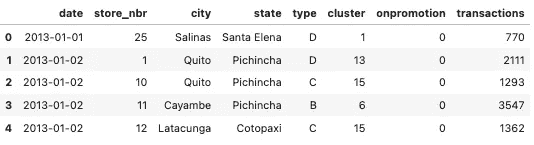

作者图片

总的来说，当我在这个数据集上做 EDA 时，我比以前更加强调讲故事的方面。我过去的大多数分析都没有明确的方向，也没有一个好的理由来支持我对变量的选择。简而言之，与其说我的分析有明确的目标，不如说是大海捞针。这一次，我采取了不同的方法，从 [Chaya Bakshi](https://medium.com/u/e49ad09c9fd1?source=post_page-----1ed24cba2c52--------------------------------) 那里得到建议，为我想通过我的数据(和我的潜在观众想听到的)精心制作的“叙述”想出一个连贯的大纲。这包括在直接进入 Jupyter 笔记本之前建立相关的假设和问题，选择相关的功能和可视化子集来支持您的主张，并在问题的背景下浓缩您的发现的关键要点和含义。这种以故事为中心的思维方式有助于我理解应该如何处理新的数据集以及如何进行更好的 EDA，我鼓励你在进行 EDA 时记住自己的叙述。我的完整文章可以在[这里](https://docs.google.com/document/d/17K_Orm-841ehCpNxM86i9xVOcd3ARoUdNV-BwFXaDFY/edit)访问，而[这里](https://github.com/irenechang1510/sales-analysis/blob/main/promotion_analysis.md)是笔记本的链接(第 1 — 4 节)。


克里斯·利维拉尼在 [Unsplash](https://unsplash.com?utm_source=medium&utm_medium=referral) 上的照片

# 促销的时间序列分析

EDA 的最后一部分，提升，需要一些额外的模型构建步骤。我已经将离散的目标变量——on promotion——转换成一个二元变量，因为我的目标是比较两组:促销与不促销。由此，作为一个时间序列的初学者，我不确定应该使用什么样的模型或软件包。后来在这个项目中，我意识到 pmdarima 对于这个特定的任务是一个非常有用的工具，但当时，我不知道它如何适用于我的工作，或者我甚至不知道我是否需要 arima(这本[电子书](https://otexts.com/fpp2/arima.html)包含了对 ARIMA 和其他关键时间序列知识的大量描述)。因此，我将我的分析范围缩小到一个更细粒度的级别，并试图首先为它找到一个正确的模型。我选择的数据子集包括基多市 1 号商店的杂货 I 产品的每日销售信息。最初的可视化显示了两组之间潜在的显著差异，这是我们正在挖掘的关系。

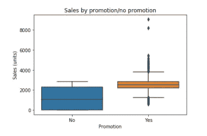

作者图片

## 2.1 找到合适的模型

在非时间序列问题中，解决方案可以是使用双样本 t 检验来查看销售额是否有任何显著差异。然而，这种类型的统计测试中的一个假设是数据点之间的独立性，这是时间序列数据通常无法实现的，除非该序列是平稳的(阅读更多[此处](https://stats.stackexchange.com/questions/19715/why-does-a-time-series-have-to-be-stationary))。我一直在寻找一个替代方案，直到我偶然发现了[这个](https://stats.stackexchange.com/questions/118425/using-2-sample-t-test-in-time-series-data)讨论:我需要的是一种 ARIMA 模型，它包含一个*外生变量，在我的例子中，就是二进制 onpromotion 特性。*

*在确定合适的 ARIMA 模型时，我发现这篇文章非常有帮助。出于学习的目的，我从手动选择模型的阶数开始。以下是我从中学到的一些主要经验:*

*   *为了获得时间序列的**趋势**和**季节性**的总体感觉，我使用了 statsmodel 中一个流行的函数 seasonal_decompose，以及 plot_acf 和 plot_pacf 来可视化数据。在这里，例如，季节性成分和 ACF，PACF 图表明一个非常明显的模式，似乎是一个周周期。在这种情况下，我们肯定需要一个**季节性 ARIMA**——带有外生变量( **SARIMAX** )。*

*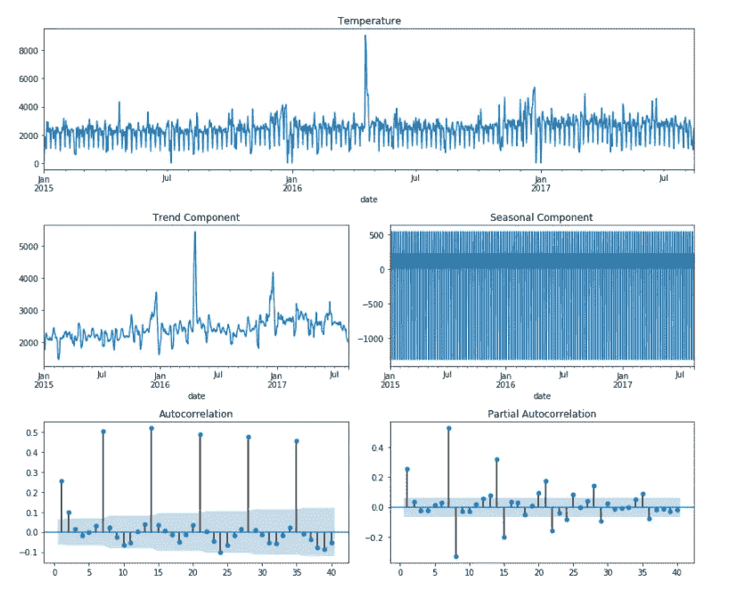*

*作者图片*

*   *接下来是对数据进行更深入的技术性分析。对于 ***平稳性*** ，这篇来自 Heiko 的[文章](/when-a-time-series-only-quacks-like-a-duck-10de9e165e)提供了一个非常彻底的检查平稳性的过程，包括使用 KPSS 和阿德富勒测试(两个最常见的平稳性测试)。规则是，如果任何一个测试表明序列不是平稳的，就要区别对待。为了实现平稳性，我们可以使用 pmdarima 库中的函数 **ndiffs()** 来帮助确定差值的阶数，并使用两个测试中的 **max** 建议阶数来获得相应的差值。*注意*:如果差分后得到的 ACF/PACF 图下降到大的负值(像我下面的)，很可能我们过度差分了，我们应该恢复到较低的差分顺序，或者完全不做。*

*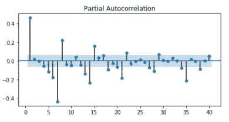*

*作者图片*

*   *对于 ***季节性*** ，差分顺序主要基于 ACF/PACF 图。看上面的例子，ACF 和 PACF 地块每隔 7 或 8 个滞后期就有一个尖峰，表明季节顺序为 7(周模式)。Pandas 的 autocorrelation_plot()函数可用于检查差分序列是否成功去除了季节性。如果图中的模式在 0 线附近显示出小的下降的波动，你就可以开始了(这意味着季节性模式随着时间的推移正在快速消失)。*

*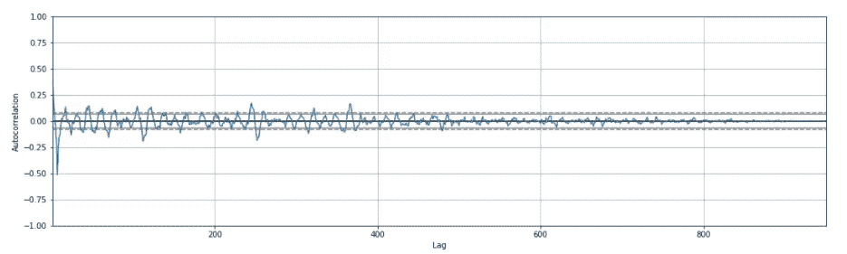*

*作者图片*

*   *接下来是为这个时间序列模型选择术语顺序的最重要部分！杜克大学精心列出的这套规则对于确定萨里玛的顺序和了解模型中每个术语背后的含义是一个很好的参考。*

*选择订单后，我开始使用 statsmodel 包构建 SARIMAX 模型并检查摘要:*

```
*from statsmodels.tsa.statespace.sarimax import SARIMAX# fitting the model
model = SARIMAX(continuous_date.sales, exog=continuous_date.bool_promotion, order=(1,0,2), seasonal_order=(1,1,1,7), enforce_invertibility=False, enforce_stationarity=False).fit(max_iter=50, method='powell')# model summary
print(model.summary())*
```

*这个特定模型的诊断图显示了相当好的拟合。用于预测时，它紧跟真实趋势。由于我们的重点是 bool_promotion 变量的估计值/系数，我认为这个模型足够好，可以用在我们的分析中。*

*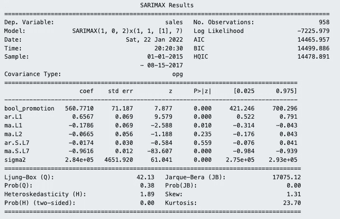*

*模型摘要—作者图片*

*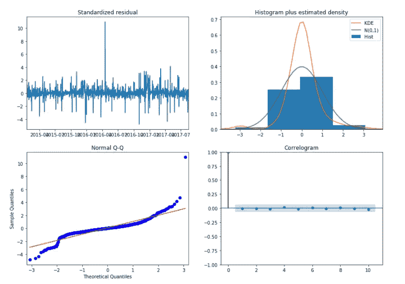*

*诊断图-作者提供的图像*

*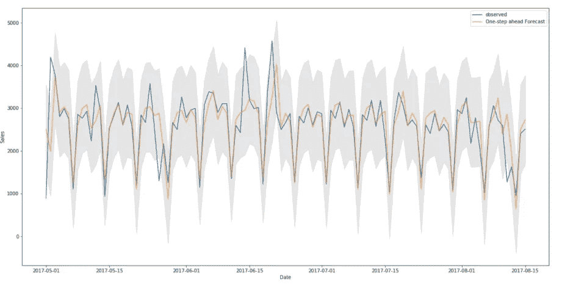*

*预测-作者的图像*

*正如我们从模型摘要中看到的，我们的 bool_promotion 变量是显著的，这意味着它显示出对商店 1 中杂货 I 的销售有影响，在本例中，是积极的。促销活动为这一组合增加了 500 多套产品。*

## *自动化其他组合的流程*

*在弄清楚了这些步骤的流程之后，我使用 auto_arima()为其他商店-城市-产品组合自动化了这个过程，这有助于我们确定最合适的订单集，记录这些订单以及系数。首先，我创建了一个助手函数来标识必要的参数并训练 auto_arima()。*

*一个对我来说很棘手的参数是参数 m，它是[季节差异](https://robjhyndman.com/hyndsight/seasonal-periods/)的周期。我(幸好！)找到了一个帮助我估计这个参数的函数，快速傅立叶变换季节性检测器(在这里阅读文档[)。它返回一个或几个可能的季节周期值。我将 m 的值限制为不超过 30(月模式)，因为它大大减少了训练时间，并且因为我只使用了过去一年半的数据(更近的数据)，任何数百的季节性周期(相当于数据集中只有 2-3 个周期)都可以被认为是非季节性的(模式不够强)。](https://facebookresearch.github.io/Kats/api/kats.detectors.seasonality.html)*

*为了检查数据集中可用的 1597 种组合，我制作了一个并行化脚本，显著加快了整个训练过程。该脚本做了几件事:(1)它在每次迭代中将训练的状态写入 progress.txt，这包括拟合每个组合的数据的最佳 SARIMAX 模型的顺序；(2)跟踪促销对销售有统计上显著影响的模型；(3)将所有“重要”组合写入结果文件，用于将来的再现目的。*

**注意:多处理包中的池方法将帮助你在多个处理器上同时完成相同的任务。通过使用 apply_async，每个 SARIMAX 模型都被训练并在结束时写入文件。任务是连续排队的，所以它们不会等待对方开始，这大大加快了整个过程。**

## *分析结果*

*有了这个模型，我可以用多种方式分析结果。首先，我选择分析重要的模型，以及它们是如何分布在各个位置的。我检查了不同地区所有组合中重要组合的数量和比例。*

*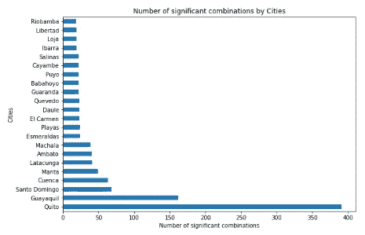*

*重要组合计数-按作者分类的图像*

*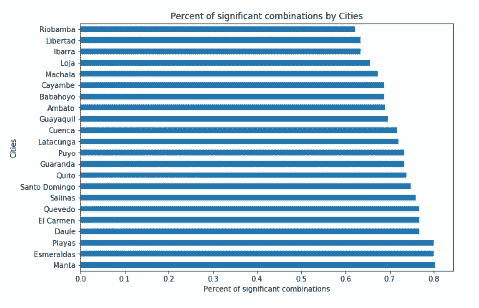*

*重要组合的比例—按作者分类的图像*

*基多和瓜亚基尔是组合最重要的城市，因为它们是厄瓜多尔最大的城市。然而，普拉亚斯、曼塔、埃尔卡门是促销活动最有效的城市，几乎 80%的促销活动导致了销售额的显著变化。类似地，我还调查了跨产品的计数和比例(只有 8 个顶部和 8 个底部产品)。*

*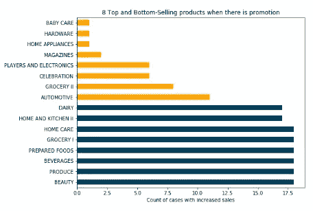**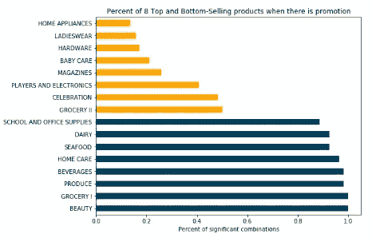*

*随着促销的出现，像美容和食品杂货这样的产品在 100%的时间里有销售变化，而像五金和家用电器、婴儿护理等产品只在 20%的时间里有这种变化。一直对促销做出反应的产品包括非常必要的产品，或者人们可能正在等待促销来购买的产品(最爱)。而且还发现这些都是积极的反应(导致销量增加)。*

*对这些系数分布的分析表明，大多数系数都非常积极，但有 24 个实例表明促销会降低销售额。*

*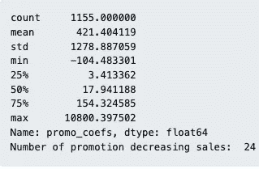*

*系数分布-按作者分类的图片*

*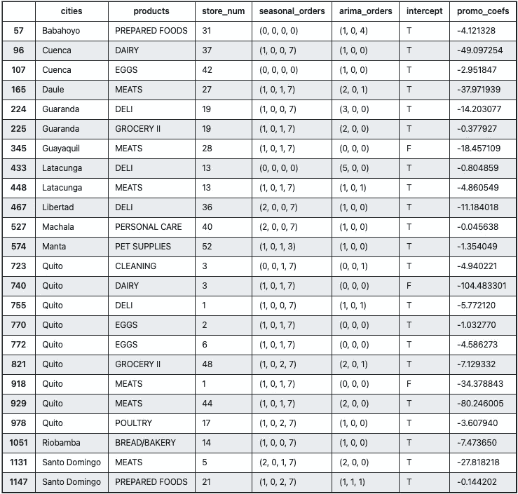*

*促销降低销售额的案例——作者图片*

*对促销不良反应案例的进一步观察表明，它们大多是乳制品、肉类和预处理产品。这是有道理的，因为促销这些产品的目的是为了在到期日之前清理库存。正如之前指出的，这些产品接近保质期的事实解释了为什么销量整体下降。相反地，*

*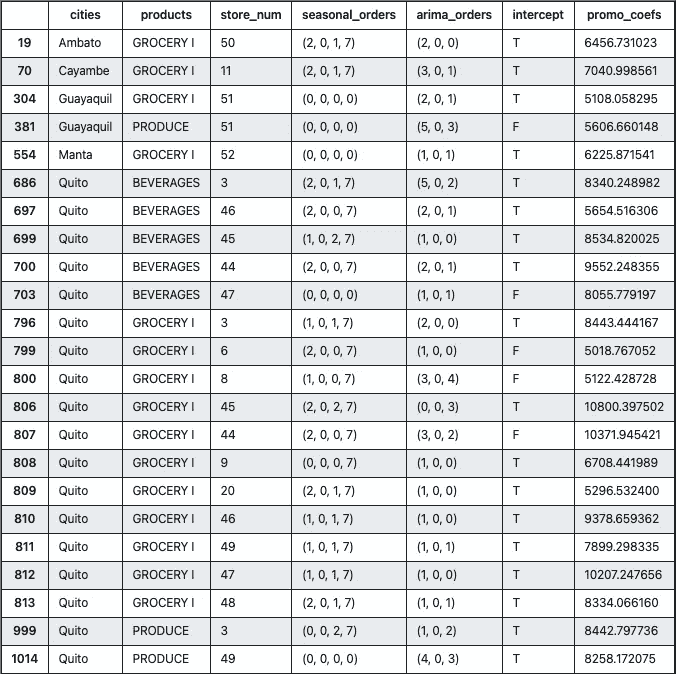*

*促销增加销售额的案例——作者图片*

*食品杂货、饮料和几种农产品在促销时销量增加了 5000 多件。*

## *结论*

*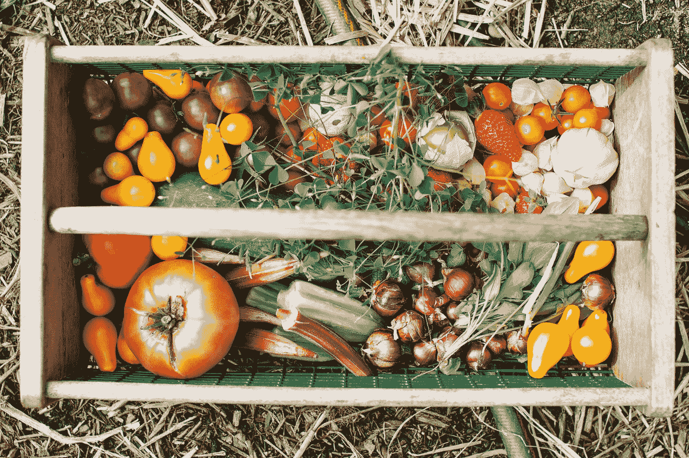*

*佐伊·谢弗在 [Unsplash](https://unsplash.com?utm_source=medium&utm_medium=referral) 上的照片*

*超过 70%的促销活动对销售有积极的影响，其中大部分会极大地提高某些产品的销售量。促销对销售的影响因地点和产品而异。有些产品在促销活动中销售额高达 100%,而有些则略有下降。一些城市有更多但效果较小的促销活动，一些城市有更少但效果较大的促销活动。我们可以利用这种分析来调整即将到来的促销策略。建议包括:在曼塔、圣多明各、多乐等促销数量和质量都很好的城市开展更多的促销活动；饮料和美容产品的促销可以用来提高某些商店和城市的销售额，如里奥班巴，那里的销售额通常较低。*

*这就是我的分析，非常感谢您的阅读！这部分的全部降价可以在[这里](https://github.com/irenechang1510/sales-analysis/blob/main/promotion_analysis.md#4-analysis-of-the-results)找到。下一步可能是利用这些信息建立一个模型，利用促销和其他变量来预测销售。除此之外，我希望这对那些开始着手时间序列项目的人有所帮助。欢迎通过我的 [LinkedIn](https://www.linkedin.com/in/irene-chang-4356a013a/) 在我的帖子上留下任何问题/反馈，我很乐意联系并回复他们！*

# *参考资料:*

*MySQL 文档:【https://dev.mysql.com/doc/ *

*Kaggle Knowledge 上的开源数据集:[https://www . ka ggle . com/c/store-sales-time-series-forecasting/overview/description](https://www.kaggle.com/c/store-sales-time-series-forecasting/overview/description)*

*[](https://people.duke.edu/~rnau/arimrule.htm)  [](/the-complete-guide-to-time-series-analysis-and-forecasting-70d476bfe775)  [](https://machinelearningmastery.com/arima-for-time-series-forecasting-with-python/)  [](https://www.machinelearningplus.com/time-series/arima-model-time-series-forecasting-python/) *