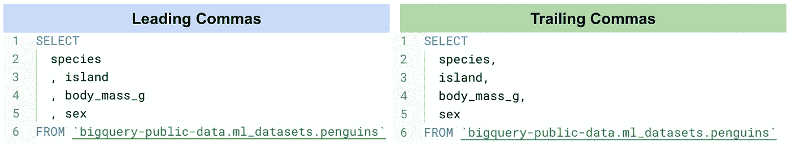
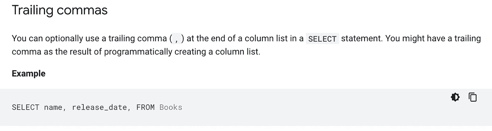
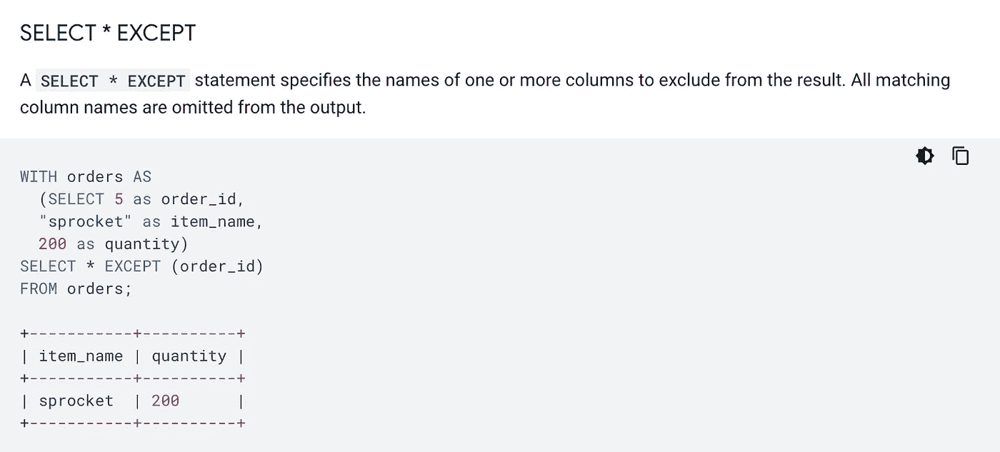

# SQL:尾随逗号还是前导逗号？

> 原文：<https://towardsdatascience.com/sql-trailing-or-leading-commas-d28ea102200f>

## ，我们一直都错了吗？


由[法尔扎德](https://unsplash.com/@euwars?utm_source=medium&utm_medium=referral)在 [Unsplash](https://unsplash.com?utm_source=medium&utm_medium=referral) 上拍摄的照片

虽然 SQL 代码编写风格可以说是一种因人而异的艺术，但有一些准则通常是大多数 SQL 从业者所遵循的。这样的指导方针将使脚本更具可读性，更容易理解，并帮助我们更好地调试或发现错误。这包括适当的缩进、间距、字母大写、别名和常用表格表达的使用(CTE)。然而，到目前为止，关于逗号的位置还没有一个明确的、普遍接受的标准。

逗号应该放在每行之后(结尾)还是之前(开头)？一种风格实际上比另一种好吗？通过查阅 SQL 从业者的许多意见、研究和网上可用的风格指南，我发现选择任何一种风格总是有强有力的令人信服的理由。

作为我目前工作的一部分，我每天都写 SQL 代码。看我自己的团队和公司的其他团队，我见过有人用尾随逗号或前导逗号来写。幸运的是，我还没有看到任何人混合这两种风格。如果你正在混合这两种风格，我建议你选择一种，忠于你的阵营！



尾随逗号与前导逗号|作者图片

# 尾随逗号的大小写

使用尾随逗号(逗号放在一行的末尾)的最强情况肯定是为了自然的人类可读性。据我所知，所有人类语言都会在一个句子或一个单词后面加上逗号，而不是在前面。这当然是最直观的。

例如:

```
I would like to learn three things: play the guitar, play the piano, and go for a vacation.
```

以上比:

```
I would like to learn three things: play the guitar , play the piano , and go for a vacation.
```

当我们在一个句子或一个单词后面加一个逗号时，我们本能地知道这个句子或这个列表还没有结束。我们的大脑自然会认为逗号后面会有其他单词和句子。

尾随逗号样式是使用最广泛的样式。从我谈论和查看各种人写的代码的经验，以及从网上找到的研究和文章来看，这是真的。绝大多数 SQL 从业者在行后写逗号，就像我们在人类语言中一样。

代码编写风格不仅仅是为了方便作者，还包括是否容易被其他人理解，例如代码评审者、其他团队成员甚至未来的团队成员。

# ，前导逗号的大小写

上面的标题你觉得不自然吗？这不是印刷错误。欢迎来到逗号营。

## ，更安全也更容易注释掉最后一项

人们选择前导逗号的最大原因之一是因为这样更容易注释掉最后一行，而不会留下不必要的尾随逗号，这可能导致语法错误。

如果我们在末尾添加逗号，当我们注释掉最后一个选中的列时，会导致末尾出现不必要的逗号。在下面的例子中，如果我们注释掉*性别*列，我们将在*身体质量 g* 列后留下不必要的逗号。这将给我们带来一个语法错误，或者让我们不得不做一个额外的步骤来删除逗号。

```
SELECT species, island, body_mass_g, --sexFROM `bigquery-public-data.ml_datasets.penguins`
```

如果我们遵循前导逗号样式，就不会发生这种情况。在我们注释掉*性别*列之后，我们就不会在后面留下一个不必要的逗号了。没有语法错误，也不需要额外的步骤来删除逗号。

```
SELECT species , island , body_mass_g --sexFROM `bigquery-public-data.ml_datasets.penguins`
```

尽管在所选列的末尾留下逗号在一些 SQL 语言中是一个语法错误，但这对于 Google BigQuery 标准 SQL 来说不是问题。事实上，它的[文档](https://cloud.google.com/bigquery/docs/reference/standard-sql/lexical#trailing_commas)专门解决了这个问题。给出的原因是为了帮助我们以编程方式创建列列表。



Google BigQuery |图片中的尾随逗号来自 [Google BigQuery 文档](https://cloud.google.com/bigquery/docs/reference/standard-sql/lexical#trailing_commas)

## ，更容易发现遗漏的逗号

当我们使用前导逗号时，项目/列是垂直排列的，都以逗号开始。很容易发现我们漏掉逗号的情况。另一方面，如果我们使用尾随逗号，我们的眼睛需要在屏幕上移动(因为列名的长度不同)，这很容易出错。

# 额外:Google BigQuery 文档怎么说？

尽管我在 BigQuery 文档中找不到提倡这两种风格的风格指南，但我可以根据他们在文档中使用的风格做出合理的推断。

例如，在解释除了之外的 *SELECT *的用法时，下面是 Google BigQuery 文档中的例子*



Google BigQuery 使用来自 [Google BigQuery 文档](https://cloud.google.com/bigquery/docs/reference/standard-sql/query-syntax#select_except)的尾随逗号|图像

是的，我们可以看到这里使用了尾随逗号。但是，这绝不是告诉我们使用尾随逗号和前导逗号是更好的样式。

# 结论

风格是一门艺术，情人眼里出西施。使用前导逗号可能会提高生产率，但是尾随逗号使用得更广泛，越来越多的人习惯了它。你有没有发现前导逗号更有效率，但却有很大的惯性去摆脱尾随逗号的阵营？或者您是否发现结尾的逗号更直观，但却经常出现与逗号相关的语法错误？

所以，我再一次给你两个选择:

尾随逗号？

或者

，前导逗号？

一定要看看我的其他文章:

[](https://medium.com/learning-sql/reproducible-random-split-in-bigquery-sql-for-beginners-f36a5825528)  [](/7-data-visualization-best-practices-everyone-must-know-b68ebe329b1e)  [](/data-science-career-switch-is-masters-degree-worth-it-part-2-1110c3440e4b)  

在 LinkedIn 上关注我:[https://www.linkedin.com/in/nathanthandoko/](https://www.linkedin.com/in/nathanthandoko/)