# SQL 窗口函数面试问题

> 原文：<https://towardsdatascience.com/sql-window-functions-interview-questions-d194c9e853d>

## *这里有一篇文章可以帮助你回答需要了解 SQL 窗口函数的 SQL 面试问题*


作者在 [Canva](https://canva.com/) 上创建的图片

如果你想从事数据科学工作——如果你不想，你就不会读这篇文章——你必须精通至少两个领域:SQL 和工作面试。是的，两者都是需要练习的技能。

当我们说 SQL 时，这是一个非常广泛的领域，甚至它的创建者也可能不了解它的一切。没有必要告诉你应该学习“完整的”SQL 来获得一份数据专业人员的工作。为什么？因为你不需要！去骑自行车，游泳，看书。盯着墙壁看油漆变干比学习“整个”SQL 更有意义。

你需要的是对**一些** SQL 概念的深入了解。你在实践中会用到的。窗口函数就是其中之一。面试官喜欢他们，你也会喜欢他们，因为他们真的会让你的日常工作变得更容易。

工作面试呢？这算什么技能？这难道不是你找工作必须经历的可怕事件吗？是的，它是。但不仅如此！当我们谈到它是一项技能时，我们指的是有一个清晰的方法来回答 SQL 问题。

编写正确的 SQL 代码很重要，不要误解我们。但是有一个解决面试问题的框架也同样重要。这不是一个委婉的说法。有一个好的框架，你会更容易写出完美的代码。即使你搞砸了，每个人有时都会这样，你也会因为你的过程和思考方式而得分。

# SQL 窗口函数到底是什么？

你还不知道吗？别担心，有一个 [SQL 窗口函数](https://www.stratascratch.com/blog/the-ultimate-guide-to-sql-window-functions/?utm_source=blog&utm_medium=click&utm_campaign=medium)指南，在那里你会学到更多你想知道的东西。

对于那些已经熟悉窗口函数的人来说，在我们开始解决 SQL 窗口函数面试问题之前，有一个简短的提醒。

窗口函数通常被视为 SQL 聚合函数[的更豪华版本](https://www.stratascratch.com/blog/the-ultimate-guide-to-sql-aggregate-functions/?utm_source=blog&utm_medium=click&utm_campaign=medium)。您已经知道，聚合函数从多行中获取值并返回一个值。没错，这就是数据聚合。最常用的聚合函数是 SUM()、COUNT()、AVG()、MIN()和 MAX()。

它们通常用在 GROUP BY 子句中。这样，数据可以在多个列上聚合，这扩展了聚合函数的分析能力。

但是，它们仍然不保留作为聚合基础的单个行。窗口函数有，这是两者的主要区别！换句话说，SQL 窗口函数允许您聚合数据并显示聚合背后的分析背景。

但是，窗口的功能还不止这些。它们大致分为三类:

*   聚合窗口函数
*   排名窗口函数
*   值窗口函数

你可以在上面的指南中读到所有关于它们的内容。我们是来给你看实际例子的，不是用理论把你烦死的。因此，让我们设置一下解决 SQL 窗口函数面试问题的方法，看看如何将其应用于测试您的窗口函数知识的问题。

# 如何接近 SQL 窗口函数面试问题？


作者在 [Canva](https://canva.com/) 上创建的图像

构成解决问题的“正确”方法的唯一东西是使它结构化。所有其他事情都不太相关。方法因人而异，取决于你的思维方式和你觉得舒服的方法。

我们被证明是成功的方法包括以下步骤。

1.  探索数据集
2.  确定用于解决问题的列
3.  写出代码逻辑
4.  编码

## 1.探索数据集

面试问题通常有一个具体的数据集，你应该使用它来提出解决方案。

数据是以测试某些 SQL 概念的方式建立的。总是需要一些时间来了解数据类型，并检查数据是否有重复、空值或缺失值。这些都会影响你的代码和你必须使用的函数。

如果有多个表，检查这些表是如何相互连接的，如何连接它们，以及应该使用哪种连接。

这并不总是可能的，但是如果可能的话，预览数据本身。这将有助于您获得一个更清晰的画面，并可能找到您仅通过查看列名和数据类型可能会遗漏的一些内容。

## 2.确定用于解决问题的列

少不是多，但通常足够了！大多数问题会给你比你需要写一个解决方案更多的数据。用这个步骤去掉你不需要的列，写下你需要的列。

## 3.写出代码逻辑

顾名思义:将代码分成逻辑块，并按步骤写下来。通常，“逻辑”指的是你将要使用的功能。给步骤编号，写下函数，并简要描述你将如何以及为什么使用它。

如果您愿意，也可以编写一个伪代码，您只需用面试问题中的实际数据来填充它。

当你写代码逻辑的时候，用这一步和面试官一起检查你是否朝着正确的方向前进。一旦你写出了代码逻辑，编码几乎就是一个技术问题。

## 4.编码

大部分思考都是在前面的步骤中完成的。这将使代码编写容易得多，因为您已经想好了大部分问题。现在，您可以专注于编写高效的代码，并有更多的带宽来处理出现的任何问题。

# SQL 面试问题中的窗口函数


作者在 [Canva](https://canva.com/) 上创建的图像

现在，你们一直在等待的事情:解决实际的 SQL 窗口函数面试问题！

# 问题#1 汇总窗口函数:平均工资

创建一个类似于 Salesforce 所要求的分析是非常常见的，这是一个窗口函数与聚合函数相比有多么相似和不同的完美例子。

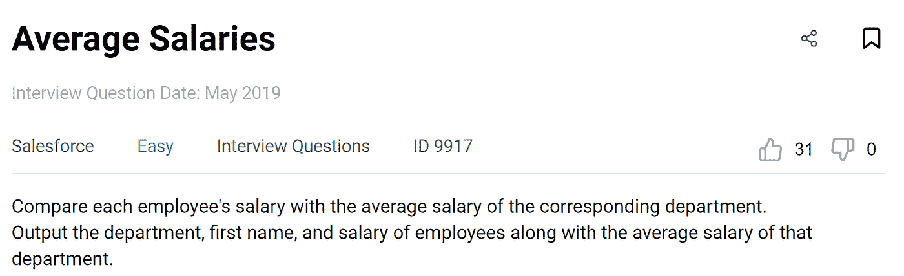

如果你想和我一起关注，这里有一个问题链接:【https://platform.stratascratch.com/coding/T2[9917-平均工资](https://platform.stratascratch.com/coding/9917-average-salaries?code_type=2)

## 解决方法

**1。探索数据集**

您得到了一个表 **employee** ，它包含以下列和数据类型。

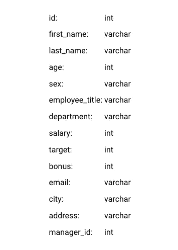

这是一个相当标准的表格，其中有关于公司雇员的数据。我们最感兴趣的是他们的薪水，表格记录这些数据有两种可能性:

1.  显示历史工资
2.  显示最新的实际工资

第一种情况意味着雇员和所有其他数据可能是重复的，同一个雇员有不同的工资值。

第二个选项是这里没有重复的雇员，即每个雇员只出现一次。

我们不知道，但我们可以问面试官，或者更好的是，预览表格中的数据。

**表:**员工

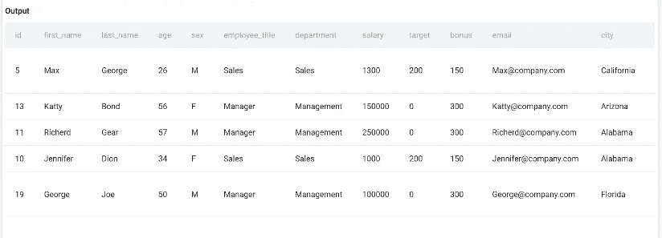

这个预览只显示了前几行，但是请相信我，没有重复的。知道这一点很重要。我们现在知道，我们不必删除重复项来确保工资数据不会因为多次包含一名员工而失真。

**2。识别用于解决问题的列**

这个 SQL 窗口函数面试问题给出了关于应该输出哪些列的简单说明:

*   部门
*   名字
*   薪水

它还要求按部门显示平均工资。为此，我们将再次使用 salary 列。您可以忽略所有其他列。

**3。写出代码逻辑**

该解决方案可分为两步:

1.  从表**雇员** —部门，名字，薪水中选择列
2.  AVG()作为窗口函数—获取各部门的平均工资

**4。编码**

剩下要做的就是将这两个步骤翻译成 SQL 代码。

*1。选择列*

```
SELECT department,
       first_name,
       salary
FROM employee;
```

*2。AVG()窗口功能*

通过完成第二步，您得到了最终的代码。

```
SELECT department,
       first_name,
       salary,
       AVG(salary) OVER (PARTITION BY department)
FROM employee;
```

“薪金”列是 AVG()函数中的一个参数。但是，我们想输出按部门的平均工资，这就需要窗口函数。

窗口函数总是由 OVER()子句调用。可选子句之一是 PARTITION BY。它的目的是将数据分成我们希望窗口函数应用的子集。换句话说，如果数据按列 department 进行分区，那么 window 函数将返回按部门划分的平均工资。

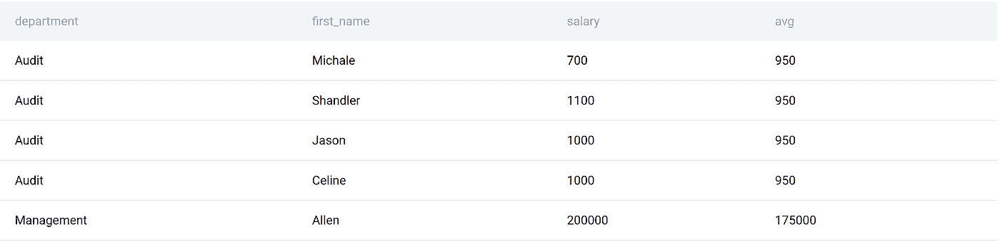

如果只使用聚合函数，就无法同时显示分析数据和部门平均值。这就是窗口功能的威力！

这里，输出显示了每个雇员及其工资以及相应部门的平均工资。你甚至可以进一步分析哪些员工高于或低于部门或公司的平均水平。这样你就可以决定调整工资以使其更加公平。

# 问题#2 排名窗口功能:最畅销的商品

聚合窗口函数的功能与“常规”聚合函数相同，只是更加复杂。

然而， [SQL 排名函数](https://www.stratascratch.com/blog/an-introduction-to-the-sql-rank-functions/?utm_source=blog&utm_medium=click&utm_campaign=medium)比这更进一步。它们为您提供了对数据进行排序的可能性，这是聚合函数所做不到的。

处理数据意味着你要做很多排名。在业务中，创建显示诸如最高销售额、收入周期或最畅销商品等数据的报表几乎是每天的要求。

亚马逊的问题反映了这一点。

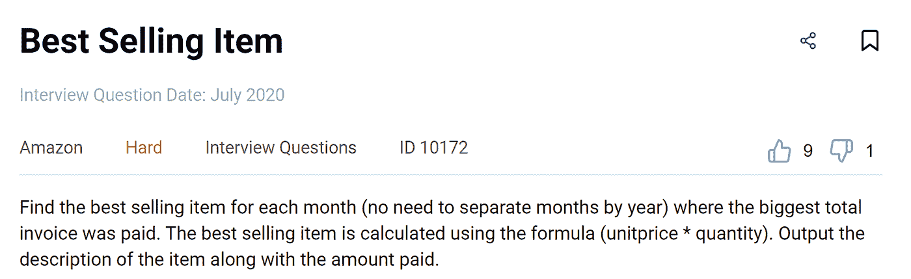

如果你想和我一起关注，这里有一个问题链接:[https://platform . stratascratch . com/coding/10172-best-selling-item](https://platform.stratascratch.com/coding/10172-best-selling-item?utm_source=blog&utm_medium=click&utm_campaign=medium)

## 解决方法

**1。探索数据集**

数据集同样只包含一个表: **online_retail** 。

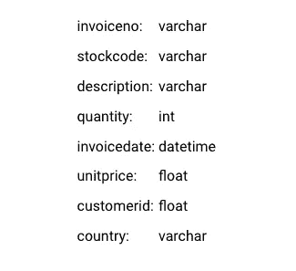

公平的假设是，这是一个在线订单列表。发票号码可能是唯一的，而其他数据可能是重复的。

数据概览证实了这一点。

**表:**在线 _ 零售

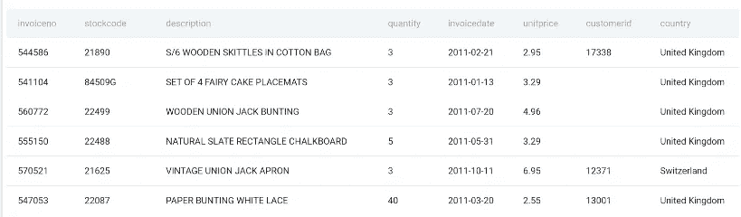

如果您看一下整个表，您会发现除了 invoiceno 之外的所有列都有重复的值。这是意料之中的，因为一个客户甚至可以在同一天下多个订单，而且是同一产品、相同数量和单价的订单。我们可以根据发票号这一栏来区分这些订单。

当然，也可能出现不同客户的几个不同订单是相同的情况。invoiceno 和 customerid 列是用来区分它们的。

同样，最畅销的商品是通过数量乘以单价计算出来的。单价是一种浮点数据类型，这意味着我们在相乘之前不需要转换任何数据。

**2。确定解决问题的列**

指令是输出项目描述和支付金额。

我们需要找到每月最畅销的商品。销售额是数量乘以价格。至于月份，我们有发票日期栏。

所有这些意味着我们需要下面的专栏来解决问题。

*   描述
*   单价
*   量
*   发票日期

**3。写出代码逻辑**

这是一个硬 SQL 窗口函数面试问题，需要比前一个问题更多的步骤。

1.  从表中选择描述**在线 _ 零售**
2.  DATE_PART() —从 invoicedate 获取月份
3.  SUM(单价*数量)—获取支付的总金额
4.  RANK()窗口函数—对每月支付的总金额进行排名
5.  分组依据-按月份和项目描述获取数据
6.  子查询-将其作为子查询写入 FROM 子句中
7.  从子查询中选择月份、描述和支付金额
8.  WHERE 子句—仅显示每月的最佳销售额

**4。编码**

*1。从表*中选择描述

```
SELECT description
FROM online_retail;
```

*2。日期 _ 部分()*

对 invoicedate 列使用 DATE_PART()函数来显示月份。

```
SELECT DATE_PART('month', invoicedate) AS month,
       description
FROM online_retail;
```

*3。SUM()*

将数量乘以商品价格，你将得到总销售额。然后合计同一个月同一商品的所有销售额。

```
SELECT DATE_PART('month', invoicedate) AS MONTH,
       description,
       SUM(unitprice * quantity) AS total_paid
FROM online_retail;
```

*4。RANK()窗口函数*

数据要按照月份排序。因为在这种情况下 SQL 不允许引用列别名，所以我们必须再次在 PARTITION BY 子句中使用 DATE_PART()函数。

OVER()中的另一个可选子句是 ORDER BY。我们按 total _ paid 列对数据进行排序。这又是一个别名，所以我们需要使用整个公式。我们将分区内的数据从最高到最低的总付费金额进行排序。

```
SELECT DATE_PART('month', invoicedate) AS month,
       description,
       SUM(unitprice * quantity) AS total_paid,
       RANK() OVER (PARTITION BY date_part('month', invoicedate)
                    ORDER BY SUM(unitprice * quantity) DESC) AS rnk
FROM online_retail;
```

*5。群组数据*

为了让这部分代码工作，需要按照月份和描述对数据进行分组。

```
SELECT DATE_PART('month', invoicedate) AS month,
       description,
       SUM(unitprice * quantity) AS total_paid,
       RANK() OVER (PARTITION BY date_part('month', invoicedate)
                    ORDER BY SUM(unitprice * quantity) DESC) AS rnk
FROM online_retail
GROUP BY month,
         description;
```

为了让您更容易理解这个查询做了什么，下面是它的输出。

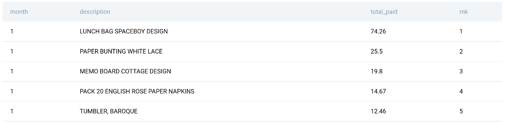

*6。使 SELECT 语句成为子查询*

现在，这个查询结果必须在另一个 SELECT 语句中使用。因此，我们需要使它成为一个子查询。

```
SELECT
FROM
  (SELECT DATE_PART('month', invoicedate) AS MONTH,
          description,
          SUM(unitprice * quantity) AS total_paid,
          RANK() OVER (PARTITION BY date_part('month', invoicedate)
                       ORDER BY SUM(unitprice * quantity) DESC) AS rnk
   FROM online_retail
   GROUP BY MONTH,
            description) AS rnk;
```

子查询名为 rnk，将被主 SELECT 语句用作 FROM 子句中的表。

7。从子查询中选择所需数据

输出必须显示月份、描述和销售额，所以我们必须在主选择中选择这些列。

```
SELECT month,
       description,
       total_paid
FROM
  (SELECT DATE_PART('month', invoicedate) AS MONTH,
          description,
          SUM(unitprice * quantity) AS total_paid,
          RANK() OVER (PARTITION BY date_part('month', invoicedate)
                       ORDER BY SUM(unitprice * quantity) DESC) AS rnk
   FROM online_retail
   GROUP BY MONTH,
            description) AS rnk;
```

8。使用 WHERE 子句显示每月最畅销的产品

一旦你过滤了数据，你就得到了问题的答案。

```
SELECT month,
       description,
       total_paid
FROM
  (SELECT DATE_PART('month', invoicedate) AS MONTH,
          description,
          SUM(unitprice * quantity) AS total_paid,
          RANK() OVER (PARTITION BY date_part('month', invoicedate)
                       ORDER BY SUM(unitprice * quantity) DESC) AS rnk
   FROM online_retail
   GROUP BY MONTH,
            description) AS rnk
WHERE rnk = 1;
```

该解决方案给出了以下输出。

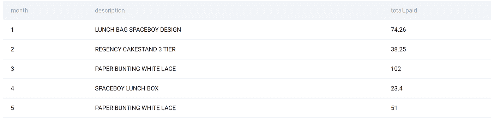

# 问题 3 价值窗口函数:年复一年的流失

值窗口函数为您提供了从其他行访问值的不同可能性。Lyft 的问题恰恰验证了这一点。

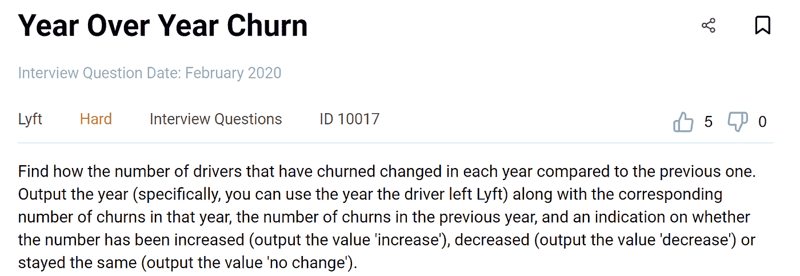

如果你想和我一起关注，这里有一个问题链接:[https://platform . stratascratch . com/coding/10017-over-year-over-year-churn](https://platform.stratascratch.com/coding/10017-year-over-year-churn?utm_source=blog&utm_medium=click&utm_campaign=medium)

## 解决方法

**1。探索数据集**

这里你将使用的一个表格是 **lyft_drivers** 。

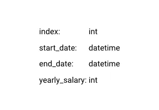

这是 Lyft 驱动程序的列表。识别它们的唯一方法是列索引，所以它应该是唯一的。start_date 不应为空，因为如果司机没有开始工作，他们就不会出现在列表中。但是，结束日期可能会有一些空值:如果为空，则司机仍在为 Lyft 工作。还有，每个司机都得有工资。

我们可以通过预览数据来证实我们的假设。

**表格:** lyft_drivers

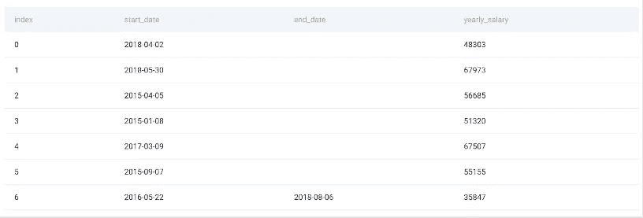

您会看到所有的索引值都是唯一的，所有的驱动程序都有开始日期和工资。这张预告图显示，从 0 到 5 的车手都还在，而 6 号车手已经在 2018 年 8 月 6 日离开。

**2。识别用于解决问题的列**

这个问题要求显示每年的数据，所以我们需要使用列 end_date。这是我们必须显式使用来获得解决方案的唯一列。

**3。写出代码逻辑**

这就是代码分解的方式。

1.  SELECT and DATE _ PART()-从结束日期获取年份
2.  WHERE 子句-仅显示离开公司的驾驶员
3.  子查询-将其作为子查询写入 FROM 子句中
4.  从子查询中选择年份
5.  计数(*) —统计每年离开公司的驾驶员人数
6.  LAG() —获取前一年离开公司的司机人数
7.  分组依据—显示年度级别的数据
8.  排序依据—从最早的年份到最新的年份对数据进行排序
9.  子查询和全选—也将它作为子查询写入 FROM 子句中，并从中选择所有列
10.  CASE 语句—将输出列标记为“增加”、“减少”和“无变化”

**4。编码**

*1。选择&日期 _ 部分()*

使用 DATE_PART()函数中的列 end_date 从表 **lyft_drivers** 中输出年份。

```
SELECT DATE_PART('year', end_date::date) AS year_driver_churned
FROM lyft_drivers;
```

此外，将年份格式化为日期类型。

*2。WHERE 子句*

我们将使用 WHERE 子句只显示那些离开公司的司机。通过检查可用数据，我们知道这些驱动因素在列 end_date 中具有非空值。

```
SELECT DATE_PART('year', end_date::date) AS year_driver_churned
FROM lyft_drivers
WHERE end_date IS NOT NULL;
```

在我们把它变成子查询之前，让我们看看这部分代码返回什么。


这是一个年份列表，每一年代表一个离开的车手。年份是重复的，因为那一年可能有不止一个车手离开。

*3。将 SELECT 写为子查询*

该子查询必须出现在主查询的 FROM 子句中，因此它可以用作表。子查询的名称是 base。

```
SELECT
FROM
(SELECT DATE_PART('year', end_date::date) AS year_driver_churned
      FROM lyft_drivers
WHERE end_date IS NOT NULL) AS base;
```

*4。从子查询*中选择年份

我们需要选择的列是 year_driver_churned。

```
SELECT year_driver_churned
FROM
  (SELECT DATE_PART('year', end_date::date) AS year_driver_churned
   FROM lyft_drivers
   WHERE end_date IS NOT NULL) AS base;
```

*5。统计离开公司的司机人数*

我们将使用 COUNT(*)函数。它将计算行数，这等于驱动程序的数量。

```
SELECT year_driver_churned,
       COUNT(*) AS n_churned
FROM
  (SELECT DATE_PART('year', end_date::date) AS year_driver_churned
   FROM lyft_drivers
   WHERE end_date IS NOT NULL) AS base;
```

*6。使用 LAG()窗口函数*

现在有趣的部分来了！LAG()函数允许您从前面的行中访问数据。我们将使用它来查找前一年离职的司机人数。

```
SELECT year_driver_churned,
       COUNT(*) AS n_churned,
       LAG(COUNT(*), 1, '0') OVER (
                                   ORDER BY year_driver_churned) AS n_churned_prev
FROM
  (SELECT DATE_PART('year', end_date::date) AS year_driver_churned
   FROM lyft_drivers
   WHERE end_date IS NOT NULL) AS base;
```

LAG()中的第一个参数是我们要返回的值，它是驱动程序的数量。

整数 1 是我们想要返回的与当前行相关的行数。换句话说，后退一行意味着我们后退一年。

文本值“0”指定没有以前的值时要返回的值。这意味着，当我们显示第一个可用年份时，前一年的客户流失率将为零。如果省略该参数，默认值将为 NULL。

OVER()子句中的数据按年份升序排序。这样，我们就按时间顺序对数据进行排序，因此前一行总是指前一年。

*7。按年份分组*

这部分代码将把同一年离开的所有驱动程序组合在一起。

```
SELECT year_driver_churned,
       COUNT(*) AS n_churned,
       LAG(COUNT(*), 1, '0') OVER (
                                   ORDER BY year_driver_churned) AS n_churned_prev
FROM
  (SELECT DATE_PART('year', end_date::date) AS year_driver_churned
   FROM lyft_drivers
   WHERE end_date IS NOT NULL) base
GROUP BY year_driver_churned;
```

*8。使用 ORDER BY 按时间顺序对输出进行排序*

输出按 year_driver_churned 列排序。

```
SELECT year_driver_churned,
       COUNT(*) AS n_churned,
       LAG(COUNT(*), 1, '0') OVER (
                                   ORDER BY year_driver_churned) AS n_churned_prev
FROM
  (SELECT DATE_PART('year', end_date::date) AS year_driver_churned
   FROM lyft_drivers
   WHERE end_date IS NOT NULL) base
GROUP BY year_driver_churned
ORDER BY year_driver_churned ASC;
```

这两个 SELECT 语句给出了这个输出。

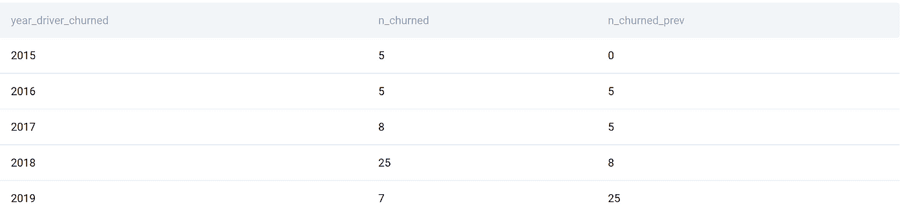

有 2015 年到 2019 年的数据。

数据告诉我们，2015 年有 5 名司机被解雇，而前一年没有司机被解雇，因为没有 2014 年的数据。2016 年，又有 5 名司机发生事故，与前一年持平。n_churned_prev 列获取前一年的数据，并将其显示在当前年份的行中。

*9。编写第二个子查询并从中选择所有数据*

同样，第二个子查询出现在 FROM 子句中。

```
SELECT *
FROM
  (SELECT year_driver_churned,
          COUNT(*) AS n_churned,
          LAG(COUNT(*), 1, '0') OVER (
                                      ORDER BY year_driver_churned) AS n_churned_prev
   FROM
     (SELECT DATE_PART('year', end_date::date) AS year_driver_churned
      FROM lyft_drivers
      WHERE end_date IS NOT NULL) base
   GROUP BY year_driver_churned
   ORDER BY year_driver_churned ASC) AS calc;
```

*10。标签数据使用案例*

CASE 语句将标记输出数据。如果产量高于上一年，这将意味着增加。如果更低，标签将是“减少”。当两者都不是时，它将被标记为没有变化。

通过编写 CASE 语句，您已经回答了这个 SQL 窗口函数面试问题。

```
SELECT *,
       CASE
           WHEN n_churned > n_churned_prev THEN 'increase'
           WHEN n_churned < n_churned_prev THEN 'decrease'
           ELSE 'no change'
       END
FROM
  (SELECT year_driver_churned,
          COUNT(*) AS n_churned,
          LAG(COUNT(*), 1, '0') OVER (
                                      ORDER BY year_driver_churned) AS n_churned_prev
   FROM
     (SELECT DATE_PART('year', end_date::date) AS year_driver_churned
      FROM lyft_drivers
      WHERE end_date IS NOT NULL) base
   GROUP BY year_driver_churned
   ORDER BY year_driver_churned ASC) AS calc;
```

至于产量，在这里。

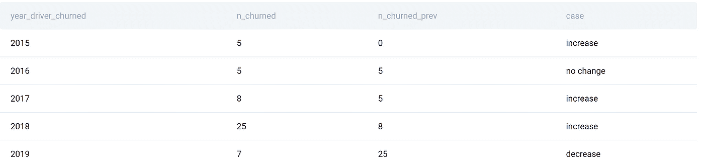

和我们之前展示的一样，只是这个有标签。

# 摘要

希望这三个例子向您展示了 SQL 窗口函数的强大功能。对于任何用 SQL 进行哪怕是非常有用的数据分析的人来说，它们都是必要的。

当然，你可以期待窗口功能在工作面试中出现。正因为如此，你应该花些时间练习。如果你想尽可能高效地准备面试，看看我们根据面试中测试的最流行的 SQL 概念精选的 [SQL 查询面试问题](https://www.stratascratch.com/blog/top-30-sql-query-interview-questions/?utm_source=blog&utm_medium=click&utm_campaign=medium)。