# Python 中的平方:如何在 Python 中平方一个数的 4 种方法

> 原文：<https://towardsdatascience.com/squaring-in-python-4-ways-how-to-square-a-number-in-python-20cd9b41f414>

## 在 Python 中，求一个数的平方的方法不止一种。学习 Python 平方的 4 种方法+列表的一些额外技巧。

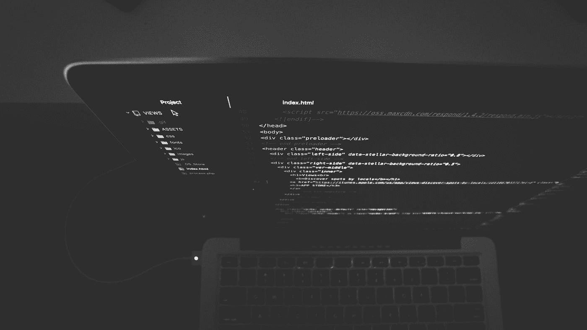

照片由[内特·格兰特](https://unsplash.com/@nateggrant?utm_source=medium&utm_medium=referral)在 [Unsplash](https://unsplash.com?utm_source=medium&utm_medium=referral) 上拍摄

如果你想用 Python 计算一个数的平方，你有很多选择。Python 平方有许多方法和途径，今天我们将探讨四种最常见的方法。您还将学习如何以三种不同的方式对 Python 列表求平方，稍后会详细介绍。

让我们从第一种 Python 平方方法开始——通过使用指数运算符(**)。

目录:

*   使用指数运算符(**)计算 Python 数的平方
*   Python 的数学库——使用 pow()函数的平方数
*   用简单的乘法计算 Python 数的平方
*   Numpy——如何用 Numpy 的 Square()函数计算一个数的平方
*   额外收获:Python 列表的 3 种平方方法
*   总结 Python 平方

# 使用指数运算符(**)计算 Python 数的平方

Python 中的星号运算符—`**`—允许你将一个数提升到任意指数。它也用于[打开字典](https://betterdatascience.com/python-dictionaries/)，但这是另一个话题。

在操作符的左边，你有你想要计算的指数，在右边，你有指数本身。例如，如果你想求数字 10 的平方，你可以写`10**2`——就这么简单。

让我们来看几个例子:

```
a = 5
b = 15
c = 8.65
d = -10

# Method #1 - The exponent operator (**)
a_squared = a**2
b_squared = b**2
c_squared = c**2
d_squared = d**2

# Print
print("Method #1 - The exponent operator (**)")
print("--------------------------------------------------")
print(f"{a} squared = {a_squared}")
print(f"{b} squared = {b_squared}")
print(f"{c} squared = {c_squared}")
print(f"{d} squared = {d_squared}")
```

下面您将看到代码单元的输出:

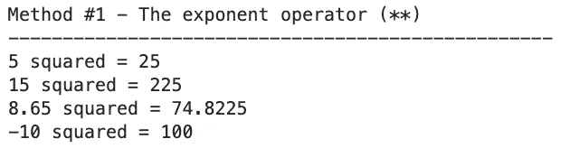

图片 1 —平方方法 1(图片由作者提供)

这就是你如何通过使用星号运算符来平方或提高一个数的二次方。

但是如果你想改变指数呢？只需更改操作员右侧的数字:

```
print("Method #1 - The exponent operator (**) (2)")
print("--------------------------------------------------")
print(f"{a} to the power of 3 = {a**3}")
print(f"{d} to the power of 5 = {d**5}")
```

代码输出:

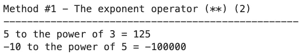

图片 2 —平方方法 1 (2)(图片由作者提供)

搞定一个，还剩三个。

# Python 的数学库——使用 pow()函数的平方数

[数学模块](https://docs.python.org/3/library/math.html)内置于 Python 中，并为数学函数提供了出色的支持。其中一个函数是`pow()`，它接受两个参数:

*   `x` -要平方或自乘的数字。
*   `y`——指数。

让我们修改前面的代码片段，改为利用`math`模块:

```
import math

a = 5
b = 15
c = 8.65
d = -10

# Method #2 - math.pow() function
a_squared = math.pow(a, 2)
b_squared = math.pow(b, 2)
c_squared = math.pow(c, 2)
d_squared = math.pow(d, 2)

# Print
print("Method #2 - math.pow() function")
print("--------------------------------------------------")
print(f"{a} squared = {a_squared}")
print(f"{b} squared = {b_squared}")
print(f"{c} squared = {c_squared}")
print(f"{d} squared = {d_squared}")
```

以下是输出结果:

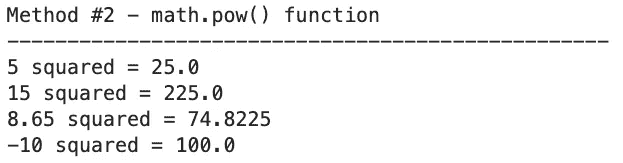

图片 3 —平方方法 2(图片由作者提供)

输出几乎与我们之前的一样，但是`math`模块将所有内容转换成浮点数，即使不需要它。请记住这一点，因为如果您明确想要整数，这是一个额外的转换步骤。

正如您所想象的，将一个数提升到任何其他指数就像更改第二个参数值一样简单:

```
print("Method #2 - math.pow() function (2)")
print("--------------------------------------------------")
print(f"{a} to the power of 3 = {math.pow(a, 3)}")
print(f"{d} to the power of 5 = {math.pow(d, 5)}")
```

代码输出:

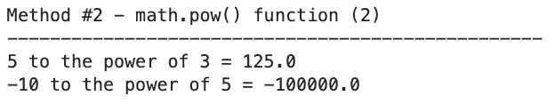

图片 4 —平方方法 2 (2)(图片由作者提供)

让我们来看看另一种更加手动的 Python 平方方法。

# 用简单的乘法计算 Python 数的平方

没有人阻止你在 Python 中通过将数字乘以自身来实现平方。然而，这种方法是不可伸缩的。如果你想简单地平方一个数，这没问题，但是如果你想把这个数提高到 10 的幂呢？

下面是一个如何通过将一个数乘以自身来对其进行平方的示例:

```
a = 5
b = 15
c = 8.65
d = -10

# Method #3 - Multiplication
a_squared = a * a
b_squared = b * b
c_squared = c * c
d_squared = d * d

# Print
print("Method #3 - Multiplication")
print("--------------------------------------------------")
print(f"{a} squared = {a_squared}")
print(f"{b} squared = {b_squared}")
print(f"{c} squared = {c_squared}")
print(f"{d} squared = {d_squared}")
```

结果与第一个示例中的结果相同:

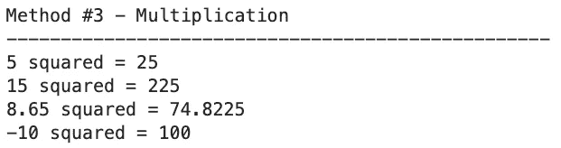

图片 5 —平方方法 3(图片由作者提供)

如果你想提高一个数字的指数，这种方法很快就会失败。您需要多次重复乘法运算，这很不方便:

```
print("Method #3 - Multiplication (2)")
print("--------------------------------------------------")
print(f"{a} to the power of 3 = {a * a * a}")
print(f"{d} to the power of 5 = {d * d * d * d * d}")
```

代码输出:

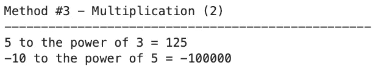

图片 6 —平方方法 3 (2)(图片由作者提供)

结果仍然是正确的，但是容易出错，如果使用其他方法就不会出错。

# Numpy——如何用 Numpy 的 Square()函数计算一个数的平方

Python 的 Numpy 库是数据科学家的圣杯。它可以轻松处理 N 维数组，但也可以处理标量。

Numpy 的`square()`函数将任意数字或数组提升到 2 的幂。让我们看看如何将它应用到前面的代码片段中:

```
import numpy as np

a = 5
b = 15
c = 8.65
d = -10

# Method #4 - Numpy
a_squared = np.square(a)
b_squared = np.square(b)
c_squared = np.square(c)
d_squared = np.square(d)

# Print
print("Method #4 - Numpy")
print("--------------------------------------------------")
print(f"{a} squared = {a_squared}")
print(f"{b} squared = {b_squared}")
print(f"{c} squared = {c_squared}")
print(f"{d} squared = {d_squared}")
```

结果显示如下:

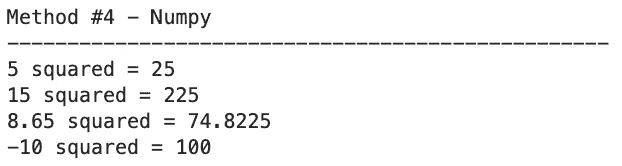

图 7 —平方方法 4(图片由作者提供)

`square()`函数的一个限制是它只能将一个数字/数组提升到 2 的幂。如果您需要不同的指数，请使用`power()`函数:

```
print("Method #4 - Numpy (2)")
print("--------------------------------------------------")
print(f"{a} to the power of 3 = {np.power(a, 3)}")
print(f"{d} to the power of 5 = {np.power(d, 5)}")
```

代码输出:

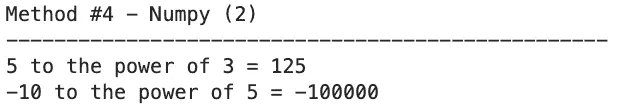

图 8 —平方方法 5(图片由作者提供)

这就是 Python 数的平方。接下来让我们看看如何对 Python 列表做同样的事情。

# 额外收获:Python 列表的 3 种平方方法

作为一名数据科学家，您将花费大量时间处理 N 维数组。知道如何对它们应用不同的运算，比如对每个数组项求平方，既实用又省时。本节将向您展示三种方法来平方 Python 列表。

## 方法 1 —循环

第一个，也是最低效的一个是循环。我们有两个 Python 列表，第一个存储数字，第二个存储数字的平方。然后，我们遍历第一个列表，计算每个数字的平方，并将其追加到第二个列表中。

代码如下:

```
arr = [5, 15, 8.65, -10]
squared = []

# Method 1 - Looping
for num in arr:
    squared.append(num**2)

# Print
print("Method #1 - Looping")
print("--------------------------------------------------")
print(squared)
```

这是输出结果:

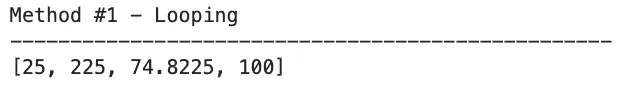

图 9-使用循环对 Python 列表求平方(图片由作者提供)

一次迭代一个数组是没有效率的。还有更方便实用的方法，比如列表理解。

## 方法 2——列表理解

使用列表理解，您可以声明第二个列表，作为对第一个列表进行元素级操作的结果。这里我们想对每一项进行平方，但是可能性是无限的。

看看下面的代码片段:

```
arr = [5, 15, 8.65, -10]

# Method 2 - List comprehensions
squared = [num**2 for num in arr]

# Print
print("Method #2 - List comprehensions")
print("--------------------------------------------------")
print(squared)
```

结果是相同的，但是现在少了一行代码:

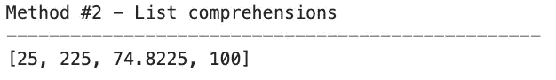

图 10 —用列表理解对 Python 列表求平方(图片由作者提供)

让我们换个话题，讨论你可以在 Numpy 中对一个数组求平方。

## 方法 3 — Numpy

还记得上一节的`square()`函数吗？还可以用它来计算单个数组项的平方。Numpy 自动推断是将单个数字还是数组作为参数传递:

```
arr = np.array([5, 15, 8.65, -10])

# Method 3 - Numpy
squared = np.square(arr)

# Print
print("Method #3 - Numpy")
print("--------------------------------------------------")
print(squared)
```

结果如下:

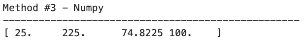

图 11-用 Numpy 对 Python 列表求平方(图片由作者提供)

Numpy 数组元素现在有了特定的类型——`numpy.float64`——这就是为什么在打印数组时会看到一些不同的格式。

这就是在 Python 中对一个数字或一系列数字求平方是多么容易。接下来让我们做一个简短的回顾。

# 总结 Python 平方

如果不要求编写一个计算整数的平方并打印结果的程序，接受初学者的编程挑战几乎是不可能的。

现在你知道了多种方法来平方任何类型的数，甚至 Python 中的数组。您还了解了如何将一个数字提升到任意指数，以及为什么有些方法比其他方法更有效。

如果你想学习相反的运算——**平方根**——以及你在 Python 编程语言中有什么选择，请继续关注博客。

*喜欢这篇文章吗？成为* [*中等会员*](/@radecicdario/membership) *继续无限制学习。如果你使用下面的链接，我会收到你的一部分会员费，不需要你额外付费。*

[](https://medium.com/@radecicdario/membership)  

## 保持联系

*   雇用我作为一名技术作家
*   在 YouTube[上订阅](https://www.youtube.com/c/BetterDataScience)
*   在 [LinkedIn](https://www.linkedin.com/in/darioradecic/) 上连接

*原载于 2022 年 11 月 15 日 https://betterdatascience.com**T21*[。](https://betterdatascience.com/python-squaring/)