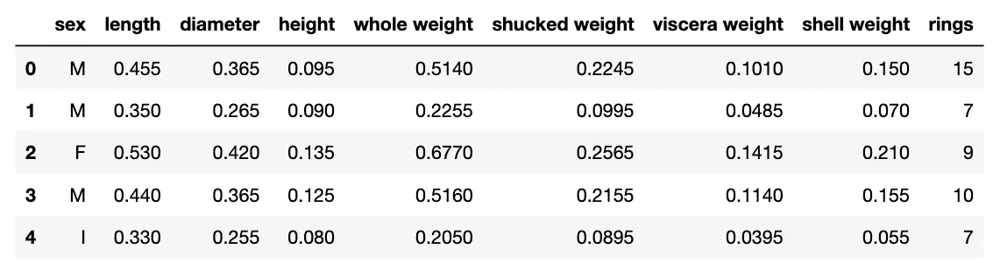
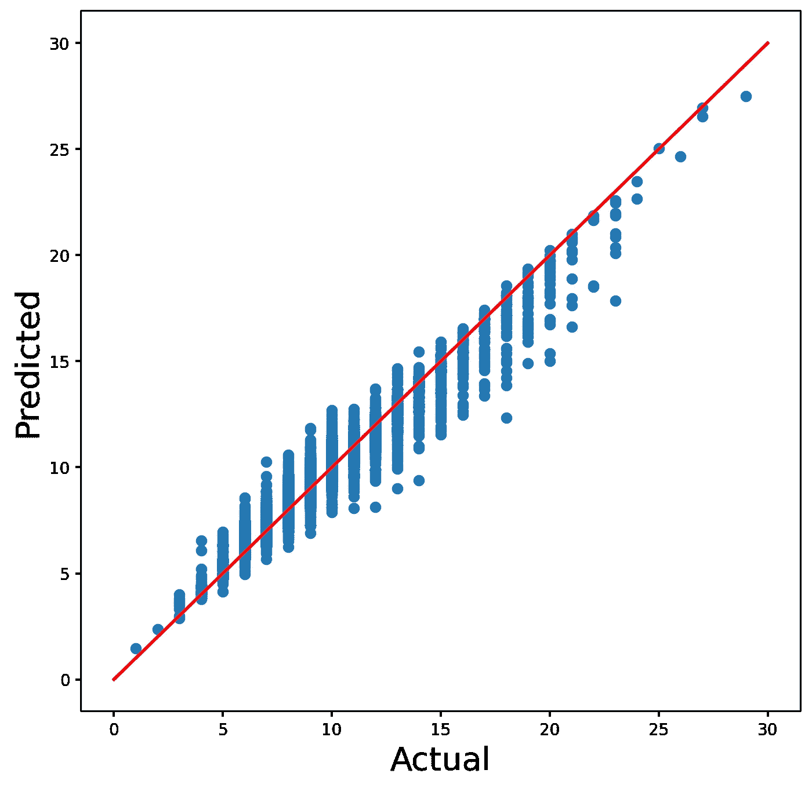
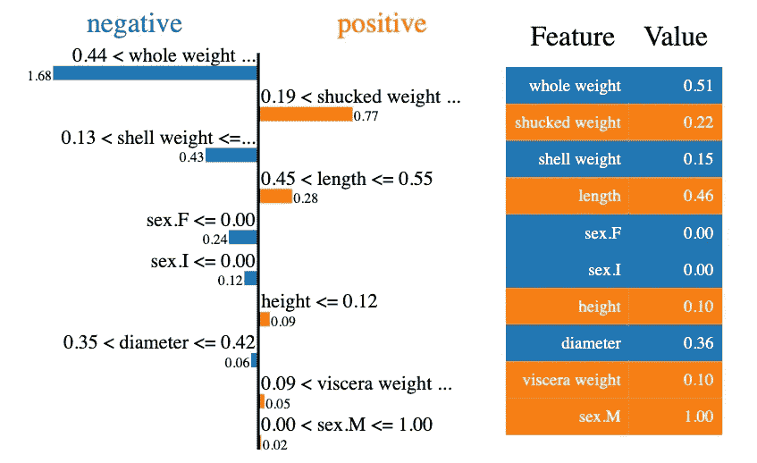
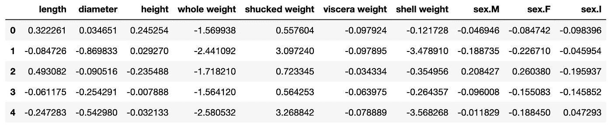
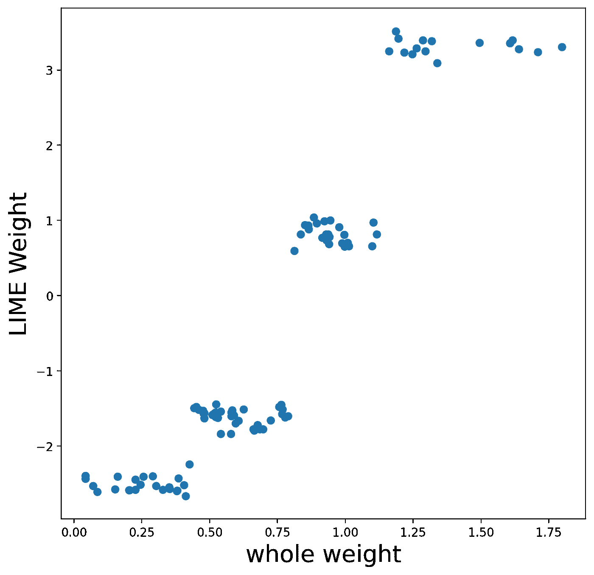
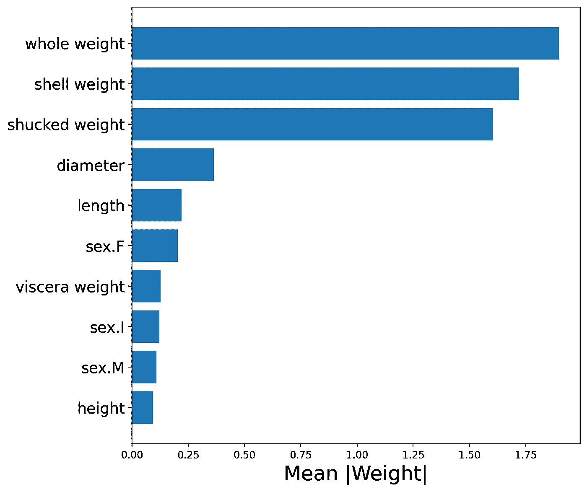
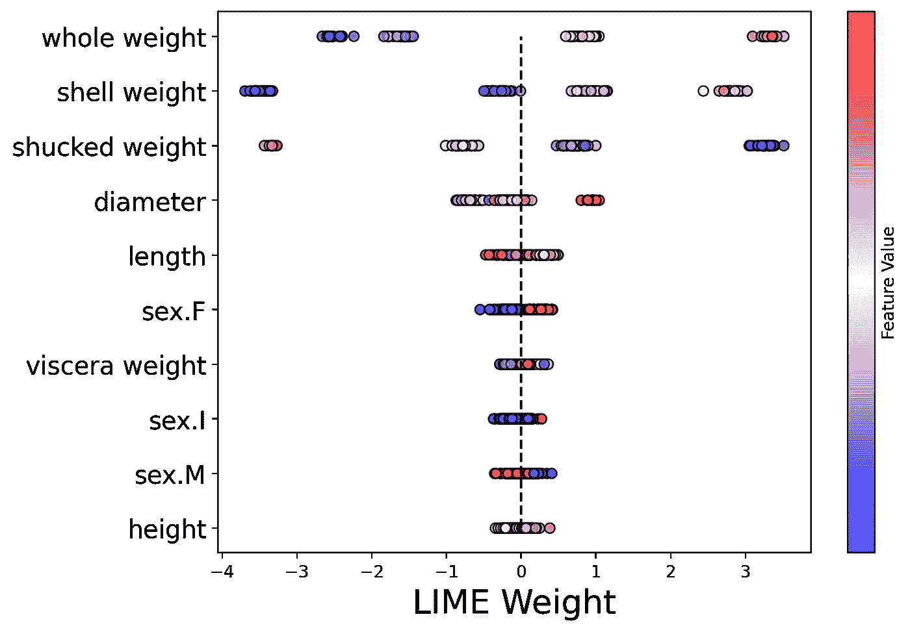
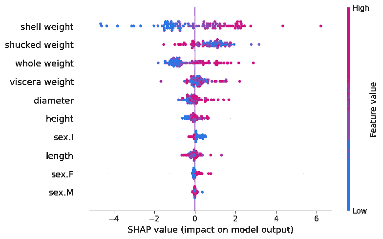
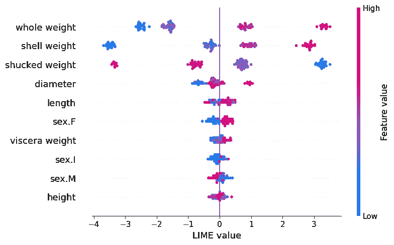

# 用 Python 从酸橙中榨出更多

> 原文：<https://towardsdatascience.com/squeezing-more-out-of-lime-with-python-28f46f74ca8e>

## 如何创建石灰权重的全局聚合

照片由[劳雷·诺弗拉兹](https://unsplash.com/@lornov?utm_source=medium&utm_medium=referral)在 [Unsplash](https://unsplash.com?utm_source=medium&utm_medium=referral) 上拍摄

LIME 是一种解释机器学习模型如何工作的流行方法。它旨在解释个人预测是如何做出的。LIME Python 包使得获取这些**本地解释**变得很容易。然而，如果我们想了解模型如何作为一个整体工作，这是缺乏的。我们将向您展示如何解决这个问题，以创建石灰权重的**全局聚合**。

我们将带您了解为多次预测收集石灰重量的过程。然后，我们将向您展示如何以 3 种方式聚合这些数据。即查看**特征趋势**、**绝对平均值**权重和**蜂群**图。最后，我们还将向您展示如何“征用”SHAP 软件包。我们将使用它的内置功能来显示我们的石灰重量。我们将讨论代码的关键部分，你可以在 GitHub 上找到完整的项目。

# 资料组

我们将使用[鲍鱼数据集](https://archive.ics.uci.edu/ml/datasets/Abalone)建立一个模型。您可以在表 1 中看到这个数据集的快照。鲍鱼是一种贝类。鲍鱼壳上的**环**的数量大致相当于它的年龄。目标是预测**环的数量。**我们使用鲍鱼的其余特征，例如外壳**长度、**外壳**直径**和**总重量**来实现这一点。

表 1:鲍鱼数据集快照(来源:作者)(数据集: [UCI](https://archive.ics.uci.edu/ml/datasets/Abalone) )(许可证:CC0:公共领域)

# 包装

在分析这些数据之前，我们需要导入一些 Python 包。我们有一些用于管理和可视化数据的标准库(第 2-4 行)。我们导入 **XGBoost** ，用于对目标变量建模(第 7 行)。当我们处理表格数据时，我们导入了**limetabularexplaner**函数(第 9 行)。最后，我们导入将在最后使用的 **SHAP** 包(第 10 行)。确保你已经安装了所有这些。

# 系统模型化

在计算石灰重量之前，我们需要训练一个模型。我们首先在下面的代码(第 2-4 行)中导入数据集。我们得到目标变量 **y** (第 7 行)和特征矩阵 **X** (第 8 行)。**性别**是一个分类特征，因此，在我们可以在模型中使用它之前，我们需要将其转换为 3 个虚拟变量(第 11-13 行)。我们通过从我们的特征矩阵中删除原始的性别特征来结束(第 16 行)。

在下面的代码中，我们训练了一个模型，用于预测鲍鱼壳中**环**的数量(第 2-4 行)。我们的目标变量是连续的，所以我们使用 XGBoost 回归。然后我们得到模型对整个特征集的预测(第 7 行)。

我们可以使用**图 1** 中的散点图来帮助评估该模型。这里我们可以看到模型预测的年轮数与实际年轮数的对比。我们忽略了一些最佳实践，但是模型应该足够好来演示 LIME 包。

图 1:实际与预测环的散点图(来源:作者)

在我们开始使用石灰之前，你可以用你自己的模型替换这个模型。或者您可以尝试不同的模型特征。这是因为 LIME 是一种[模型不可知的](/what-are-model-agnostic-methods-387b0e8441ef)方法。这意味着它可以用于任何型号。这也使得修改其余的代码为您的应用程序运行变得容易。

# 当地解释

让我们深入一个石灰本地解释。在**图 2** 中，可以看到第一个预测的解释。这是我们数据集中第一只鲍鱼的预测年轮数。看左边的图表可以告诉我们每个特征是如何影响预测的。例如，对于这种鲍鱼，**整体重量**的值减少了预测的环数。精确值-1.68 是石灰重量相对于**总重量**的重量。

图 2:第一个预测的石灰解释(来源:作者)

我们使用下面的代码来创建这个本地解释。我们假设您对 LIME 包有些熟悉，所以我们不会详细解释代码。为了给出一个概述，我们首先创建一个 LIME 解释器(第 2–6 行)。然后我们使用这个解释器为我们的第一个预测创建一个解释器对象， **exp** (第 9–12 行)。最后，我们显示这个解释器对象(第 15 行)。这是你在**图 2** 中看到的输出。

# 全局聚合

当你想了解个体预测是如何做出的时候，局部解释是非常有用的。然而，单看一个预测并不能告诉我们这个模型一般是如何工作的。为此，我们可以使用不同的本地解释集合。也就是说，我们将结合使用不同图表的许多预测的权重。

首先，我们需要从我们的解释器对象中获取石灰权重。为此，我们可以使用下面的函数 **return_weights** 。这个函数接受一个解释器对象， **exp** 。从这个对象中，它将获得并返回一个石灰重量列表。这些权重将按照与 X 特征矩阵中的特征相同的顺序排序。

为了使用这个函数，我们将迭代 X 特征矩阵中的前 100 行(第 4 行)。对于每个迭代，我们将创建一个解释对象(第 7–10 行)。我们使用 **return_weights** 函数从这个对象获得权重(第 13 行),并将它们添加到一个权重列表中(第 14 行)。最后，我们使用这个权重列表创建数据帧， **lime_weights** (第 17 行)。

您可以在**表 2** 中看到该过程的结果。这里我们看到了**石灰重量**数据帧的快照。这个数据集总共有 100 行。每一行代表一个不同的预测。对于每个预测，每个特征都有一个权重。我们现在可以使用这个数据集来创建石灰重量的全局聚合。如果你愿意，你可以修改代码运行超过 100 行。

表 2:石灰重量快照(来源:作者)

## 特征趋势

我们的第一个汇总着眼于模型特征之一的趋势— **整体重量**。这是整个鲍鱼的重量。在**图 3** 中，我们可以看到随着**整体重量**增加**石灰重量**增加。较高的石灰权重表明，对于特定的预测，特征值增加了预测的环数。所以，这个图表告诉我们，随着鲍鱼重量的增加，它壳上的环的数量会增加。这是有道理的，因为我们预计老鲍鱼会更大/更重。

图 3:整体体重的特征趋势(来源:作者)

为了创建这个图表，我们首先获取整个重量特性的石灰重量(第 4 行)。我们还得到相应的特征值(第 5 行)。然后我们创建一个权重和特征值的散点图(第 7 行)。

## 平均石灰重量

接下来的汇总可以帮助我们了解哪些特性是最重要的。具有较高正或负石灰权重的要素对预测的影响较大。对于每个特征，我们可以取所有石灰重量的绝对平均值。平均权重较大的要素通常会对预测产生较大影响。

我们可以在图 4 中看到我们模型的平均重量。请注意**整体重量**、**外壳重量**和**去壳重量**与其他特征相比具有更大的平均重量。这告诉我们，在预测环数时，这些特征是最重要的。

图 4:石灰重量的绝对平均值(来源:作者)

为了创建这个图表，我们首先取重量的绝对平均值(第 2 行)。然后我们创建一个新的数据帧，它有两列——特征名和绝对平均值(第 3 行)。我们从最大到最小的平均重量(第 4 行)对该数据帧进行排序。然后，我们只需要使用该数据框架绘制一个条形图(第 9–11 行)。

## 蜂群

我们最后的汇总是一个蜂群图。如**图 5** 所示，这是所有石灰重量的曲线图。这些值按 y 轴上的要素分组。对于每个组，点的颜色由相同的特征值决定(即，较高的特征值为红色)。要素按平均石灰重量排序。换句话说，与**图 4** 顺序相同。

图 5:石灰重量的蜂群(来源:作者)

为了创建这个图表，我们使用下面的代码。为了给出一个概述，我们迭代每个特性(第 8 行)。对于每个特性，我们得到权重和值(第 10-11 行)。使用这些，我们然后创建一个散点图(第 13-18 行)。诀窍是将每个点的 y 值设置为相同的值(第 14 行)。这就是我们如何在一条直线上得到每个散点图。

如果你熟悉 SHAP 包，你会认出这个蜂群图。它是包提供的内置可视化之一。上面的观想远不如 SHAP 创造的那样令人愉快。因此，在下一节中，我们将向您展示如何使用 SHAP 软件包来绘制石灰重量。

# 使用 SHAP 软件包

首先，我们计算特征矩阵中前 100 个观察值的 SHAP 值(第 2-3 行)。然后我们创建 **shap_placeholder** 对象(第 6 行)。这将最初包含 SHAP 值。然后我们简单地用石灰重量代替 SHAP 值(第 7 行)。

在下面的代码中，我们使用原始的 SHAP 值创建了一个蜂群图。在这种情况下，我们传递 **shap_values** 对象。你可以在**图 6** 中看到这个结果。

图 6:SHAP 价值观的蜂群(来源:作者)

我们可以使用该函数来创建石灰重量的蜂群图。唯一的区别是我们传递的是 **shap_placeholder** 对象，而不是 shap 值。你可以在**图 7** 中看到这个结果。请注意，该图表与我们在图 5 中创建的图表非常相似。除了我们避免了自己编码，结果更加赏心悦目。

图 7:石灰重量的蜂群(来源:作者)

上述图表还允许我们比较石灰重量和 SHAP 值。这可以帮助我们理解两种局部解释方法之间的差异。例如，注意在图 7**中一些石灰重量是如何聚集在一起的。这来自于石灰重量的计算方式。该过程包括将连续特征分成 4 组。**

蜂群图只是 SHAP 软件包中的一个可视化效果。我们也可以使用一些其他的可视化石灰重量。在下面的文章中，我们探索这些情节。我们给出了 python 代码，并详细介绍了如何解释每个图表。

 [## Python SHAP 简介

### 如何创造和解释 SHAP 情节:瀑布，力量，决定，SHAP 和蜂群

towardsdatascience.com](/introduction-to-shap-with-python-d27edc23c454) 

我希望这篇文章对你有帮助！你可以成为我的 [**推荐会员**](https://conorosullyds.medium.com/membership) **来支持我。你可以访问 Medium 上的所有文章，我可以得到你的部分费用。**

 [## 通过我的推荐链接加入 Medium 康纳·奥沙利文

### 作为一个媒体会员，你的会员费的一部分会给你阅读的作家，你可以完全接触到每一个故事…

conorosullyds.medium.com](https://conorosullyds.medium.com/membership) 

你可以在|[Twitter](https://twitter.com/conorosullyDS)|[YouTube](https://www.youtube.com/channel/UChsoWqJbEjBwrn00Zvghi4w)|[时事通讯](https://mailchi.mp/aa82a5ce1dc0/signup)上找到我——注册免费参加 [Python SHAP 课程](https://adataodyssey.com/courses/shap-with-python/)

## 资料组

W.纳什等人。艾尔。，1994，**鲍鱼数据集，** *加州欧文:加州大学信息与计算机科学学院* ( **许可证:** CC0:公共领域)，[https://archive.ics.uci.edu/ml/datasets/Abalone](https://archive.ics.uci.edu/ml/datasets/Abalone)

## 参考

Ribeiro，M.T .，Singh，S. and Guestrin，c .，2016 **“我为什么要相信你？”解释任何分类器的预测**。[https://arxiv.org/abs/1602.04938](https://arxiv.org/abs/1602.04938)

C.Molnar，**可解释机器学习** *，*2021[https://christophm . github . io/Interpretable-ml-book/lime . html](https://christophm.github.io/interpretable-ml-book/lime.html)

**石灰蟒包**，[https://github.com/marcotcr/lime](https://github.com/marcotcr/lime)

**SHAP 蟒包** *，*，[https://github.com/slundberg/shap](https://github.com/slundberg/shap)