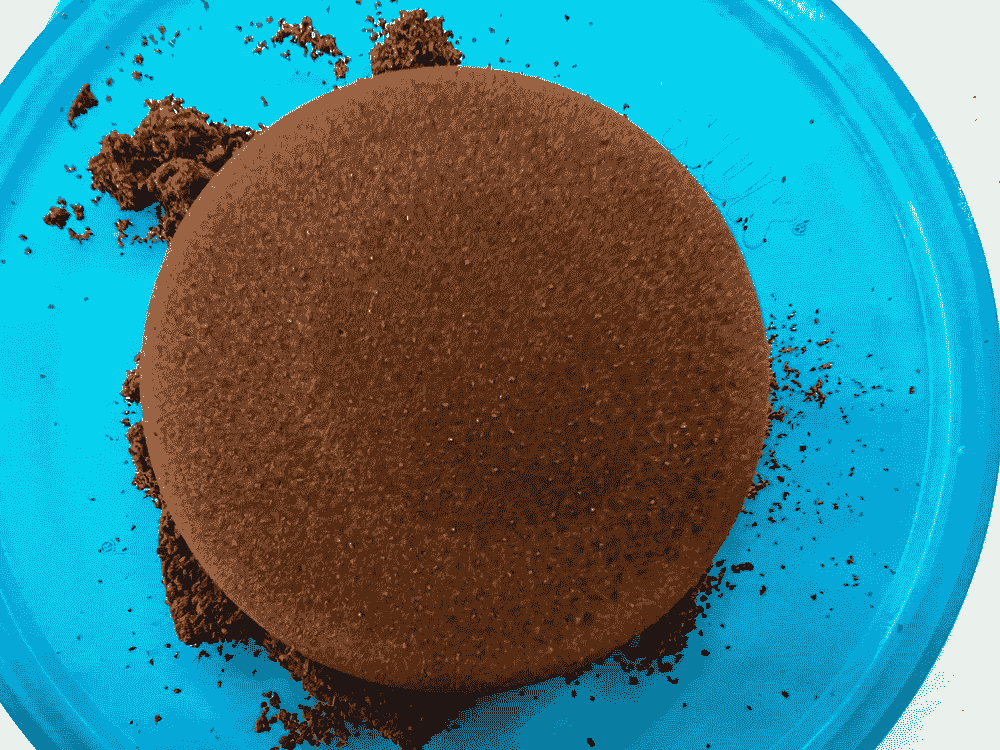
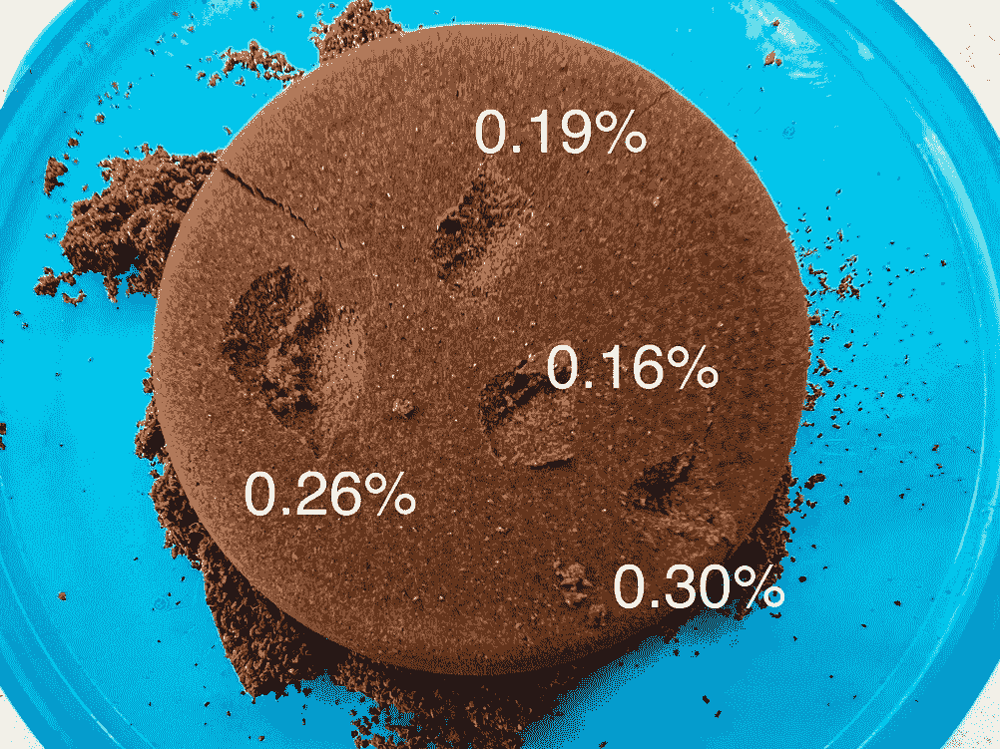
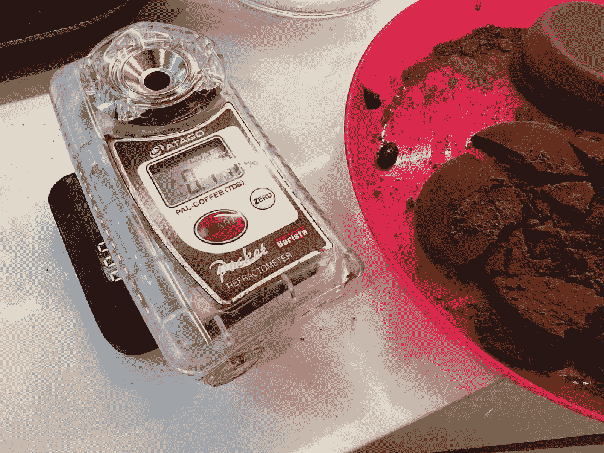
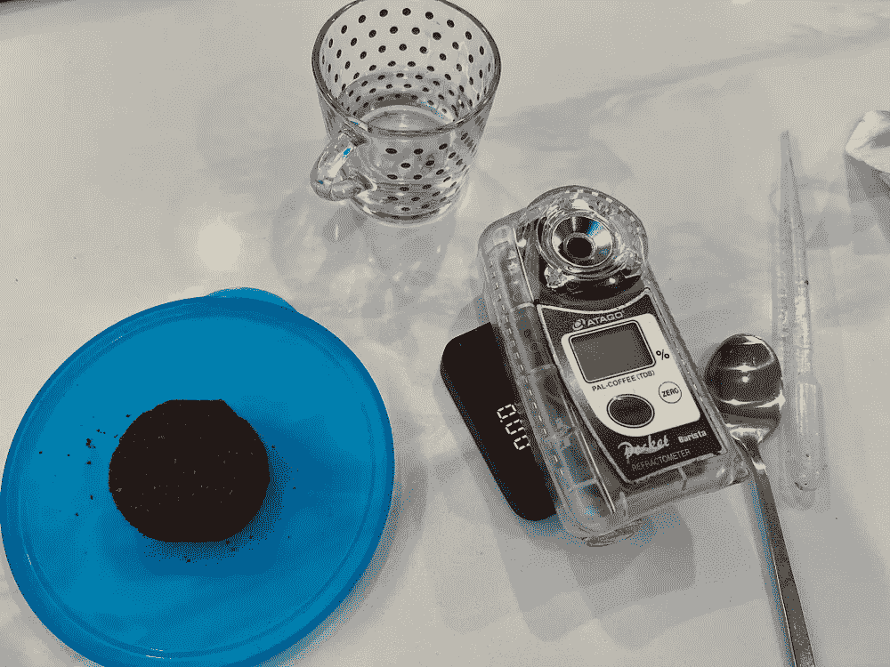
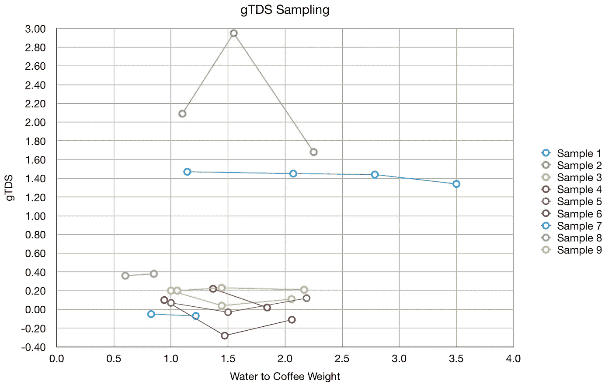

# 咖啡渣中总溶解固体(TDS)样品的稳定性

> 原文：<https://towardsdatascience.com/stability-of-grounds-tds-samples-in-spent-coffee-8e98df95bdc8>

## 咖啡数据科学

# 咖啡渣中总溶解固体(TDS)样品的稳定性

## 挑战传统

几个月前，我尝试了一个实验，将咖啡渣直接放在折光仪上，读取总溶解固体(TDS ),以此来衡量废咖啡中剩余的可溶物。我将此称为 TDS 或 gTDS，以区分样本是如何收集的。目的是获得不容易提取的可溶物的读数。读数确实出现了，经过一些测试后，它似乎是一个有价值的事后分析指标。

这是一个很好的例子，我在冰球中间看到了一个黑点。我担心它的提取率较低，所以我取了一些样本。我发现它实际上比其他的提取率更高，因为样品中剩下的可溶物更少。

所有图片由作者提供

有些人质疑我在测量时没有称水或咖啡的重量，我的回答是我没有注意到测量中的差异。作为一名数据科学家，这个答案可以用一些数据来验证，所以我收集了一些数据，并验证了在这样的样本中加入多少水并没有多大关系。我怀疑这是由于咖啡渣阻挡了大部分光线，所以只要它们是湿的，读数是一样的。

# 数据

我收集了一些样品，在测量时，我称了咖啡和水的重量。

我发现了一些微小的变化，但不是很多，它们肯定不会随着水的加入而趋势良好。通常，如果你将样品中的水增加一倍，TDS 读数会下降一半。事实并非如此。

负值是相对于刻度的校准，我用的是水箱水。

从这些数据中，我发现 gTDS 读数非常稳定，只要咖啡覆盖传感器并且水遍布其中，就不需要称量咖啡和水。

如果你愿意，可以在[推特](https://mobile.twitter.com/espressofun?source=post_page---------------------------)、 [YouTube](https://m.youtube.com/channel/UClgcmAtBMTmVVGANjtntXTw?source=post_page---------------------------) 和 [Instagram](https://www.instagram.com/espressofun/) 上关注我，我会在那里发布不同机器上的浓缩咖啡照片和浓缩咖啡相关的视频。你也可以在 [LinkedIn](https://www.linkedin.com/in/robert-mckeon-aloe-01581595?source=post_page---------------------------) 上找到我。也可以在[中](https://towardsdatascience.com/@rmckeon/follow)关注我，在[订阅](https://rmckeon.medium.com/subscribe)。

# [我的进一步阅读](https://rmckeon.medium.com/story-collection-splash-page-e15025710347):

[我的未来之书](https://www.kickstarter.com/projects/espressofun/engineering-better-espresso-data-driven-coffee)

[浓缩咖啡系列文章](https://rmckeon.medium.com/a-collection-of-espresso-articles-de8a3abf9917?postPublishedType=repub)

工作和学校故事集

[个人故事和关注点](https://rmckeon.medium.com/personal-stories-and-concerns-51bd8b3e63e6?source=your_stories_page-------------------------------------)

[乐高故事启动页面](https://rmckeon.medium.com/lego-story-splash-page-b91ba4f56bc7?source=your_stories_page-------------------------------------)

[摄影启动页面](https://rmckeon.medium.com/photography-splash-page-fe93297abc06?source=your_stories_page-------------------------------------)

[改进浓缩咖啡](https://rmckeon.medium.com/improving-espresso-splash-page-576c70e64d0d?source=your_stories_page-------------------------------------)

[断奏生活方式概述](https://rmckeon.medium.com/a-summary-of-the-staccato-lifestyle-dd1dc6d4b861?source=your_stories_page-------------------------------------)

[测量咖啡磨粒分布](https://rmckeon.medium.com/measuring-coffee-grind-distribution-d37a39ffc215?source=your_stories_page-------------------------------------)

[浓缩咖啡中的粉末迁移](https://medium.com/nerd-for-tech/rebuking-fines-migration-in-espresso-6790e6c964de)

[咖啡萃取](https://rmckeon.medium.com/coffee-extraction-splash-page-3e568df003ac?source=your_stories_page-------------------------------------)

[咖啡烘焙](https://rmckeon.medium.com/coffee-roasting-splash-page-780b0c3242ea?source=your_stories_page-------------------------------------)

[咖啡豆](https://rmckeon.medium.com/coffee-beans-splash-page-e52e1993274f?source=your_stories_page-------------------------------------)

[浓缩咖啡滤纸](https://rmckeon.medium.com/paper-filters-for-espresso-splash-page-f55fc553e98?source=your_stories_page-------------------------------------)

[浓缩咖啡篮和相关主题](https://rmckeon.medium.com/espresso-baskets-and-related-topics-splash-page-ff10f690a738?source=your_stories_page-------------------------------------)

[意式咖啡观点](https://rmckeon.medium.com/espresso-opinions-splash-page-5a89856d74da?source=your_stories_page-------------------------------------)

[透明 Portafilter 实验](https://rmckeon.medium.com/transparent-portafilter-experiments-splash-page-8fd3ae3a286d?source=your_stories_page-------------------------------------)

[杠杆机维护](https://rmckeon.medium.com/lever-machine-maintenance-splash-page-72c1e3102ff?source=your_stories_page-------------------------------------)

[咖啡评论和想法](https://rmckeon.medium.com/coffee-reviews-and-thoughts-splash-page-ca6840eb04f7?source=your_stories_page-------------------------------------)

[咖啡实验](https://rmckeon.medium.com/coffee-experiments-splash-page-671a77ba4d42?source=your_stories_page-------------------------------------)