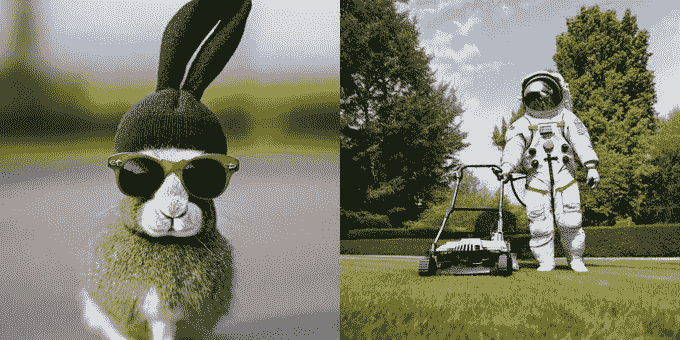
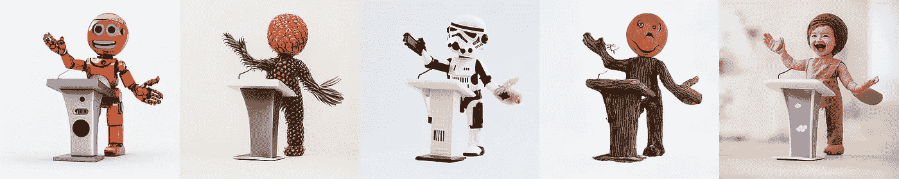
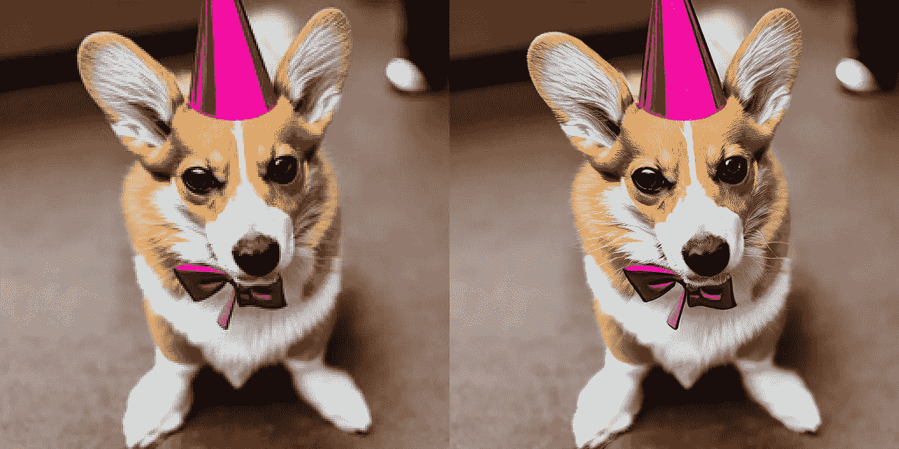

# 稳定扩散 2 是第一个艺术家友好的人工智能艺术模型

> 原文：<https://towardsdatascience.com/stable-diffusion-2-is-not-what-users-expected-or-wanted-abfd39524dff>

## 意见

## 但这不是用户想要的——他们生气是对的吗？

现在谁坐在生成人工智能的宝座上？鸣谢:作者 via Midjourney(哦，讽刺的是)

我通常不报道模特发布会。我为先验的下游含义(如[卡拉狄加](https://thealgorithmicbridge.substack.com/p/galactica-what-dangerous-ai-looks)和[布鲁姆](https://thealgorithmicbridge.substack.com/p/bloom-is-the-most-important-ai-model))或高趣味性/有用性做了例外。

今天的话题大概是两个都查:Stability.ai，开源的生成式 ai 之王，已经宣布[稳定扩散 2](https://stability.ai/blog/stable-diffusion-v2-release) 。

新版本的稳定扩散带来了关键的改进和更新。在一个不同的世界里，很有可能每一个使用稳定传播的应用/功能/程序都会马上使用新版本。

然而，这是不可能的。Stable Diffusion 2 尽管技术质量出众，但被很多用户(如果不是全部的话)认为*退一步讲*。

在这篇文章中，我将尽可能简单地描述稳定扩散 2 的主要特性，它与 1.x 版本的比较，为什么人们认为它是一种回归，以及我对所有这些的看法。

要明确的是，这不仅仅是关于稳定扩散 2。正在发生的事情超出了稳定性。人工智能——这是一个迹象，表明即将发生的事情以及生成性人工智能将如何与现实世界发生冲突。

*本文选自*[***The Algorithmic Bridge***](https://thealgorithmicbridge.substack.com/subscribe?)*，这是一份旨在弥合算法与人之间鸿沟的教育通讯。它将帮助你理解人工智能对你生活的影响，并开发工具来更好地导航未来。*

  

## 稳定扩散 2:模型和特征

让我们从故事的客观部分开始。

这一部分稍微有点技术性(虽然不难)，所以可以随意浏览一下(如果您计划使用该模型，仍然值得一读)。

稳定扩散 2 是源自共同基线的整个模型家族的通用名称:稳定扩散 2.0-base (SD 2.0-base)原始文本到图像模型。

基线模型在开放数据集 LAION-5B 的美学子集上进行训练(记住这一点，它在以后会很重要)，并生成 512x512 图像。

在 SD 2.0 基础之上，Stability.ai 又训练了几个具有特定功能的模型(下面的例子)。

SD 2.0-v 也是文本到图像模型，但默认分辨率更高(768x768):

信用: [Stability.ai](https://twitter.com/StabilityAI/status/1595590345374326785)

Depth2img 是一个深度到图像模型，它建立在经典的 img2img 版本的基础上，以提高模型保持结构和连贯性的能力:

鸣谢:[GitHub 上的 stability . ai](https://github.com/Stability-AI/stablediffusion#depth-conditional-stable-diffusion)

升级型号采用其他型号的输出，并将分辨率提高了 4 倍(例如，从 512x512 提高到 2048x2048):

鸣谢:[GitHub 上的 stability . ai](https://github.com/Stability-AI/stablediffusion#image-upscaling-with-stable-diffusion)

最后，文本引导的修复模型提供了语义替换原始图像部分的工具(就像你可以用 DALL E 做的那样):

功劳:[GitHub 上的 stability . ai](https://github.com/Stability-AI/stablediffusion#image-inpainting-with-stable-diffusion)

为了方便现有用户的可移植性，Stability.ai 对模型进行了优化，以在单个 GPU 上运行。正如他们在博客文章中解释的那样:“我们希望从一开始就让尽可能多的人可以使用它。”

像 Stable diffusion 1.x 一样，新版本属于许可许可证。代码是 MIT 许可的([在 GitHub](https://github.com/Stability-AI/stablediffusion) 上)，重量([在拥抱面](https://huggingface.co/spaces/stabilityai/stable-diffusion)上)遵循[creative ml Open RAIL ++ M 许可](https://github.com/Stability-AI/stablediffusion/blob/main/LICENSE-MODEL)。

Stability.ai 也在 [API 平台](https://platform.stability.ai/)(面向开发者)和 [DreamStudio](https://beta.dreamstudio.ai/dream) (面向用户)上发布模型。

## 与 SD 2 最相关的变化:OpenCLIP 编码器

现在来看更重要的消息。

Stable Diffusion 2 在架构上比它的前身更好，但也很相似。没什么好惊讶的。然而，Stability.ai 彻底改变了一个特定组件的性质:文本/图像编码器(将文本-图像对转换为向量的内部模型)。

所有公开的文本到图像模型——包括 DALL E 和 mid journey——都使用 [OpenAI 的 CLIP](https://openai.com/blog/clip/) 作为编码器。

毫不夸张地说，CLIP 是 2022 年生成式 AI 浪潮中最具影响力的模型。如果没有 OpenAI 或 CLIP，它根本不会发生。

这让人们看到了稳定性。ai 的决定打破了两年的标准做法，用一种新的编码器取代了 OpenAI 在稳定扩散 2 上的剪辑。

在 Stability.ai 的支持下，LAION 已经训练了 [OpenCLIP-ViT/H](https://github.com/mlfoundations/open_clip) (OpenCLIP)，据报道，这创造了一个新的最先进的性能:“【它】[与早期的 V1 版本相比，大大提高了生成图像的质量。”](https://twitter.com/StabilityAI/status/1595590334624321536)

稳定扩散 2 是第一个也是唯一一个集成 OpenCLIP 而不是 CLIP 的模型。

为什么这是值得注意的？因为 OpenCLIP 不仅仅是开源的，就像原始剪辑一样——它是在*公共*数据集(LAION-5B) *上训练的。*

正如艾玛德·莫斯塔克(Stability.ai 首席执行官)解释的那样，“(视频)很棒，但没人知道里面有什么。”

[艾玛德·莫斯塔克的推特](https://twitter.com/EMostaque/status/1595731398450634755)

OpenCLIP 在公开可用的数据集上进行训练的事实意义重大(尽管不一定是好的)，因为现在开发人员和用户可以知道它编码了什么(即它学习了什么以及如何学习)。

这有两个直接的影响。

第一，因为 OpenCLIP 和 CLIP 的训练数据不一样，稳定扩散 2“知道”的东西*和稳定扩散 1、DALL E、Midjourney“知道”的东西*不一样。

Mostaque 解释说，对早期版本的稳定扩散有效的提示技术和启发法，可能对新模型不太有效:“(稳定扩散)V2 提示不同，人们需要一段时间来适应。”

然而，他解释说，即使稳定扩散 2 已经以不同的方式学习了一些东西——这将迫使用户重新思考他们的提示技能——它已经更好地学习了这些技能。

其次，因为现在我们可以准确地找出谁的作品出现在数据集中，Stability.ai 可以在未来的版本中为艺术家实现选择加入/选择退出功能(我不知道该公司是否会这样做，但 Mostaque 自己承认这是一个问题)。

这意味着稳定扩散 2 更尊重训练数据中存在的艺术家的作品。与 Midjourney 和 DALL E 相比，这是一个显著的改进。

## 人工智能社区为何愤怒

但是，如果我们深入挖掘，我们会发现一个非常不同的观点。

事实证明，Stability.ai 在不同的 LAION 子集上训练 OpenCLIP(和模型),而不是用户想要的。

他们删除了大部分 NSFW 内容和名人图片，最让人们愤怒的是，他们把著名(现代)艺术家的名字从标签上完全删除了(尽管不是他们的作品)。

这对稳定扩散 2 和整个生殖人工智能领域有着严重的(尽管不一定是坏的)二阶影响。

一方面，Stability.ai 显然试图通过减少其法律上可疑的做法来遵守版权法，即在没有署名、同意或报复的情况下，从互联网上抓取在世艺术家的作品来训练他们的模型。

另一方面，稳定扩散的用户相当恼火，因为他们以前用唯一存在的高质量开源模型(稳定扩散)可以产生的许多东西现在都不可能了。

Mostaque 说，提示的工作方式不同，但新的隐式限制不会通过更好的提示工程来解决。

例如，你不能再提示“以格雷格·鲁特科夫斯基的风格”并得到一个有魔法和龙的史诗般的中世纪场景，因为稳定扩散 2 不再认为“格雷格·鲁特科夫斯基”是任何特别的东西。

那已经过去了。和他在一起的，还有你用过的其他在世的或已故的艺术家。他们的作品仍然存在于数据中，但是编码器不再能够将图像与名字相关联。

我承认《稳定扩散 2》在客观上比它的上一个版本在制作艺术的能力上受到了更多的限制(例如，《中途 v4》在质量方面要好得多)。

AI 社区可以通过调整 OpenCLIP 来绕过这些限制吗？虽然 Mostaque 在 Discord 服务器上提出了这种可能性，但不清楚他们如何才能做到这一点(最终，是 Stability.ai 拥有 5408 个 A100s)，微调编码器是*昂贵的*。

## 生成式人工智能的回归？

然而，尽管用户普遍感到失望，但 Stability.ai 有一个很好的理由这样做——如果你生活在社会中，你就必须适应社会设定的边界。

你不应该仅仅因为技术允许你这样做，就把别人踩在脚下(那些作品被记录在案的艺术家就有这种感觉)。如果你说这就是自由的含义，让我告诉你，从这个角度来看，今天的“自由”就是明天的危险。

诚然，监管的发展比技术慢，但它最终会赶上。当法律制定时，争论“妖怪已经从瓶子里出来”或“进步是不可阻挡的”是不够的。

现在，[正在对微软、GitHub 和 OpenAI 提起诉讼，指控他们抓取网页来训练 Copilot (Codex)。如果它最终支持开源开发，它可能会从根本上重新定义生成式人工智能的前景。](https://githubcopilotlitigation.com/)

Stability.ai 对艺人的所作所为和那些公司对编码员的所作所为没什么区别。他们未经许可就拿走了数千人的作品来创造人工智能技术，现在任何人都可以用它来模仿艺术家的创作。

这很可能是该公司这么做的原因。他们正在采取措施避免潜在的诉讼(很难说他们是在保护艺术家，因为如果是这样的话，他们从一开始就已经这么做了)。

但是，不管他们的动机如何，最终的结果才是最重要的:人工智能拥有他们的技术，艺术家得到了更多的保护。

如果人工智能社区现在声称稳定扩散毫无价值，因为“以…的风格”各种提示不起作用(即使艺术家的作品仍然存在于数据中)，那么唯一合理的结论可能是艺术家一直是正确的:他们在数据中的明确存在承担了创造伟大人工智能艺术的大部分重量。

## 最后的想法

正如我几个月前所说的，我们应该开诚布公、相互尊重地讨论这个问题。

可悲的是——也是意料之中的——这并没有发生。AI 人很大程度上驳回了艺人的投诉和请愿。在大多数情况下，艺术家并不愿意适应新的发展，有时甚至会对人工智能社区变得咄咄逼人。

这些都没有用。

我进入了 r/StableDiffusion subreddit 来了解总体情绪，它与我在这里告诉你的相符。AI 社区与 Stability.ai 的决定严重相左。

把稳定扩散 2 称为“后退一步”和“一次回归”是最软的评论。

只有一条评论道出了我读到这些愤怒和沮丧时的想法:

> *“显然这里没有人认为未经许可复制艺术家的作品是错误的。我发现所有的信息都在暗示，模仿人们的风格在某种程度上是一种倒退。我不是艺术家，但是想象一下，有人使用别人开发的工具复制了你的作品，让你失业，你的作品无疑是独一无二的。有人会认为这是公平的吗？”*

我认为在考虑稳定扩散 2 和一般的生成性人工智能时，最重要的是考虑“另一面”(无论你是艺术家，还是人工智能用户，或者两者都是)。

用户现在对 Stability.ai 很恼火——从某种意义上来说是合理的，但在其他方面是不合理的——但他们不应该忘记，当监管发生时——它将会发生——Midjourney 和 OpenAI(以及微软和谷歌)也必须适应和遵守。

这远远超出了任何特定的公司。这是一个世界在不忽视人的权利的情况下重新适应新技术的问题(顺便提一下，我可能不同意人工智能监管的细节，但我强烈认为监管不应该不存在)。

生殖型 AI 公司和用户一直享受的这种非问责差距(有人可能称之为自由)即将结束。

而且，在我看来，这样更好。

*订阅* [**算法桥**](https://thealgorithmicbridge.substack.com/) *。弥合算法和人之间的鸿沟。关于与你生活相关的人工智能的时事通讯。*

*您也可以直接支持我在 Medium 上的工作，并通过使用我的推荐链接* [**这里**](https://albertoromgar.medium.com/membership) 成为会员来获得无限制的访问权限！ *:)*