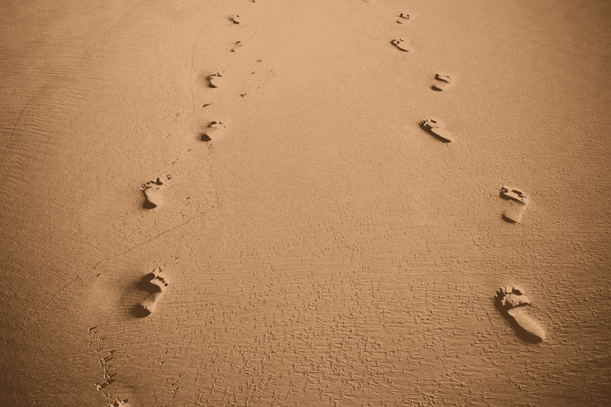
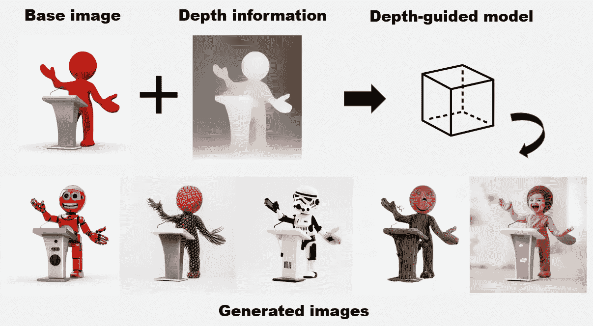

# 稳定扩散 2:好的，坏的和丑陋的

> 原文：<https://towardsdatascience.com/stable-diffusion-2-the-good-the-bad-and-the-ugly-bd44bc7a1333>

## 向前一步，向后一步



照片由[费利佩·科雷亚](https://unsplash.com/@felipecorreia?utm_source=medium&utm_medium=referral)在 [Unsplash](https://unsplash.com?utm_source=medium&utm_medium=referral) 上拍摄

2022 年 11 月 24 日，稳定。AI 宣布[稳定扩散 2.0](https://stability.ai/blog/stable-diffusion-v2-release) 公开发布，这是对之前版本的重大更新，具有突破性的变化。在撰写本文时，社区对它的反应不一。新建筑因其最先进的特点而受到称赞，但同时也因其稳定性方向而受到批评。

StabilityAI 发布了版本 2 的以下[检查点](https://huggingface.co/stabilityai/stable-diffusion-2-base):

*   `512-base-ema.ckpt` —生成 512x512 图像的版本 2 检查点。
*   `768-v-ema.ckpt` —基于`512-base-ema.ckpt`的检查点。在相同的数据集上使用 [v-objective](https://arxiv.org/abs/2202.00512) 对其进行了进一步微调。能够原生生成 768x768 的图像。
*   `512-depth-ema.ckpt`—基于`512-base-ema.ckpt`的检查点，具有额外的输入通道，用于处理 [MiDaS](https://github.com/isl-org/MiDaS) 产生的(相对)深度预测。这是一个深度导向的扩散模型。适用于图像到图像的生成。
*   `512-inpainting-ema.ckpt` —修复模型的版本 2 检查点，用于修复 512x512 分辨率的图像。
*   `x4-upscaling-ema.ckpt` —超分辨率放大扩散模型，生成分辨率为 2048x2048 或更高的图像。

本文涵盖了稳定扩散 2.0 的一些事实和我个人的看法。

# 培训用数据

通常，稳定扩散 1 在[里昂-2B (en)](https://huggingface.co/datasets/laion/laion2B-en) 、[里昂-高分辨率](https://huggingface.co/datasets/laion/laion-high-resolution)和里昂-改良-美学的子集上训练。

> laion-improved-aesthetics 是 laion2B-en 的子集，被过滤成具有原始尺寸`>= 512x512`、估计美学分数`> 5.0`和估计水印概率`< 0.5`的图像。

另一方面，稳定扩散 2 基于 [LAION-5B](https://laion.ai/blog/laion-5b/) 的子集:

*   23.2 亿张图片和英文文本
*   [laion 2 b-multi](https://huggingface.co/datasets/laion/laion2B-multi)22.6 亿张图片，文字来自 100 多种其他语言
*   [laion 1b-nolang](https://huggingface.co/datasets/laion/laion1B-nolang)12.7 亿张图片，带有未知语言文本(无法清晰检测)

然后，使用带有`punsafe=0.1`和[审美评分](https://github.com/christophschuhmann/improved-aesthetic-predictor) > = `4.5`的[莱昂-NSFW 分类器](https://github.com/LAION-AI/CLIP-based-NSFW-Detector)，对数据集进行过滤，以找出露骨的色情内容。

换句话说，稳定扩散 2 使用更大的 NSFW 滤波数据集进行训练。此外，第二阶段的训练基于分辨率高于或等于 512x512 的图像。

## 好人

新版本确保 StabilityAI 解决了与儿童色情和深度假货有关的长期法律问题。此外，新的模式在某些领域产生更好的图像。从社区进行的测试来看，它似乎在现实摄影(非人类)、照片现实场景中的照明、3D 渲染和设计方面表现不错。

这里是一个使用稳定扩散 2.0 生成的[鸟的例子。](https://old.reddit.com/r/StableDiffusion/comments/z4r2oo/v2_makes_really_nice_birds/)

## 坏事

根据用户的反馈，你仍然可以生成裸体，但是生成的图像往往缺乏任何性吸引力。此外，新模型对于与人体解剖和名人脸部相关的图像表现不佳。

此外，某些提示倾向于生成大部分黑白图像(偏向单色)，您必须添加提示“彩色”来生成彩色图像。

## 丑陋的

与版本 1 类似，手和图像中的文本生成仍然是一个大问题。此外，不确定为什么稳定扩散 2 没有使用估计水印概率策略来过滤 [LAION-5B](https://laion.ai/blog/laion-5b/) 数据集。根据我自己的亲身经历，与旧模型相比，新模型更倾向于生成带有水印的图像。

此外，LAION 是质量数据集上的数量。您可以通过下面的[剪辑检索页面](https://rom1504.github.io/clip-retrieval/)轻松验证图像及其文本标签对。你会发现大部分的图片标签都很差，这对模型的性能有很大的影响。

# 文本编码器

稳定扩散 2 基于 [OpenCLIP-ViT/H](https://github.com/mlfoundations/open_clip) 作为文本编码器，而旧架构使用 [OpenAI 的 ViT-L/14](https://github.com/openai/CLIP) 。ViT/H 在里昂-2B 上进行训练，精度为 **78.0** 。它是 OpenCLIP 提供的最好的开源权重之一。

虽然 ViT-L/14 的重量是开源的，但 OpenAI 没有公布训练数据。因此，您将无法控制模型正在学习的内容。StabilityAI 通过利用开源实现 OpnCLIP-ViT/H weight 解决了这一问题，该实现是在他们用于潜在扩散模型的相同数据集上训练的。

## 好人

新型号现在可以更好地理解您的提示。继续前进，StabilityAI 和社区可以通过训练他们自己的 OpenCLIP 模型来改进文本编码器。因此，您可以引导模型轻松生成所需的图像。

此外，对某些领域的偏见似乎减少了。例如，版本 2 现在能够[生成非白色天花板的房间](https://old.reddit.com/r/StableDiffusion/comments/z3iry9/i_guess_at_least_one_improvement_for/)。

## 坏事

版本 1 中的所有现有提示在版本 2 中并不相同。输入提示需要更具描述性。使用提示“猫”不同于提示“猫的照片”。

除此之外，所有现有的嵌入和 dreambooths 模型都不能开箱即用。根据预先训练好的模型，您需要在管道中使用相应的文本编码器。

不仅如此，新的文本编码器不会识别你的提示中的一些“著名艺术家”。它将只识别存在于 LAION-5B 数据集中的艺术家。

> 注意[没有艺术家被刻意从训练数据集中删除](https://preview.redd.it/mkg2uxmwxx1a1.png?width=624&format=png&auto=webp&s=834219554b337f85ec58edbee30d3e575bccfa59)。

## 丑陋的

由于稳定扩散是在 LAION-5B 的子集上训练的，因此 OpenCLIP 很有可能在未来使用 LAION-5B 训练新的文本编码器。鉴于文本编码器是整个稳定扩散架构中至关重要的组件，当文本编码器发生变化时，大多数与提示相关的现有工作都将失效。

此外，一些现有的实现必须为旧版本和新版本提供向后兼容支持。

# 深度到图像模型

[新的深度制导模型](https://huggingface.co/stabilityai/stable-diffusion-2-depth)是 StabilityAI 发布的最有前景的功能之一。它基于 [MiDaS](https://github.com/isl-org/MiDaS) ，推断一张图像的深度，然后使用文本和深度信息来生成新的图像。

下面是它如何工作的一个例子:



作者图片

查看拥抱中的[下面的空间](https://huggingface.co/spaces/pytorch/MiDaS)以了解更多关于从图像生成深度信息的信息。

## 好人

新的深度引导模型为图像到图像生成提供了更好的结果。这为一些功能开辟了新的可能性，例如生成带有图层的图像，甚至是 3D 模型的文本。

## 坏的和丑的

在撰写本文时，您只能将深度导向模型与 [stablediffusion](https://github.com/Stability-AI/stablediffusion) 库一起使用，这使得测试模型变得困难，因为大多数用户在设置和运行所提供的脚本时都遇到了困难。0.9.0 版本仅支持其他四种型号:

*   [稳定扩散 2 基](https://huggingface.co/stabilityai/stable-diffusion-2-base)
*   [稳定扩散-2](https://huggingface.co/stabilityai/stable-diffusion-2)
*   [稳定扩散 2 修复](https://huggingface.co/stabilityai/stable-diffusion-2-inpainting)
*   [稳定扩散-x4-升级](https://huggingface.co/stabilityai/stable-diffusion-x4-upscaler)

从版本 0.10.0 开始，您现在可以使用`diffusers`运行模型:

*   [稳定扩散 2 深度](https://huggingface.co/stabilityai/stable-diffusion-2-depth)

```
import torch
import requests
from PIL import Image
from diffusers import StableDiffusionDepth2ImgPipeline

pipe = StableDiffusionDepth2ImgPipeline.from_pretrained(
   "stabilityai/stable-diffusion-2-depth",
   torch_dtype=torch.float16,
).to("cuda")

url = "http://images.cocodataset.org/val2017/000000039769.jpg"
init_image = Image.open(requests.get(url, stream=True).raw)

prompt = "two tigers"
n_propmt = "bad, deformed, ugly, bad anotomy"
image = pipe(prompt=prompt, image=init_image, negative_prompt=n_propmt, strength=0.7).images[0]
```

# 结论

StabilityAI 声明新模型仅作为社区进一步改进的基础模型。在未来，他们将定期发布，这样任何人都可以通过用自己的数据集对其进行微调来进一步改进。他们还会提供公开的[分布式训练](https://github.com/learning-at-home/hivemind)(不保证有效的实验测试)的方法。

总而言之，《稳定扩散 2》的发布标志着在研究和解决法律问题方面向前迈进了一步。然而，对于社区中一些更喜欢不受限制的创作或对以前版本的总体改进的采纳者来说，这也是一种倒退。

感谢你阅读这篇文章。祝你有美好的一天！

# 参考

1.  [里昂-5B 数据集](https://laion.ai/blog/laion-5b/)
2.  [StabilityAI 博客—稳定扩散 2.0](https://stability.ai/blog/stable-diffusion-v2-release)
3.  [Reddit —稳定扩散](https://old.reddit.com/r/StableDiffusion)
4.  [拥抱脸—稳定性](https://huggingface.co/stabilityai)