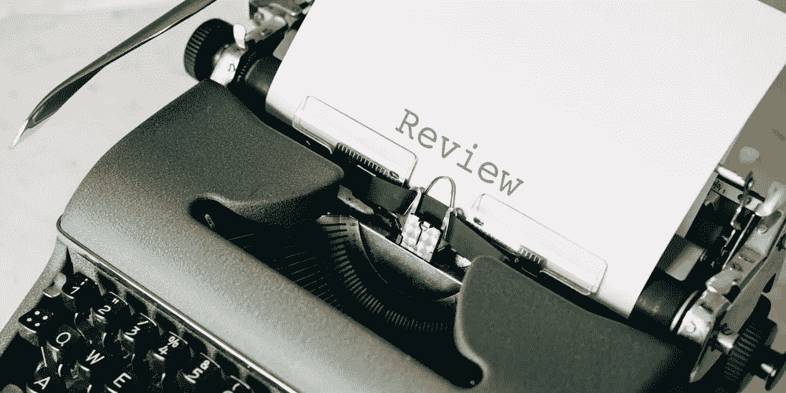
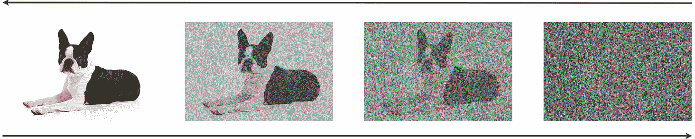
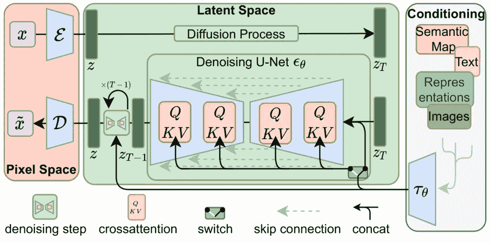
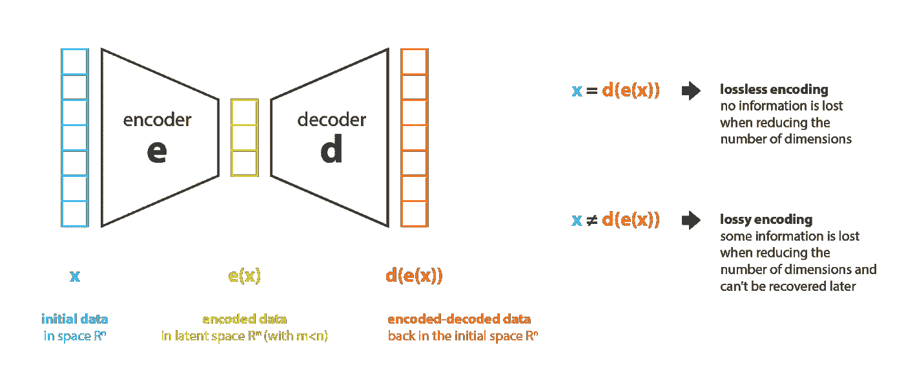
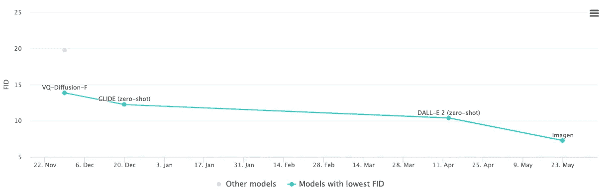
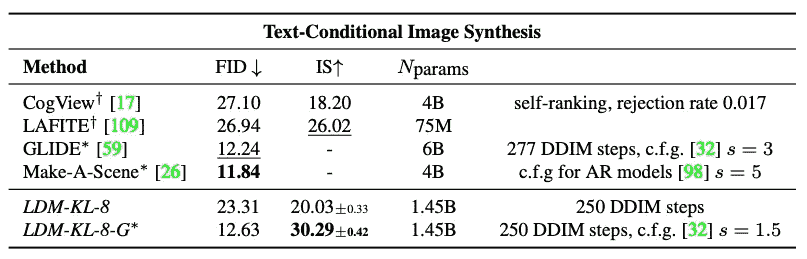
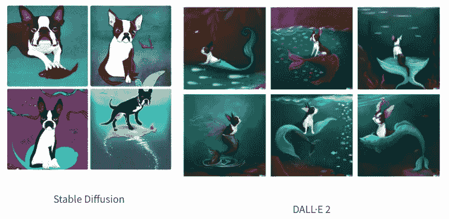
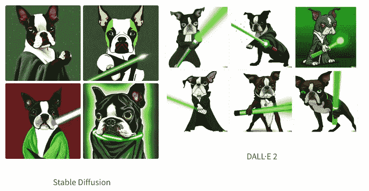
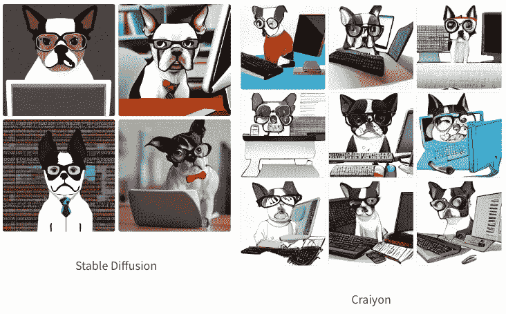
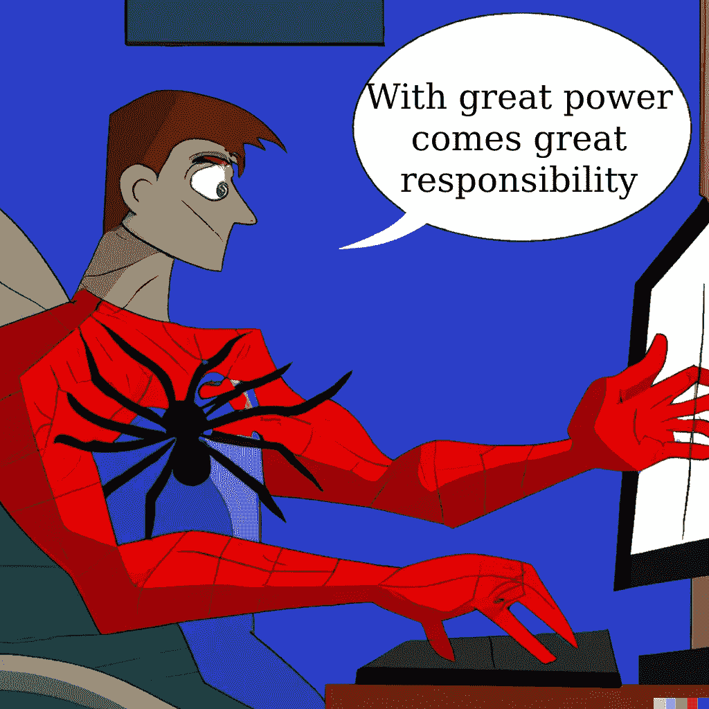

# 稳定扩散:DALL E 2 的最佳开源版本

> 原文：<https://towardsdatascience.com/stable-diffusion-best-open-source-version-of-dall-e-2-ebcdf1cb64bc>

图片来自 [Unsplash](https://unsplash.com/photos/-fRAIQHKcc0)

由来自 [Stability AI](https://stability.ai/) 、 [CompVis](https://github.com/CompVis) 和 [LAION](https://laion.ai/) 的研究人员和工程师创造的“稳定扩散”宣称来自 [Craiyon](https://www.craiyon.com/) 的王冠，以前被称为 DALL E-Mini，是新的最先进的文本到图像的开源模型。

虽然从文本中生成图像已经感觉像是古老的技术，但稳定的扩散设法将创新带到桌面上，鉴于这是一个开源项目，这更令人惊讶。

让我们深入细节，看看数据科学社区有什么稳定的扩散！

# 引入稳定扩散

稳定扩散是[潜在扩散](https://arxiv.org/abs/2112.10752)架构的开源实现，被训练为在低维潜在空间中对随机高斯噪声进行降噪，以获得感兴趣的样本。

训练扩散模型来预测在每一步中对样本进行轻微去噪的方式，并且在几次迭代之后，获得结果。扩散模型已经被应用于各种生成任务，例如图像、语音、3D 形状和图形合成。

扩散过程(作者图片)

扩散模型包括两个步骤:

*   正向扩散-通过逐渐扰动输入数据将数据映射到噪声。这在形式上是通过简单的随机过程实现的，该过程从数据样本开始，并使用简单的高斯扩散核迭代地产生噪声样本。这个过程仅在训练中使用，而不是在推理中使用。
*   参数化反向-撤消正向扩散并执行迭代去噪。该过程代表数据合成，并被训练成通过将随机噪声转换成现实数据来生成数据。

正向和反向过程需要顺序重复数千个步骤，注入和减少噪声，这使得整个过程缓慢且计算资源繁重。

为了能够在有限的资源上进行培训，同时保持其质量和灵活性,《稳定传播》的创建者采用了论文中建议的方法。他们没有使用实际的像素空间，而是在一个低维的潜在空间上应用了扩散过程。

> 例如，稳定扩散中使用的自动编码器的缩减系数为 8。这意味着一个形状为`(3, 512, 512)`的图像在潜在空间中变成了`(3, 64, 64)`，这需要`8 × 8 = 64`倍少的内存。
> [官方《稳定扩散》发布说明](https://huggingface.co/blog/stable_diffusion)

稳定的扩散架构(图片来自[论文](https://arxiv.org/abs/2112.10752)

# 稳定扩散体系结构

稳定扩散架构具有三个主要组件，两个用于将样本减少到较低维度的潜在空间，然后对随机高斯噪声进行去噪，一个用于文本处理。

1)自动编码器:模型的输入是期望输出大小的随机噪声。它首先将样本缩减到一个较低维度的潜在空间。为此，作者使用了由编码器和解码器两部分组成的 [VAE 架构](/understanding-variational-autoencoders-vaes-f70510919f73)。在训练期间使用编码器将样本转换成较低的潜在表示，并将其作为输入传递给下一个块。根据推断，去噪后生成的样本经历反向扩散，并被转换回其原始维度潜在空间。

VAE 建筑(图片来自[论文](https://arxiv.org/abs/2112.10752)

2) U-Net:由 ResNet 组成的 U-Net 块在较低延迟空间中接收有噪声的样本，对其进行压缩，然后以较少的噪声对其进行解码。来自 U-Net 输出的估计噪声残差用于构建预期的去噪样本表示。

3)文本编码器:文本编码器负责文本处理，将提示转化为嵌入空间。与谷歌的 [Imagen](https://arxiv.org/abs/2205.11487) 类似，稳定扩散使用冻结剪辑 ViT-L/14 文本编码器。

# 技术细节

稳定扩散 v1 在 256x256 图像上进行预训练，然后在 512x512 图像上进行微调，所有这些都来自 [LAION-5B](https://laion.ai/blog/laion-5b/) 数据库的子集。它对扩散模型使用带有 860M UNet 和 CLIP ViT-L/14 文本编码器的 8 倍下采样自动编码器。稳定扩散相对来说是轻量级的，在 10GB VRAM 的 GPU 上运行，当使用 float16 precision 而不是默认的 float32 时甚至更少。

该小组目前公布了以下检查点:

*   `sd-v1-1.ckpt`:在 [laion2B-en](https://huggingface.co/datasets/laion/laion2B-en) 上分辨率`256x256`处 237k 步。[LAION-高分辨率](https://huggingface.co/datasets/laion/laion-high-resolution)上分辨率`512x512`的 194k 步(分辨率`>= 1024x1024`的 LAION-5B 的 170M 示例)。
*   `sd-v1-2.ckpt`:从`sd-v1-1.ckpt`开始恢复。在 [laion-aesthetics v2 5+](https://laion.ai/blog/laion-aesthetics/) (具有估计美学分数`> 5.0`的 laion2B-en 的子集，并且另外被过滤成具有原始尺寸`>= 512x512`和估计水印概率`< 0.5`的图像)上以分辨率`512x512`前进 515k 步。水印估计来自 [LAION-5B](https://laion.ai/blog/laion-5b/) 元数据，美学分数使用[laon 美学预测器 V2](https://github.com/christophschuhmann/improved-aesthetic-predictor) 来估计。
*   `sd-v1-3.ckpt`:从`sd-v1-2.ckpt`恢复。“laion-aesthetics v2 5+”的分辨率`512x512`为 195k 步，文本调节下降 10%，以改进[无分类器引导取样](https://arxiv.org/abs/2207.12598)。
*   `sd-v1-4.ckpt`:从`sd-v1-2.ckpt`恢复。“laion-aesthetics v2 5+”的分辨率`512x512`为 225k 步，文本调节下降 10%，以改进[无分类器引导取样](https://arxiv.org/abs/2207.12598)。

**来自 GitHub 官方稳定扩散库**

# 模型性能

为了评估生成模型创建的图像质量，通常使用[弗雷歇初始距离(FID)](https://en.wikipedia.org/wiki/Fr%C3%A9chet_inception_distance) 度量。简而言之，FID 计算真实图像和生成图像的特征向量之间的距离。在 COCO 基准测试上，Imagen 目前取得了 7.27 的最佳(最低)零拍 FID 分数，优于 10.39 FID 分数的 DALL E 2。

扩散模型的最佳结果(图片来自[论文，代码](https://paperswithcode.com/sota/text-to-image-generation-on-coco?tag_filter=246)

Stable Diffusion 团队还没有发布任何基准分数来与其他模型进行比较。从最初的[潜在扩散](https://arxiv.org/abs/2112.10752)论文(见下文)，潜在扩散模型(LDM)已经使用 56 × 256 大小的 MS-COCO 数据集达到 12.63 FID 分数:具有 250 个 DDIM 步骤。

稳定的扩散结果(图片来自[纸张](https://arxiv.org/abs/2112.10752)

文本到图像模型最好的部分是我们可以很容易地定性评估模型的性能。让我们来看看稳定扩散与 SOTA 闭源模型 DALL E 2 相比表现如何。

# 稳定扩散 vs DALL E 2

> 波士顿梗与美人鱼尾巴，在海底，戏剧性的，数字艺术。

使用稳定扩散和 DALL E 2 生成的图像(图片由作者提供)

> 一名波士顿梗绝地手持墨绿色光剑，栩栩如生

使用稳定扩散和 DALL E 2 生成的图像(图片由作者提供)

我不禁惊叹于这些模型产生的结果，这绝对是令人兴奋的。未来就在这里！

从结果中可以看出，达尔·E-2 设法理解并产生了更适合于提示的图像，而稳定的扩散却在挣扎。例如，狗站在一条鱼上，而不是有尾巴。然而，图像的质量、颜色、灯光和风格都令人印象深刻。

# 稳定扩散对 Cray ion(DALL E Mini)

但是作为优秀的数据科学家，我们喜欢比较苹果和苹果。让我们将稳定扩散与开源项目 Craiyon 进行比较。

> 书呆子气的波士顿梗，戴着眼镜，在电脑后面写代码，动漫风格

使用稳定扩散和 Craiyon 生成的图像(图片由作者提供)

正如我们可以立即看到的，稳定的扩散产生更真实的图像，而 Craiyon 努力塑造狗的脸。

# 稳定扩散有争议的一面

稳定扩散在其存在的短时间内已经产生了许多争论。与 DALL E 2 不同，稳定扩散对它可以生成的内容几乎没有限制。在发布后，用户测试了它的局限性，生成了人名图像、色情图像以及与不同意使用其材料的艺术家的作品可疑相似的图像。

用 DALL E 2 的话说就是稍微修改一下文字😉(图片由导演提供)

所有这些都在 Twitter 和 T2 的 Reddit 上引发了大量讨论，人们呼吁因安全问题停止该项目。截至这篇博文撰写之时，Twitter 决定封锁该项目账户，托管在 [HugginFace Space](https://huggingface.co/spaces/stabilityai/stable-diffusion) 上的模型对其可以生成的内容进行了限制，名为“安全分类器”，旨在删除 NSFW 图像。

# 结论

稳定扩散是最近发布的最令人兴奋的 OSDS 项目之一。与以前的操作系统文本到图像模型相比，它提供了最先进的结果和各方面的显著改进。迫不及待地想看到这个领域的未来，但又忍不住担心它的影响。

# 资源

*   [稳定扩散发布说明](https://huggingface.co/blog/stable_diffusion)
*   [稳定扩散 GitHub 回购](https://github.com/CompVis/stable-diffusion)
*   [“使用潜在扩散模型的高分辨率图像合成”论文](https://arxiv.org/abs/2112.10752)
*   [改进扩散模型，作为 gan 的替代方案](https://developer.nvidia.com/blog/improving-diffusion-models-as-an-alternative-to-gans-part-1/)