# 使用拥抱脸的稳定扩散

> 原文：<https://towardsdatascience.com/stable-diffusion-using-hugging-face-501d8dbdd8>

## 对稳定扩散世界的全面介绍使用[拥抱脸](https://huggingface.co/)——[扩散器库](https://github.com/huggingface/diffusers)使用文本提示创建人工智能生成的图像

# 1.介绍

你可能已经看到人工智能生成的图像有所上升，这是因为潜在扩散模型的兴起。稳定扩散简单地说是一种深度学习模型，它可以在给定文本提示的情况下生成图像。

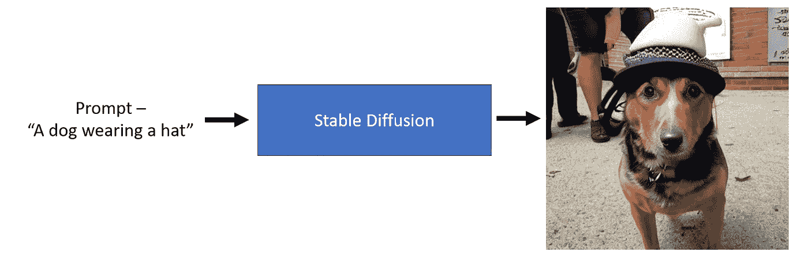

图 1:稳定扩散概述

从上面的图像中我们可以看到，我们可以传递一个文本提示，比如“一只戴着帽子的狗”，一个稳定的扩散模型可以生成一个代表文本的图像。相当惊人！

# 2.使用🤗扩散器库

与任何 python 库一样，在运行它之前，我们需要遵循特定的安装步骤，下面是这些步骤的概要。

1.  **接受许可—** 在使用模型之前，您需要前往[此处](https://huggingface.co/CompVis/stable-diffusion-v1-4)使用您的拥抱脸帐户登录，然后接受模型许可，下载并使用砝码。
2.  **令牌生成—** 如果这是你第一次使用拥抱人脸库，这听起来可能有点奇怪。您需要转到这里的[并生成一个令牌(最好有写权限)来下载模型。](https://huggingface.co/settings/tokens)


图 2:访问令牌页面

3.**安装 hugging face hub 库并登录—** 生成令牌后，复制它。首先，我们将使用下面的代码下载 hugging face hub 库。

***注意—*** *为了用代码正确地渲染这些内容，我推荐你在这里阅读*<https://aayushmnit.com/posts/2022-11-02-StabeDiffusionP1/2022-11-02-StableDiffusionP1.html>**。**

```
*!pip install huggingface-hub==0.10.1*
```

*然后使用下面的代码，一旦运行它，就会出现一个小部件，粘贴您新生成的令牌，然后单击登录。*

```
*from huggingface_hub import notebook_login
notebook_login()*
```

*4.I **安装扩散器和变压器库—** 一旦该过程完成，使用以下代码安装依赖项。这将下载最新版本的[扩散器](https://github.com/huggingface/diffusers)和[变形金刚](https://github.com/huggingface/transformers)库。*

```
*!pip install -qq -U diffusers transformers*
```

*就这样，现在我们准备好使用扩散器库了。*

# *3.运行稳定的扩散——高层管道*

*第一步是从扩散器库中导入`StableDiffusionPipeline`。*

```
*from diffusers import StableDiffusionPipeline*
```

*下一步是初始化管道以生成图像。第一次运行以下命令时，它会将模型从 hugging face 模型中心下载到您的本地机器上。您将需要一台 GPU 机器来运行这段代码。*

```
*pipe = StableDiffusionPipeline.from_pretrained('CompVis/stable-diffusion-v1-4').to('cuda')*
```

*现在让我们传递一个文本提示并生成一个图像。*

```
*# Initialize a prompt
prompt = "a dog wearing hat"
# Pass the prompt in the pipeline
pipe(prompt).images[0]*
```

*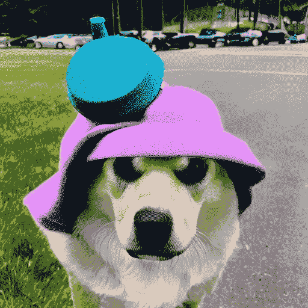*

*图 3:由扩散管道产生的图像的例子。*

# *4.了解稳定扩散的核心要素*

*如上所示的扩散模型可以生成高质量的图像。稳定扩散模型是一种特殊的扩散模型，称为**潜在扩散**模型。他们在这篇论文中首次提出了[用潜在扩散模型进行高分辨率图像合成](https://arxiv.org/abs/2112.10752)。原始扩散模型往往会消耗更多的内存，因此创建了潜在扩散模型，它可以在称为`Latent`空间的低维空间中进行扩散过程。在高层次上，扩散模型是机器学习模型，其被逐步训练到`denoise`随机高斯噪声，以得到结果，即`image`。在`latent diffusion`中，模型被训练在一个较低的维度上做同样的过程。*

*潜在扩散有三个主要组成部分*

1.  *一个文本编码器，在这种情况下，一个[剪辑文本编码器](https://openai.com/blog/clip/)*
2.  *自动编码器，在这种情况下，变型自动编码器也称为 VAE*
3.  *一个 [U 形网](https://arxiv.org/abs/1505.04597)*

*让我们深入这些组件，了解它们在扩散过程中的用途。我将尝试通过以下三个阶段来解释这些组成部分*

1.  ****基础知识:什么进入组件，什么从组件中出来***——这是理解“整个游戏”的[自上而下学习方法](https://www.fast.ai/posts/2016-10-08-teaching-philosophy.html)的一个重要且关键的部分*
2.  ****更深层次的解释运用🤗代码。***——这一部分将提供对模型使用代码产生什么的更多理解*
3.  ****它们在稳定扩散管道中的作用是什么*** —这将让你对这种成分在稳定扩散过程中的作用有一个直观的认识。这将有助于你对扩散过程的直觉*

# *5.剪辑文本编码器*

## *5.1 基础知识—什么进出组件？*

*CLIP(对比语言-图像预训练)文本编码器将文本作为输入，并生成潜在空间接近的文本嵌入，就像通过 CLIP 模型对图像进行编码一样。*

*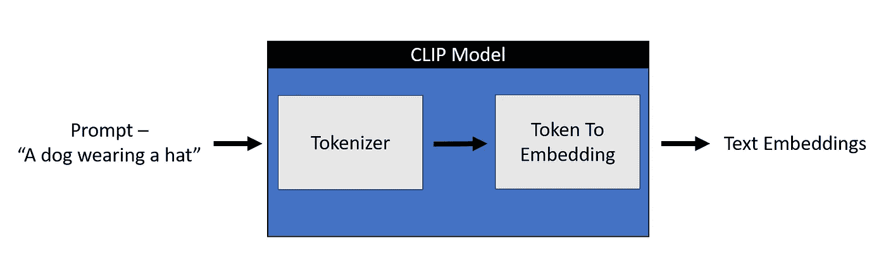*

*图 4:剪辑文本编码器*

## *2.2 使用更深入的解释🤗密码*

*任何机器学习模型都不理解文本数据。对于任何理解文本数据的模型，我们都需要将这个文本转换成保存文本含义的数字，称为`embeddings`。将文本转换成数字的过程可以分为两个部分。 ***记号化器***——将每个单词分解成子单词，然后使用查找表将它们转换成数字
2。 ***Token_To_Embedding 编码器***——将那些数字子词转换成包含该文本表示的表示*

*我们通过代码来看一下。我们将从导入相关的工件开始。*

****注—*** *要用代码正确地渲染这些内容，我推荐你在这里阅读*<https://aayushmnit.com/posts/2022-11-05-StableDiffusionP2/2022-11-05-StableDiffusionP2.html>**。***

```
**import torch, logging
## disable warnings
logging.disable(logging.WARNING)  
## Import the CLIP artifacts 
from transformers import CLIPTextModel, CLIPTokenizer
## Initiating tokenizer and encoder.
tokenizer = CLIPTokenizer.from_pretrained("openai/clip-vit-large-patch14", torch_dtype=torch.float16)
text_encoder = CLIPTextModel.from_pretrained("openai/clip-vit-large-patch14", torch_dtype=torch.float16).to("cuda")**
```

**让我们初始化一个提示符并对其进行标记。**

```
**prompt = ["a dog wearing hat"]
tok =tokenizer(prompt, padding="max_length", max_length=tokenizer.model_max_length, truncation=True, return_tensors="pt") 
print(tok.input_ids.shape)
tok**
```

**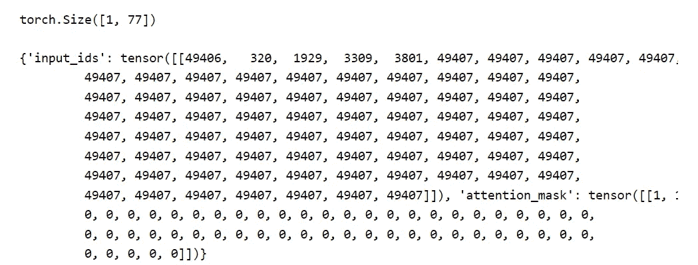**

**A `tokenizer`以字典的形式返回两个对象-
1。`***input_ids***` -一个大小为 1x77 的张量作为一个提示被传递并填充到 77 的最大长度。`*49406*`是开始标记，`*320*`是给予单词“a”的标记，`*1929*`是给予单词“dog”的标记，`*3309*`是给予单词“wear”的标记，`*3801*`是给予单词“hat”的标记，`*49407*`是文本结束标记，重复直到填充长度为 77。
2。`***attention_mask***` - `1`表示嵌入值，`0`表示填充。**

```
**for token in list(tok.input_ids[0,:7]): 
    print(f"{token}:{tokenizer.convert_ids_to_tokens(int(token))}")**
```

**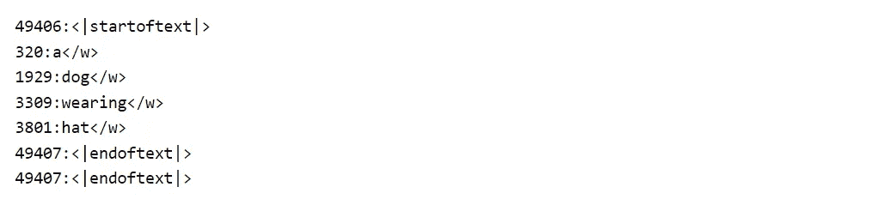**

**所以，让我们看一下`Token_To_Embedding Encoder`，它接受由记号赋予器生成的`input_ids`,并将它们转换成嵌入-**

```
**emb = text_encoder(tok.input_ids.to("cuda"))[0].half()
print(f"Shape of embedding : {emb.shape}")
emb**
```

**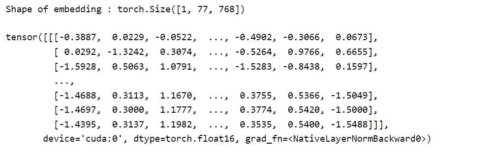**

**正如我们在上面看到的，每个大小为 1x77 的标记化输入现在已经被转换为 1x77x768 形状嵌入。所以，每个单词都在一个 768 维的空间中被表现出来。**

# **5.3 他们在稳定扩散管道中的作用是什么**

**稳定扩散仅使用剪辑训练的编码器来将文本转换为嵌入。这成为 U-net 的输入之一。在高层次上，CLIP 使用图像编码器和文本编码器来创建在潜在空间中相似的嵌入。这种相似性被更精确地定义为[对比目标](https://arxiv.org/abs/1807.03748)。关于 CLIP 如何训练的更多信息，请参考这个[开放 AI 博客](https://openai.com/blog/clip/)。**

**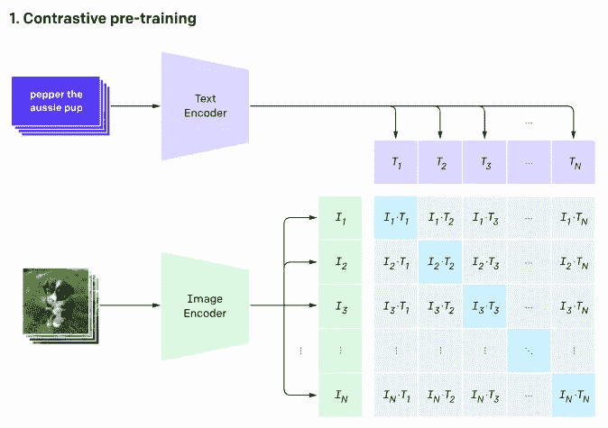**

**图 5: CLIP 预先训练了一个图像编码器和一个文本编码器，以预测在我们的数据集中哪些图像与哪些文本配对。信用— [OpenAI](https://openai.com/blog/clip/)**

# **6.VAE —变分自动编码器**

## **6.1 基础知识—什么进出组件？**

**一个自动编码器包含两部分-
1。`Encoder`将图像作为输入，并将其转换为低维潜在表示
2。`Decoder`获取潜像并将其转换回图像**

**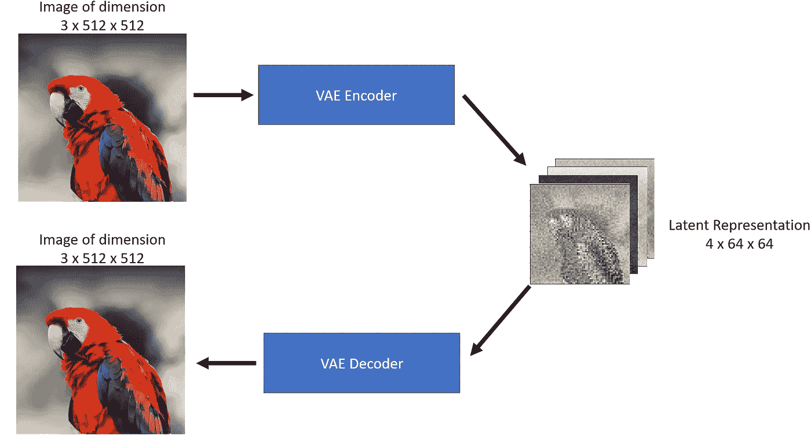**

**图 6:一个变化的自动编码器。原鸟 [pic 功劳](https://lafeber.com/pet-birds/wp-content/uploads/2018/06/Scarlet-Macaw-2.jpg)。**

**正如我们在上面看到的，编码器就像一个压缩器，将图像压缩到更低的维度，解码器从压缩版本中重新创建原始图像。**

> ****注意:**编解码压缩-解压缩不是无损的。**

## **6.2 更深入的解释使用🤗密码**

**让我们通过代码来看看 VAE。我们将从导入所需的库和一些辅助函数开始。**

```
**## To import an image from a URL 
from fastdownload import FastDownload  
## Imaging  library 
from PIL import Image 
from torchvision import transforms as tfms  
## Basic libraries 
import numpy as np 
import matplotlib.pyplot as plt 
%matplotlib inline  
## Loading a VAE model 
from diffusers import AutoencoderKL 
vae = AutoencoderKL.from_pretrained("CompVis/stable-diffusion-v1-4", subfolder="vae", torch_dtype=torch.float16).to("cuda")
def load_image(p):
   '''     
   Function to load images from a defined path     
   '''    
    return Image.open(p).convert('RGB').resize((512,512))
def pil_to_latents(image):
    '''     
    Function to convert image to latents     
    '''     
    init_image = tfms.ToTensor()(image).unsqueeze(0) * 2.0 - 1.0   
    init_image = init_image.to(device="cuda", dtype=torch.float16)
    init_latent_dist = vae.encode(init_image).latent_dist.sample() * 0.18215     
    return init_latent_dist  
def latents_to_pil(latents):     
    '''     
    Function to convert latents to images     
    '''     
    latents = (1 / 0.18215) * latents     
    with torch.no_grad():         
        image = vae.decode(latents).sample     

    image = (image / 2 + 0.5).clamp(0, 1)     
    image = image.detach().cpu().permute(0, 2, 3, 1).numpy()      
    images = (image * 255).round().astype("uint8")     
    pil_images = [Image.fromarray(image) for image in images]        
    return pil_images**
```

**我们从网上下载一张图片吧。**

```
**p = FastDownload().download('https://lafeber.com/pet-birds/wp-content/uploads/2018/06/Scarlet-Macaw-2.jpg')
img = load_image(p)
print(f"Dimension of this image: {np.array(img).shape}")
img**
```

**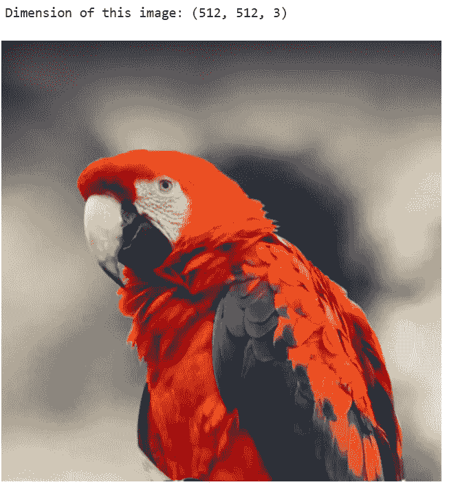**

**图 7:原鸟 [pic 信用](https://lafeber.com/pet-birds/wp-content/uploads/2018/06/Scarlet-Macaw-2.jpg)。**

**现在让我们使用 VAE 编码器来压缩这个图像，我们将使用`pil_to_latents`辅助函数。**

```
**latent_img = pil_to_latents(img)
print(f"Dimension of this latent representation: {latent_img.shape}")**
```

**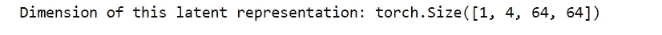**

**我们可以看到 VAE 是如何将一个 3 x 512 x 512 的图像压缩成 4 x 64 x 64 的图像的。这是 48 倍的压缩比！让我们想象这四个潜在表征的渠道。**

```
**fig, axs = plt.subplots(1, 4, figsize=(16, 4))
for c in range(4):
    axs[c].imshow(latent_img[0][c].detach().cpu(), cmap='Greys')**
```

**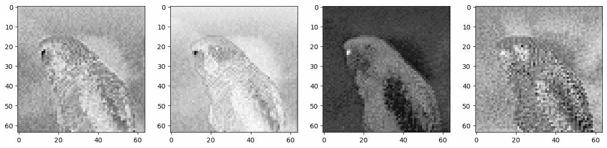**

**图 8:来自 VAE 编码器的潜在表示的可视化。**

**这种潜在的表示在理论上应该捕捉到很多关于原始图像的信息。让我们对这个表示使用解码器，看看我们得到什么。为此，我们将使用`latents_to_pil`助手函数。**

```
**decoded_img = latents_to_pil(latent_img)
decoded_img[0]**
```

**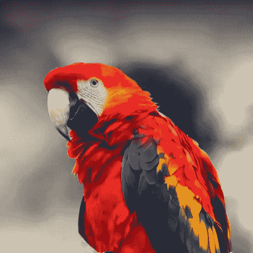**

**图 9:来自 VAE 解码器的解码潜在表示的可视化。**

**从上图中我们可以看到，VAE 解码器能够从 48x 压缩的潜在图像中恢复原始图像。令人印象深刻！**

> ****注意:**如果你仔细看解码图像，它与原始图像不一样，注意眼睛周围的差异。这就是为什么 VAE 编码器/解码器不是无损压缩。**

## **6.3 他们在稳定扩散管道中的角色是什么**

**稳定的扩散可以在没有 VAE 分量的情况下完成，但是我们使用 VAE 的原因是为了减少生成高分辨率图像的计算时间。潜在扩散模型可以在由 VAE 编码器产生的这个*潜在空间*中执行扩散，并且一旦我们有了由扩散过程产生的我们期望的潜在输出，我们可以通过使用 VAE 解码器将它们转换回高分辨率图像。为了更直观地理解变体自动编码器以及它们是如何被训练的，请阅读 Irhum Shafkat 的博客。**

# **7.u 网模型**

## **7.1 基础知识—什么进出组件？**

**U-Net 模型接受两个输入-
1。`Noisy latent`或`Noise` -噪声潜伏是由 VAE 编码器(在提供初始图像的情况下)产生的具有附加噪声的潜伏，或者在我们想要仅基于文本描述创建随机新图像的情况下，它可以接受纯噪声输入
2。`Text embeddings` -基于剪辑的嵌入由输入的文本提示生成**

**U-Net 模型的输出是输入噪声潜势包含的预测噪声残差。换句话说，它预测从噪声潜伏时间中减去的噪声，以返回原始的去噪声潜伏时间。**

**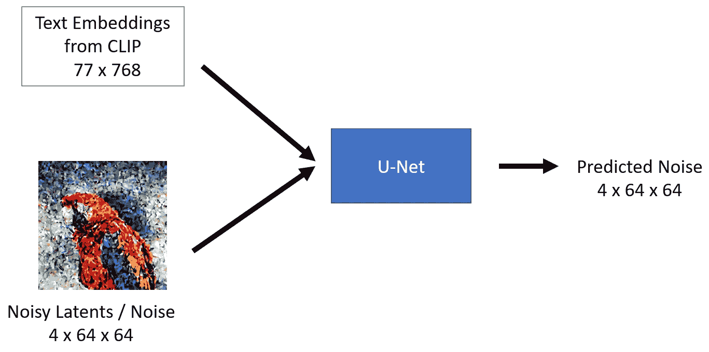**

**图 10:一个 U 网表示。**

## **7.2 更深入的解释使用🤗密码**

**让我们通过代码开始看 U-Net。我们将从导入所需的库和启动我们的 U-Net 模型开始。**

```
**from diffusers import UNet2DConditionModel, LMSDiscreteScheduler
## Initializing a scheduler
scheduler = LMSDiscreteScheduler(beta_start=0.00085, beta_end=0.012, beta_schedule="scaled_linear", num_train_timesteps=1000)
## Setting number of sampling steps
scheduler.set_timesteps(51)
## Initializing the U-Net model
unet = UNet2DConditionModel.from_pretrained("CompVis/stable-diffusion-v1-4", subfolder="unet", torch_dtype=torch.float16).to("cuda")**
```

**您可能已经从上面的代码中注意到，我们不仅导入了`unet`，还导入了`scheduler`。`schedular`的目的是确定在扩散过程的给定步骤中有多少噪声添加到潜在噪声中。让我们来看一下 schedular 函数**

**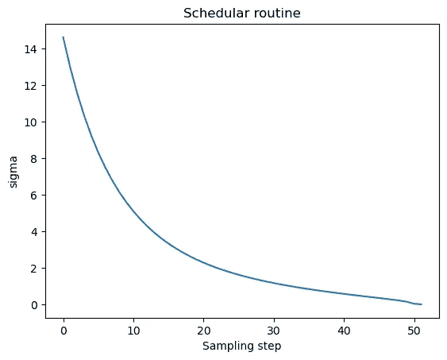**

**图 11:采样计划可视化。**

**扩散过程遵循这个采样时间表，我们从高噪声开始，并逐渐对图像去噪。让我们想象一下这个过程-**

```
**noise = torch.randn_like(latent_img) # Random noise
fig, axs = plt.subplots(2, 3, figsize=(16, 12))
for c, sampling_step in enumerate(range(0,51,10)):
    encoded_and_noised = scheduler.add_noise(latent_img, noise, timesteps=torch.tensor([scheduler.timesteps[sampling_step]]))
    axs[c//3][c%3].imshow(latents_to_pil(encoded_and_noised)[0])
    axs[c//3][c%3].set_title(f"Step - {sampling_step}")**
```

****

**图 12:通过步骤的噪声进展。**

**让我们看看 U-Net 是如何去除图像中的噪声的。让我们从给图像添加一些噪声开始。**

```
**encoded_and_noised = scheduler.add_noise(latent_img, noise, timesteps=torch.tensor([scheduler.timesteps[40]])) latents_to_pil(encoded_and_noised)[0]**
```

**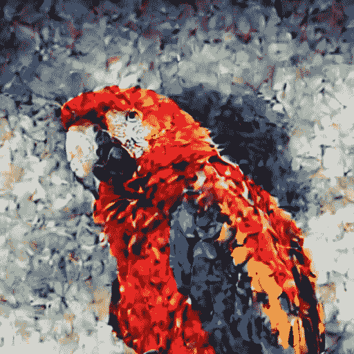**

**图 13:馈入 U-Net 的噪声输入。**

**让我们浏览一下 U-Net，试着去噪这个图像。**

```
**## Unconditional textual prompt
prompt = [""]
## Using clip model to get embeddings
text_input = tokenizer(prompt, padding="max_length", max_length=tokenizer.model_max_length, truncation=True, return_tensors="pt")
with torch.no_grad(): 
    text_embeddings = text_encoder(
        text_input.input_ids.to("cuda")
    )[0]

## Using U-Net to predict noise    
latent_model_input = torch.cat([encoded_and_noised.to("cuda").float()]).half()
with torch.no_grad():
    noise_pred = unet(
        latent_model_input,40,encoder_hidden_states=text_embeddings
    )["sample"]
## Visualize after subtracting noise 
latents_to_pil(encoded_and_noised- noise_pred)[0]**
```

**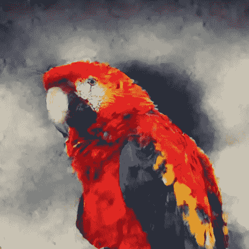**

**图 14:来自 U-Net 的去噪声输出**

**正如我们在上面看到的，U-Net 的输出比通过的原始噪声输入更清晰。**

## **7.3 他们在稳定扩散管道中的角色是什么**

**潜在扩散使用 U-Net 通过几个步骤逐渐减去潜在空间中的噪声，以达到所需的输出。每走一步，添加到延迟中的噪声量就会减少，直到我们得到最终的去噪输出。u-网最初是由[本文](https://arxiv.org/abs/1505.04597)介绍的，用于生物医学图像分割。U-Net 具有由 ResNet 块组成的编码器和解码器。稳定扩散 U-Net 还具有交叉注意层，使它们能够根据所提供的文本描述来调节输出。交叉注意层通常在 ResNet 块之间被添加到 U-Net 的编码器和解码器部分。你可以在这里了解更多关于这个 U-Net 架构[的信息。](https://colab.research.google.com/github/huggingface/notebooks/blob/main/diffusers/diffusers_intro.ipynb#scrollTo=wW8o1Wp0zRkq)**

# **8.把所有东西放在一起，理解扩散过程**

**如上所述，我展示了如何安装🤗扩散器库开始生成您自己的人工智能图像和稳定扩散管道的关键组件，即剪辑文本编码器，VAE 和 U-Net。现在，我们将尝试把这些关键部分放在一起，并做一个产生图像的扩散过程的演练。**

## **8.1 概述-扩散过程**

**稳定扩散模型采用文本输入和种子。文本输入然后通过剪辑模型以生成大小为 77×768 的文本嵌入，并且种子用于生成大小为 4×64×64 的高斯噪声，该高斯噪声成为第一潜像表示。**

> **注意—您会注意到在图像中提到了一个额外的维度(1x ),如用于文本嵌入的 1x77x768，这是因为它表示批量大小为 1。**

**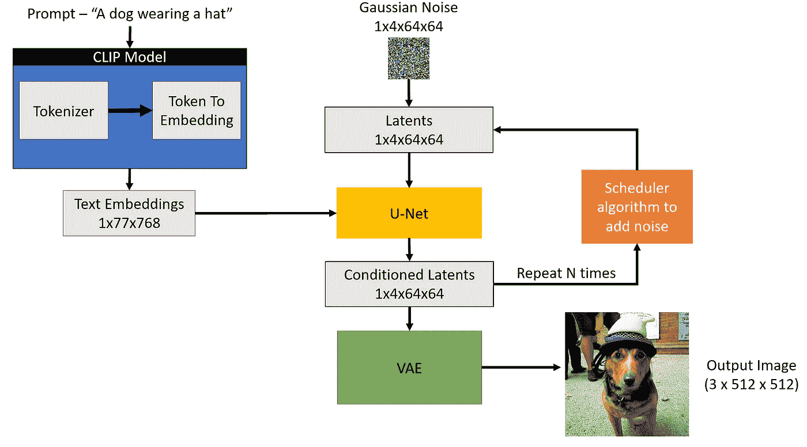**

**图 15:扩散过程。**

**接下来，U-Net 迭代地去除随机潜像表示的噪声，同时以文本嵌入为条件。U-Net 的输出是预测的噪声残差，该噪声残差然后被用于通过调度器算法来计算条件延迟。这个去噪和文本调节的过程重复 N 次(我们将使用 50 次)以检索更好的潜像表示。一旦该过程完成，潜像表示(4x64x64)由 VAE 解码器解码，以检索最终的输出图像(3x512x512)。**

> **注意——这种迭代去噪是获得良好输出图像的重要步骤。典型的步长范围是 30–80。然而，有[最近的论文](https://arxiv.org/abs/2202.00512)声称通过使用蒸馏技术将其减少到 4-5 步。**

## **8.2 通过代码理解扩散过程**

**让我们从导入所需的库和助手函数开始。上面已经解释了所有这些。**

*****注意—*** *为了用代码正确地渲染这些内容，我推荐你在这里阅读* [*。*](https://aayushmnit.com/posts/2022-11-07-StableDiffusionP3/2022-11-07-StableDiffusionP3.html)**

```
**import torch, logging
## disable warnings
logging.disable(logging.WARNING)  
## Imaging  library
from PIL import Image
from torchvision import transforms as tfms
## Basic libraries
import numpy as np
from tqdm.auto import tqdm
import matplotlib.pyplot as plt
%matplotlib inline
from IPython.display import display
import shutil
import os
## For video display
from IPython.display import HTML
from base64 import b64encode

## Import the CLIP artifacts 
from transformers import CLIPTextModel, CLIPTokenizer
from diffusers import AutoencoderKL, UNet2DConditionModel, LMSDiscreteScheduler
## Initiating tokenizer and encoder.
tokenizer = CLIPTokenizer.from_pretrained("openai/clip-vit-large-patch14", torch_dtype=torch.float16)
text_encoder = CLIPTextModel.from_pretrained("openai/clip-vit-large-patch14", torch_dtype=torch.float16).to("cuda")
## Initiating the VAE
vae = AutoencoderKL.from_pretrained("CompVis/stable-diffusion-v1-4", subfolder="vae", torch_dtype=torch.float16).to("cuda")
## Initializing a scheduler and Setting number of sampling steps
scheduler = LMSDiscreteScheduler(beta_start=0.00085, beta_end=0.012, beta_schedule="scaled_linear", num_train_timesteps=1000)
scheduler.set_timesteps(50)
## Initializing the U-Net model
unet = UNet2DConditionModel.from_pretrained("CompVis/stable-diffusion-v1-4", subfolder="unet", torch_dtype=torch.float16).to("cuda")
## Helper functions
def load_image(p):
    '''
    Function to load images from a defined path
    '''
    return Image.open(p).convert('RGB').resize((512,512))
def pil_to_latents(image):
    '''
    Function to convert image to latents
    '''
    init_image = tfms.ToTensor()(image).unsqueeze(0) * 2.0 - 1.0
    init_image = init_image.to(device="cuda", dtype=torch.float16) 
    init_latent_dist = vae.encode(init_image).latent_dist.sample() * 0.18215
    return init_latent_dist
def latents_to_pil(latents):
    '''
    Function to convert latents to images
    '''
    latents = (1 / 0.18215) * latents
    with torch.no_grad():
        image = vae.decode(latents).sample
    image = (image / 2 + 0.5).clamp(0, 1)
    image = image.detach().cpu().permute(0, 2, 3, 1).numpy()
    images = (image * 255).round().astype("uint8")
    pil_images = [Image.fromarray(image) for image in images]
    return pil_images
def text_enc(prompts, maxlen=None):
    '''
    A function to take a texual promt and convert it into embeddings
    '''
    if maxlen is None: maxlen = tokenizer.model_max_length
    inp = tokenizer(prompts, padding="max_length", max_length=maxlen, truncation=True, return_tensors="pt") 
    return text_encoder(inp.input_ids.to("cuda"))[0].half()**
```

**下面的代码是`[StableDiffusionPipeline.from_pretrained](https://github.com/huggingface/diffusers/blob/269109dbfbbdbe2800535239b881e96e1828a0ef/src/diffusers/pipelines/stable_diffusion/pipeline_stable_diffusion.py)`函数中的精简版本，显示了扩散过程的重要部分。**

```
**def prompt_2_img(prompts, g=7.5, seed=100, steps=70, dim=512, save_int=False):
    """
    Diffusion process to convert prompt to image
    """

    # Defining batch size
    bs = len(prompts) 

    # Converting textual prompts to embedding
    text = text_enc(prompts) 

    # Adding an unconditional prompt , helps in the generation process
    uncond =  text_enc([""] * bs, text.shape[1])
    emb = torch.cat([uncond, text])

    # Setting the seed
    if seed: torch.manual_seed(seed)

    # Initiating random noise
    latents = torch.randn((bs, unet.in_channels, dim//8, dim//8))

    # Setting number of steps in scheduler
    scheduler.set_timesteps(steps)

    # Adding noise to the latents 
    latents = latents.to("cuda").half() * scheduler.init_noise_sigma

    # Iterating through defined steps
    for i,ts in enumerate(tqdm(scheduler.timesteps)):
        # We need to scale the i/p latents to match the variance
        inp = scheduler.scale_model_input(torch.cat([latents] * 2), ts)

        # Predicting noise residual using U-Net
        with torch.no_grad(): u,t = unet(inp, ts, encoder_hidden_states=emb).sample.chunk(2)

        # Performing Guidance
        pred = u + g*(t-u)

        # Conditioning  the latents
        latents = scheduler.step(pred, ts, latents).prev_sample

        # Saving intermediate images
        if save_int: 
            if not os.path.exists(f'./steps'):
                os.mkdir(f'./steps')
            latents_to_pil(latents)[0].save(f'steps/{i:04}.jpeg')

    # Returning the latent representation to output an image of 3x512x512
    return latents_to_pil(latents)**
```

**让我们看看这个函数是否如预期的那样工作。**

```
**images = prompt_2_img(["A dog wearing a hat", "a photograph of an astronaut riding a horse"], save_int=False)
for img in images:display(img)**
```

**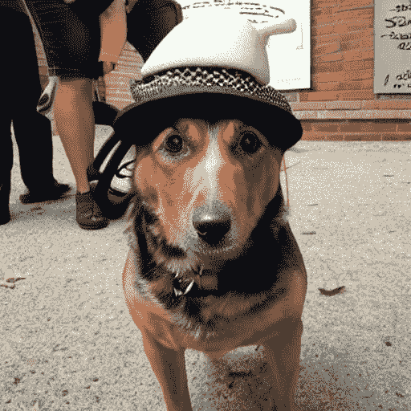******

**看起来它正在工作！因此，让我们更深入地了解该函数的超参数。
1。`prompt` -这是我们用来生成图像的文本提示。类似于我们在第 1 部分
2 中看到的`pipe(prompt)`函数。`g`或`guidance scale`——这是一个决定图像应该多接近文本提示的值。这与一种名为[分类器自由引导](https://benanne.github.io/2022/05/26/guidance.html)的技术有关，该技术提高了生成图像的质量。指导比例值越高，越接近文本提示
3。`seed` -设置生成初始高斯噪声潜伏时间的种子
4。`steps` -生成最终延迟所采取的去噪步骤数。
5。`dim` -图像的尺寸，为了简单起见，我们目前正在生成正方形图像，因此只需要一个值
6。`save_int` -这是可选的，一个布尔标志，如果我们想保存中间潜像，有助于可视化。**

**让我们想象一下从噪声到最终图像的生成过程。**

**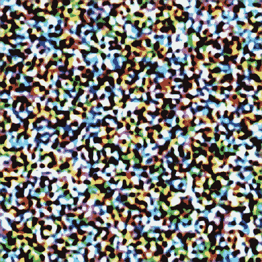**

**图 16:去噪步骤可视化。**

# **9.结论**

**我希望你喜欢阅读它，并随时使用我的代码，并尝试生成您的图像。此外，如果对代码或博客帖子有任何反馈，请随时联系 LinkedIn 或给我发电子邮件，地址是 aayushmnit@gmail.com。**

# **10.参考**

*   **[Fast.ai 课程——《从深度学习基础到稳定扩散》前两节](https://www.fast.ai/posts/part2-2022-preview.html)**
*   **[🧨扩散器的稳定扩散](https://huggingface.co/blog/stable_diffusion)**
*   **[稳定扩散世界入门](https://bipinkrishnan.github.io/posts/getting-started-in-the-world-of-stable-diffusion/)**