# 使用拥抱脸的稳定扩散— DiffEdit 纸张实现

> 原文：<https://towardsdatascience.com/stable-diffusion-using-hugging-face-diffedit-paper-implementation-e4c99e3e320c>

DIFFEDIT 的一种实现:基于扩散的语义图像编辑，具有掩模引导🤗[抱紧脸扩散器库](https://github.com/huggingface/diffusers)。

在这篇文章中，我将实现 Meta AI 和索邦大学的研究人员最近发表的一篇名为`**DIFFEDIT**`的论文。这篇博客对于那些熟悉稳定扩散过程或者正在阅读我写的关于稳定扩散的另外两篇博客的人来说更有意义。**第一部分** - [使用拥抱脸的稳定扩散|作者 Aayush agr awal | 2022 年 11 月|走向数据科学](/stable-diffusion-using-hugging-face-501d8dbdd8)
2 .**第 2 部分** - [使用拥抱脸的稳定扩散-稳定扩散的变化|作者 Aayush agr awal | 2022 年 11 月|走向数据科学](/stable-diffusion-using-hugging-face-variations-of-stable-diffusion-56fd2ab7a265)

最初，这是我想写的博文，但是意识到没有一个地方可以理解代码的稳定扩散。这就是我最终创建其他博客作为参考或预读材料来理解本文的原因。

# 什么是 DiffEdit？

简单地说，你可以把`DiffEdit`方法看作是`Image to Image`管道的一个更受控制的版本。`DiffEdit`接受三个输入-
1。一个输入图像
2。`Caption` -描述输入图像
3。`Target Query` -描述您想要生成的新图像

并且基于查询文本产生原始图像的修改版本。如果您想对实际图像稍作调整而不完全修改它，这个过程特别好。


图 1:差异编辑概述。

从上面的图片中我们可以看到，只有图片中的水果部分被替换成了梨。相当惊人的结果！

作者解释说，他们实现这一目标的方式是通过引入一个遮罩生成模块，该模块确定图像的哪一部分应该被编辑，然后只对被遮罩的部分执行基于文本的扩散调节。

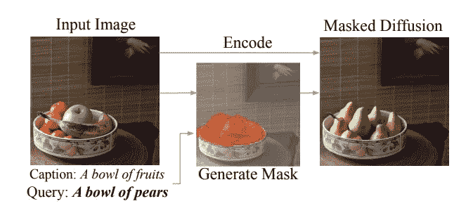

图 2:来自论文 [DiffEdit](https://arxiv.org/pdf/2210.11427.pdf) 。一种通过提供标题文本和新文本来改变输入图像的方法。

从上面取自论文的图像中我们可以看到，作者从输入图像中创建了一个遮罩，它可以准确地确定图像中存在水果的部分，并生成一个遮罩(以橙色显示),然后执行遮罩扩散以用梨替换水果。进一步阅读，作者提供了整个`DiffEdit`过程的一个很好的可视化表示。

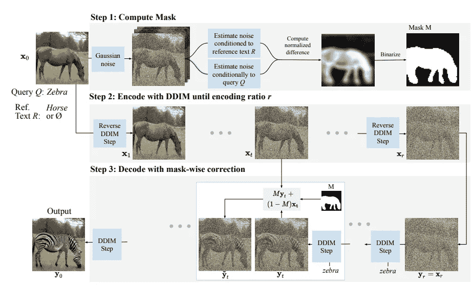

图 DiffEdit 的三个步骤。[论文](https://arxiv.org/pdf/2210.11427.pdf)

当我阅读这篇论文时，似乎生成掩蔽是最重要的步骤，剩下的只是使用扩散过程的文本条件。使用蒙版对图像进行调节的想法与[拥抱面部画中画管道](https://github.com/huggingface/diffusers/blob/main/src/diffusers/pipelines/stable_diffusion/pipeline_stable_diffusion_inpaint.py)中实现的想法类似。正如作者们所建议的，“这个`DiffEdit`过程分三步——
**第一步:**给输入图像加噪声，去噪:一次条件化在查询文本上，一次条件化在参考文本上(或者无条件)。我们基于去噪结果的差异来导出掩模。

在接下来的部分中，我们将开始在实际的代码中实现这些想法。

让我们从导入所需的库和助手函数开始。所有这些都已经在稳定扩散系列的前[第 1 部分](/stable-diffusion-using-hugging-face-501d8dbdd8)和[第 2 部分](/stable-diffusion-using-hugging-face-variations-of-stable-diffusion-56fd2ab7a265)中使用和解释过。

```
import torch, logging

## disable warnings
logging.disable(logging.WARNING)  

## Imaging  library
from PIL import Image
from torchvision import transforms as tfms

## Basic libraries
from fastdownload import FastDownload
import numpy as np
from tqdm.auto import tqdm
import matplotlib.pyplot as plt
%matplotlib inline
from IPython.display import display
import shutil
import os

## For video display
from IPython.display import HTML
from base64 import b64encode

## Import the CLIP artifacts 
from transformers import CLIPTextModel, CLIPTokenizer
from diffusers import AutoencoderKL, UNet2DConditionModel, DDIMScheduler

## Helper functions

def load_artifacts():
    '''
    A function to load all diffusion artifacts
    '''
    vae = AutoencoderKL.from_pretrained("CompVis/stable-diffusion-v1-4", subfolder="vae", torch_dtype=torch.float16).to("cuda")
    unet = UNet2DConditionModel.from_pretrained("CompVis/stable-diffusion-v1-4", subfolder="unet", torch_dtype=torch.float16).to("cuda")
    tokenizer = CLIPTokenizer.from_pretrained("openai/clip-vit-large-patch14", torch_dtype=torch.float16)
    text_encoder = CLIPTextModel.from_pretrained("openai/clip-vit-large-patch14", torch_dtype=torch.float16).to("cuda")
    scheduler = DDIMScheduler(beta_start=0.00085, beta_end=0.012, beta_schedule="scaled_linear", clip_sample=False, set_alpha_to_one=False)    
    return vae, unet, tokenizer, text_encoder, scheduler

def load_image(p):
    '''
    Function to load images from a defined path
    '''
    return Image.open(p).convert('RGB').resize((512,512))

def pil_to_latents(image):
    '''
    Function to convert image to latents
    '''
    init_image = tfms.ToTensor()(image).unsqueeze(0) * 2.0 - 1.0
    init_image = init_image.to(device="cuda", dtype=torch.float16) 
    init_latent_dist = vae.encode(init_image).latent_dist.sample() * 0.18215
    return init_latent_dist

def latents_to_pil(latents):
    '''
    Function to convert latents to images
    '''
    latents = (1 / 0.18215) * latents
    with torch.no_grad():
        image = vae.decode(latents).sample
    image = (image / 2 + 0.5).clamp(0, 1)
    image = image.detach().cpu().permute(0, 2, 3, 1).numpy()
    images = (image * 255).round().astype("uint8")
    pil_images = [Image.fromarray(image) for image in images]
    return pil_images

def text_enc(prompts, maxlen=None):
    '''
    A function to take a texual promt and convert it into embeddings
    '''
    if maxlen is None: maxlen = tokenizer.model_max_length
    inp = tokenizer(prompts, padding="max_length", max_length=maxlen, truncation=True, return_tensors="pt") 
    return text_encoder(inp.input_ids.to("cuda"))[0].half()

vae, unet, tokenizer, text_encoder, scheduler = load_artifacts()
```

让我们也下载一个图像，我们将用于代码实现过程。

```
p = FastDownload().download('https://images.pexels.com/photos/1996333/pexels-photo-1996333.jpeg?cs=srgb&dl=pexels-helena-lopes-1996333.jpg&fm=jpg&_gl=1*1pc0nw8*_ga*OTk4MTI0MzE4LjE2NjY1NDQwMjE.*_ga_8JE65Q40S6*MTY2Njc1MjIwMC4yLjEuMTY2Njc1MjIwMS4wLjAuMA..')
init_img = load_image(p)
init_img
```

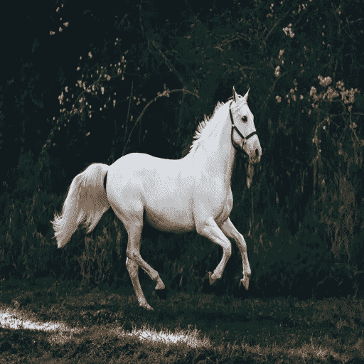

# 2 DiffEdit:纯粹的实现

让我们从按照作者的建议实现这篇论文开始，因此是纯粹的实现。

# 2.1 遮罩创建:DiffEdit 过程的第一步

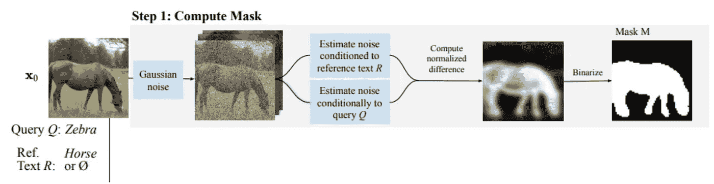

图 4:`DiffEdit`论文的第一步。信用— [论文](https://arxiv.org/pdf/2210.11427.pdf)

论文中有对步骤 1 更详细的解释，下面是提到的关键部分——
1。使用不同的文本条件对图像去噪，一个使用参考文本，另一个使用查询文本，并从结果中取差。这个想法是在不同的部分有更多的变化，而不是在图像的背景中。
2。重复此差分过程 10 次
3。平均这些差异，并对遮罩进行二值化

> 注意——蒙版创建的第三步(平均和二值化)在文章中没有解释清楚，我做了很多实验才弄清楚。

首先，我们将尝试完全按照所提到的来实现这篇论文。我们将为此任务修改 [prompt_2_img_i2i](https://aayushmnit.com/posts/2022-11-10-StableDiffusionP4/2022-11-10-StableDiffusionP4.html#variation-2-image-to-image-pipeline) 函数，以返回 latents，而不是重新缩放和解码的去噪图像。

```
def prompt_2_img_i2i(prompts, init_img, neg_prompts=None, g=7.5, seed=100, strength =0.8, steps=50, dim=512):
    """
    Diffusion process to convert prompt to image
    """
    # Converting textual prompts to embedding
    text = text_enc(prompts) 

    # Adding an unconditional prompt , helps in the generation process
    if not neg_prompts: uncond =  text_enc([""], text.shape[1])
    else: uncond =  text_enc(neg_prompt, text.shape[1])
    emb = torch.cat([uncond, text])

    # Setting the seed
    if seed: torch.manual_seed(seed)

    # Setting number of steps in scheduler
    scheduler.set_timesteps(steps)

    # Convert the seed image to latent
    init_latents = pil_to_latents(init_img)

    # Figuring initial time step based on strength
    init_timestep = int(steps * strength) 
    timesteps = scheduler.timesteps[-init_timestep]
    timesteps = torch.tensor([timesteps], device="cuda")

    # Adding noise to the latents 
    noise = torch.randn(init_latents.shape, generator=None, device="cuda", dtype=init_latents.dtype)
    init_latents = scheduler.add_noise(init_latents, noise, timesteps)
    latents = init_latents

    # Computing the timestep to start the diffusion loop
    t_start = max(steps - init_timestep, 0)
    timesteps = scheduler.timesteps[t_start:].to("cuda")

    # Iterating through defined steps
    for i,ts in enumerate(tqdm(timesteps)):
        # We need to scale the i/p latents to match the variance
        inp = scheduler.scale_model_input(torch.cat([latents] * 2), ts)

        # Predicting noise residual using U-Net
        with torch.no_grad(): u,t = unet(inp, ts, encoder_hidden_states=emb).sample.chunk(2)

        # Performing Guidance
        pred = u + g*(t-u)

        # Conditioning  the latents
        #latents = scheduler.step(pred, ts, latents).pred_original_sample
        latents = scheduler.step(pred, ts, latents).prev_sample

    # Returning the latent representation to output an array of 4x64x64
    return latents.detach().cpu()
```

接下来，我们将制作一个`create_mask`函数，该函数将获取一个初始图像、引用提示和带有我们需要重复这些步骤的次数的查询提示。在论文中，作者建议 n=10，强度为 0.5，在他们的实验中效果很好。因此，该函数的默认值被调整为。`create_mask`功能执行以下步骤-
1。创建两个去噪的潜在值，一个以参考文本为条件，另一个以查询文本为条件，取这两个潜在值的差
2。重复此步骤 n 次
3。取这些差异的平均值并标准化
4。选择阈值 0.5 进行二值化并创建一个遮罩

```
def create_mask(init_img, rp, qp, n=10, s=0.5):
    ## Initialize a dictionary to save n iterations
    diff = {}

    ## Repeating the difference process n times
    for idx in range(n):
        ## Creating denoised sample using reference / original text
        orig_noise = prompt_2_img_i2i(prompts=rp, init_img=init_img, strength=s, seed = 100*idx)[0]
        ## Creating denoised sample using query / target text
        query_noise = prompt_2_img_i2i(prompts=qp, init_img=init_img, strength=s, seed = 100*idx)[0]
        ## Taking the difference 
        diff[idx] = (np.array(orig_noise)-np.array(query_noise))

    ## Creating a mask placeholder
    mask = np.zeros_like(diff[0])

    ## Taking an average of 10 iterations
    for idx in range(n):
        ## Note np.abs is a key step
        mask += np.abs(diff[idx])  

    ## Averaging multiple channels 
    mask = mask.mean(0)

    ## Normalizing 
    mask = (mask - mask.mean()) / np.std(mask)

    ## Binarizing and returning the mask object
    return (mask > 0).astype("uint8")

mask = create_mask(init_img=init_img, rp=["a horse image"], qp=["a zebra image"], n=10)
```

让我们在图像上可视化生成的遮罩。

```
plt.imshow(np.array(init_img), cmap='gray') # I would add interpolation='none'
plt.imshow(
    Image.fromarray(mask).resize((512,512)), ## Scaling the mask to original size
    cmap='cividis', 
    alpha=0.5*(np.array(Image.fromarray(mask*255).resize((512,512))) > 0)  
)
```

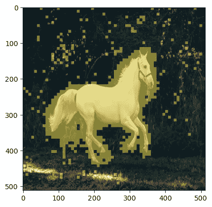

图 5:我们的马图像的掩蔽可视化。

正如我们在上面看到的，制作的面具很好的覆盖了马的部分，这正是我们想要的。

# 2.2 掩蔽扩散:DiffEdit 论文的步骤 2 和 3。

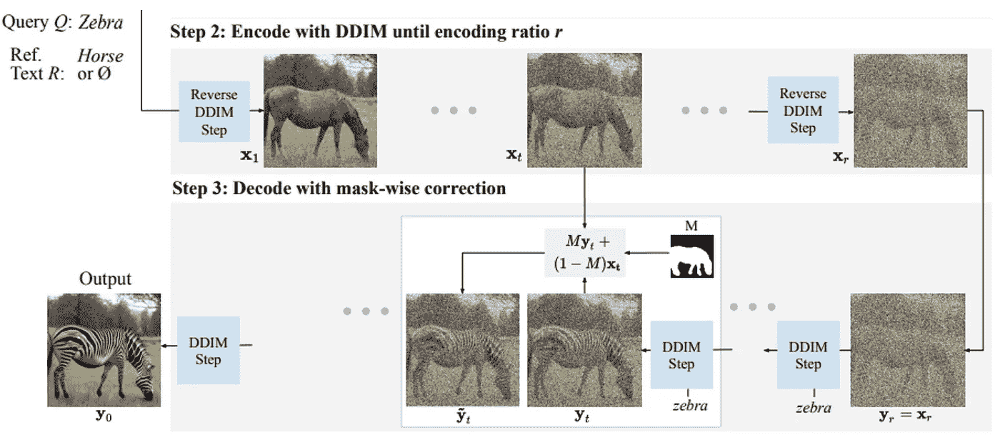

图 6:`DiffEdit`论文中的第二步和第三步。信用— [论文](https://arxiv.org/pdf/2210.11427.pdf)

步骤 2 和 3 需要在同一个循环中实现。简而言之，作者是说根据非屏蔽部分的参考文本和屏蔽部分的查询文本来调节潜在事件。
使用这个简单的公式将这两个部分组合起来，以创建组合的潜在客户-

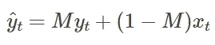

```
def prompt_2_img_diffedit(rp, qp, init_img, mask, g=7.5, seed=100, strength =0.7, steps=70, dim=512):
    """
    Diffusion process to convert prompt to image
    """
    # Converting textual prompts to embedding
    rtext = text_enc(rp) 
    qtext = text_enc(qp)

    # Adding an unconditional prompt , helps in the generation process
    uncond =  text_enc([""], rtext.shape[1])
    emb = torch.cat([uncond, rtext, qtext])

    # Setting the seed
    if seed: torch.manual_seed(seed)

    # Setting number of steps in scheduler
    scheduler.set_timesteps(steps)

    # Convert the seed image to latent
    init_latents = pil_to_latents(init_img)

    # Figuring initial time step based on strength
    init_timestep = int(steps * strength) 
    timesteps = scheduler.timesteps[-init_timestep]
    timesteps = torch.tensor([timesteps], device="cuda")

    # Adding noise to the latents 
    noise = torch.randn(init_latents.shape, generator=None, device="cuda", dtype=init_latents.dtype)
    init_latents = scheduler.add_noise(init_latents, noise, timesteps)
    latents = init_latents

    # Computing the timestep to start the diffusion loop
    t_start = max(steps - init_timestep, 0)
    timesteps = scheduler.timesteps[t_start:].to("cuda")

    # Converting mask to torch tensor
    mask = torch.tensor(mask, dtype=unet.dtype).unsqueeze(0).unsqueeze(0).to("cuda")

    # Iterating through defined steps
    for i,ts in enumerate(tqdm(timesteps)):
        # We need to scale the i/p latents to match the variance
        inp = scheduler.scale_model_input(torch.cat([latents] * 3), ts)

        # Predicting noise residual using U-Net
        with torch.no_grad(): u, rt, qt = unet(inp, ts, encoder_hidden_states=emb).sample.chunk(3)

        # Performing Guidance
        rpred = u + g*(rt-u)
        qpred = u + g*(qt-u)

        # Conditioning  the latents
        rlatents = scheduler.step(rpred, ts, latents).prev_sample
        qlatents = scheduler.step(qpred, ts, latents).prev_sample
        latents = mask*qlatents + (1-mask)*rlatents

    # Returning the latent representation to output an array of 4x64x64
    return latents_to_pil(latents)
```

让我们将生成的图像可视化

```
output = prompt_2_img_diffedit(
    rp = ["a horse image"], 
    qp=["a zebra image"],
    init_img=init_img, 
    mask = mask, 
    g=7.5, seed=100, strength =0.5, steps=70, dim=512)

## Plotting side by side
fig, axs = plt.subplots(1, 2, figsize=(12, 6))
for c, img in enumerate([init_img, output[0]]): 
    axs[c].imshow(img)
    if c == 0 : axs[c].set_title(f"Initial image ")
    else: axs[c].set_title(f"DiffEdit output")
```

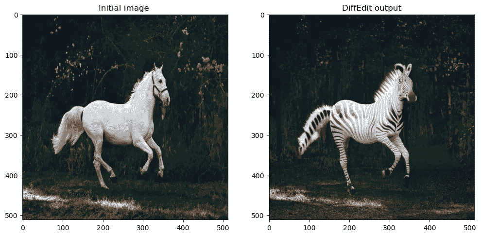

图 7: DiffEdit 输出可视化

让我们为遮罩和扩散过程创建一个简单的函数。

```
def diffEdit(init_img, rp , qp, g=7.5, seed=100, strength =0.7, steps=70, dim=512):

    ## Step 1: Create mask
    mask = create_mask(init_img=init_img, rp=rp, qp=qp)

    ## Step 2 and 3: Diffusion process using mask
    output = prompt_2_img_diffedit(
        rp = rp, 
        qp=qp, 
        init_img=init_img, 
        mask = mask, 
        g=g, 
        seed=seed,
        strength =strength, 
        steps=steps, 
        dim=dim)
    return mask , output
```

让我们也为`DiffEdit`创建一个可视化函数，显示原始输入图像、屏蔽图像和最终输出图像。

```
def plot_diffEdit(init_img, output, mask):
    ## Plotting side by side
    fig, axs = plt.subplots(1, 3, figsize=(12, 6))

    ## Visualizing initial image
    axs[0].imshow(init_img)
    axs[0].set_title(f"Initial image")

    ## Visualizing initial image
    axs[2].imshow(output[0])
    axs[2].set_title(f"DiffEdit output")

    ## Visualizing the mask 
    axs[1].imshow(np.array(init_img), cmap='gray') 
    axs[1].imshow(
        Image.fromarray(mask).resize((512,512)), ## Scaling the mask to original size
        cmap='cividis', 
        alpha=0.5*(np.array(Image.fromarray(mask*255).resize((512,512))) > 0)  
    )
    axs[1].set_title(f"DiffEdit mask")
```

让我们在一些图像上测试这个函数。

```
p = FastDownload().download('https://images.pexels.com/photos/1996333/pexels-photo-1996333.jpeg?cs=srgb&dl=pexels-helena-lopes-1996333.jpg&fm=jpg&_gl=1*1pc0nw8*_ga*OTk4MTI0MzE4LjE2NjY1NDQwMjE.*_ga_8JE65Q40S6*MTY2Njc1MjIwMC4yLjEuMTY2Njc1MjIwMS4wLjAuMA..')
init_img = load_image(p)
mask, output = diffEdit(
  init_img, 
  rp = ["a horse image"], 
  qp=["a zebra image"]
)
plot_diffEdit(init_img, output, mask)
```

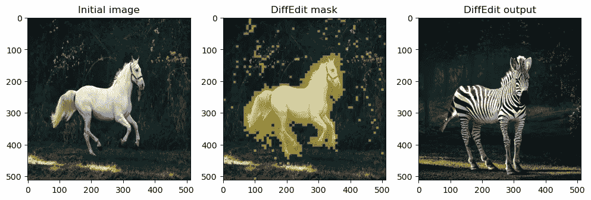

图 8: Purist 实现输出示例

太好了，让我们试试另一个。

```
p = FastDownload().download('https://raw.githubusercontent.com/johnrobinsn/diffusion_experiments/main/images/bowloberries_scaled.jpg')
init_img = load_image(p)
mask, output = diffEdit(
  init_img, 
  rp = ['Bowl of Strawberries'], 
  qp=['Bowl of Grapes']
)
plot_diffEdit(init_img, output, mask)
```

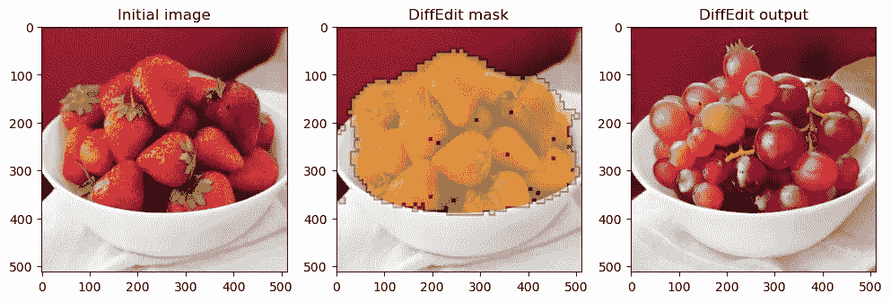

图 9: Purist 实现输出示例

# 3 FastDiffEdit:一个更快的 DiffEdit 实现

现在我们已经看到了 purist 的实现，我建议我们可以在速度和更好的结果方面对原始的 DiffEdit 过程进行一些改进。我们姑且称这些改进为`FastDiffEdit`。

# 3.1 遮罩创建:快速 DiffEdit 遮罩过程

我对当前的蒙版方式最大的问题是它太花时间了(在 4500 GPU 上大约 50 秒)。我的观点是，我们不需要运行一个完整的扩散循环来对图像进行降噪，而只需在一次拍摄中使用原始样本的 U-net 预测，并将重复次数增加到 20 次。在这种情况下，我们可以将计算从 10*25 = 250 步提高到 20 步(少 12x 个循环)。让我们看看这在实践中是否行得通。

```
def prompt_2_img_i2i_fast(prompts, init_img, g=7.5, seed=100, strength =0.5, steps=50, dim=512):
    """
    Diffusion process to convert prompt to image
    """
    # Converting textual prompts to embedding
    text = text_enc(prompts) 

    # Adding an unconditional prompt , helps in the generation process
    uncond =  text_enc([""], text.shape[1])
    emb = torch.cat([uncond, text])

    # Setting the seed
    if seed: torch.manual_seed(seed)

    # Setting number of steps in scheduler
    scheduler.set_timesteps(steps)

    # Convert the seed image to latent
    init_latents = pil_to_latents(init_img)

    # Figuring initial time step based on strength
    init_timestep = int(steps * strength) 
    timesteps = scheduler.timesteps[-init_timestep]
    timesteps = torch.tensor([timesteps], device="cuda")

    # Adding noise to the latents 
    noise = torch.randn(init_latents.shape, generator=None, device="cuda", dtype=init_latents.dtype)
    init_latents = scheduler.add_noise(init_latents, noise, timesteps)
    latents = init_latents

    # We need to scale the i/p latents to match the variance
    inp = scheduler.scale_model_input(torch.cat([latents] * 2), timesteps)
    # Predicting noise residual using U-Net
    with torch.no_grad(): u,t = unet(inp, timesteps, encoder_hidden_states=emb).sample.chunk(2)

    # Performing Guidance
    pred = u + g*(t-u)

    # Zero shot prediction
    latents = scheduler.step(pred, timesteps, latents).pred_original_sample

    # Returning the latent representation to output an array of 4x64x64
    return latents.detach().cpu()
```

让我们创建一个新的屏蔽函数，它可以接受我们的`prompt_2_img_i2i_fast`函数。

```
def create_mask_fast(init_img, rp, qp, n=20, s=0.5):
    ## Initialize a dictionary to save n iterations
    diff = {}

    ## Repeating the difference process n times
    for idx in range(n):
        ## Creating denoised sample using reference / original text
        orig_noise = prompt_2_img_i2i_fast(prompts=rp, init_img=init_img, strength=s, seed = 100*idx)[0]
        ## Creating denoised sample using query / target text
        query_noise = prompt_2_img_i2i_fast(prompts=qp, init_img=init_img, strength=s, seed = 100*idx)[0]
        ## Taking the difference 
        diff[idx] = (np.array(orig_noise)-np.array(query_noise))

    ## Creating a mask placeholder
    mask = np.zeros_like(diff[0])

    ## Taking an average of 10 iterations
    for idx in range(n):
        ## Note np.abs is a key step
        mask += np.abs(diff[idx])  

    ## Averaging multiple channels 
    mask = mask.mean(0)

    ## Normalizing 
    mask = (mask - mask.mean()) / np.std(mask)

    ## Binarizing and returning the mask object
    return (mask > 0).astype("uint8")
```

让我们看看这个新的蒙版函数是否能产生一个好的蒙版。

```
p = FastDownload().download('https://images.pexels.com/photos/1996333/pexels-photo-1996333.jpeg?cs=srgb&dl=pexels-helena-lopes-1996333.jpg&fm=jpg&_gl=1*1pc0nw8*_ga*OTk4MTI0MzE4LjE2NjY1NDQwMjE.*_ga_8JE65Q40S6*MTY2Njc1MjIwMC4yLjEuMTY2Njc1MjIwMS4wLjAuMA..')
init_img = load_image(p)
mask = create_mask_fast(init_img=init_img, rp=["a horse image"], qp=["a zebra image"], n=20)
plt.imshow(np.array(init_img), cmap='gray') # I would add interpolation='none'
plt.imshow(
    Image.fromarray(mask).resize((512,512)), ## Scaling the mask to original size
    cmap='cividis', 
    alpha=0.5*(np.array(Image.fromarray(mask*255).resize((512,512))) > 0)  
)
```

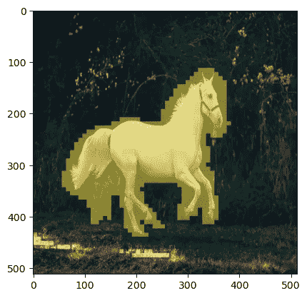

图 10: `FastDiffEdit`遮蔽我们的马的形象。

正如我们在上面所看到的，在我的机器上，屏蔽得到了改进，计算时间从大约 50 秒减少到大约 10 秒(提高了 5 倍！).

让我们通过添加 cv2 技巧来改进我们的遮罩。这将只是平滑掩蔽多一点点。

```
import cv2
def improve_mask(mask):
    mask  = cv2.GaussianBlur(mask*255,(3,3),1) > 0
    return mask.astype('uint8')

mask = improve_mask(mask)
plt.imshow(np.array(init_img), cmap='gray') # I would add interpolation='none'
plt.imshow(
    Image.fromarray(mask).resize((512,512)), ## Scaling the mask to original size
    cmap='cividis', 
    alpha=0.5*(np.array(Image.fromarray(mask*255).resize((512,512))) > 0)  
)
```

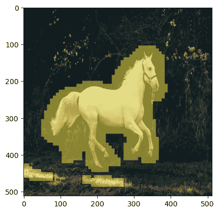

图 11:使用 cv2 高斯模糊技巧改进了我们的马图像的`FastDiffEdit`掩蔽可视化。

正如我们在上面看到的，遮罩变得更加平滑，覆盖了更多的区域。

# 3.2 掩蔽扩散:替换为🤗修补管道

因此，不是使用我们的函数来执行掩蔽扩散，而是有一个特殊的管道🤗`diffusers`库名为`inpaint`管道。它采用查询提示、初始图像和生成的遮罩来生成输出图像。让我们从装入`inpaint`管道开始。

```
from diffusers import StableDiffusionInpaintPipeline
pipe = StableDiffusionInpaintPipeline.from_pretrained(
    "runwayml/stable-diffusion-inpainting",
    revision="fp16",
    torch_dtype=torch.float16,
).to("cuda")
```

让我们使用我们生成的蒙版和图像修复管道。

```
pipe(
    prompt=["a zebra image"], 
    image=init_img, 
    mask_image=Image.fromarray(mask*255).resize((512,512)), 
    generator=torch.Generator("cuda").manual_seed(100),
    num_inference_steps = 20
).images[0]
image
```

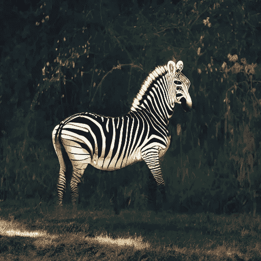

图 12:油漆管道输出。

正如我们上面看到的，修复管道创建了一个更真实的斑马图像。让我们为遮罩和扩散过程创建一个简单的函数。

```
def fastDiffEdit(init_img, rp , qp, g=7.5, seed=100, strength =0.7, steps=20, dim=512):

    ## Step 1: Create mask
    mask = create_mask_fast(init_img=init_img, rp=rp, qp=qp, n=20)

    ## Improve masking using CV trick
    mask = improve_mask(mask)

    ## Step 2 and 3: Diffusion process using mask
    output = pipe(
        prompt=qp, 
        image=init_img, 
        mask_image=Image.fromarray(mask*255).resize((512,512)), 
        generator=torch.Generator("cuda").manual_seed(100),
        num_inference_steps = steps
    ).images
    return mask , output
```

让我们在一些图像上测试这个函数。

```
p = FastDownload().download('https://images.pexels.com/photos/1996333/pexels-photo-1996333.jpeg?cs=srgb&dl=pexels-helena-lopes-1996333.jpg&fm=jpg&_gl=1*1pc0nw8*_ga*OTk4MTI0MzE4LjE2NjY1NDQwMjE.*_ga_8JE65Q40S6*MTY2Njc1MjIwMC4yLjEuMTY2Njc1MjIwMS4wLjAuMA..')
init_img = load_image(p)
mask, output = fastDiffEdit(init_img, rp = ["a horse image"], qp=["a zebra image"])
plot_diffEdit(init_img, output, mask)
```

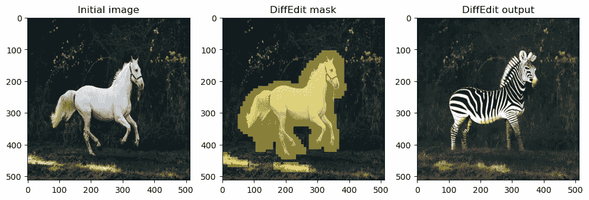

图 13: `FastDiffEdit`输出示例

太好了，让我们试试另一个。

```
p = FastDownload().download('https://raw.githubusercontent.com/johnrobinsn/diffusion_experiments/main/images/bowloberries_scaled.jpg')
init_img = load_image(p)
mask, output = fastDiffEdit(init_img, rp = ['Bowl of Strawberries'], qp=['Bowl of Grapes'])
plot_diffEdit(init_img, output, mask)
```

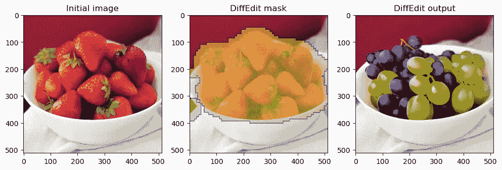

图 14: `FastDiffEdit`输出示例

# 4 结论

在这篇文章中，我们实现了作者提到的`DiffEdit`论文，然后我们对创建`FastDiffEdit`的方法提出了改进，将计算速度提高了 5 倍。

我希望你喜欢阅读它，并随时使用我的代码，并尝试生成您的图像。此外，如果对代码或博客帖子有任何反馈，请随时联系 LinkedIn 或给我发电子邮件，地址是 aayushmnit@gmail.com。你也可以在我的网站上阅读博客的早期发布【aayushmnit.com[Aayush agr awal-博客](https://aayushmnit.com/blog.html)。