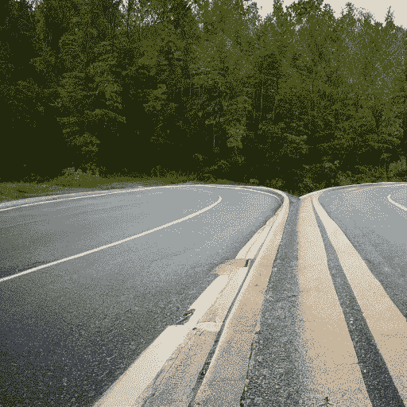
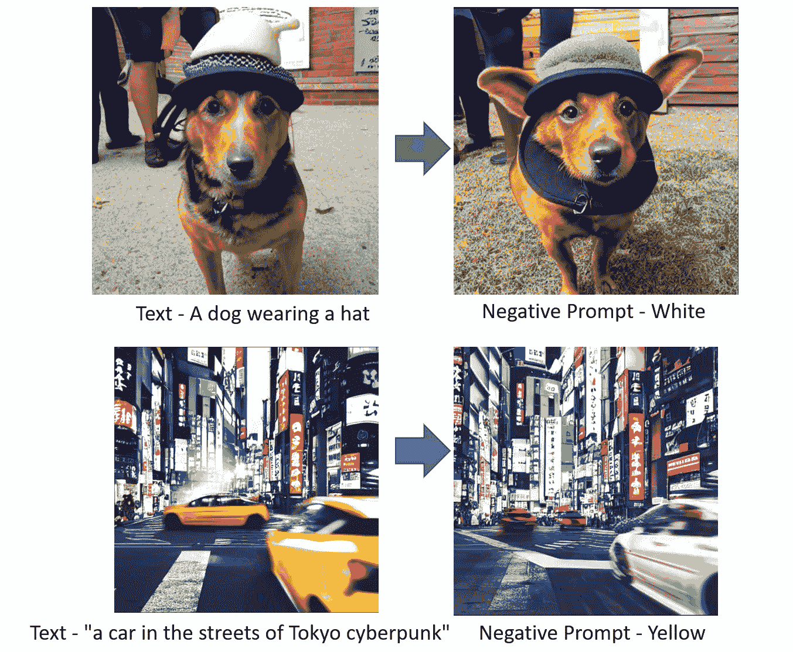
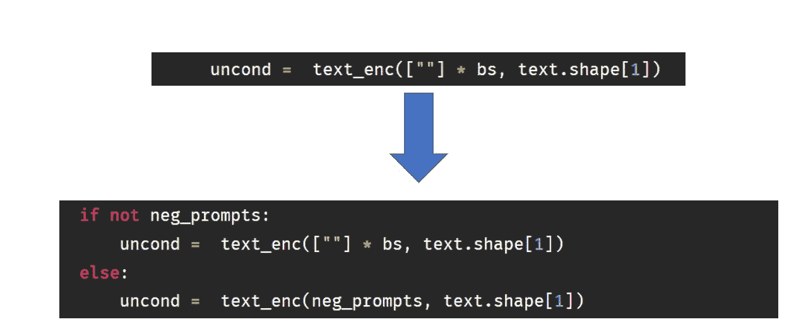
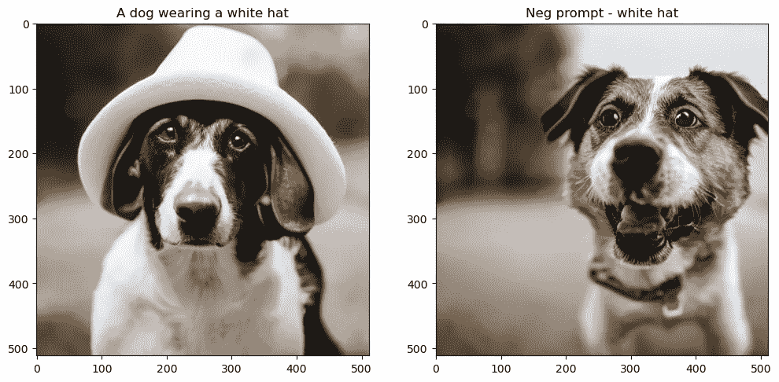
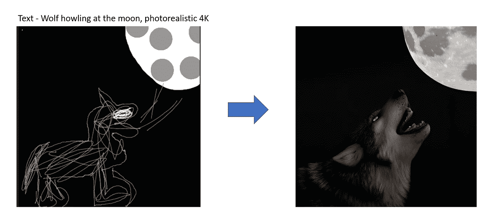

# 利用拥抱面的稳定扩散——稳定扩散的变化

> 原文：<https://towardsdatascience.com/stable-diffusion-using-hugging-face-variations-of-stable-diffusion-56fd2ab7a265>

## 使用[拥抱面部扩散器库](https://github.com/huggingface/diffusers)的负面提示和图像到图像稳定扩散管道的介绍

这是我上一篇文章的续篇——[使用拥抱脸的稳定扩散|作者:Aayush agr awal | 2022 年 11 月|迈向数据科学(medium.com)](https://medium.com/towards-data-science/stable-diffusion-using-hugging-face-501d8dbdd8)。

在前一篇文章中，我回顾了稳定扩散的所有关键组成部分，以及如何让`prompt to image`管道工作。在这篇文章中，我将展示如何编辑`prompt to image`函数来为我们的稳定扩散管道添加额外的功能，即`Negative prompting`和`Image to Image`管道。希望这将提供足够的动力来玩这个函数并进行您的研究。



图 1:使用 prompt -
“在两个不同方向分叉的道路”的稳定扩散生成的图像

# 1.变体 1:否定提示

## 1.1 什么是负面提示？

否定提示是我们可以添加到模型中的附加功能，用来告诉稳定扩散模型我们不希望在生成的图像中看到什么。这个特性很受欢迎，可以从原始生成的图像中删除用户不想看到的任何内容。



图 2:否定提示示例

## 1.2 通过代码理解负面提示

让我们从导入所需的库和助手函数开始。所有这些都已经在之前的[帖子](https://medium.com/towards-data-science/stable-diffusion-using-hugging-face-501d8dbdd8)中使用和解释过了。

```
import torch, logging

## disable warnings
logging.disable(logging.WARNING)  

## Imaging  library
from PIL import Image
from torchvision import transforms as tfms

## Basic libraries
from fastdownload import FastDownload
import numpy as np
from tqdm.auto import tqdm
import matplotlib.pyplot as plt
%matplotlib inline
from IPython.display import display
import shutil
import os

## For video display
from IPython.display import HTML
from base64 import b64encode

## Import the CLIP artifacts 
from transformers import CLIPTextModel, CLIPTokenizer
from diffusers import AutoencoderKL, UNet2DConditionModel, LMSDiscreteScheduler

## Initiating tokenizer and encoder.
tokenizer = CLIPTokenizer.from_pretrained("openai/clip-vit-large-patch14", torch_dtype=torch.float16)
text_encoder = CLIPTextModel.from_pretrained("openai/clip-vit-large-patch14", torch_dtype=torch.float16).to("cuda")

## Initiating the VAE
vae = AutoencoderKL.from_pretrained("CompVis/stable-diffusion-v1-4", subfolder="vae", torch_dtype=torch.float16).to("cuda")

## Initializing a scheduler and Setting number of sampling steps
scheduler = LMSDiscreteScheduler(beta_start=0.00085, beta_end=0.012, beta_schedule="scaled_linear", num_train_timesteps=1000)
scheduler.set_timesteps(50)

## Initializing the U-Net model
unet = UNet2DConditionModel.from_pretrained("CompVis/stable-diffusion-v1-4", subfolder="unet", torch_dtype=torch.float16).to("cuda")

## Helper functions
def load_image(p):
    '''
    Function to load images from a defined path
    '''
    return Image.open(p).convert('RGB').resize((512,512))

def pil_to_latents(image):
    '''
    Function to convert image to latents
    '''
    init_image = tfms.ToTensor()(image).unsqueeze(0) * 2.0 - 1.0
    init_image = init_image.to(device="cuda", dtype=torch.float16) 
    init_latent_dist = vae.encode(init_image).latent_dist.sample() * 0.18215
    return init_latent_dist

def latents_to_pil(latents):
    '''
    Function to convert latents to images
    '''
    latents = (1 / 0.18215) * latents
    with torch.no_grad():
        image = vae.decode(latents).sample
    image = (image / 2 + 0.5).clamp(0, 1)
    image = image.detach().cpu().permute(0, 2, 3, 1).numpy()
    images = (image * 255).round().astype("uint8")
    pil_images = [Image.fromarray(image) for image in images]
    return pil_images

def text_enc(prompts, maxlen=None):
    '''
    A function to take a texual promt and convert it into embeddings
    '''
    if maxlen is None: maxlen = tokenizer.model_max_length
    inp = tokenizer(prompts, padding="max_length", max_length=maxlen, truncation=True, return_tensors="pt") 
    return text_encoder(inp.input_ids.to("cuda"))[0].half()
```

现在我们要通过传递一个额外的函数`neg_prompts`来改变`prompt_2_img`函数。否定提示的工作方式是在采样时使用用户指定的文本代替空字符串进行无条件嵌入(`uncond`)。



图 3:负提示代码变化

所以，让我们做这个改变并更新我们的`prompt_2_img`函数。

```
def prompt_2_img(prompts, neg_prompts=None, g=7.5, seed=100, steps=70, dim=512, save_int=False):
    """
    Diffusion process to convert prompt to image
    """

    # Defining batch size
    bs = len(prompts) 

    # Converting textual prompts to embedding
    text = text_enc(prompts) 

    # Adding negative prompt condition
    if not neg_prompts: uncond =  text_enc([""] * bs, text.shape[1])
    # Adding an unconditional prompt , helps in the generation process
    else: uncond =  text_enc(neg_prompts, text.shape[1])
    emb = torch.cat([uncond, text])

    # Setting the seed
    if seed: torch.manual_seed(seed)

    # Initiating random noise
    latents = torch.randn((bs, unet.in_channels, dim//8, dim//8))

    # Setting number of steps in scheduler
    scheduler.set_timesteps(steps)

    # Adding noise to the latents 
    latents = latents.to("cuda").half() * scheduler.init_noise_sigma

    # Iterating through defined steps
    for i,ts in enumerate(tqdm(scheduler.timesteps)):
        # We need to scale the i/p latents to match the variance
        inp = scheduler.scale_model_input(torch.cat([latents] * 2), ts)

        # Predicting noise residual using U-Net
        with torch.no_grad(): u,t = unet(inp, ts, encoder_hidden_states=emb).sample.chunk(2)

        # Performing Guidance
        pred = u + g*(t-u)

        # Conditioning  the latents
        latents = scheduler.step(pred, ts, latents).prev_sample

        # Saving intermediate images
        if save_int: 
            if not os.path.exists(f'./steps'): os.mkdir(f'./steps')
            latents_to_pil(latents)[0].save(f'steps/{i:04}.jpeg')

    # Returning the latent representation to output an image of 3x512x512
    return latents_to_pil(latents)
```

让我们看看这个函数是否如预期的那样工作。

```
## Image without neg prompt
images = [None, None]
images[0] = prompt_2_img(prompts = ["A dog wearing a white hat"], neg_prompts=[""],steps=50, save_int=False)[0]
images[1] = prompt_2_img(prompts = ["A dog wearing a white hat"], neg_prompts=["White hat"],steps=50, save_int=False)[0]

## Plotting side by side
fig, axs = plt.subplots(1, 2, figsize=(12, 6))
for c, img in enumerate(images): 
    axs[c].imshow(img)
    if c == 0 : axs[c].set_title(f"A dog wearing a white hat")
    else: axs[c].set_title(f"Neg prompt - white hat")
```



图 4:负面提示的可视化。左侧 SD 生成提示“戴白帽子的狗”,右侧相同标题生成否定提示“白帽子”

正如我们所见，这是一个非常方便的功能，可以根据您的喜好微调图像。你也可以用它来生成一张非常逼真的脸，就像这个 [Reddit 帖子](https://www.reddit.com/r/StableDiffusion/comments/yqnh2c/closeup_photo_of_a_face_just_txt2img_and_lsdr/)一样。让我们试试-

```
prompt = ['Close-up photography of the face of a 30 years old man with brown eyes, (by Alyssa Monks:1.1), by Joseph Lorusso, by Lilia Alvarado, beautiful lighting, sharp focus, 8k, high res, (pores:0.1), (sweaty:0.8), Masterpiece, Nikon Z9, Award - winning photograph']
neg_prompt = ['lowres, signs, memes, labels, text, food, text, error, mutant, cropped, worst quality, low quality, normal quality, jpeg artifacts, signature, watermark, username, blurry, made by children, caricature, ugly, boring, sketch, lacklustre, repetitive, cropped, (long neck), facebook, youtube, body horror, out of frame, mutilated, tiled, frame, border, porcelain skin, doll like, doll']
images = prompt_2_img(prompts = prompt, neg_prompts=neg_prompt, steps=50, save_int=False)
images[0]
```


图 5:使用负面提示生成的图像。

相当整洁！我希望这能给你一些想法，关于如何开始你自己的稳定扩散的变化。现在让我们看看稳定扩散的另一种变化。

# 2.变体 2:图像到图像管道

## 2.1 什么是图像到图像管道？

如上所述，`prompt_2_img`函数开始从随机高斯噪声中生成图像，但是如果我们输入一个初始种子图像来引导扩散过程会怎么样呢？这正是图像到图像管道的工作方式。我们可以使用初始种子图像将它与一些噪声混合(这可以由一个`strength`参数来引导)，然后运行扩散循环，而不是纯粹依赖于输出图像的文本调节。



图 6:图像到图像管道示例。

# 2.2 通过代码理解图像到图像的提示

现在我们要改变上面定义的`prompt_2_img`函数。我们将为我们的`prompt_2_img_i2i`函数-
1 引入另外两个参数。`init_img`:它将是包含种子图像
2 的`Image`对象。`strength`:该参数取 0 到 1 之间的值。值越高，最终图像看起来就越不像种子图像。

```
def prompt_2_img_i2i(prompts, init_img, neg_prompts=None, g=7.5, seed=100, strength =0.8, steps=50, dim=512, save_int=False):
    """
    Diffusion process to convert prompt to image
    """
    # Converting textual prompts to embedding
    text = text_enc(prompt) 

    # Adding negative prompt condition
    if not neg_prompts: uncond =  text_enc([""] * bs, text.shape[1])
    # Adding an unconditional prompt , helps in the generation process
    else: uncond =  text_enc(neg_prompts, text.shape[1])
    emb = torch.cat([uncond, text])

    # Setting the seed
    if seed: torch.manual_seed(seed)

    # Setting number of steps in scheduler
    scheduler.set_timesteps(steps)

    # Convert the seed image to latent
    init_latents = pil_to_latents(init_img)

    # Figuring initial time step based on strength
    init_timestep = int(steps * strength) 
    timesteps = scheduler.timesteps[-init_timestep]
    timesteps = torch.tensor([timesteps], device="cuda")

    # Adding noise to the latents 
    noise = torch.randn(init_latents.shape, generator=None, device="cuda", dtype=init_latents.dtype)
    init_latents = scheduler.add_noise(init_latents, noise, timesteps)
    latents = init_latents

    # Computing the timestep to start the diffusion loop
    t_start = max(steps - init_timestep, 0)
    timesteps = scheduler.timesteps[t_start:].to("cuda")

    # Iterating through defined steps
    for i,ts in enumerate(tqdm(timesteps)):
        # We need to scale the i/p latents to match the variance
        inp = scheduler.scale_model_input(torch.cat([latents] * 2), ts)

        # Predicting noise residual using U-Net
        with torch.no_grad(): u,t = unet(inp, ts, encoder_hidden_states=emb).sample.chunk(2)

        # Performing Guidance
        pred = u + g*(t-u)

        # Conditioning  the latents
        latents = scheduler.step(pred, ts, latents).prev_sample

        # Saving intermediate images
        if save_int: 
            if not os.path.exists(f'./steps'):
                os.mkdir(f'./steps')
            latents_to_pil(latents)[0].save(f'steps/{i:04}.jpeg')

    # Returning the latent representation to output an image of 3x512x512
    return latents_to_pil(latents)
```

你会注意到，我们没有使用随机噪声，而是使用`strength`参数来计算添加多少噪声以及运行扩散循环的步骤数。通过将强度(默认值= 0.8)乘以第 10(50-50 * 0.8)步的步数(默认值= 50)并运行剩余 40(50*0.8)步的扩散循环来计算噪波量。让我们加载一个初始图像，并通过`prompt_2_img_i2i`函数传递它。

```
p = FastDownload().download('https://s3.amazonaws.com/moonup/production/uploads/1664665907257-noauth.png')
image = Image.open(p).convert('RGB').resize((512,512))
prompt = ["Wolf howling at the moon, photorealistic 4K"]
images = prompt_2_img_i2i(prompts = prompt, init_img = image)

## Plotting side by side
fig, axs = plt.subplots(1, 2, figsize=(12, 6))
for c, img in enumerate([image, images[0]]): 
    axs[c].imshow(img)
    if c == 0 : axs[c].set_title(f"Initial image")
    else: axs[c].set_title(f"Image 2 Image output")
```


图 7:图像到图像管道的可视化。左边是 img2img 管道中传递的初始图像，右边是 img2img 管道的输出。

我们可以看到，我们的`prompt_2_img_i2i`函数从提供的初始草图中创建了一个漂亮的史诗图像。

# 3 结论

我希望这能很好地概述如何调整`prompt_2_img`函数，为你的稳定扩散循环增加额外的能力。对这个低级函数的理解对于尝试你自己的想法来改善稳定扩散或实现我可能在下一篇文章中涉及的新论文是有用的。

我希望你喜欢阅读它，并随时使用我的代码，并尝试生成您的图像。此外，如果对代码或博客帖子有任何反馈，请随时联系 aayushmnit@gmail.com 的 LinkedIn 或发电子邮件给我。你也可以在我的网站上阅读博客的早期发布[Aayush agr awal-博客(aayushmnit.com)](https://aayushmnit.com/blog.html)。

# 4 参考文献

*   [Fast.ai 课程——《从深度学习基础到稳定扩散》前两节](https://www.fast.ai/posts/part2-2022-preview.html)
*   [🧨扩散器的稳定扩散](https://huggingface.co/blog/stable_diffusion)
*   [进入稳定扩散的世界](https://bipinkrishnan.github.io/posts/getting-started-in-the-world-of-stable-diffusion/)