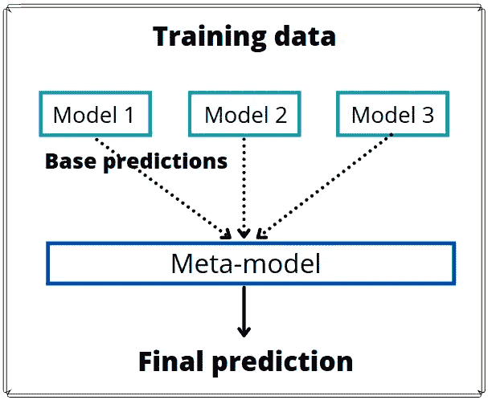
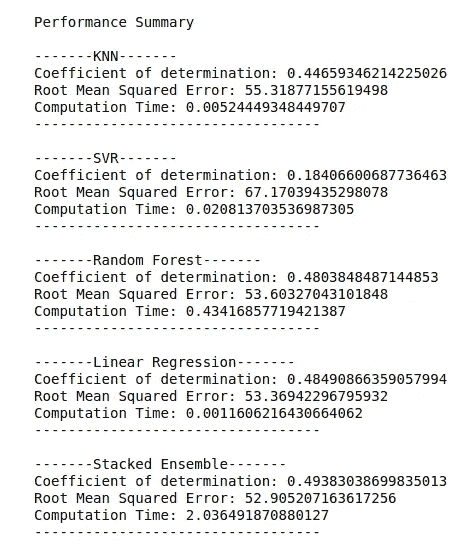

# 堆叠集成—在更高层次上提高模型性能

> 原文：<https://towardsdatascience.com/stacked-ensembles-improving-model-performance-on-a-higher-level-99ffc4ea5523>

## 堆叠集成设计多个预测值的线性组合，以提高模型性能


由 [Unsplash](https://unsplash.com?utm_source=medium&utm_medium=referral) 上的 [La-Rel Easter](https://unsplash.com/@lastnameeaster?utm_source=medium&utm_medium=referral) 拍摄的照片

在本文中，我们将讨论**堆叠系综**，并使用 Scikit 学习模块在 Python 中实现该技术。在此之前，你应该已经知道什么是模型的集合。基本上，模型集合是一个模型，它利用来自多个机器学习模型的预测来产生一个更好的预测模型。如果你错过了我之前关于这个主题的文章，如果你需要复习，请查看一下。

在一个模型集合中，我们试图根据多个机器学习模型的表现分配权重，从而最大化我们的模型的预测。事实证明，让表现更好的模型在集合的最终预测中有更多的发言权并不总是最有利的。我们应该如何知道我们可以给每个模型分配什么样的权重，从而得到最适合的预测呢？

# 堆叠系综框架

引入堆叠，一个集成机器学习算法**，该算法**学习如何最好地组合集成**中的每个模型，以获得最佳性能。**

*   **普通的机器学习模型仅试图通过生成关系函数来将输入映射到输出。**
*   **通过**学习每个集合模型对样本外预测**的预测结果**和实际值**之间的关系，叠加在普通之上一个级别上起作用。**

**在这种情况下，在堆叠的集合中，每个模型都是一块石头，如下图所示。堆叠模型的工作是学习放置每块岩石的最佳方式，以使其最稳定且差异较小(能够最好地拟合样本外预测)。**

****

**肖恩·斯特拉顿在 [Unsplash](https://unsplash.com?utm_source=medium&utm_medium=referral) 上拍摄的照片**

**堆叠集合的一般框架由两个或多个基本模型(0 级模型)和一个更高级别的元模型(1 级模型)组成，它们的功能如下:**

*   ****基础模型**(0 级模型):拟合训练数据并预测样本外数据的模型。**
*   ****元模型**(一级模型):模型符合基础模型的预测，并学习如何最好地组合预测。**

# **执行堆栈的理论步骤**

**执行堆叠技术的**主要步骤**可以概括为:**

1.  **实施 K 倍交叉验证，将数据集分成 K 倍。**
2.  **伸出其中一个褶皱，将多个独立的基础模型训练到其他褶皱上。**
3.  **使用基础模型预测支撑褶皱**
4.  **重复上述三个步骤 K 次，以获得所有 K 个折叠的样本外预测。**
5.  **将所有样本外预测作为特征(训练数据)提供给元模型。**
6.  **使用元模型预测最终输出。**

**整个堆垛过程的概要图:**

****

**作者图片**

# **选择合适的元模型**

**在这个阶段出现了一个特殊的问题。**

****我们如何知道选择什么模型作为元模型**？不幸的是，还没有这方面的研究，元模型的选择更像是一门艺术而不是科学。**

****

**照片由[布伦丹·丘奇](https://unsplash.com/@bdchu614?utm_source=medium&utm_medium=referral)在 [Unsplash](https://unsplash.com?utm_source=medium&utm_medium=referral) 上拍摄**

**在大多数讨论堆叠模型的论文中，所使用的**元模型**往往只是一个简单的模型，例如用于回归任务的**线性回归**和用于分类任务的**逻辑回归**。通常不选择更复杂的元模型的一个原因是，元模型更有可能过度适应基础模型的预测。**

**对于某些应用来说，**岭回归**要比线性回归好得多。这是因为基础模型的预测通常**强相关**，因为它们都试图预测相同的关系。因此，线性回归拟合可能导致最终预测对数据变化高度敏感。因此，较高的方差导致较差的泛化能力。**

****岭回归**带有**正则化** **参数**，因此能够比线性回归更好地处理每个基础模型预测之间的相关性。经验证明这是真的；然而，任何论文都没有给出一个一般性的证明。**

# **堆叠整体的优势**

****

**阿菲夫·库苏马在 [Unsplash](https://unsplash.com?utm_source=medium&utm_medium=referral) 上拍摄的照片**

*   **由于堆叠集合的性质，它通常**产生比常规单个模型或平均集合更稳健的预测性能**。在某些情况下，预测性能的微小改进会对业务场景产生巨大影响。**
*   **它在 Python StackingRegressor 和 StackingClassifier 中的实现**很容易通过 Scikit 学习模块**获得。它的**实现也相当简单**，我们将在本文后面实现它。**

# **堆叠系综的缺点**

****

**照片由 [Michal Matlon](https://unsplash.com/@michalmatlon?utm_source=medium&utm_medium=referral) 在 [Unsplash](https://unsplash.com?utm_source=medium&utm_medium=referral) 上拍摄**

*   **使用堆叠技术的一个巨大缺点是，堆叠带来了许多额外的复杂性；也就是说，最终模型变得**更加难以解释**。因此，企业可能不认为实现是值得的，因为它伴随着解释能力的成本。**
*   **伴随着复杂性增加的一件事是**增加的计算时间**。当手头的数据量呈指数级增长时，一个过于复杂的模型将需要数年时间来运行。这对企业来说没有太大意义，因为它产生的成本比仅仅实现一个简单的模型要大得多。**
*   **只有在使用无相关性或低相关性基础模型时，叠加模型的改进**才是最有效的**。这背后的概念类似于正常的平均集合。多样化模型的集合意味着堆叠模型的更多多样性，以优化和达到更好的性能。**

# **Python 实现**

****

**由 [Clément Hélardot](https://unsplash.com/@clemhlrdt?utm_source=medium&utm_medium=referral) 在 [Unsplash](https://unsplash.com?utm_source=medium&utm_medium=referral) 上拍摄**

**在接受了大部分理论之后，是时候看看实践中的技术了。在本文中，我们将使用糖尿病数据集进行演示。**

**我们首先导入必要的模块。**

**我们使用 train_test_split 将数据进一步拆分为训练数据和测试数据。**

```
from sklearn.datasets import load_diabetes
from sklearn.model_selection import train_test_split
from sklearn.linear_model import LinearRegression
from sklearn.neighbors import KNeighborsRegressor
from sklearn.svm import SVR
from sklearn.ensemble import RandomForestRegressor, StackingRegressor
from sklearn.metrics import mean_squared_error
**import** timeitX, y = load_diabetes(return_X_y=True)
X_train, X_test, y_train, y_test = train_test_split(X, y, random_state=42)
```

**在下一步中，我们定义将要使用的基本模型。**

**我们将使用 KNN，支持向量，随机森林和线性回归。我们还从 Scikit Learn 的模块中定义了一个 StackingRegressor，将基本估计量设置为基本模型，并将最终估计量设置为具有 5 个交叉折叠的线性回归。**

```
base_models = [
    ('KNN', KNeighborsRegressor()),
    ('SVR',SVR()),
    ('Random Forest',RandomForestRegressor()),
    ('Linear Regression',LinearRegression()),
    ]stacked = StackingRegressor(
    estimators = base_models,
    final_estimator = LinearRegression(),
    cv = 5)
```

**之后，我们将拟合基本模型，并预测我们之前分割的测试数据，以便我们可以将结果与堆叠回归进行比较。**

**堆叠回归量也适用于训练数据，并用于预测测试数据。我们来看看每个模型的最终得分。**

```
for name, model in base_models:
    start_time = time.time() model.fit(X_train, y_train)
    prediction = model.predict(X_test) end_time = time.time()

    r2 = model.score(X_test, y_test)
    rmse = mean_squared_error(y_test, prediction, squared = False)

    print("-------{}-------".format(name))
    print("Coefficient of determination: {}".format(r2))
    print("Root Mean Squared Error: {}".format(rmse))
    print("Computation Time: {}".format(end_time - start_time))
    print("----------------------------------\n")start_time = time.time()stacked.fit(X_train, y_train)    
stacked_prediction = stacked.predict(X_test)end_time = time.time()stacked_r2 = stacked.score(X_test, y_test)
stacked_rmse = mean_squared_error(y_test, stacked_prediction, squared = False)print("-------Stacked Ensemble-------")
print("Coefficient of determination: {}".format(stacked_r2))
print("Root Mean Squared Error: {}".format(stacked_rmse))
print("Computation Time: {}".format(end_time - start_time))
print("----------------------------------")
```

****

**作者输出的代码**

**我们可以看到，通过实施堆叠，我们确实获得了比单个模型更好的结果**！****

****

**照片由[J E W E L M I T CH E L L L](https://unsplash.com/@preciousjfm?utm_source=medium&utm_medium=referral)在 [Unsplash](https://unsplash.com?utm_source=medium&utm_medium=referral) 上拍摄**

**然而，堆叠集合的**计算时间比仅使用任何单个模型要高得多**。对于小数据量来说，这不是问题，但随着数据量的增长，这将成为一个令人头疼的问题。**

**如果您正面临一个**分类问题**，使用 Scikit Learn 的 **StackingClassifier()** 可以轻松实现类似的过程。**

# **外卖**

**堆叠是一种奇妙的技术，可以用来从你的模型集合中榨出每一滴汁液。它可以**优化模型的最佳线性组合。**这使我们能够从每个模型中获得**最佳多样性混合**，并获得**最佳预测性能**。因为它的实现相当简单，所以绝对值得包含在您的机器学习管道中。**

**然而，你的数据量应该一直记在心里**因为堆叠集合的计算时间比单个机器学习模型要长得多。****

****非常感谢您花时间阅读这篇文章。我希望你喜欢它，并肯定会感谢你的掌声和关注！****

********

****照片由[普里西拉·杜·普里兹](https://unsplash.com/@priscilladupreez?utm_source=medium&utm_medium=referral)在 [Unsplash](https://unsplash.com?utm_source=medium&utm_medium=referral) 上拍摄****