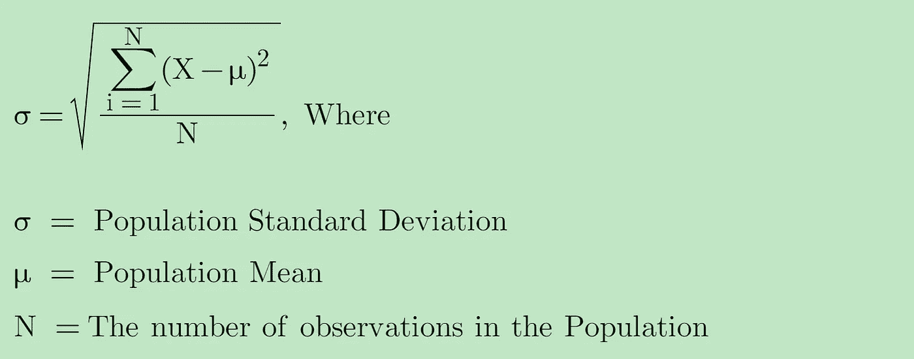
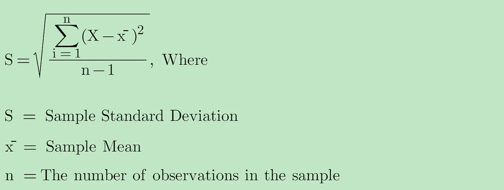
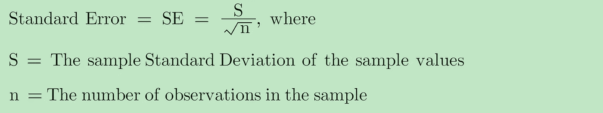
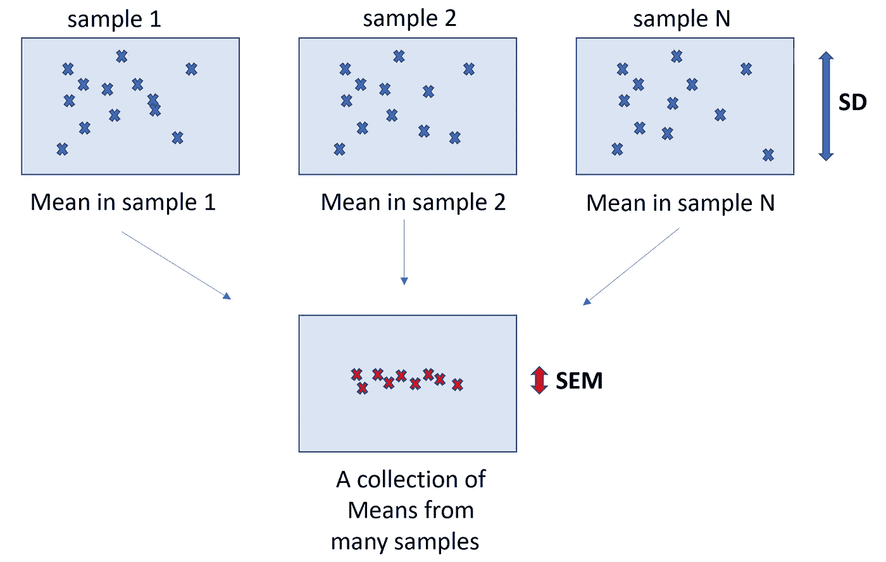
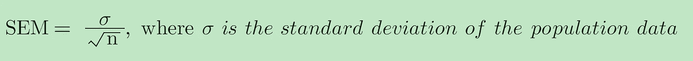
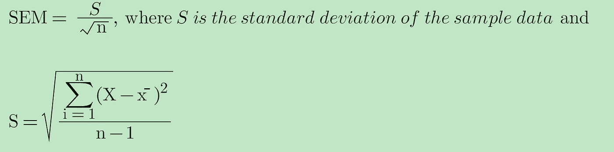
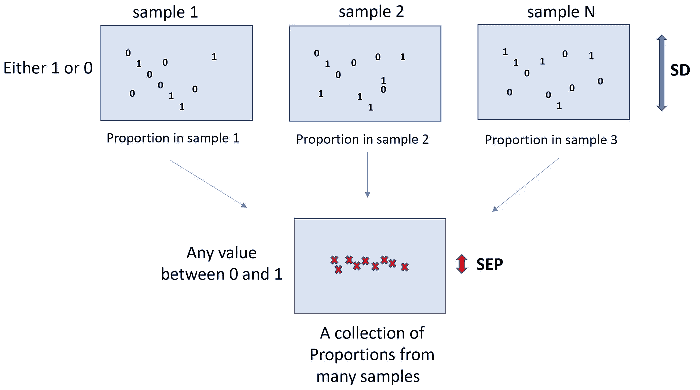
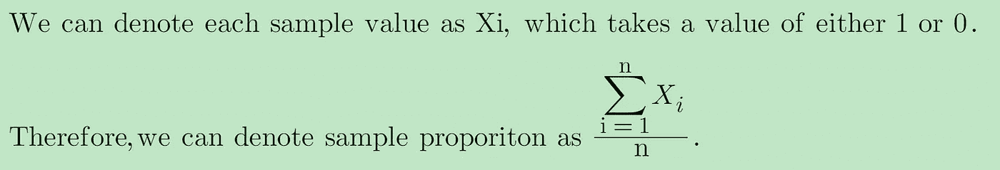
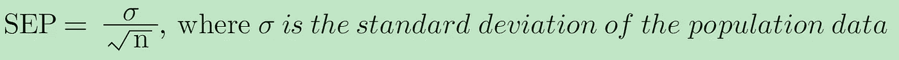
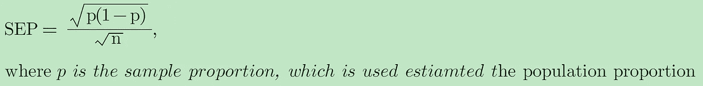

# 标准差 vs 标准误:有什么区别？

> 原文：<https://towardsdatascience.com/standard-deviation-vs-standard-error-whats-the-difference-ae969f48adef>

## 来自不同宇宙的双胞胎

马丁·桑切斯在 [Unsplash](https://unsplash.com?utm_source=medium&utm_medium=referral) 上的照片

S 标准差和标准误是两个经常引起混淆的统计学概念。它们有相同的解释吗，或者它们代表着完全不同的东西？我们将在这篇文章中讨论更多。

## **什么是标准差？**

**标准差**测量给定数据集中围绕**平均值**的数据点的**可变性**(又名**分布**)。换句话说，它告诉我们，平均来说，每个数据点离平均值有多远。

## **人口标准差**

在现实世界中，我们感兴趣的是估计人口中的某个特征。标准差是这些特征的一个例子。

当您拥有来自总体的所有数据点时，您可以使用以下公式计算总体标准偏差的真实值。

作者图片

## **样本标准偏差**

通常，由于时间、资金或技术限制，很难从人群中收集所有的数据点。例如，如果我们想计算洛杉矶家庭收入的真实标准差，我们需要得到洛杉矶所有家庭的收入，这几乎是不可能的。

相反，我们可以从总体中收集随机样本，并使用**样本标准差对总体标准差进行推断。**样本标准差的公式为

作者图片

## 为什么样本标准差用 n-1？

您会注意到，我们使用样本均值(x̄)而不是总体均值(μ)来计算样本标准差，因为我们对总体均值一无所知。x̄是μ的合理估计值。

因此，样本数据集中的任何值 x 都更接近 x̄，而不是μ。样本标准差中的分子会人为地变得比它应该的要小。因此，样本标准偏差会被**低估**。

为了校正样本标准差中的这个**偏差**，我们将使用**“n-1”而不是“n”(**又名，**贝塞尔校正**)来表示样本标准差**。**

使用 n-1 会使样本标准偏差大于使用 n 的样本标准偏差。因此，我们对总体标准偏差的估计偏差较小，给出了对变异性的保守估计。

## 什么是标准误差？

在讨论标准差之前，我们先熟悉一下**样本分布**和**样本分布**的概念。

## **样本分布对比抽样分布**

**样本分布**就是从总体中随机抽取的样本的**数据分布**。

例如，我们在洛杉矶随机问了 100 个人他们的收入是多少。样本分布描述了这 100 个人的**实际**收入分布。

但是什么是抽样分布呢？

**抽样分布**是从同一总体中抽取的多个样本(即**重复抽样**)的样本统计量(如样本均值、样本方差、样本标准差、样本比例)的**分布。**

例如，我们在洛杉矶随机问了 100 个人他们的收入是多少。然后计算平均收入。我们重复这个 1000 次，然后我们有 1000 个不同的平均收入。这 1000 个平均收入的分布称为抽样分布。

> 因此，**样本分布**是**样本数据**的分布，而**样本分布**是**样本统计量的分布。**
> 
> 概念是**标准误差**与抽样分布有关，而不是样本分布。
> 
> **标准误差**是描述**抽样分布中统计**的**可变性的指标。**

## 如何解读标准差(SE)？

标准误差衡量**样本统计**(如样本均值)可能与**真实人口统计**(如人口均值)相差多远。

## 为什么我们需要标准误差？

通常，当我们试图进行统计推断时，您可能想要构建**置信区间**，并且分配一个概率来构建包含平均值的置信区间会提供更多信息。

*   如果底层数据是正态分布，那么抽样分布也是正态分布。然后，我们可以说，我们有 68%的信心，总体均值位于 1 个标准误差内，或 95%将位于 2 个标准误差内，等等。
*   如果底层数据不是正态分布，但是样本量足够大，我们可以依靠**中心极限定理(CLT)** 说抽样分布近似正态分布，那么我们可以对置信区间做类似的陈述。

## 如何计算标准误差(SE)？

我们通常使用以下公式来计算标准误差。我将在下一节讨论如何推导这个公式。

作者图片

## 标准误差的例子有哪些？

标准误差可以应用于各种类型的 ***统计。*** 一些流行的例子有

*   样本平均值的标准误差(又名平均值的标准误差，SEM)
*   样本比例的标准误差(又名比例的标准误差，SEP)

## 平均值(SEM)的标准误差是多少？

> 平均值的标准误差(或简称为标准误差)表示**样本平均值**与**总体平均值**的差异程度。

从技术上来说，平均值的标准误差计算为样本平均值的标准偏差。

作者图片

假设，我们可以使用以下步骤计算重复样本下的标准误差:

1.  从总体中抽取一个新样本。
2.  计算步骤 1 中抽取样本的样本平均值
3.  多次重复步骤 1 和 2。
4.  标准误差是通过计算前面步骤的样本平均值的标准偏差获得的。

由于**中心极限定理(CLT)** ，我们不需要考虑重复样本下的抽样分布。相反，样本均值的抽样分布可以从一个随机样本中估计出来。

> 中心极限定理说明样本均值具有近似正态分布，其**均值为μ** ，其**标准差(或标准误差)为σ/√n** 。

## SEM 的公式怎么推导？

作者图片

因此，

作者图片

在大多数情况下，总体数据的标准差是未知的。我们会用样本数据的标准差(样本标准差)来估计。

因此，

作者图片

## 比例的标准差(SEP)是多少？

> 比例的标准误差表明**样本比例**可能与**人口比例**有多大差异。

比例的标准误差计算为样本比例的标准偏差。

作者图片

您会注意到，在每个样本数据中，我们只有 1 或 0 的数据。每个值遵循一个**伯努利分布**。计算出的样本比例不再是二进制值。相反，它们可以是 0 到 1 之间的任何值。

> 中心极限定理陈述了样本比例具有近似正态分布，其均值为 p 的**，标准差(或标准差)为√P(1-P)/√n** ，其中 P 为总体比例。

## SEP 的公式怎么推导？

作者图片

类似于 SEM，

作者图片

作者图片

我们可以使用样本标准差 **√p(1-p)** (即伯努利分布的标准差)来估计 **σ**

作者图片

## 结论:

标准偏差和标准误差是相似的概念，都用于测量**可变性。**

**标准差**表示**样本数据值**与**样本分布**中的平均值有何不同。

**标准差**表示**样本数据统计**与**抽样分布**中的总体统计有何不同。

如果你想探索更多与**统计**相关的帖子，请查看我的文章:

*   [**7 关于中心极限定理的最常见问题**](/7-most-asked-questions-on-central-limit-theorem-82e95eb7d964)
*   [**标准差 vs 标准差:有什么区别？**](/standard-deviation-vs-standard-error-whats-the-difference-ae969f48adef)
*   [**3 种最常见的曲解:假设检验、置信区间、P 值**](/the-most-common-misinterpretations-hypothesis-testing-confidence-interval-p-value-4548a10a5b72)
*   [**线性回归模型中误差项是否呈正态分布？**](/are-the-error-terms-normally-distributed-in-a-linear-regression-model-15e6882298a4)
*   线性回归模型中的 OLS 估计量是否正态分布？
*   [**什么是正则化:偏差-方差权衡**](/machine-learning-bias-variance-tradeoff-and-regularization-94846f945131)
*   [**方差 vs 协方差 vs 相关性:有什么区别？**](https://medium.com/geekculture/variance-vs-covariance-vs-correlation-what-is-the-difference-95adff96d542)
*   [**置信区间 vs 预测区间:有什么区别？**](/confidence-interval-vs-prediction-interval-what-is-the-difference-64c45146d47d)
*   I 型和 II 型错误哪个更糟糕？

## 感谢您的阅读！！！

如果你喜欢这篇文章，并且想**请我喝杯咖啡，**请[点击这里](https://ko-fi.com/aaronzhu)。

您可以注册一个 [**会员**](https://aaron-zhu.medium.com/membership) 来解锁我的文章的全部访问权限，并且可以无限制访问介质上的所有内容。如果你想在我发表新文章时收到电子邮件通知，请订阅。