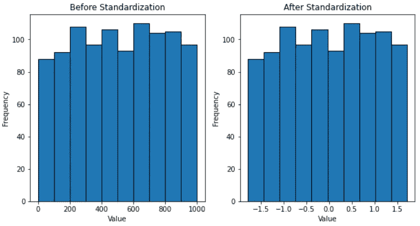
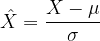
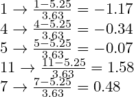
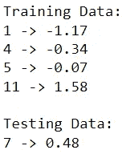
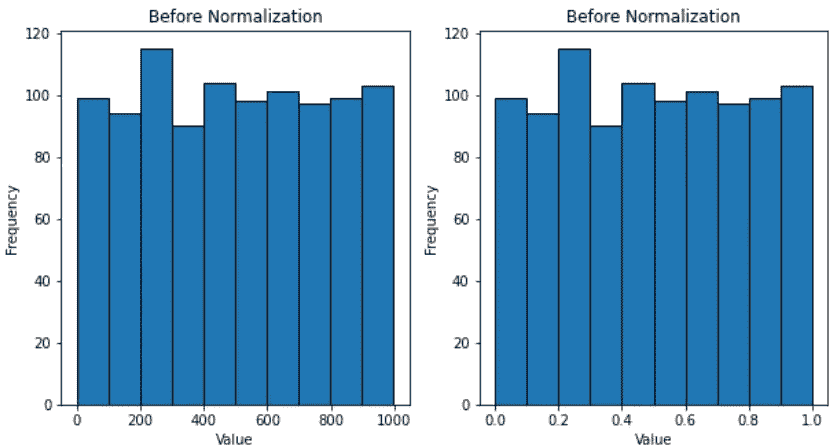
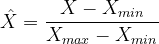
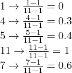
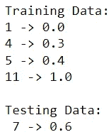

# 标准化与规范化

> 原文：<https://towardsdatascience.com/standardization-vs-normalization-dc81f23085e3>

## 区分两种常见的特征缩放方法

照片由[像素](https://www.pexels.com/photo/white-10-feet-steel-tape-162500/?utm_content=attributionCopyText&utm_medium=referral&utm_source=pexels)的[皮克斯拜](https://www.pexels.com/@pixabay?utm_content=attributionCopyText&utm_medium=referral&utm_source=pexels)拍摄

通常，数据中的输入要素可以有不同的测量单位。因此，每个要素都可以有自己独特的值分布。

不幸的是，合并具有不同分布的要素会导致模型偏向具有较大值和方差的要素。

特征缩放通过将所有数据调整到特定比例来解决这一问题，这就是为什么它通常是特征工程中的必要组成部分。

两种最常见的特征缩放方法是标准化和规范化。

在这里，我们探索每种方法的来龙去脉，并深入研究如何为机器学习任务确定理想的缩放方法。

## 标准化

标准化需要缩放数据以符合标准的正态分布。

标准正态分布定义为均值为 0、标准差为 1 的分布。

**可视化标准化**

为了更好地理解标准化，将它对一些数据的影响可视化会有所帮助。

我们将对从 1 到 1000 的 1000 个随机值进行标准化。之后，缩放前后的数据分布将通过直方图显示。

代码输出(由作者创建)

从直方图中，我们可以看到标准化是如何使数据符合标准的正态分布的。缩放后，数据的平均值为 0，标准差为 1。

然而，即使值发生了相当大的变化，变换后分布的形状仍保持相对完整。这是缩放的关键，因为必须保留存储在要素中的信息。

**数学**

那么，这些新的价值究竟是如何产生的呢？

用于得出标准化值的公式如下:

标准化(由作者创建)

通俗地说，标准化是根据数据的平均值和标准差来转换值。

为了了解这个公式是如何实现的，让我们在一个例子中使用它。

假设我们正在处理以下数据:

训练集:[1，4，5，11]

测试集:[7]

在这种情况下，平均值为 5.25，标准偏差为 3.63。请记住，在确定参数时，我们不考虑测试集。

知道了所有必要的信息，我们可以通过简单的即插即用来标准化原始值。

标准化(由作者创建)

为了验证这些结果，我们可以在 Python 中执行相同的操作。

代码输出(由作者创建)

## 正常化

规范化需要缩放数据以适应特定的范围。

虽然您可以选择这个范围，但通常情况下，归一化会将数据调整到 0 到 1 的范围内。

**可视化标准化**

同样，可视化有助于洞察规范化对数据的影响。

我们可以对相同的 1000 个随机数进行归一化，并使用直方图来查看它们在缩放后的变化。

代码输出(由作者创建)

如图所示，分布已经移动和收缩，所有值都在 0 和 1 之间。

与标准化类似，标准化不会过多地改变分布的形状，因为它旨在保留信息。

**数学**

规范化遵循一个简单的公式:

这意味着归一化会根据分布中的最小值和最大值来转换值。

我们可以通过对相同的虚构数据执行归一化来重复前面的练习:

训练集:[1，4，5，11]

测试集:[7]

在这种情况下，最小值为 1，最大值为 11。

同样，在导出这些参数时，不考虑测试集。这意味着，即使测试集的值小于 1 或大于 11，公式中的最小值和最大值仍将分别为 1 和 11。

有了这些信息，就很容易得出标准化值:

规范化(由作者创建)

我们可以通过在 Python 中执行相同的操作来验证这些结果。

代码输出(由作者创建)

## 重要的一点

如示例中所述，在确定缩放操作的参数时，应*而不是*考虑测试数据。

在任何缩放中使用的参数应该总是由训练数据单独确定。虽然测试数据也被转换，但是它的值仅基于从训练数据导出的参数进行缩放。

如果您不确定为什么这样的安排是必要的，请查看我关于数据泄漏的文章:

</an-introduction-to-data-leakage-f1c58f7c1d64>  

## 你应该使用哪一个？

尽管标准化和规范化具有相同的基本功能，但它们使用不同的方法。因此，它们的用例也不同。

标准化是符合正态/高斯分布的数据的理想选择。

在处理带有异常值的数据时，它也更优越，因为它更能抵抗极端值。标准化常用于 PCA，其目的是在降低维数的同时最大化方差。

另一方面，当您不确定数据的分布时，规范化是更安全的选择。

总而言之，在机器学习任务中确定最佳特征缩放方法需要对正在使用的数据有很强的理解。

## 结论

照片由 [Unsplash](https://unsplash.com?utm_source=medium&utm_medium=referral) 上的 [Prateek Katyal](https://unsplash.com/@prateekkatyal?utm_source=medium&utm_medium=referral) 拍摄

现在，您了解了如何利用标准化和规范化来扩展数据。尽管有相似的功能，它们采取不同的方法，这意味着它们的可用性因情况而异。

理解这两种技术之间的差异是至关重要的，因为它使您能够针对任何给定的情况确定和应用最佳的扩展方法。这将优化您的特征工程并提高模型的整体性能。

我祝你在数据科学的努力中好运！