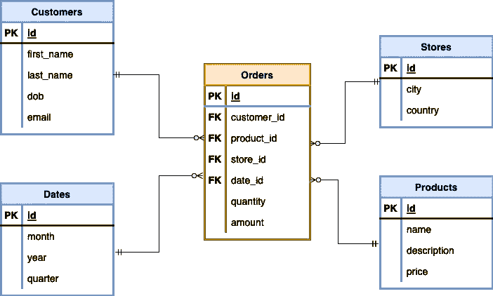

# 事实与维度表

> 原文：<https://towardsdatascience.com/star-schema-924b995a9bdf>

## 在星型模式和数据仓库的上下文中理解事实表和维度表之间的区别

在 [Unsplash](https://unsplash.com/s/photos/star?utm_source=unsplash&utm_medium=referral&utm_content=creditCopyText) 上由[统治的](https://unsplash.com/@jareeign?utm_source=unsplash&utm_medium=referral&utm_content=creditCopyText)拍照

## 介绍

随着组织生成和消耗越来越多的数据，有效的数据管理变得越来越具有挑战性，尤其是在数据存储和建模方面。因此，建立适当的数据结构对于有效管理数据至关重要。

在本文中，我们将探索一个在数据工程中广泛使用的原则，称为**星型模式**，并深入研究它的两个主要组件:**事实**和**维度** **表**。通过讨论它们的区别并提供一个端到端的例子，我们旨在展示这些概念是如何在现实项目中使用的。

## 简而言之的星型模式

星型模式广泛用于数据仓库和多维数据集市的建模。它由引用任意数量的维度表的单个事实表组成。

这种模式是雪花模式的变体，通常用于支持更简单的查询集，既有优点也有缺点。“星型模式”这个名字来源于事实表在模式图中的中心位置，被维度表包围着。

## 事实和维度表

一个**事实表**保存了被引用的**维度表**的**主键**以及一些**量化指标**(即测量值)，在这些指标上可以执行某种计算。事实表的一些常见示例包括*订单*、*日志*和*时序财务数据*。

另一方面，**维度表**保存了事实表记录中包含的所有相关字段的**描述信息**。维度表的几个常见示例是物理实体，如客户表*和产品表*和产品表*甚至时间表。一般来说，**维度表的大小比**事实表要小得多。*

区分事实表和维度表的一个简单方法是检查一个表是否引用一个名词，比如一个物理对象或人。例如，产品或客户可能独立于任何特定的业务事件而存在。因此，维度表表示名词，因为它们表示采取行动或对其采取行动的事物(例如实体店、客户或产品)。另一方面，一个动词通常对应于一个事实表，其中每个记录对应于一个事件，该事件涉及维度表中的条目。例如，一个订单涉及一个客户和一个产品(或者可能更多)。下订单的行为是由特定客户针对特定产品做出的。

作为一个例子，让我们考虑一个用例，客户在实体店购买产品。星形模式如下图所示。

示例星型架构，事实表为橙色，维度表为蓝色—来源:作者

蓝色的维度表对应于包含关于*客户*、*商店*、*产品*和*日期*的信息的表。这些是商业案例的*名词*。

橙色显示的事实表包含维度表的所有主键(PK)——事实表中的外键(FK)——以及两个定量字段，即`quantity`和`amount`。

请注意，即使没有主键，事实表也可以存在，但通常会给它们分配一个代理键。

## 星型模式的优势

由于模型的非规范化性质，星型模式在性能方面往往更快。同时，星型模式往往相当简单，因此整体结构更容易设计。此外，尽管不可维护，但可读性更好——下一节将详细介绍。

星型模式的结构有助于数据聚合，事实表通常只连接到一个级别的维度表。这种简单性降低了数据工程师和科学家查询的复杂性，也可以简化测试过程。此外，星型模式的高效查询性能有助于最小化对其他 OLAP 产品产生负面影响的风险。

## 何时(不)使用星型模式

如前所述，星型模式中的维度是非规范化的，这可能会导致表中出现重复值。因此，星型模式的存储需求相对大于其他模式，如规范化雪花模式。如果存储大小是一个问题，这种数据冗余可能需要重新考虑星型模式。

此外，星型模式中的数据冗余增加了数据完整性的风险，因为由于数据在多个记录中重复，新的更新、删除和插入可能会影响整体数据完整性。

尽管由于表之间的直接关系，星型模式的设计和实现很简单，但是由于前面提到的数据完整性问题，维护星型模式可能会带来挑战。随着新数据的接收和新表的潜在创建，在整个数据仓库中验证和保持数据完整性可能会变得很困难。

## 最后的想法

在本文中，我们强调了拥有适当的数据存储结构以实现有效数据管理的重要性。我们讨论了星型模式，这是数据工程中常用的原则，以及它的两个主要组成部分，事实表和维度表。此外，我们已经看到了如何在实际用例中应用这些概念。我们还分析了星型模式的优缺点，包括其潜在的存储和数据完整性问题。

最终，使用星型模式的决定取决于具体的环境，并且应该考虑必要的替代方法，如雪花模式。通过了解星型模式，数据工程师和科学家可以构建高效的数据存储结构并执行有效的数据分析。

[**成为会员**](https://gmyrianthous.medium.com/membership) **阅读介质上的每一个故事。你的会员费直接支持我和你看的其他作家。你也可以在媒体上看到所有的故事。**

<https://gmyrianthous.medium.com/membership>  

**相关文章你可能也喜欢**

</data-lakes-vs-data-warehouses-47444228604c>  <https://pub.towardsai.net/object-storage-521d5454d2d>  <https://betterprogramming.pub/kafka-cli-commands-1a135a4ae1bd> 