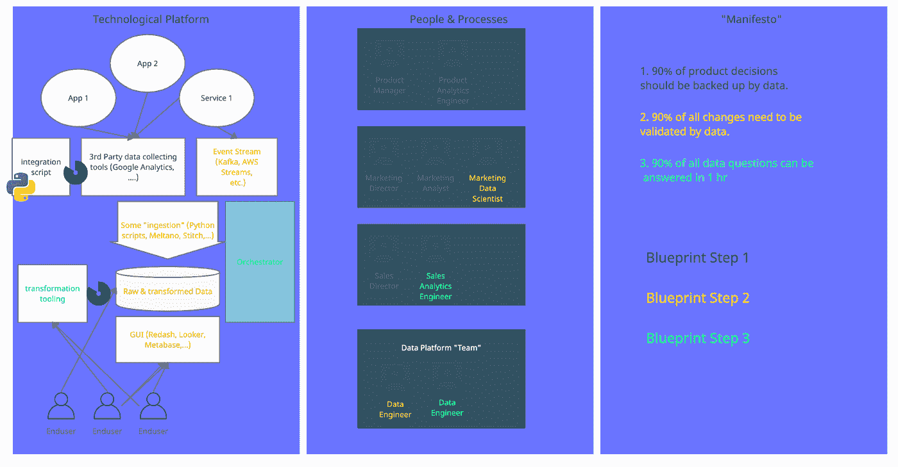
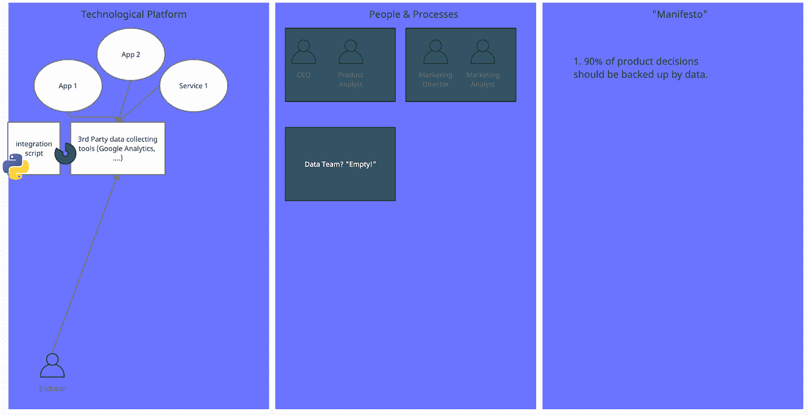
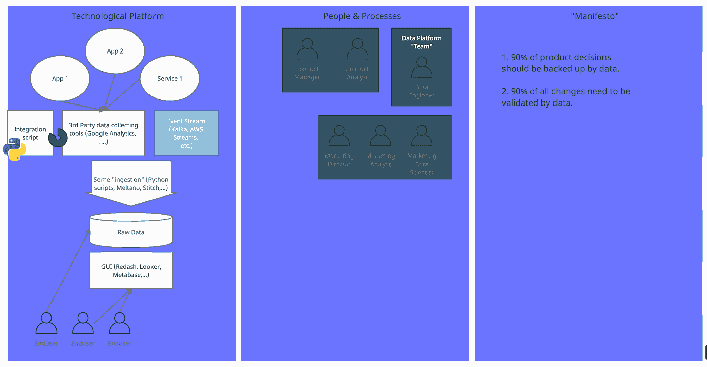
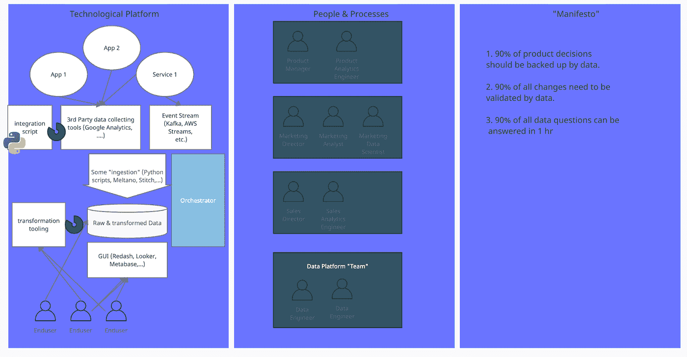

# 初创企业数据网格蓝图:通过数据网格成为数据驱动型初创企业的 3 个步骤

> 原文：<https://towardsdatascience.com/start-up-data-mesh-blueprint-3-steps-for-becoming-a-data-driven-start-up-through-the-data-mesh-ae9540c1a846>

## *一个非常简单的 3 步蓝图，帮助初创企业通过数据网获得数据驱动*

成为数据网格数据驱动型初创企业的三步蓝图。图片作者。

T 何字“*数据网*”是数据行业内的顶级潮流。目前普遍的看法似乎是，这是大公司的事情。

但是那是错误的。更好的是，初创企业拥有独一无二的机会，可以从一开始就利用数据网，直到**比市场上任何一家现有企业都更受数据驱动**。简单的事实是，转移到数据网格是一项艰巨的工作，因为它涉及到组织的变化。初创企业有独特的机会从一开始就做好组织基础，从而避免被大型现有公司的遗留数据组织所束缚。

我对数据之旅进行了大量的深入研究，以提供一个大多数初创企业都可以遵循的极其简单的蓝图。游戏初创公司 [Kolibri Games](https://www.kolibrigames.com/) 凭借其热门游戏“闲置矿工大亨”,尤其激发了很多这方面的灵感，因为他们分享了一些特别深刻的见解，这些见解可以追溯到他们公司成立至今的数据之旅。

**该蓝图是一个简单的三步蓝图，在组织和技术上都是如此:**

1.第二步:专注于在决策中使用数据，直到你最大化每份数据的价值。

2.第二步:专注于将数据构建到决策中，直到你最大化产生的数据量。

3.第二步:关注从数据中得出决策的速度。

我们先来理解一下为什么我认为初创企业在这里有独特的机会。

# 为什么说这是初创企业的独特机遇？

上面和下面描述的蓝图的每个阶段都有三个“列”。

*   图片左侧有一个技术栏，
*   中间有一个人与流程栏，
*   和一个“清单”列，在右边。

技术一栏虽然重要，但实际上是数据网格环境中最不重要的一栏。光靠技术不会为你做任何事情。事实上，您可以使用相同的技术来构建一个[简单的新的现代数据堆栈](https://future.a16z.com/emerging-architectures-modern-data-infrastructure/)，而不会更接近数据驱动。

首先也是最重要的是对“宣言”的承诺，即在公司的每一项决策中明确使用数据，这是最重要的。是被雇来支持它的人。正是这些流程明确规定了决策者及其支持团队拥有数据。

这是确保数据被纳入决策的唯一途径，也是数据真正被“拥有”的唯一途径。

从传统的"*数据只是一些副产品，分析团队做一些分析*"方法到真正的责任&数据所有权是很难的，真的很难。这将包括改变周围的人，雇佣或提高技能，以及改变许多流程。也就是说，如果你从一开始就做对了，那么作为一家初创企业，你将拥有超越竞争对手的独特优势。

# 什么&为什么是数据网格？

数据网格不是技术，它更像是一种思维方式，即…

*“产生数据的组织单位也拥有数据；这意味着它有责任为他人服务，并将其转化为有用的东西”。*

*(这是一个非常简短的版本！)*

因此，如果我是一个软件的产品经理，我也要对它产生的数据负责。毕竟，我也需要知道它是否有效，对吗？如果我做出改变或实施新的东西，没有数据，我不知道这是不是正确的事情。所以对我来说，拥有数据似乎是世界上最自然的事情。我负责获取数据。我还负责向其他团队提供这些数据，就像我为我的团队构建的任何其他 API 一样。

问题是，情况并不总是这样，事实上，今天大多数软件开发人员甚至产品经理都不同意这种观点。

但这只意味着一件事:如果你是一家初创公司，你将能够做出更多正确的决定，比市场上的大多数公司更受数据驱动，如果你从一开始就采取这种心态。

现在让我们看看我们的示例产品经理 Eve。

# 进入夏娃

Eve 是一款在线游戏的产品经理。她想增加总游戏时间，即玩家人数乘以他们的平均游戏时间。该游戏目前由三轮组成。

她的想法是，将回合从 3 轮增加到 4 轮将通过大致保持玩家数量不变来增加玩家数量，当然还会增加他们的平均游戏时间(这也与游戏中的流失率有关)。

如果 Eve 实现了这种改变，我们的初创公司需要三样东西来做出数据驱动的决策，然后从中学习:

*   1.我们需要给 Eve 一些指导，让她知道她应该为自己的决定做一些研究，而不是简单地基于直觉。= >我们称之为"**宣言**，它可以有多种形式。
*   2.我们需要某种**技术**，允许某人收集一些 Eve 需要的数据点，比如玩家数量和平均游戏时间。= >我们称之为**技术平台**。
*   3.最后，我们需要一些流程/人员来帮助 Eve 专注于决策。= >我们称之为“**流程&人员**部分。

# 起点

虽然很痛苦，但起点是开始使用数据，即使几乎没有任何基础设施，Kolibri Games 也提到了这一点。这意味着在你公司的前 10-20 名员工中，应该有 1-2 名分析师支持决策。

如果你看看 *Airbnb* ，他们在最初的 20 名员工中雇佣了他们的第一位数据科学家。在 *Spotify* ,第一批雇员之一继续建立推荐系统，这是 Spotify 发展到目前规模的关键垫脚石。

但即使是注重数据的产品经理和创始人也会做这项工作，只要你有开始使用数据的人，不管数据来自哪里。

接下来的只是一个可能的蓝图。我见过它实现了很多次，它非常灵活，但是当然，根据您的情况，还有其他更适合的方法。但是如前所述，这应该使事情更简单，而不是更困难，所以我将坚持使用一个灵活的启动数据网格蓝图。

# 蓝图第一步:尽可能精益

我们可以用以下要点总结第 1 步:

*   *全程第三方工具*
*   *最简单的数据集成，或者根本没有；*
*   *甚至不需要全职员工来维护基础设施；*
*   *多个决策者使用数据；*
*   *大多数决策中使用的数据。*

下图举例描述了这一点。

蓝图步骤 1 示例。图片作者。

目标: **让人们根据数据做出决策**。但是当然，数据需要在那里，所以把你对第三方工具的使用扩展到所有地方，直到你“再也无法忍受”为止。通过将分析人员安排在靠近决策者的正确位置，并让决策者自始至终使用数据，真正最大限度地利用这一步。

*第一步背后的推理:*第二步将从第三方获取数据，以尽可能简单的形式集成它们，并提供某种访问途径。这些是你清单上的 2-3 个主要技术项目，它们很贵。它们需要长期的人力和资金。所以，除非你已经从数据中获得了价值，否则这是不值得的。*先关注步骤 1*。

创业初期以及从一开始就建立数据网的关键很简单，就是专注于从数据中产生价值，而不是产生更多的数据。

但这看似简单，因为专注于此意味着忽略其他东西。你应该忽略一些别的东西！

你应该剥离技术方面的一切，在你自己的领域里几乎什么都不保留。到处使用第三方工具，托管云版本。不要拥有数据库，甚至不要试图使用它。

您的目标应该是没有或者至少没有全职员工在数据堆栈上工作。

你这样做是为了把数据带给人们，带给决策者。雇佣 1-2 名你安排在他们附近的分析师，比如一名市场分析师和一名产品分析师。把他们留在那里，不要试图把他们转移到某个中央“分析单位”。

用你的价值观，你的宣言，你的任何核心沟通媒介，让数据成为每个决策的核心。后来，Kolibri Games 有一个宣言，上面写着“所有决策的 90%应该基于数据”。这是一个很好的例子。

*或者，如果您的情况需要，找一个更有技术专长的人编写 1-2 个小脚本，将数据从第三方工具 1 推送到 2 到 3。*

*可能的技术选择:* *任何第三方工具，跟踪工具前端和后端，简单的 bash/Python/R 脚本。*

# 蓝图步骤 2:精益投入集成

*要点总结:*

*   *第三方工具最常用，*
*   *但是要把数据拿出来，存储起来，让它可以访问。*
*   *~ 1 名全职员工负责管理基础设施。*
*   *用于验证决策&变更的数据；*
*   数据用户变得更加专业，能够进行更深入的分析。

下图描述了第 2 步启动的示例。

蓝图第二步。图片作者。

步骤 2 的**目标是让决策者能够**使用数据来验证决策，而不仅仅是基于 i** t。但这通常需要两件事，一是访问集成数据，这意味着同时有多个数据源。第二个是直接针对一个新特性、一个变化的数据访问。**

在思维方面，这意味着我们可以扩展我们的宣言，加入一个类似“90%的变化都需要数据验证”的条款。这一个同样取自 Kolibri Games，但是你可以在 Zynga 找到类似的，巧合的是也在游戏行业。

在人员方面，集成数据需要更多的技术技能。这意味着人们必须是 Excel & Power BI 忍者，能够编写一些 SQL，可能还有一些 Python 代码。我们需要这些人再次接近我们的决策者。这些人可能还是以前的那些人，或者我们可能会给我们公司增加一名“数据科学家”。

如何构建开发、分析师和决策者之间的互动，很大程度上取决于你。一种选择可能是让分析师和产品经理模拟出“事件”，比如通过修正谷歌分析类别、命名等。这些事件然后由开发团队和新特性一起实现。

如果开发团队已经是负责任的团队，你也可以让分析师与他们紧密合作。

在最不重要的方面，即技术方面，我们将不得不做相当多的繁重工作。第一，我们需要某种方式从第三方获取数据。第二，我们需要一个地方来放置和整合它。我们可以在这里选择一些托管解决方案。第三，我们需要某种方法来访问存储的数据，同样，我们应该选择托管解决方案。

首先，我们可以选择很多东西，Python 中的简单脚本，一些托管的摄取工具，如 Stitch、Airbyte、Meltano 或许多其他解决方案。如果我们之前已经构建了一个小的“集成脚本”,我们可以简单地使用它作为一个起点。

第二，我们可以选择像 AWS S3 这样的对象存储，尽管我首先会选择数据库，因为它使访问变得相当简单。

第三，我们可以默认使用 Excel &一些基本的 SQL 编辑器。虽然我会更进一步，使用能够进行一些“定制数据操作”的商业智能/报告工具。符合这一描述的可能是 Looker、Redash 或 Metabase。

*可选组件:事件流解决方案。根据开发者的成熟度，你也可以包含，甚至基于类似 Kafka 的事件流解决方案。好处是数据集成容易，而坏处是开发团队需要的成熟度。*

*注意:如前所述，无论你最终得到的是一个数据网，还是另一个数据栈，都在这个过程中。这里我们故意省略了一个通常被称为“转化”的部分。我们希望最终用户能够参与进来，这样我们就可以将数据的责任放在正确的位置。我们只是让他们做得更多！我们一直这样做，直到像以前一样，他们无法再忍受下去，但技术人员已经有能力采取下一步措施，也就是自己转换数据。*

# 蓝图步骤 3:最小平台团队

*要点总结:*

*   *最简单的可能集成*
*   *1-2 名全职员工负责基础设施；*
*   *多个决策者使用数据；*
*   *大多数决策中使用的数据。*

下图描述了第 3 步启动的示例。

蓝图第三步。图片作者。

**目标**:第三步(现在也是最后一步)是**优化速度，同时保持质量不变**。在这里，分散模式的真正力量展现了出来。如果你还没有建立起知识&人们在分散的单位，销售，市场和产品你现在会有一个严重的问题。

事实上，如果没有这种结构，我看不到任何一个选项可以实现这个目标。因为简单的事实是，数据问题是分散产生的，你需要投资于这种分散的数据知识。

为了优化速度，我们的中央数据平台团队为分散的团队提供“转换”工具作为服务。流行的选择可能是托管的 Trino 集群，可以选择检入物化视图、Dbt 甚至数据块。任何能够以简单的方式将原始数据转换成新信息的东西。

在人员方面，我们将会处理数据的人员添加到分散的团队中。在我们的例子中，我们选择将“分析工程师”添加到最终用户端，但是我们也可以将相同的能力引入开发团队。选择取决于您，这在很大程度上取决于您目前是更关注“在域之间共享数据”还是更关注“我们在一个数据域内工作”这一方面。如果是后者，选择分析工程师，如果是前者，给开发团队适当的能力。

在金属层面，我们关注涵盖整个公司数据的 SLA。因此，完成步骤 1-2 以建立数据成熟度至关重要。覆盖整个公司的 SLA 应该关注速度。在我们的示例中，我们选择了“90%的数据问题可以在 1 小时内回答”，这意味着这应该可以在自助服务中实现，而无需致电分析部门。这个 SLA 意味着，开发团队必须真正彻底地将数据包含到他们的所有产品中，这也意味着中央平台团队必须提供适当的工具，以某种方式使所有数据可用。

仅此而已。但是你说的那些花哨的数据网格词呢？

# 数据产品、端口、所有者等等呢？

false 我没有使用任何这些花哨的词语，甚至没有使用社会技术范式转变，因为我认为在这个阶段根本不需要开销。第一步是尽可能精简，我仍然认为即使在第三步中，你也只是触及了数据价值的表面，尽管你已经比许多人走得更远了。

下一步很难预测，所以我把它从线性蓝图中排除了。你现在有几个选择，比如使用仍然在技术上集中的基础设施建立一些机器学习解决方案，或者扩展你的数据操作的其余部分。

无论你做什么，你很快就会注意到你需要把这些数据流分解出来，并把它们变成真正的“数据产品”。

但是好消息是，你已经在你周围建立了一个组织，它将会支持做这样的事情！你将拥有从第一天起就处理数据的开发团队，并将其视为一等公民，你将拥有周围的经理和决策者，他们知道他们拥有用于决策的数据。知道我采取的任何步骤都需要收集数据的人。

因此，从这里到(实际)数据产品的网状结构将是一个简单的步骤，而来自现有企业的竞争将会反应非常缓慢。

最后，您还将开始遇到治理问题，像数据质量这样的事情将变得更加重要。

# 摘要

如果你正在阅读这篇文章，并且想要应用它，我强烈推荐你看看 Kolibri Games 走过的旅程。除此之外，如果你觉得自己也在其中，我希望你能在 LinkedIn 或 Twitter 上与我分享你的故事！享受吧。

对如何建立伟大的数据公司、伟大的数据密集型产品、成为伟大的数据团队感兴趣，还是对如何利用开源构建任何伟大的东西感兴趣？然后考虑加入我的 [*免费简讯《三个数据点周四》*](http://thdpth.com/) *。它已经成为数据初创企业、风投和数据领导者值得信赖的资源。*