# 开始使用 Python 来自动化 PLAXIS

> 原文：<https://towardsdatascience.com/start-using-python-to-automate-plaxis-35a5297321e7>

## PLAXIS 自动化系列

## 逐步走向自动化的指南


在 [Unsplash](https://unsplash.com/s/photos/python-programming?utm_source=unsplash&utm_medium=referral&utm_content=creditCopyText) 上由 [Hitesh Choudhary](https://unsplash.com/@hiteshchoudhary?utm_source=unsplash&utm_medium=referral&utm_content=creditCopyText) 拍摄的照片

PLAXIS 是一款有限元建模软件，岩土工程师在职业生涯的某个阶段肯定会遇到。在 PLAXIS 中模拟复杂的岩土工程问题可能具有挑战性，并且是耗时的模拟工作，经常涉及重复的任务。

> *作为一名工程师，我们总是想让枯燥的工作自动化，让精彩的工作变得精彩。*

在这种情况下，编程，更确切地说是 Python 是自动化重复任务的最佳工具。

Python 已经存在很多年了，但是直到最近才得到更大的社区的认可，因为它易于使用，应用范围广，并且得到了大型开源社区的支持。对于数据科学、工作流自动化和 web 开发来说，它是一种非常棒的编程语言。

PLAXIS 有一个开发良好的应用编程接口(API ),允许用户通过编程来操作 PLAXIS。更多细节可以在宾利官方网站上看到。

<https://communities.bentley.com/products/geotech-analysis/w/wiki/45393/api-python-scripting---plaxis>  

# 目标

尽管 PLAXIS Python API 已经开发了很长时间，但是仍然缺乏向岩土工程师介绍这种技术的完整指南。

本教程假设读者没有编程经验，所以我将展示如何从头开始建立编程环境。

*免责声明*

已经有很多付费课程教工程师使用 PLAXIS 中内置的 Python 编辑器，我认为这已经相当成熟了。但我个人更喜欢用自己的编程环境写脚本，原因有以下三点:

1.  一个开发良好的集成开发环境(IDE)对于编码来说更为用户友好，因为它会挑选错误的语法并识别错误，这对于初学者来说至关重要。
2.  内置的 Python 编辑器在导入用户开发的模块时灵活性较差。将来当你有更多的编程经验时，你会发现很多时候我们需要把我们写的函数分离出来作为一个模块，这样我们的脚本就不那么忙了。这在 IDE 中可以很好的管理。
3.  我们不想把剧本留给自己，而是和同事们分享。IDE 提供了与 GitHub、GitLab 等代码共享平台的完美集成。

本教程的最终目标是向您展示如何使用 Python 脚本在 PLAXIS 2D 中创建您的第一个结构元素。这可以通过以下四个步骤来完成。

1.  安装集成开发环境(IDE)
2.  激活 PLAXIS 环境
3.  连接到 PLAXIS API
4.  创建第一个板元素

最后，本教程假设读者使用的是 Windows 操作系统，并且已经安装了 PLAXIS 2D V22。所以让我们开始吧！

# 步骤 1:安装集成开发环境(IDE)

IDE 是一个软件应用程序，它为编程提供了全面的工具，通常由源代码编辑器、构建自动化工具和调试器组成。

IDE 有各种各样的选项，如 Visual Studio Code (VS Code)、PyCharm、Jupyter Notebook 等，这些选项在功能上没有区别，完全取决于用户对 IDE 的选择偏好。本指令演示了 VS 代码的安装。

按照以下说明安装 Visual Studio 代码(VS 代码):

为 Windows 下载最新的 VS 代码:[https://code.visualstudio.com/download](https://code.visualstudio.com/download)

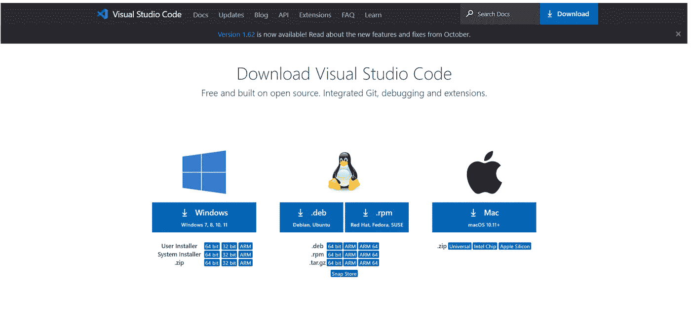

作者截图

遵循安装向导，并检查如下所示的选项。

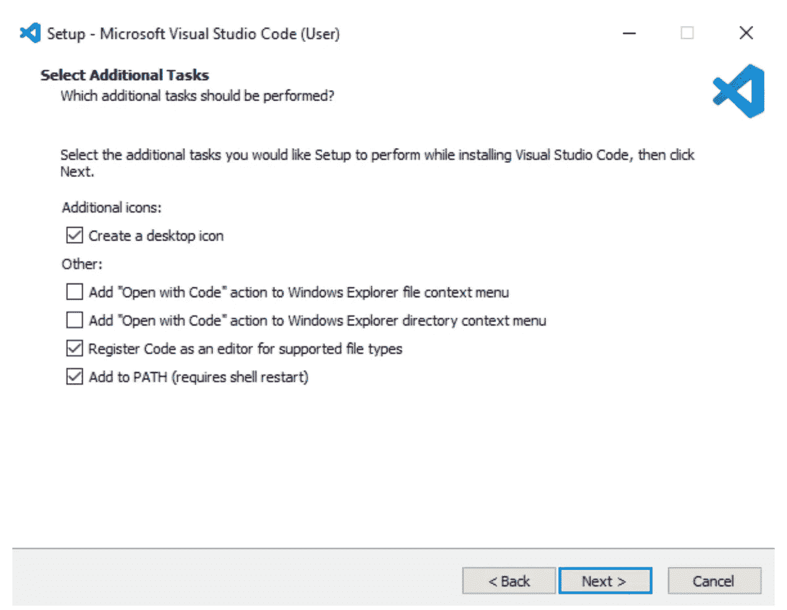

作者截图

安装完成后，在桌面上打开 VS 代码。您将看到以下界面。

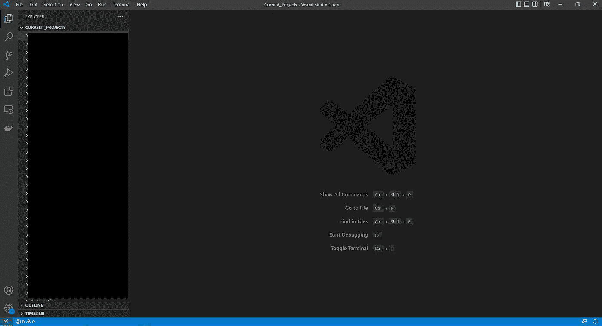

作者截图自 VS 代码

右键单击资源管理器->将文件夹添加到工作区，在资源管理器中添加您的工作文件夹…

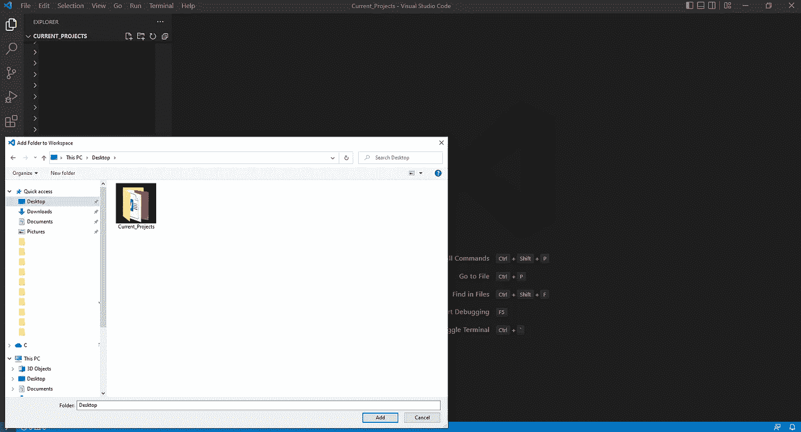

作者截图自 VS 代码

您现在已经完成了 VS 代码的设置，并准备开始编码了！

# 步骤 2:激活 PLAXIS 环境

一旦建立了虚拟环境和 IDE，就可以开始在 IDE 中编写 Python 脚本了。

要编写 Python 脚本，应遵循以下过程:

*   打开 IDE 终端
*   直接到您的首选工作文件夹(在终端中)
*   激活 PLAXIS Python 环境
*   创造。文件夹中的 py 文件

## 打开 IDE 终端

单击底部菜单栏中的“警告”图标:

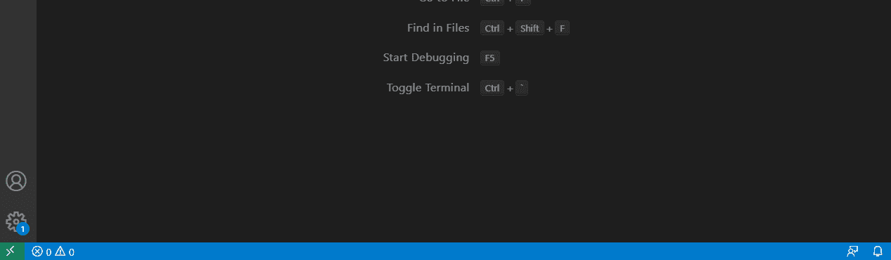

作者截图自 VS 代码

您将看到 Shell 窗口出现:

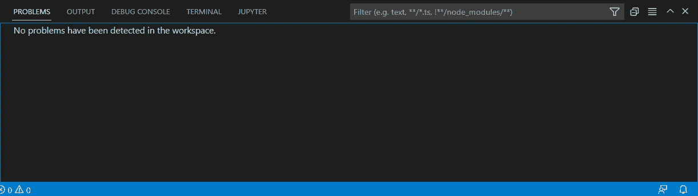

作者截图自 VS 代码

按照指示，转到顶部菜单栏中的“终端”选项卡。您应该看到您在工作文件夹中。

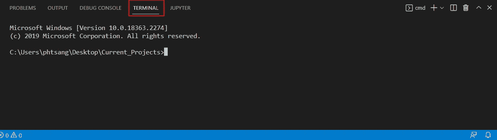

作者截图自 VS 代码

## 直接到您的首选工作文件夹

如果不是正确的工作文件夹。您可以键入:

cd

例如，我目前在当前项目文件夹，我想定位到 00 _ 数字化->01_Python-FE。文件夹路径是:

c:\ Users \ phtsang \ Desktop \ Current _ Projects \ 00 _ digital isation \ 01 _ Python-FE

在 IDE 终端中:

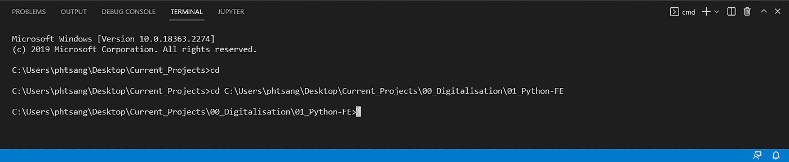

作者截图自 VS 代码

它应该显示正确的文件夹名称，如上所示。

## 激活 PLAXIS Python 环境

要激活 PLAXIS Python 环境，我们需要选择 PLAXIS 内置的 Python 解释器，它包含操作 PLAXIS 所需的所有功能。安装 PLAXIS 时，python 解释器会自动安装。

Python 解释器的位置:

c:\ program data \ Bentley \ geography \ PLAXIS Python 发行版 V2\python\python.exe

要选择特定的环境，请使用命令面板中的 Python: Select Interpreter 命令(Ctrl+Shift+P)。点击“输入解释器路径…”，然后在上述位置浏览 python.exe。

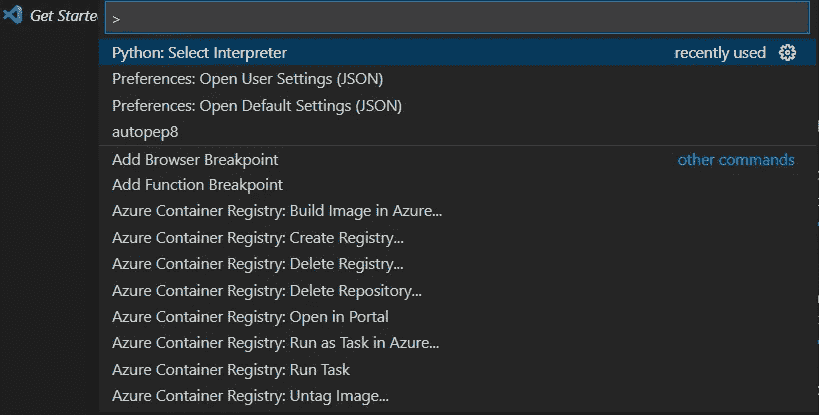

作者截图自 VS 代码

在“终端”选项卡中，从下拉列表中选择命令提示符，如下图所示。

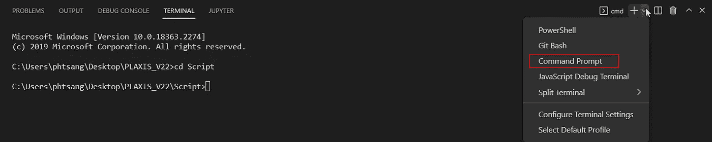

作者截图自 VS 代码

如果环境被成功激活，您应该在工作目录前面看到(PLAXIS)。

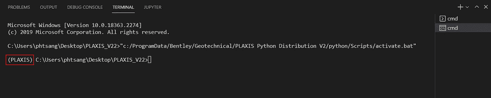

作者截图自 VS 代码

## 创造。文件夹中的 py 文件

单击新建文件图标:

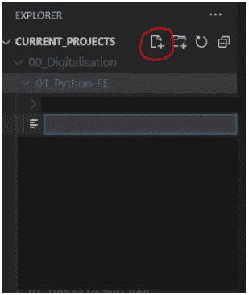

作者截图自 VS 代码

创造。py 文件如下:

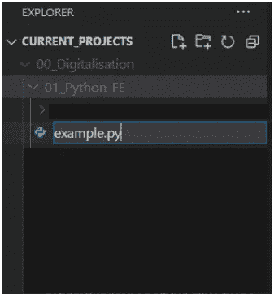

作者截图自 VS 代码

下一节我们将开始连接 PLAXIS API。

# 步骤 3:连接 PLAXIS API

我将首先创建一个空的 python 脚本，并将其命名为“create_plate.py ”,如下所示。

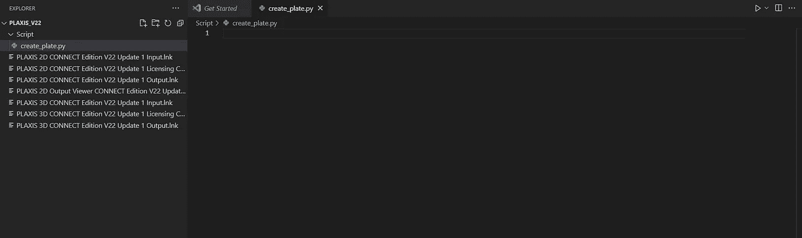

作者截图自 VS 代码

之后，我们将下面的代码写入 python 文件。这里有三件事:

1.  从 PLAXIS Python 环境导入模块。为了用 Python 脚本操作 PLAXIS，我们需要使用 PLAXIS 开发的函数(在编程方面更通常称为方法)。我们导入的模块名为“plxscripting.east”
2.  打开 2D 桌面应用程序。如果采用默认安装路径，Plaxis2DXInput.exe 的路径应该与下面列出的路径相同。如果不是这样，只需将路径更改为正确的目录。端口号和密码可以保持默认，但您可以选择任何您想要的值。
3.  使用预定义的端口号和密码启动 PLAXIS 脚本服务器。

```
from plxscripting.easy import *
import subprocess, time

PLAXIS_PATH = r'C:\Program Files\Bentley\Geotechnical\PLAXIS 2D CONNECT Edition V22\\Plaxis2DXInput.exe'  # Specify PLAXIS path on server.

PORT_i = 10000  # Define a port number.
PORT_o = 10001

PASSWORD = 'SxDBR<TYKRAX834~'  # Define a password (up to user choice).

subprocess.Popen([PLAXIS_PATH, f'--AppServerPassword={PASSWORD}', f'--AppServerPort={PORT_i}'], shell=False)  # Start the PLAXIS remote scripting service.

time.sleep(5)  # Wait for PLAXIS to boot before sending commands to the scripting service.

# Start the scripting server.

s_i, g_i = new_server('localhost', PORT_i, password=PASSWORD)
s_o, g_o = new_server('localhost', PORT_o, password=PASSWORD)

s_i.new()

g_i.gotostructures()
```

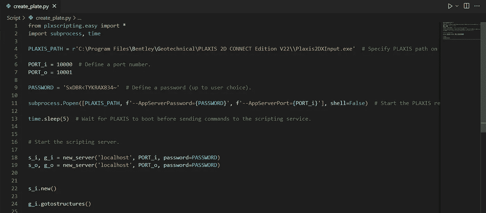

作者截图自 VS 代码

为了测试上面的代码是否正常工作，我们将在终端中运行“create_plate.py ”,如下所示。输入“python create_plate.py ”,然后单击输入。

```
(PLAXIS) C:\Users\phtsang\Desktop\PLAXIS_V22\Script>python create_plate.py
```


作者截图自 VS 代码

PLAXIS 2D 应用程序应该会自动打开。如果服务器配置正确，您应该会看到如下所示的“服务器活动”。

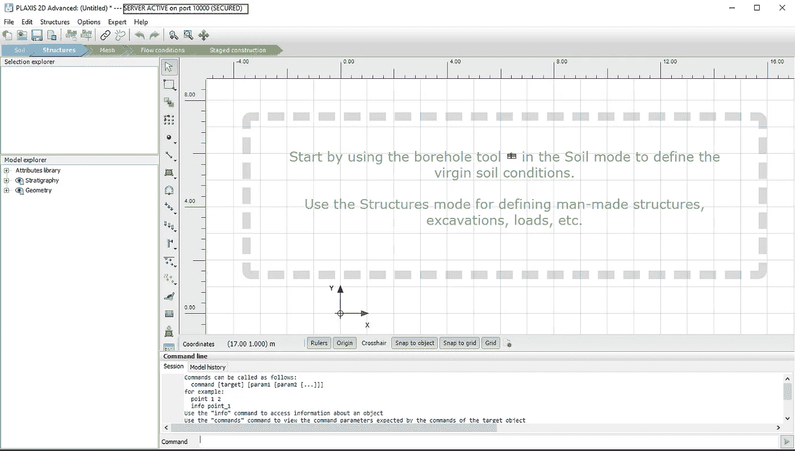

作者截图自 PLAXIS

既然我们已经连接到 PLAXIS API 服务器，那么我们可以使用 Python 脚本在 PLAXIS 中创建一个 plate 元素。

# 步骤 4:创建第一个板元素

在这部分教程中，我们的目标是创建一个具有正负界面的板单元。然后，我们将“混凝土”材料分配给元素。

首先，我们定义材料名称和几何图形。我计划创建一条从(-10，0)到(10，0)的直线。方括号[ ]在 python 中被称为 **list** ，是一种非常常见的存储值的数据类型。若要访问存储在列表中的值，请使用以下语法调用它:

如果我想访问第一个点的坐标，我使用

x 坐标= -10 =第一个点[0]

y 坐标= 10 =第一个点[1]

这里的 0 和 1 称为索引，它总是从 0 开始。

然后，我们创建材料并将其指定给板材材料列表。使用命令“g_i.platemat()”创建板材。下面的代码是将 plate 对象分配给一个列表。

```
material=['Concrete']
first_point=[-10,0]
second_point=[10,0]

# Create material
for i in range(len(material)):
    g_i.platemat('Identification',material[i])

platematerials = [mat for mat in g_i.Materials[:] if mat.TypeName.value == 'PlateMat']
```

然后，我们根据预定义的坐标用“g_i.plate()”创建板单元。

```
plate=g_i.plate(
    (first_point[0],first_point[1]),
    (second_point[0],second_point[1]),
    )
plate1=plate[-1]
```

然后，使用“g_i.posinterface()”和“g_i.neginterface()”创建接口。

```
plate2=plate[-2]
g_i.posinterface(plate2)
g_i.neginterface(plate2)
```

最后，将“混凝土”设置为板元素。

```
plate1.setmaterial(platematerials[0])
```

如果您重新运行该脚本，您将看到在 PLAXIS 中创建了以下内容。如您所见，创建了“混凝土”材质，并将其分配给我们创建的板元素。

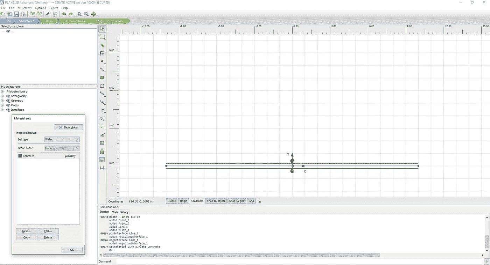

作者截图自 PLAXIS

恭喜你！您已经使用 Python 在 PLAXIS 中创建了第一个 plate 元素！

# 奖金

当然，我们经常需要在 PLAXIS 中创建不止一个结构元素。在本节中，我们的目标是创建四个板元素，它们用以下坐标形成一个矩形:

*   (-10,0)
*   (-10,10)
*   (10,10)
*   (10,0)

我们需要首先创建一个列表(称之为“df_plate”)来指定每个板元素的坐标。第一点和第二点分别存储为(x1，y1)和(x2，y2)。在这个列表中，我使用了一种新的数据类型，叫做 **Dictionary** ，这在 Python 中非常常用。在下一个教程中会有更多的介绍。

```
df_plate=[{'x1':-10,'y1':0,'x2':10,'y2':0},{'x1':-10,'y1':10,'x2':-10,'y2':0},{'x1':-10,'y1':10,'x2':10,'y2':10},{'x1':10,'y1':10,'x2':10,'y2':0}]
```

由于这次我们需要访问一个列表中的多个元素，我们将利用一个叫做**的概念来循环**。它允许我们遍历元素并相应地在 PLAXIS 中创建点。这可以通过下面的代码来完成:

```
for i in range(len(df_plate)):
    plate=g_i.plate(
        (df_plate[i]['x1'],df_plate[i]['y1']),
        (df_plate[i]['x2'],df_plate[i]['y2']),
        )
    plate1=plate[-1]
```

您的最终脚本应该是这样的:

```
# Plate
#Material name and geometry
material=['Concrete']

df_plate=[{'x1':-10,'y1':0,'x2':10,'y2':0},{'x1':-10,'y1':10,'x2':-10,'y2':0},{'x1':-10,'y1':10,'x2':10,'y2':10},{'x1':10,'y1':10,'x2':10,'y2':0}]

# Create material
for i in range(len(material)):
    g_i.platemat('Identification',material[i])

platematerials = [mat for mat in g_i.Materials[:] if mat.TypeName.value == 'PlateMat']

#Create Plate
for i in range(len(df_plate)):
    plate=g_i.plate(
        (df_plate[i]['x1'],df_plate[i]['y1']),
        (df_plate[i]['x2'],df_plate[i]['y2']),
        )
    plate1=plate[-1]

#Create Interface

    plate2=plate[-2]
    g_i.posinterface(plate2)
    g_i.neginterface(plate2)
#Set Material

    plate1.setmaterial(platematerials[0])
```

如果您重新运行该脚本，您将看到在 PLAXIS 中创建了以下内容。现在，您可以使用 Python 脚本创建多个元素。

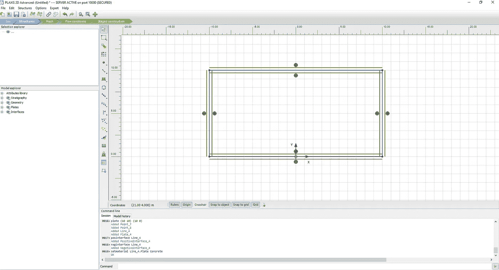

作者截图自 PLAXIS

# 结论

关于用 Python 自动化 PLAXIS 的第一篇教程到此结束。到目前为止，您应该能够使用 Python 脚本在 PLAXIS 中创建结构化元素。以后，我会继续发布在 PLAXIS 中使用 Python 的教程。不仅如此，我还热衷于分享如何使用 Python 来自动化工程中枯燥的工作流程的知识。

如果你有兴趣了解更多关于 Python、PLAXIS 和工作流自动化的知识，欢迎关注我的页面。

你可以在我的 [Github](https://github.com/philiptsangeic/PLAXIS_Python_Automation/blob/master/create_plate.py) 上找到这篇文章中演示的代码。