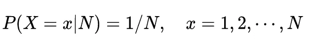
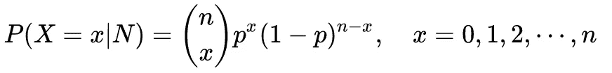
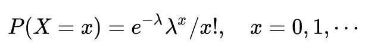
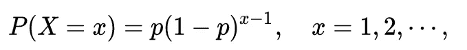
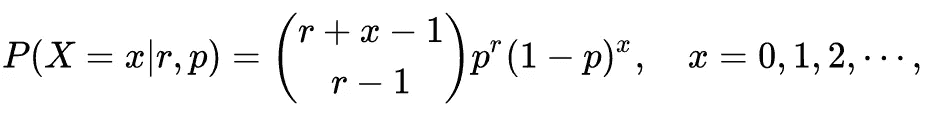
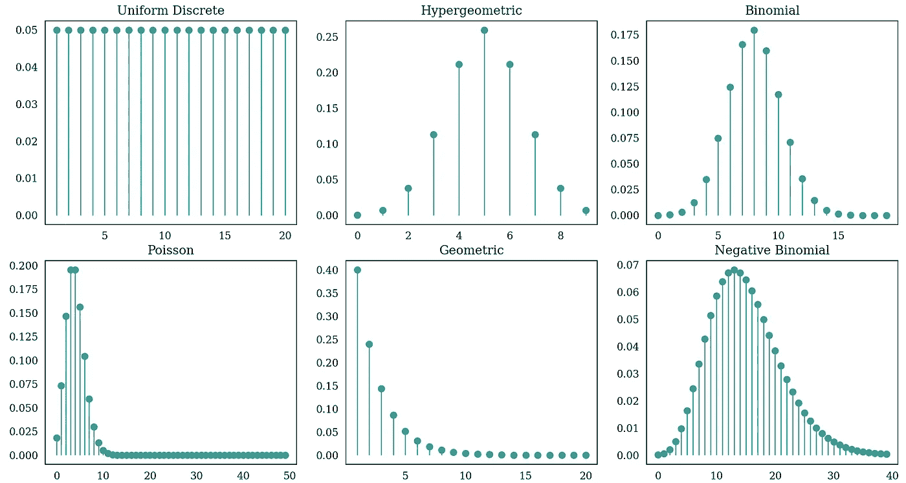

# 统计故事:统计分布的常见家族(第 1 部分)

> 原文：<https://towardsdatascience.com/stat-stories-common-families-of-statistical-distributions-part-1-2b704dd6a808>

## 为数据创建模型的工具

亚利桑那大学 ENR2 大楼(容纳数学、统计和数据科学项目)。作者拍摄的照片

作为数据科学家、统计学家、计算机工程师或数据分析师，人们正在处理从各种来源、通过许多物理过程获得的海量数据，这些数据涵盖了交通运输、光子学、生物信息学和天文学等广泛的领域。统计学家和数据科学家花很大一部分时间对数据进行建模，以便他们能够做出一些有意义的推断。创建新统计方法的一种方法是生成对应于物理过程或实验室实验的合成数据集。在使用合成数据集开发新方法方面取得了巨大成功，这些新方法对真实数据集和推理产生了更大的影响，并取得了进一步的新突破。一个显著的例子是用 R 语言编写的 [Splatter](https://link.springer.com/article/10.1186/s13059-017-1305-0) 包，它生成一个合成数据集来表示一项单细胞 RNA 测序研究。

合成数据集的生成需要对真实数据集有丰富的理解-它们遵循哪种统计分布，以及如何在现有数据集上拟合已知分布。在许多情况下，真实数据集呈现混合模型，即多个分布的组合。这要求统计学家熟悉一些常见的分布族。在本文中，我们将介绍一些最常见的分布族，包括离散分布族和连续分布族。在第 1 部分中，我们描述了离散分布，然后从这些分布中生成合成数据。

<https://rahulbhadani.medium.com/stat-stories-common-families-of-statistical-distributions-part-2-4bdea86c3132>  

# 离散制服

对于离散均匀分布，随机变量 *X* 是可数的，即 X ∈ {1，2，…，N}其中 N 是参数。其概率质量函数(pmf)为

等式 1。离散均匀分布的 PMF

其期望和方差分别为𝔼( *X* ) = (1+N)/2，Var( *X* ) = ((N+1)(N-1)/12)。

# 超几何分布

超几何分布与有限总体中无替换的一系列 *N* 次试验的成功次数有关。另一种思考超几何分布的方式是把它看作一个装满了 *N* 个球的瓮，其中 *M* 个球被读取，其余的是绿色的。随机抽取 *K* 球，不更换，为随机变量 *X* 。其概率质量函数(pmf)为

等式 2。超几何分布的 PMF

其期望和方差分别为𝔼( *X* ) = K*M/N，var(*x*)= 𝔼(*x*)*((n-m)(m-k))/(n(n-1))。

超几何分布用于估计总种群大小 *N，*比如说池塘里的鱼。策略是抓到 *M* 鱼，做好标记，放回原处，然后重新抓到 *K* 鱼。另一个受欢迎的应用是验收抽样，即估计从一批机器零件中选出的样本中没有缺陷零件的概率。

# 二项分布

当只有两种可能的结果:成功和失败时，二项式分布用于估计来自 *n* 次试验的成功总数。考虑重复 *n* 次的随机实验。进一步，考虑成功的概率是 *p，*并且实验是彼此独立的。随机变量 *X* 表示在 *n 次*试验中成功的总次数。那么，分布的 PMF 是

等式 3。二项分布的 PMF。

在这种情况下，期望和方差分别为𝔼( *X* ) = *np，*和 var(*x*)=*NP(1-p)*。

# 泊松分布

我认为泊松分布是最重要的离散分布之一。泊松分布用于在给定大量观察值的情况下模拟某一事件的发生次数，并且期望事件在每个观察值中发生的概率明显较小。一个这样的例子是激光发射中光子的到达。泊松分布用于量子信息理论中的光子计数过程。感兴趣的读者可以看看我的研究论文“[相移键控相干态的星座优化与位移接收器最大化互信息](https://ieeexplore.ieee.org/iel7/6287639/8948470/09291373.pdf)”，深入了解光子量子信息处理。

<https://ieeexplore.ieee.org/abstract/document/9291373/>  

考虑一个随机变量 *X* 只取一个非负整数。那么泊松分布的 PMF 可以写成

等式 4。泊松分布的 PMF

其中λ是速率参数。对于泊松分布，我们有𝔼(*x*)= var(*x*)=λ。

# **几何分布**

几何分布类似于二项式分布，但是，实验会继续进行，直到获得 *S* 的成功。在这种情况下，考虑到 *X* 是表示获得第一个 *S* 成功所需的试验次数的随机变量，PMF 被写成

等式 5。几何分布的 PMF

对于几何分布，我们有𝔼( *X* ) = 1/p，Var( *X* ) = (1-p)/p。几何分布的一个特殊性质是它是无记忆的，I..它忘记了已经发生的事情。

# 负二项分布

负二项分布类似于泊松分布，但有两个参数而不是一个: *r* 和 *p* 。在这种情况下，泊松分布是负二项分布的极限情况。

如果事件是独立的且随机发生，则给定时间内事件的数量是对泊松分布的观察。当这些假设不再成立时，负二项式更适合数据，因为它有一个额外的参数，泊松分布成为一个极限情况。

考虑随机变量 *X* 来表示从负二项分布得到 *r* 成功的失败次数，成功的概率为 *p，*PMF 为

等式 6。负二项分布的 PMF

期望和方差，即𝔼( *X* ，Var( *X* )分别为 *r(1-p)/p* 和*r(1-p)/p**。*

**备注。**如前所述，泊松分布是负二项分布的极限情况。可以通过 r →∞，p→1，r(1-p)→ λ来实现。

# 数据生成

可以使用`scipy.stats.rv_discrete`生成来自上述分布的合成数据集。下面是需要 Python 3.8 或更高版本的代码片段，后面是显示每个分布的 PMF 的词干图。

代码片段 1。Python 代码来生成本文中讨论的离散分布

图一。离散分布的 PMF

请注意，选择多少样本来生成分布很重要，因为从理论上讲，我们讨论的是无限个样本。因此，我们通过除以总数来标准化概率，以使概率之和等于 1。

在**统计故事**系列的下一篇文章中，我将讨论连续统计分布的常见系列。你可以在[https://rahulbhadani . medium . com/stat-stories-common-families-of-statistical-distributions-part-2-4 bdea 86 c 3132](https://rahulbhadani.medium.com/stat-stories-common-families-of-statistical-distributions-part-2-4bdea86c3132)上阅读

另外，看看下面这个系列的其他文章。

</stat-stories-variable-transformation-to-generate-new-distributions-d4607cb32c30>  </stat-stories-why-is-moment-generating-function-important-25bbc17dad68>  <https://rahulbhadani.medium.com/stat-stories-common-families-of-statistical-distributions-part-2-4bdea86c3132>  

> 如果你喜欢我的作品，并想支持我创作高质量的内容，我请求你通过 https://rahulbhadani.medium.com/membership 的<https://rahulbhadani.medium.com/membership>**订阅 Medium。虽然只是 5 美元/月，但对我有很大的帮助，因为 Medium 支付你的订阅费的一部分给作家。**