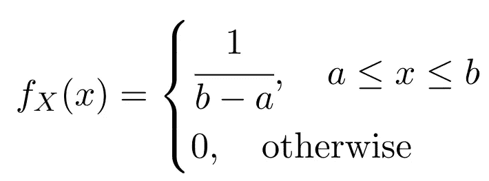
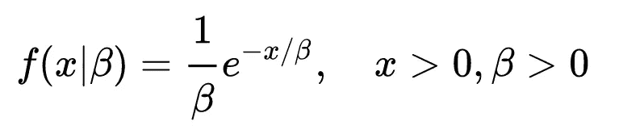
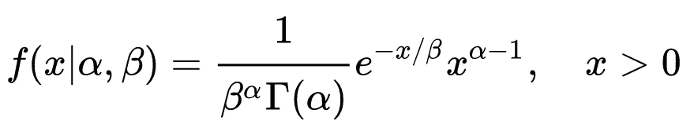
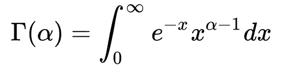
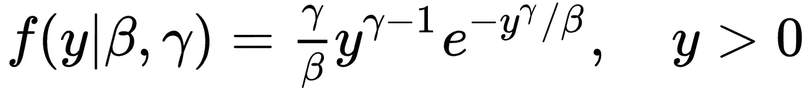
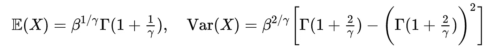
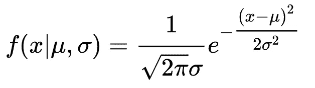
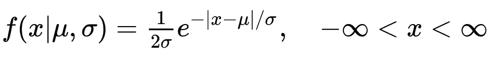
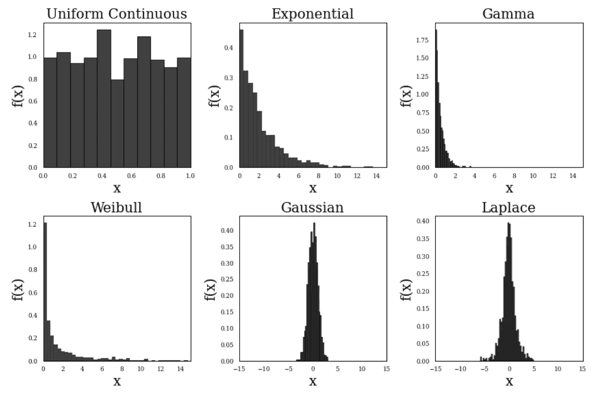

# 统计故事:统计分布的常见家族(第 2 部分)

> 原文：<https://towardsdatascience.com/stat-stories-common-families-of-statistical-distributions-part-2-4bdea86c3132>

## 为数据创建模型的工具

亚利桑那大学主图书馆。作者拍摄的图片

在“常用统计分布族”的第 1 部分中，我们看到了离散分布族，它们有助于对光子到达、人口规模估计、接受抽样等事件进行建模。在分布族的第二部分中，我们将着眼于连续统计分布，其中随机变量 *X* 可以取任何实数ℝ.

连续分布可用于模拟物理过程，例如驾驶员的驾驶速度分布、给定时间段内的温度变化等。使用连续分布对这种过程的数据建模有助于合成数据生成，该合成数据生成可用于开发和测试各种机器学习模型和神经网络。

# 连续均匀分布

考虑一个随机变量 *X~Unif[a，b]* ，其概率密度函数(pdf)由下式给出

等式 1。连续均匀分布的概率密度函数

在这种情况下，期望和方差分别由𝔼( *X* ) = (a+b)/2 和 Var( *X* ) = (b-a) /12 给出。

# 指数分布族

对于随机变量 *X* ，分布的指数族表示为 *X~Exp(β)* ，β > 0，pdf 定义为

等式 2。指数分布族的概率密度函数

其均值和方差分别由𝔼( *X* ) = β和 Var( *X* ) = β给出。

# γ分布

对于随机变量 *X* ，伽马分布由两个参数表征:α和β。其 pdf 由下式给出

等式 3。伽马分布的概率密度函数

其中伽马函数γ(α)由下式给出

等式 4。伽马函数

在伽玛分布中，α是定义分布峰值的形状参数，而β是影响分布扩散的比例参数。

伽马分布的平均值，𝔼( *X* ) = αβ，而方差 Var( *X* ) = αβ。

# 威布尔分布

如果一个随机变量*x ~ exp(β)*和另一个随机变量 *Y = X^{1/γ}* ，那么随机变量 *Y* 遵循一个新的分布，称为威布尔分布，其 pdf 由下式给出

等式 5。威布尔分布

威布尔分布的 PDF 可以使用变量转换方法从指数分布中导出，如我以前的文章[中所述](/stat-stories-variable-transformation-to-generate-new-distributions-d4607cb32c30)

</stat-stories-variable-transformation-to-generate-new-distributions-d4607cb32c30>  

备注:威布尔分布和伽马分布的区别在于，在伽马分布中， *y* 在指数中有一个线性项，而在威布尔分布中，有 y 的幂 *γ。*

对于威布尔分布，平均值和方差由下式给出

等式 6。威布尔分布的均值和方差。γ()由等式(4)给出。

威布尔分布用于风险函数建模。(关于这一点的更多内容，请继续关注。订阅电子邮件更新)。

# 正态分布/高斯分布

我认为正态分布或者高斯分布是大家最熟悉的分布。对于服从正态分布的随机变量 *X~N(* μ，σ)，其概率密度函数为

方程式 7。正态分布的 PDF

其均值和方差分别由𝔼( *X* ) = μ，Var( *X* ) = σ给出。标准正态分布的均值为 0，方差为 1，表示为*X～N(0，1)* 。

# 拉普拉斯分布

列表中的最后一个分布是拉普拉斯分布，也称为双指数分布。遵循拉普拉斯分布的随机变量 *X* 具有以下 PDF:

方程式 12。柯西分布的 PDF

其均值和方差分别由𝔼( *X* ) = μ，Var( *X* ) = 2σ给出。

# 从连续分布中生成数据

现在，让我们看一些实际的代码。下面是需要 Python 3.8 或更高版本来基于上面讨论的分布生成一些合成数据集的代码片段。我用`scipy.stats.rv_continuous`进行数据生成。代码后面是这里讨论的六种分布的概率密度函数的直方图。

代码片段 1

图一。直方图显示了本文中讨论的六种分布的概率密度函数。

在本文中，我讨论了连续分布族。本文的第 1 部分可以在 https://towards data science . com/stat-stories-common-families-of-statistical-distributions-part-1-2b 704 DD 6a 808 上找到。理解这种分布的用例超出了对统计学的理论理解，可以用于合成数据生成、拟合给定数据的分布，甚至估计一些感兴趣的参数。当我们不得不使用混合建模时，经常会出现这样的情况:可以使用分段函数将分布的组合用于数据建模。一个这样的例子是高斯混合建模。请继续关注，在未来的文章中了解更多这方面的内容。

> 如果你喜欢我的作品，并想支持我创作高质量的内容，我请求你通过 https://rahulbhadani.medium.com/membership 的<https://rahulbhadani.medium.com/membership>**订阅 Medium。虽然只是 5 美元/月，但对我有很大的帮助，因为 Medium 支付你的订阅费的一部分给作家。**