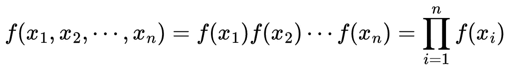
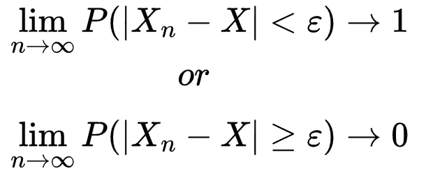
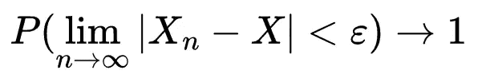
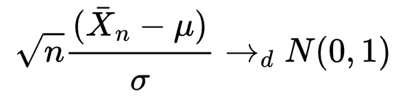
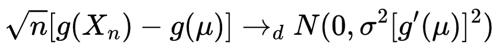
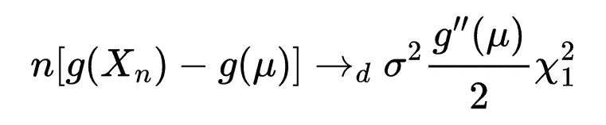

# 统计故事:统计学中的 Delta 方法

> 原文：<https://towardsdatascience.com/stat-stories-delta-method-in-statistics-bd681fbbf037>

## 机器学习实践者经常忽略的话题


作者使用人工智能工具 Dreamstudio 生成的封面照片。

数据采样是数据科学的核心。从一个给定的总体 *f(x)，*我们采样数据点。所有这些数据点统称为随机样本，用随机变量 *X* 表示。但我们知道，数据科学是一个概率游戏，通常，我们会多次重复实验。在这种情况下，我们最终得到了 *n* 个随机样本 *X₁、X₂、……xₙ*(不要与样本中的数据点数量混淆)。通常这些随机样本是独立的，但是同分布的，因此，它们被称为 pdf 或 pmf *f(x)的独立同分布随机变量，或者 iid* 随机变量*。*

在本文中，我们将讨论 Delta 方法，它提供了一个数学框架，用于在给定 iid 样本的情况下计算极限分布和渐近方差。Delta 方法允许您计算方差已知的随机变量函数的方差(通过一些变换，我们将在后面看到)。这个框架与统计学中的变量转换方法密切相关，我之前已经在[详细讨论过](/stat-stories-variable-transformation-to-generate-new-distributions-d4607cb32c30)。

[](/stat-stories-variable-transformation-to-generate-new-distributions-d4607cb32c30)  [](/stat-stories-multivariate-transformation-for-statistical-distributions-7077a374b3b4)  [](/stat-stories-normalizing-flows-as-an-application-of-variable-transformation-7b7beda7b03b)  

# 基础

给定 *iid* 随机样本 *X₁、X₂、……xₙ、*他们的联合 pdf 由下式给出



等式 iid 随机变量的联合 PDF

特殊情况下，如果所有 iid 样本(我们去掉‘随机’但假设它们在那里)正态分布，均值和方差分别为 0 和 1，那么 X ~ χ ₁，即自由度的卡方分布等于 1。(可以用 Python，R，或者 Julia 写一个简单的脚本来测试)。

## 趋同；聚集

分布收敛告诉我们 *Xₙ* 如何收敛到某个极限分布，如 *n → ∞* 。我们可以在不同层面上讨论融合:

1.  **依概率收敛:**一个随机变量序列 *X₁，X₂，… Xₙ* →ₚ *X* 如果对每一个 *ε > 0* ，



等式 2。概率收敛

其中→ₚ表示概率收敛。概率收敛的一个应用是**弱大数定律**。对于 iid *X₁，X₂，… Xₙ* 带 *𝔼(X) = μ* ，而 *var(X) < ∞，*则( *X +，X₂+ … + Xₙ)/n* →ₚ *μ。*

2 **。几乎确定收敛:**我们说 *Xₙ → X* a.s .(几乎确定)如果



等式 3。几乎肯定收敛。

几乎必然收敛意味着概率收敛，反之则不成立。强大数定律是几乎必然收敛的结果其中 *𝔼(X)* = *μ* ，var(X) = *σ，*然后( *X +，X₂+ … + Xₙ)/n* → *μ，a.s.*

**3。分布的收敛性:**我们说 *Xₙ → X* 如果 *Xₙ* 的分布函数 F_{ *Xₙ}* 的序列在适当的意义上收敛于 *X* 的序列: *F_{Xₙ}(x) → F_{X}(x)* 对于所有的 *x，*其中 *F_{X}* 是连续的 *(* 注意我的

分布的收敛性是分布的性质，而不是与前两种分布不同的特定随机变量。[矩母函数](/stat-stories-why-is-moment-generating-function-important-25bbc17dad68)的收敛意味着分布的收敛，即 *M_{X_n}(t) → M_X(t)* 对于所有 *t* 在 *0* 的邻域内。

[](/stat-stories-why-is-moment-generating-function-important-25bbc17dad68)  

***中心极限定理*** 是收敛在分布中的一个应用其中，对于 *X₁、X₂、……xₙ*具有均值 *μ* 和方差 *σ* ，



等式 4。正态分布通过中心极限定理，一个分布收敛的结果。

分布收敛的另一个结果是**斯卢茨基定理**:

> *如果* Xₙ → X *在分配*，*和* Yₙ → c *在分配*，*与* c *一个常数*，*那么* Xₙ + Yₙ → X + c，Xₙ Yₙ → cX，*和* Xₙ /Yₙ → X/c，c ≠0，

# 德尔塔法

Delta 方法通过收敛性质和泰勒级数，逼近随机变量函数的渐近行为。通过[变量变换方法](/stat-stories-variable-transformation-to-generate-new-distributions-d4607cb32c30)很容易看出，如果 *Xₙ* 渐近正态，那么任何光滑函数 *g(Xₙ)* 也是渐近正态的。在这种情况下，可以使用 Delta 方法来计算样本平均值函数的渐近分布。

如果方差很小，那么 *Xₙ* 集中在其均值附近。因此，对于 *g(x)* 来说，重要的是其平均值 *μ* 附近的行为。因此，我们可以使用泰勒级数将 *g(x)* 展开到 *μ* 附近，如下所示:


等式 5。随机变量函数的泰勒级数逼近。

这就需要以下被称为**一阶增量法**的渐近行为:

## 一阶增量法

设 *Xₙ* 为满足*√n(xₙμ)→n(0，σ )* 的随机变量序列。如果*g****'****(μ)≠0*，那么



等式 6。一阶增量法

它可以按照我之前提到的斯卢茨基定理来写。

## 二阶增量法

如果我们从等式中给泰勒级数增加一项，我们可以得到二阶 delta 方法，当*g****'****(μ)= 0*时，该方法是有用的，但是当*g '****'****(μ)≠0*时，该方法是有用的。



方程式 7。二阶增量法。

其中 *χ ₁* 是前面介绍的自由度等于 1 的卡方分布。

***我们来做一点编码。***

考虑一个均值为 1.5、真实样本方差为 0.25 的随机正态样本。我们感兴趣的是这个样本的方差乘以常数 *c = 2.50* 的近似值。数学上，使用 Delta 方法，新样本的方差将是 0.25*(2.50 ) = 1.5625。让我们根据经验使用 R 代码来做这个例子:

```
c <- 2.50
trans_sample <- c*sample
var(trans_sample)
```

其输出为 1.563107，非常接近使用 Delta 方法获得的结果。

# 结论

在本文中，我介绍了 Delta 方法，这对于学习统计课程的学生来说是一个重要的主题，但通常被数据科学和机器学习从业者所忽略。Delta 方法用于各种应用，例如生存概率乘积的方差、报告率估计的方差、一个参数的方差和该参数与另一个参数的协方差的联合估计以及模型平均等等。我建议读者看看参考资料，进一步了解这个话题。

这有帮助吗？ [*给我买杯咖啡*](https://www.buymeacoffee.com/rahulbhadani) *。*

*爱我的文字？加入我的* [*邮箱列表*](https://rahulbhadani.medium.com/subscribe) *。*

*想了解更多 STEM 相关话题？加入* [*中等*](https://rahulbhadani.medium.com/membership)

# 参考

1.  [https://web . archive . org/web/20220609034135/http://www . phi dot . org/software/mark/docs/book/pdf/app _ 2 . pdf](https://web.archive.org/web/20220609034135/http://www.phidot.org/software/mark/docs/book/pdf/app_2.pdf)
2.  [https://web . archive . org/web/20220816054241/https://stats . oarc . UCLA . edu/r/FAQ/how-can-I-estimate-the-standard-error-of-transformed-regression-parameters-in-r-using-the-delta-method/](https://web.archive.org/web/20220816054241/https://stats.oarc.ucla.edu/r/faq/how-can-i-estimate-the-standard-error-of-transformed-regression-parameters-in-r-using-the-delta-method/)
3.  [https://web . archive . org/web/20221014235612/https://cran . r-project . org/web/packages/modmarg/vignettes/delta-method . html](https://web.archive.org/web/20221014235612/https://cran.r-project.org/web/packages/modmarg/vignettes/delta-method.html)
4.  [https://web . archive . org/web/20220903164755/https://book down . org/ts _ Robinson 1994/10 _ 基本面 _ 定理 _ 计量经济学/dm.html](https://web.archive.org/web/20220903164755/https://bookdown.org/ts_robinson1994/10_fundamental_theorems_for_econometrics/dm.html)
5.  去 JM。谁发明了德尔塔法？。美国统计学家。2012 年 5 月 1 日；66(2):124–7.
6.  尼尔森·GK、芒特-卡斯·阿兹、斯卡格·HJ、布伦·m,《深度学习中不确定性近似的德尔塔法》。arXiv 预印本 arXiv:1912.00832。2019 Dec3.尼尔森·GK、芒特-卡斯·阿兹、斯卡格·HJ、布伦·m,《深度学习中不确定性近似的德尔塔法》。arXiv 预印本 arXiv:1912.00832。2019 Dec3.
7.  尼尔森·GK、芒特-卡斯·阿兹、斯卡格·HJ、布伦·m,《用德尔塔法量化深度学习分类中的认知不确定性》。神经网络。2022 年 1 月 1 日；145:164–76.
8.  尼尔森·GK、芒特-卡斯·阿兹、斯卡格·HJ、布伦·m,《深度学习分类中德尔塔法和自助法的比较》。arXiv 预印本 arXiv:2107.01606。2021 年 7 月 4 日。

**统计故事系列相关主题列表:**

1.  [https://towards data science . com/stat-stories-variable-transformation-to-generate-new-distributions-d 4607 CB 32 c 30](/stat-stories-variable-transformation-to-generate-new-distributions-d4607cb32c30)
2.  [https://towards data science . com/stat-stories-multivarial-transformation-for-statistical-distributions-7077 a 374 B3 b 4](/stat-stories-multivariate-transformation-for-statistical-distributions-7077a374b3b4)
3.  [https://towards data science . com/stat-stories-normalizing-flow-as-a-application-of-variable-transformation-7 b 7 beda 7 b 03 b](/stat-stories-normalizing-flows-as-an-application-of-variable-transformation-7b7beda7b03b)
4.  [https://towards data science . com/stat-stories-why-moment-generating-function-important-25 BBC 17 dad 68](/stat-stories-why-is-moment-generating-function-important-25bbc17dad68)
5.  [https://towards data science . com/stat-stories-common-family-of-statistical-distributions-part-1-2b 704 DD 6a 808](/stat-stories-common-families-of-statistical-distributions-part-1-2b704dd6a808)
6.  [https://towards data science . com/stat-stories-common-family-of-statistical-distributions-part-2-4b DEA 86 c 3132](/stat-stories-common-families-of-statistical-distributions-part-2-4bdea86c3132)