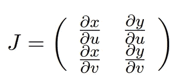
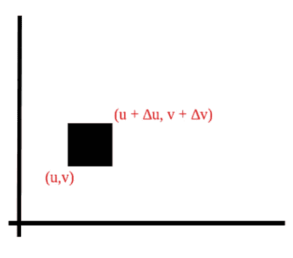
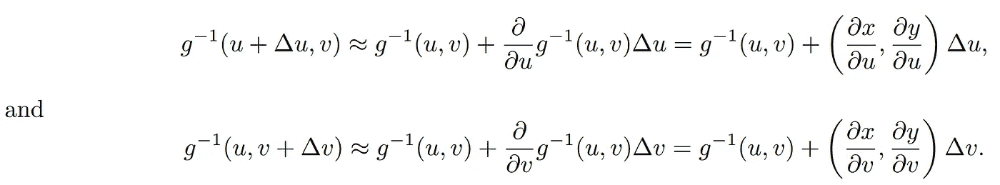
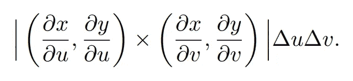
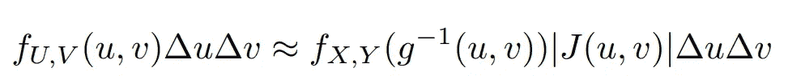
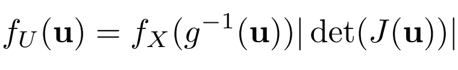
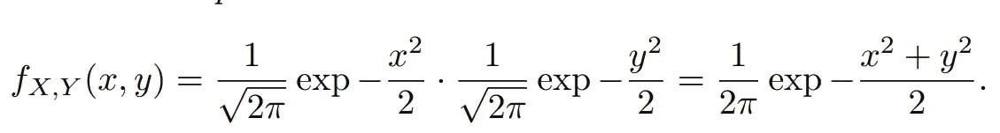
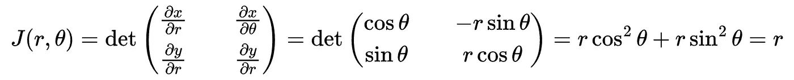
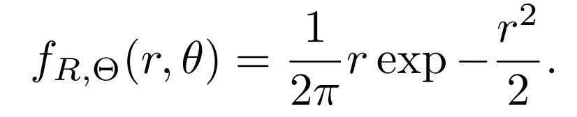

# 统计故事:统计分布的多元变换

> 原文：<https://towardsdatascience.com/stat-stories-multivariate-transformation-for-statistical-distributions-7077a374b3b4>

## 标准化流程的先驱

作者在加州圣贝纳迪诺拍摄的照片

在 Stat Stories 的前一集中，我讨论了单变量连续分布的变量变换。这种变量变换对于从简单分布生成新的复杂分布是必不可少的。然而，讨论仅限于单个变量。在本文中，我们将讨论二元分布的变换。理解多变量转换的机制是走向最近流行的机器学习方法[标准化流程](https://arxiv.org/pdf/1908.09257.pdf)的第一步。然而，为了简单起见，本文中我们将只讨论二元分布，它可以推广到多元分布。

 [## 统计故事:生成新分布的变量转换

### 统计分布的变换

towardsdatascience.com](/stat-stories-variable-transformation-to-generate-new-distributions-d4607cb32c30) 

## 二元变换

考虑一个二元随机向量 *(X，Y)* 。此外，我们考虑对随机向量进行以下变换: *U = g₁(X，y)，V = g₂(X，Y)* 。我们进一步假设 *g₁* 和 *g₂* 是连续的、可微的、一对一的，因此，它们的逆存在，我们可以把逆变换写成 *X = h₁(U，v)，Y= h₂(U，V)* 。或者，我们也可以假设随机向量 *(X，Y )* 上的函数 *g* 共同给出 *(U，V)，即 g(X，Y) = (U，V)。我们假设 g 保持可逆。*

如果考虑 *x* ∈ *X，y∈ Y，*那么雅可比矩阵可以写成

等式 1。二元随机向量的雅可比矩阵

而它的行列式是 *det(J)* 或者简单的说，**雅可比**。

# 密度转换

如果我们从 *(u，v)到(u+∏u，v+∏v)*画一个矩形如图 2 *，*

图二。在 U，V 坐标系上画矩形。

然后在矩形内，我们有联合密度函数 fᵤ，ᵥ (u, v).的概率 fᵤ，ᵥ (u，v)如果 *g⁻* 是 *g 的逆，*那么 *(x，y) = g* ⁻ *(u，v)。*利用泰勒展开，仅保留一阶微分， *g⁻* 的线性近似给出了可近似为矩形的平行四边形的两条边:

等式 2。 *g⁻的线性近似。*

矩形的面积由叉积的范数给出

等式 3。叉积的范数。

可以使用等式 1 中提到的雅可比矩阵的确定来计算等式 3。

因此，

等式 4。用 X，Y 坐标系表示的 U，V 坐标系中矩形的面积

其中近似值改进为*∏y，∏v→0*。因此，我们得出了二元密度转换的公式:

等式 5。二元分布的变换公式

其中可以扩展到多元随机变量*如下:*

**

*等式 6。多元分布的变换公式*

# **例子**

*我们认为 *X* 和 *Y* 是独立的标准正态随机变量。因此 *X* 和 *Y* 的联合 pdf 由下式给出*

**

*方程式 7。二元正态分布的联合概率密度函数*

*我们有逆变换 *g* ⁻ *(x，y)* 如下是极坐标变换(r ∈ R，θ∈θ)*:**

**

*等式 8。极坐标变换*

*我们可以将雅可比矩阵的行列式写成*

**

*等式 9。极坐标变换的雅可比矩阵*

*因此，利用等式 5，R 和θ的联合 pdf 可以写成*

**

*方程式 10。极坐标变换后 R 和θ的联合概率密度函数*

*这里 R 和θ是独立的，θ在[0，2π]上是一致的。*

*在下一集的 Stat Stories 中，我将讨论规范化流程。标准化流程仅仅是变量转换的扩展，它使用神经网络的能力进行密度估计和采样、合成数据生成等。我们到目前为止所讨论的只是冰山一角。*

*当我制作关于标准化流程的内容时，请查看以前的 Stat 故事集:*

* [## 统计故事:生成新分布的变量转换

### 统计分布的变换

towardsdatascience.com](/stat-stories-variable-transformation-to-generate-new-distributions-d4607cb32c30)  [## 统计故事:统计分布的常见家族(第 1 部分)

### 为数据创建模型的工具

towardsdatascience.com](/stat-stories-common-families-of-statistical-distributions-part-1-2b704dd6a808)  [## 统计故事:统计分布的常见家族(第 2 部分)

### 为数据创建模型的工具

towardsdatascience.com](/stat-stories-common-families-of-statistical-distributions-part-2-4bdea86c3132)  [## 统计故事:为什么矩母函数很重要？

### 什么唯一地决定了概率分布

towardsdatascience.com](/stat-stories-why-is-moment-generating-function-important-25bbc17dad68) 

> 如果你想了解更多关于统计学和数据科学的重要话题，请通过[https://rahulbhadani.medium.com/membership](https://rahulbhadani.medium.com/membership)订阅 Medium。虽然只是 5 美元/月，但对我有很大的帮助，因为 Medium 支付你的订阅费的一部分给作家。

如果你已经走了这么远，看看我可爱的猫咪 Yuja 的照片:

作者的猫，Yuja。图片由作者拍摄

感谢阅读。*