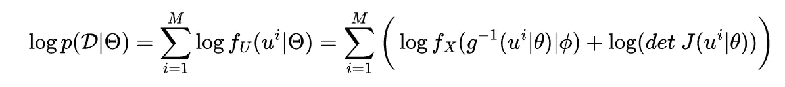
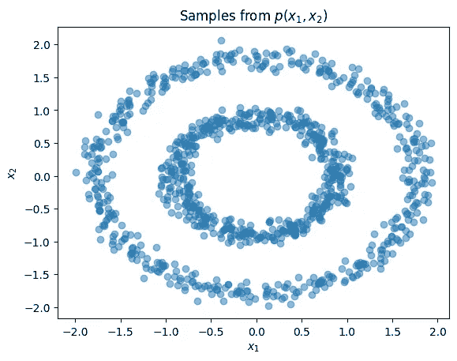
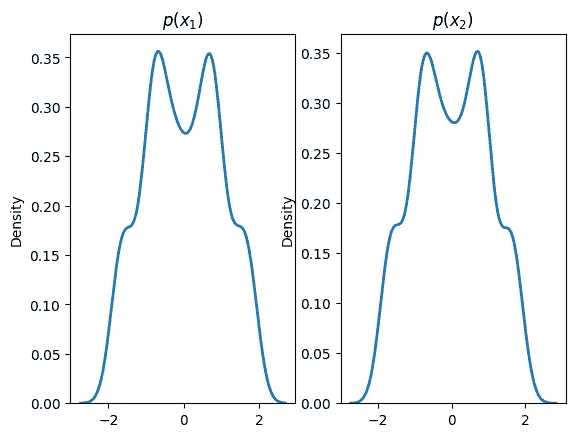
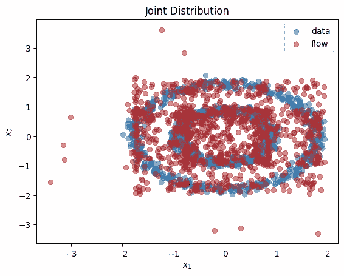
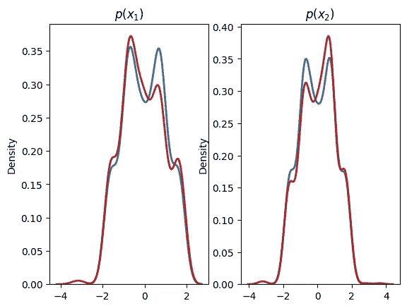

# Stat Stories:将流程规范化作为变量转换的应用

> 原文：<https://towardsdatascience.com/stat-stories-normalizing-flows-as-an-application-of-variable-transformation-7b7beda7b03b>

## 易处理分布的生成模型


加利福尼亚州的箭头湖，图片由作者提供

在我之前的*统计故事*系列的集中，我谈到了生成新分布的变量转换方法。对单变量和多变量分布的变量转换的讨论导致**标准化流程**。

我推荐阅读关于生成新分布的变量转换的讨论，作为理解规范化流程的先决条件。

[](/stat-stories-variable-transformation-to-generate-new-distributions-d4607cb32c30) [## 统计故事:生成新分布的变量转换

### 统计分布的变换

towardsdatascience.com](/stat-stories-variable-transformation-to-generate-new-distributions-d4607cb32c30) [](/stat-stories-multivariate-transformation-for-statistical-distributions-7077a374b3b4) [## 统计故事:统计分布的多元变换

### 标准化流程的先驱

towardsdatascience.com](/stat-stories-multivariate-transformation-for-statistical-distributions-7077a374b3b4) 

# **简介**

统计机器学习中的一个大挑战是，如果我们已经从某个分布中获得了样本，就要对概率分布进行建模。 [Tabak 和 VandenEijnden【2010】](https://www.researchgate.net/profile/Martin-Cadeiras/publication/220385824_Clustering_and_Classification_through_Normalizing_Flows_in_Feature_Space/links/54da12330cf2464758204dbb/Clustering-and-Classification-through-Normalizing-Flows-in-Feature-Space.pdf)以及 Tabak 和 Turner【2013】在聚类、分类和密度估计的背景下首次提出了流的标准化。

**定义**:标准化流程可以定义为将简单的概率分布(如均匀分布)转换为复杂的分布(如通过应用一系列可逆转换，可以为您提供猫图像的随机样本)。

作为一系列可逆变换的结果，我们可以通过选择一个简单的初始密度函数，然后将一些参数化的、可逆的和可微的变换链接在一起，获得[新的分布族](https://rahulbhadani.medium.com/stat-stories-common-families-of-statistical-distributions-part-2-4bdea86c3132?source=user_profile---------1----------------------------)。这样，我们可以获得对应于新密度的样本。

需要注意的一点是，在规范化流的上下文中，与我在[https://rahulbhadani . medium . com/stat-stories-variable-transformation-to-generate-new-distributions-d 4607 CB 32 c 30](https://rahulbhadani.medium.com/stat-stories-variable-transformation-to-generate-new-distributions-d4607cb32c30)中最初的讨论相比，转换是参数化的，在那里我使用的转换不包含任何参数。然而，想法保持不变。

让我们再次看看变量变换的公式:


等式 1。多元分布的转换公式(由作者创建)

其中 *U* 是新分布的多元随机向量，X 是原始初始分布的多元随机向量。 *J* 是雅可比的。在规范化流的上下文中，新的密度函数 *fᵤ* 被称为*向前推，*和 *g* 被称为生成器。这种从最初的简单密度到最终的复杂密度的运动称为生成方向。反函数 g⁻沿称为*归一化方向*的相反方向移动。这就是为什么整个转换过程被称为规范化流程。为了生成对应于 *U 的数据点，*应用变换**U**=*g*(**x**)。

对于规范化流程定义的更详细和正式的方法，我推荐看一下**规范化流程:当前方法的介绍和回顾【https://arxiv.org/pdf/1908.09257.pdf】()T21。**

# 标准化流程的应用

虽然诸如生成对抗网络(GAN)和变分自动编码器(VAN)的其他统计方法已经能够在诸如学习图像的分布和其他复杂数据集的困难任务上执行引人注目的结果，但是它们不允许评估密度估计和计算新数据点的概率密度。从这个意义上说，让流动正常化是有说服力的。该方法可以执行密度估计和采样以及变分推断。

## 密度估计和抽样

考虑一个变换**u**=*g*(**x；** *θ* ，即 *g* 由参数向量 *θ* 参数化。初始概率密度函数 *fₓ* 由向量 *φ* 参数化，即 *fₓ(x | φ)。*如果我们有对应于期望分布 F_U 的样本点𝓓，那么我们可以如下执行参数*θ=(θ，φ)* 的对数似然估计:



等式 2:对数似然估计(由作者创建)

在神经网络训练期间，参数进化以最大化对数似然。在选择诸如对抗性损失的损失函数时，有许多选择可以做出，但是选择完全取决于应用。

在下一篇文章中，我将从更广泛的背景中单独讨论**变分推理**。请务必[订阅我的电子邮件列表](https://rahulbhadani.medium.com/subscribe)以收到相关通知。同时，让我们看一些使用 Python 的代码。

## 例子

例如，我将使用 Flowtorch 库，它可以通过

```
pip install flowtorch
```

在我的[前几篇文章](/stat-stories-variable-transformation-to-generate-new-distributions-d4607cb32c30)中，我手动推导了转换后的密度函数，我们可以使用 Flowtorch 的标准化流程实现来学习转换和估计密度。

让我们来看两个同心圆数据集的样本

```
import numpy as np
from sklearn import datasets
from sklearn.preprocessing import StandardScaler

n_samples = 1000
X, y = datasets.make_circles(n_samples=n_samples, factor=0.5, noise=0.05)
X = StandardScaler().fit_transform(X)

plt.title(r'Samples from $p(x_1,x_2)$')
plt.xlabel(r'$x_1$')
plt.ylabel(r'$x_2$')
plt.scatter(X[:,0], X[:,1], alpha=0.5)
plt.show()
```



同心圆数据集的样本:联合分布(由作者创建)

```
plt.subplot(1, 2, 1)
sns.distplot(X[:,0], *hist***=**False, *kde***=**True,
*bins***=**None,*hist_kws***=**{'edgecolor':'black'}, *kde_kws***=**{'linewidth': 2})plt.title(**r**'$p(x_1)$')
plt.subplot(1, 2, 2)
sns.distplot(X[:,1], *hist***=**False, *kde***=**True, *bins***=**None, *hist_kws***=**{'edgecolor':'black'}, *kde_kws***=**{'linewidth': 2})plt.title(**r**'$p(x_2)$')
plt.show()
```



边缘分布(由作者创建)

我们可以学习边际变换`bij.Spline.`节点和样条的导数充当可以使用随机梯度下降学习的参数:

```
dist_x = torch.distributions.Independent(
  torch.distributions.Normal(torch.zeros(2), torch.ones(2)), 
  1
)
bijector = bij.Spline()
dist_y = dist.Flow(dist_x, bijector) optimizer = torch.optim.Adam(dist_y.parameters(), lr=1e-2)
steps = 5000X = torch.Tensor(X)
for step in range(steps):
    optimizer.zero_grad()
    loss = -dist_y.log_prob(X).mean()
    loss.backward()
    optimizer.step()

    if step % 200 == 0:
        print('step: {}, loss: {}'.format(step, loss.item()))
```

现在，我们可以根据学习后的变换分布绘制样本:

```
X_flow = dist_y.sample(torch.Size([1000,])).detach().numpy()
plt.title(r'Joint Distribution')
plt.xlabel(r'$x_1$')
plt.ylabel(r'$x_2$')
plt.scatter(X[:,0], X[:,1], label='data', alpha=0.5)
plt.scatter(X_flow[:,0], X_flow[:,1], color='firebrick', label='flow', alpha=0.5)
plt.legend()
plt.show()
```



使用红点显示来自新学习的变换分布的样本。(作者创作)

我们可以画出学习到的边际分布:

```
plt.subplot(1, 2, 1)
sns.distplot(X[:,0], hist=False, kde=True,
             bins=None,
             hist_kws={'edgecolor':'black'},
             kde_kws={'linewidth': 2},
             label='data')
sns.distplot(X_flow[:,0], hist=False, kde=True,
             bins=None, color='firebrick',
             hist_kws={'edgecolor':'black'},
             kde_kws={'linewidth': 2},
             label='flow')
plt.title(r'$p(x_1)$')
plt.subplot(1, 2, 2)
sns.distplot(X[:,1], hist=False, kde=True,
             bins=None,
             hist_kws={'edgecolor':'black'},
             kde_kws={'linewidth': 2},
             label='data')
sns.distplot(X_flow[:,1], hist=False, kde=True,
             bins=None, color='firebrick',
             hist_kws={'edgecolor':'black'},
             kde_kws={'linewidth': 2},
             label='flow')
plt.title(r'$p(x_2)$')
plt.show()
```



学习边际分布(由作者创建)

这从情节上看，似乎接近实际分布。当然，我们可以做得更好，但那是以后的事了。

还有其他几个库可以使用规范化流方法，比如`normflows`、`ProbFlow`等。此外，我发现以下资源很有帮助:

1.  [https://gowrishankar . info/blog/normalizing-flows-a-practical-guide-using-tensor flow-probability/](https://gowrishankar.info/blog/normalizing-flows-a-practical-guide-using-tensorflow-probability/)
2.  [https://github.com/LukasRinder/normalizing-flows](https://github.com/LukasRinder/normalizing-flows)
3.  [https://prob flow . readthedocs . io/en/latest/examples/normalizing _ flows . html](https://probflow.readthedocs.io/en/latest/examples/normalizing_flows.html)
4.  [https://github.com/VincentStimper/normalizing-flows](https://github.com/VincentStimper/normalizing-flows)
5.  [https://github.com/tatsy/normalizing-flows-pytorch](https://github.com/tatsy/normalizing-flows-pytorch)
6.  [https://vishakh.me/posts/normalizing_flows/](https://vishakh.me/posts/normalizing_flows/)
7.  [https://UVA DLC-notebooks . readthedocs . io/en/latest/tutorial _ notebooks/tutorial 11/NF _ image _ modeling . html](https://uvadlc-notebooks.readthedocs.io/en/latest/tutorial_notebooks/tutorial11/NF_image_modeling.html)
8.  https://gebob19.github.io/normalizing-flows/

## 结论

本文简要介绍了从变量转换到生成新分布的规范化流程方法。这种与神经网络相结合的统计方法的应用范围从伪图像生成到异常检测以及发现新的分子和材料。我建议读者查看我上面提到的参考资料，以便更深入地理解规范化流程。在以后的文章中，我将介绍流规范化的新进展。

上面 Python 代码关联的笔记本可以在这里获得:[https://github . com/rahulbhadani/medium . com/blob/EC 92 a9 BC 7 B2 aa 165 df 630 ed 5 e 268 EC 58 fc 0716 a 2/10 _ 09 _ 2022/norm flow . ipynb](https://github.com/rahulbhadani/medium.com/blob/ec92a9bc7b2aa165df630ed5e268ec58fc0716a2/10_09_2022/normflow.ipynb)

# 参考

1.  通过对特征空间中的
    流进行归一化进行聚类和分类[https://www . research gate . net/profile/Martin-Cadeiras/publication/220385824 _ Clustering _ and _ class ification _ through _ Normalizing _ Flows _ in _ Feature _ Space/links/54da 12330 cf 2464758204 dbb/Clustering-and-class ification-through-Normalizing-Flows-in-Feature-Space . pdf](https://www.researchgate.net/profile/Martin-Cadeiras/publication/220385824_Clustering_and_Classification_through_Normalizing_Flows_in_Feature_Space/links/54da12330cf2464758204dbb/Clustering-and-Classification-through-Normalizing-Flows-in-Feature-Space.pdf)
2.  一族非参数密度估计
    算法[https://ri . coni et . gov . ar/bitstream/handle/11336/8930/coni et _ Digital _ nro . 12124 . pdf？序列=1](https://ri.conicet.gov.ar/bitstream/handle/11336/8930/CONICET_Digital_Nro.12124.pdf?sequence=1)
3.  Kobyzev，I .，Prince，S. J .，& Brubaker，M. A. (2020)。标准化流程:当前方法的介绍和评论。 *IEEE 模式分析与机器智能汇刊*， *43* (11)，3964–3979。

我希望这篇文章有助于你开始一个令人兴奋的统计学和数据科学的话题。

这有帮助吗？ [*给我买杯咖啡*](https://www.buymeacoffee.com/rahulbhadani) *。*

喜欢我的作品？加入我的 [*邮箱列表*](https://rahulbhadani.medium.com/subscribe) *。*

*想了解更多 STEM 相关话题？加入* [*中等*](https://rahulbhadani.medium.com/membership) *。*