# 统计故事:生成新分布的变量转换

> 原文：<https://towardsdatascience.com/stat-stories-variable-transformation-to-generate-new-distributions-d4607cb32c30>

## 统计分布的变换

作者的封面图片。

通常我们需要从一个给定的分布中产生一个新的封闭形式的分布或密度函数。从程序上来说，这可能很容易，但有时需要超越数字来获得新分布的特定参数，如均值、标准差、矩母函数等。因此，了解通过随机变量的变换生成新分布的方法是很重要的。

在本文中，我们将研究随机变量的变换，根据给定的变换函数，从连续分布创建新的分布。

# 随机变量的函数

假设 *X* 是一个随机变量，具有连续的概率密度函数(pdf) *fₓ* ，样本空间为𝓧.我们可以将函数 *g* 应用于 *X* ，这样我们就可以得到一个新的随机变量 *Y* ，即 *Y = g(X)* 。在这种情况下，自然要问的是 *Y* 的分布如何与 *X* 的分布相关联。

考虑以下情况:

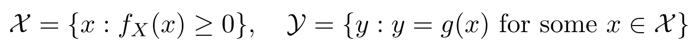

等式 1

这里， *fₓ(x)* ≥ 0 是 *X.* 的支撑集从第一个原理，我们可以把 y 的累积分布函数(CDF)写成

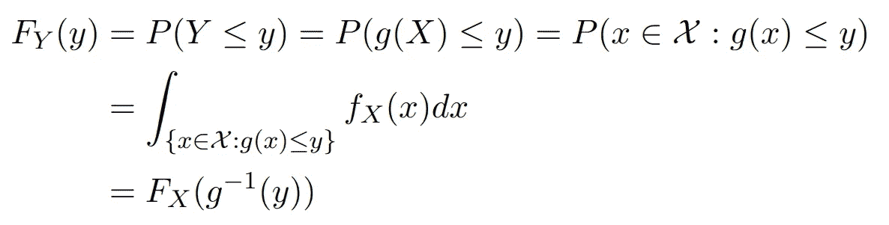

等式 2

*Y* 的密度函数可以使用微分链法则导出(考虑 *g* 单调递增):

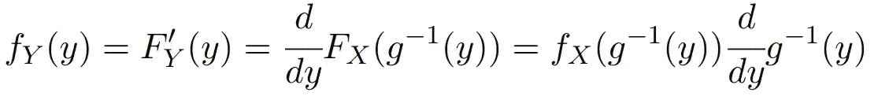

等式 3

对于单调递减的 *g* ，我们有(推导省略):

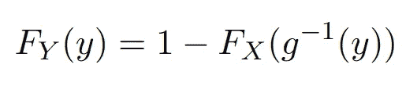

等式 4

因此，

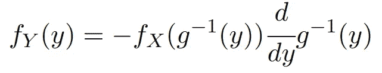

等式 5

因此，获得 *Y* 的密度函数的总体规则可以写成:

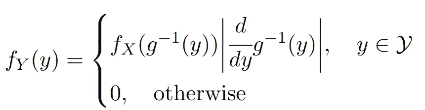

等式 6

现在，让我们看一个例子，它有 Python 的情节和见解

# **示例**

考虑一个均匀分布的随机变量 *X* ，在 *Y* 上进行变换:

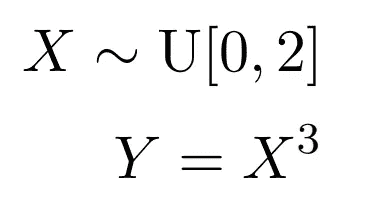

等式 7

在这种情况下，均匀分布的密度函数如下所示:

均匀分布*U【a，b】*定义为:

等式 8

在这种情况下，均匀分布的密度函数如下所示:

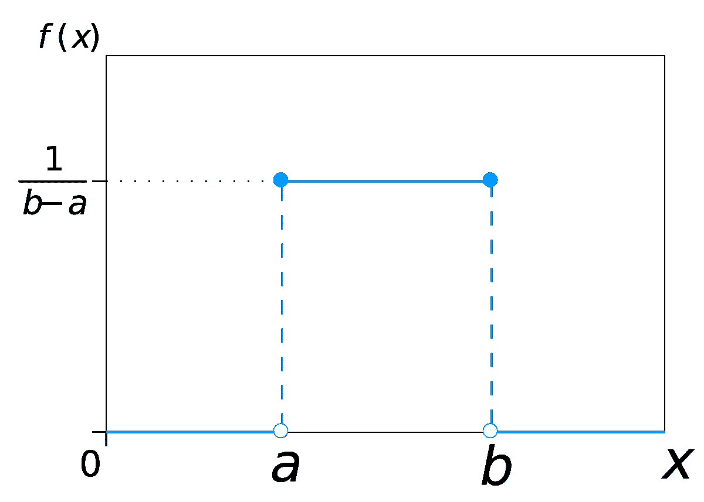

图 1:均匀分布

让我们来看看从 Python 模拟中获得的密度函数图:

代码片段 1

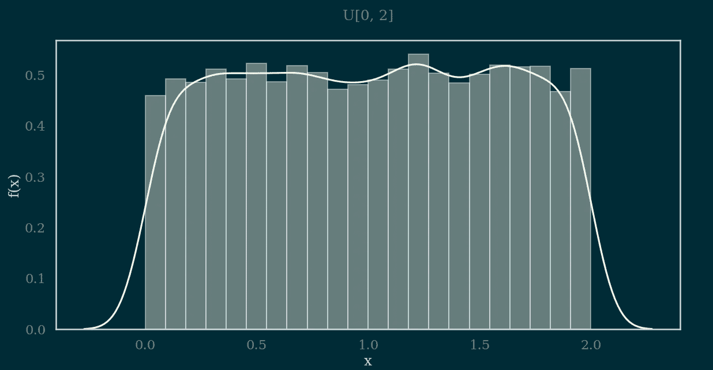

图 2:均匀分布 U[0，2]的模拟

从图 2 中，我们看到从均匀分布中随机产生的数字类似于图 1 所示的密度函数。

现在，对 Y = X 的密度函数的天真想法是，图 1 中的幅度应该是(1/8)而不是(1/2)。然而，事实并非如此。通过使用`distplot(A**3)`绘制密度函数，稍微修改给出图 3 的代码片段 1，可以很容易地验证这一点。

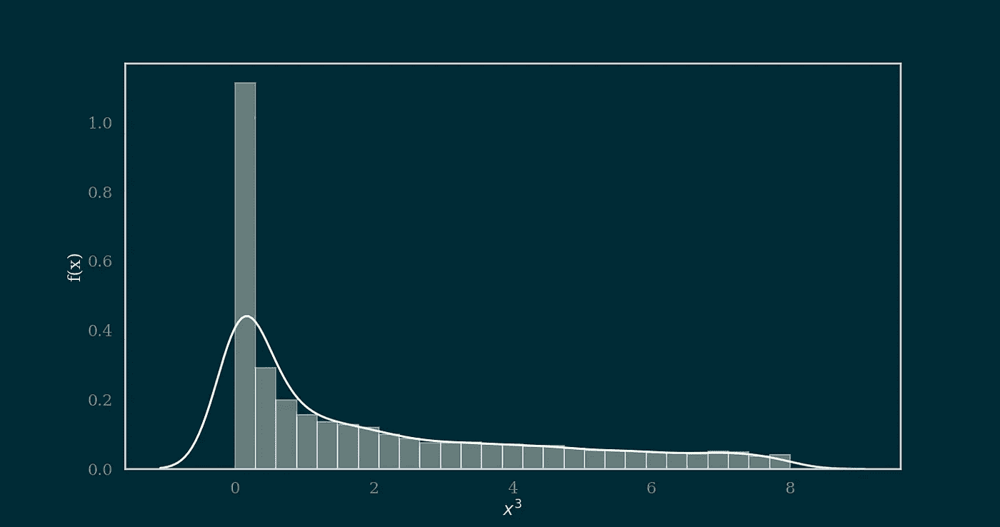

图 3。Y = X 的密度函数

如您所见，转换后的随机变量的密度图与原始密度完全不同。可以获得变换的随机变量的密度函数，可以使用前面详述的等式 6 获得。

## 获得示例的密度函数

当 Y = X 时，我们可以写成:

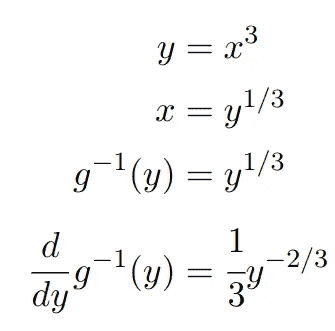

等式 9

而我们不需要考虑| | as，在[0，2]的范围内， *x* 是单调递增的。因此，

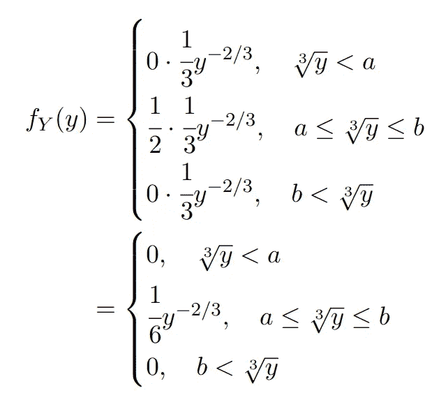

等式 10

我们可以使用 scipy 包的`rv_continuous`模块模拟等式 10 中的密度函数。下面是代码片段:

代码片段 2

上面的代码生成了一个类似于图 3 所示的密度图。图 4 给出了对应于代码片段 2 的图。

图 4。方程(10)中 y 的密度图

正如您在应用变换并从等式 10 导出密度后所看到的，我们得出了相同的结论。然而，用一个封闭形式的密度函数，我们还可以得到均值、方差、矩母函数、生存函数等。给定一个较简单的分布，可以使用类似的技术从一个较复杂的分布生成数据。

我希望以上讨论让您对变量变换和生成新的统计分布和相应的密度函数有了很好的理解。本文的 pdf 副本可以从[https://github . com/rahulbhadani/medium . com/raw/master/05 _ 25 _ 2022/Variable % 20 transformation % 20 to % 20 generate % 20 new % 20 distributions . pdf](https://github.com/rahulbhadani/medium.com/raw/master/05_25_2022/Variable%20Transformation%20to%20Generate%20New%20Distributions.pdf)下载。

</stat-stories-multivariate-transformation-for-statistical-distributions-7077a374b3b4>  

> 如果你喜欢我的文章并想支持我的内容，我请求你通过[https://rahulbhadani.medium.com/membership](https://rahulbhadani.medium.com/membership)订阅 Medium。