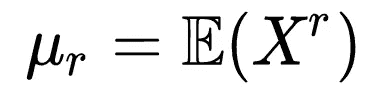
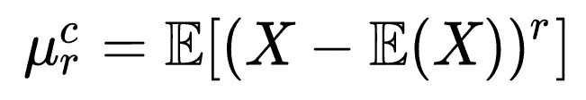
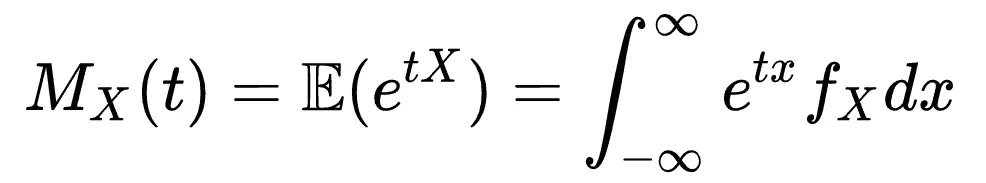
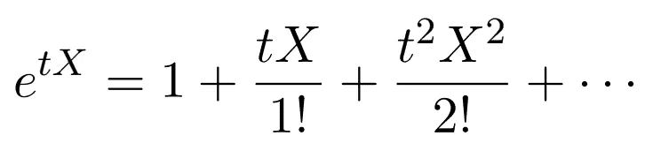
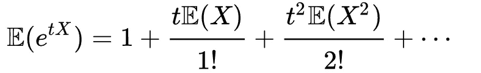
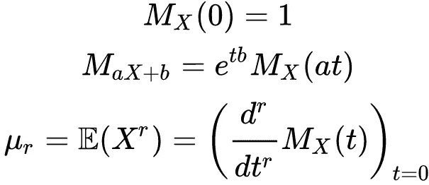
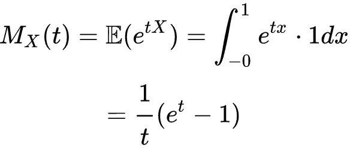
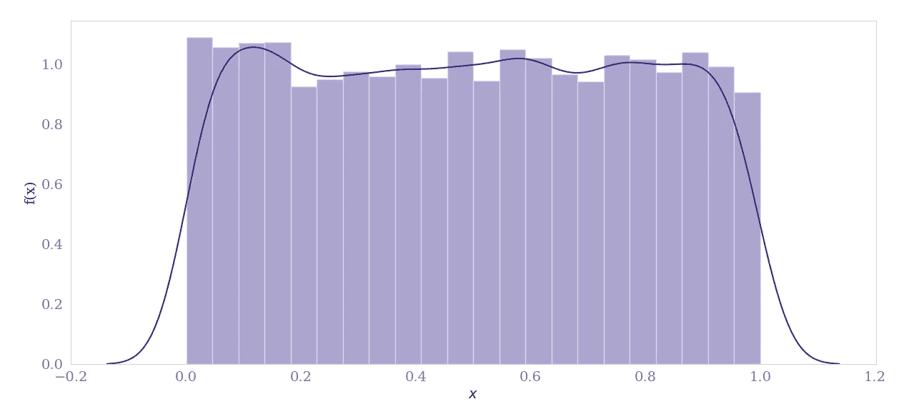
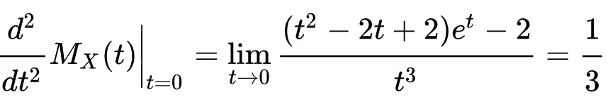

# 统计故事:为什么矩母函数很重要？

> 原文：<https://towardsdatascience.com/stat-stories-why-is-moment-generating-function-important-25bbc17dad68>

## 什么唯一地决定了概率分布

该列，米佐。作者拍摄的图片

在统计理论和数据分析中，我们经常想知道分布的特征是什么，以及是否有任何方法可以清楚地识别分布。答案是**力矩生成函数。**

矩生成函数或 **MGF** 之所以如此称呼，是因为它有助于生成统计分布的矩。现在是什么时候？很高兴你问了这个问题。统计中的矩被定义为

等式 1:随机变量 X 的 R 阶矩

等式(1)定义了随机变量 *X* 的 r 阶矩。矩与分布的形状有关。一阶矩与期望值相关，二阶矩与方差相关，三阶矩与偏斜度(即偏离对称性)相关，四阶矩与峰度(即分布的峰值)相关。

类似地，我们有另一个称为 r 阶中心矩的度量，其定义为

等式 2:随机变量 X 的 R 阶中心矩

r 阶中心矩是有用的，因为矩被计算为与平均值的偏差，而不是零。

然而，仅仅是矩不足以描述分布的特征。尽管均值、方差、偏斜度和峰度合在一起可以概括一个分布，但它们并不等同于一个分布。

在这种情况下，我们看矩母函数或 MGF

# 矩母函数或 MGF

假设 x 是一个随机变量，并且相关的概率密度函数(PDF)是 *fₓ* 并且累积分布函数(CDF)或简单分布是 *Fₓ.*于是，MGF 被定义为

等式 3。矩母函数作为 e^{tX}的期望

如果我们使用泰勒级数展开 exp(tX ),我们得到

等式 4。e^{tX}的泰勒级数展开

取等式(4)的期望值，我们得到

等式 5。对 e^{tX}的期望

从等式(5)可以看出，tʳ/r 系数！给出 r 阶矩。那个 *Mₓ(t)* 叫做矩母函数。注意，只有当涉及有限多项时，等式(5)才是合理的。只要 *Mₓ(t)* < ∞对于所有的 *t* 都在一个包含 0 的开区间内，这就是合理的。

我们可以从 MGF 计算力矩如下:

等式 6。力矩计算

# MGF 的意义

MGF 可以被用来唯一地确定一个概率分布，这不是真的，只是通过使用我们在上面看到的矩。在这种情况下，可以有把握地说两个随机变量 *X* 和 *V* 具有相同的 CDF 当且仅当 *Mₓ(t) = M* ᵥ *(t)* 对于任意 *t* 。

  

## **举例**

我们来看一个均匀分布 U[0，1]。密度函数给出了广义均匀分布

方程式 7。广义均匀分布的密度函数

其中 a= 0，b =1 给出 U[0，1]。我们可以如下推导出均匀密度函数的 MGF:

等式 8。均匀分布 U[0，1]的 MGF

# Python 编程

在 python 中，可以使用`scipy rv_continuous`计算分布的 r 阶矩。代码片段如下所示:

作为验证，密度函数如图 1 所示。

图一。均匀分布 U[0，1]的密度函数

使用`moment(n=2)`函数调用，我们看到二阶矩是 0.33333。

我们可以用等式 6 来验证这一点。t = 0 时 *Mₓ(t)* 的二阶导数给出:

等式 9。从 MGF 导出均匀分布 U[0，1]的二阶矩

您可以使用[极限计算器](https://www.symbolab.com/solver/limit-calculator)来验证极限。

MGF 对于复杂分布的情况非常有帮助，并且采用通常的期望公式来计算均值和方差并不简单。

我希望上面的讨论让你对矩母函数有了很好的理解。如果你对 MGF 这个话题有什么有价值的补充，请留下你的评论。感谢您的阅读。

> 如果你喜欢我的文章，并想支持我制作高质量内容的努力，我请求你通过[*https://rahulbhadani.medium.com/membership*](https://rahulbhadani.medium.com/membership)*订阅 Medium。虽然只是 5 美元/月，但对我有很大的帮助，因为 Medium 支付你的订阅费的一部分给作家。*